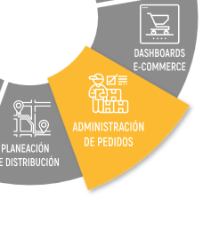
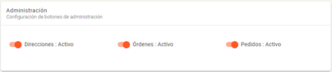
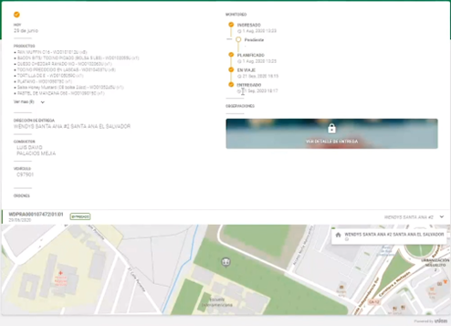
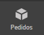

Administración de Pedidos
=========================

Pedidos
--------

.. container:: justified-text

   En UNIGIS TMS, es útil entender la naturaleza de un pedido y una orden.

   Pedido:
   Un pedido en UNIGIS TMS es una solicitud de transporte proporcionada por el cliente o dador de carga. Contiene información como la ubicación de recolección y entrega, detalles de los productos y fechas acordadas.

   Cada pedido pertenece a un único cliente o dador de carga y se le asignan estados que reflejan su progreso a lo largo del proceso de cumplimiento del servicio. Dependiendo del tipo de pedido, se pueden generar pedidos multi-tienda, troncal, reenvíos, pick up, delivery, pedidos híbridos, entre otros.

   Entidades importantes:

   Cliente: Es el dador de carga que solicita el pedido inicialmente y recibe información detallada sobre el pedido solicitado por el Cliente Orden.

   Cliente Orden: Es el destinatario que solicitó el pedido.

   Domicilio Orden: En algunos casos, el sistema puede tercerizar el pedido indicando un domicilio final para la orden, dependiendo del tipo de operación.

Orden
------

.. container:: justified-text
   
   Una orden es la entidad ejecutiva mediante la cual se lleva a cabo una actividad específica. Contiene toda la información necesaria para ejecutar la acción solicitada en el pedido, incluyendo:

   Información general sobre la orden del pedido.
   
   Detalles sobre los ítems o productos asociados, que pueden abarcar todos los productos o solo una parte de ellos.
   
   Validaciones y observaciones sobre el progreso del proceso, reflejadas a través de estados configurables que automatizan las acciones correspondientes.
   
   Desde un pedido, pueden generarse múltiples órdenes según las operaciones y fechas requeridas para alcanzar el objetivo deseado.

   Las órdenes son dinámicamente ruteadas con la herramienta de UNIGIS Routing en la creación de jornadas de trabajo.

   Tipos de Órdenes:

   - Pick-Up.
   - Delivery.
   - Reenvío.
   - Multi-tienda.
   - Troncal.
   - Entre otros.

Administración de Pedidos
-------------------------

.. container:: justified-text

 El administrador de pedidos (Order Management) tiene la capacidad de integrar y gestionar todos los pedidos de venta de diferentes portales colaborativos (ERP, CRM, WMS, entre otros) que utiliza un negocio para delivery y pedidos. Los administra en un sistema centralizado que permite ajustar las fechas de entrega comprometidas, realizar particiones y consolidaciones, geo codificar y normalizar las direcciones, hasta generar las órdenes de entrega, trabajo o servicio, que requiere la logística de distribución.

 Las principales tareas de un negocio es la gestión de pedidos, ordenes de entrega y recolección, con el módulo de Administrador de Pedidos (Order Management) permite administrar los pedidos de productos a entregar, consolidar los pedidos por cliente, generar ordenes de entrega, programar todo tipo de operación, administrar datos por catálogos, geo codificador automático, visibilidad y trazabilidad del estado de los pedidos, configurar reglas de negocio y flujos de trabajo.

 Se puede acceder al administrador de pedidos en todas las soluciones de UNIGIS TMS, dentro de la versión Web de UNIGIS TMS se visualiza en la pantalla Home.

Configuración 
-------------
.. container:: justified-text

 Crear un pedido dispone con la previa creación de una estructura base, configuración y catálogos involucrados en la transacción de datos para un nuevo pedido. Es necesario realizar la configuración de las entidades relacionadas al flujo de trabajo “Pedidos” para iniciar con la operación.

.. image:: conf.png
   :align: center

.. container:: justified-text

 Establecido el pedido o solicitud de transporte esto se pueden referenciar la cantidad de órdenes necesarias. Las ordenes pertenecen a una única jornada, operación y fechas por su naturaleza del pedido. (Multi tienda, troncal, reenvíos, pick up, delivery, etc.).

Permisos
--------

.. container:: justified-text

 El módulo de administración de pedidos dispone con una serie de permisos para cada grupo, tipo de usuario, estado del pedido y tipo de pedido, según se requiera delegar todo tipo de acciones y catálogos involucrados para pedidos. Esto se realiza desde el administrador del sistema, si no se cuentan con los permisos necesarios no se pueden realizar acciones como dar de alta pedidos, editar, dar de baja, cambio de estado, etc. 

.. image:: permisos.png
   :align: center

Flujos de Trabajo
------------------

.. container:: justified-text

 Toda entidad transaccional en UNIGIS TMS posee un flujo de trabajo que son 100% configurables para adaptarlos a proceso internos de un negocio. Esto permite configurar cualquier cantidad de estados para los momentos importantes dentro del proceso de un pedido, los estados producen transiciones configurables para hacer que se ejecute automáticamente un proceso.
 
 Las transiciones pueden ser limitadas por grupo de usuarios, características de la entidad, tipo de orden, categoría viaje, tipo de pedido, etc. Los cambios de estado de una entidad puede ser desencadenadores de una transición en otra entidad, por ejemplo, cuando un pedido pase en estado “aprobado” pueden desencadenar el proceso de planificación de viaje con el estado “Planificado”.

.. image:: flujos.png
   :align: center

Estado Pedido
    Los estados de pedido son una parte fundamental en la administración de pedidos que se reciben. Todos los pedidos pasan por varios estados a lo largo del proceso, estos pedidos desencadenan y permiten acciones configurables dentro de UNIGIS TMS. Por ejemplo, cuando un pedido tiene un estado “Ingresado” se pueden permitir acciones como la edición del pedido, eliminar pedido, etc.

Transiciones de pedidos
    Los pedidos pueden cambiar de estado de forma automática cuando reciben información desencadenante para avanzar o no con el proceso, esto se le llama transiciones. Las transiciones permitidas son por tipos de estado de origen y destino, el desencadenante de un nuevo estado del pedido. Por ejemplo, cuando el estado origen de un pedido sea “Ingresado” y su orden haya sido “Ruteada” este pase a estado destino “Planificado” de forma automática.

Tipo de Pedido
    El objetivo de esta entidad es crear los modelos de servicio por catálogos para los tipos de pedido de cada operación. Se definen los tipos de pedio a operar configurando campos relacionados.

.. image:: tipopedido.png
   :align: center

Orden Tipo Pedido
    El objetivo de esta entidad es usarse como modelo para crear ordenes desde un tipo de pedido, es decir, al disponer con un pedido de cualquier tipo esta entidad ayuda a ejecutar el tipo de orden asignada, tomando datos relacionados al pedido para continuar con el proceso de la orden. 

    Por ejemplo, para un tipo de pedido “Delivery” genera un tipo de orden “Delivery” de tal manera que para generar una entrega se necesita de las especificaciones origen para llevarse a cabo una orden determinada. Especificaciones como: fechas de entrega, horarios, domicilio, operación, deposito, etc.

.. image:: ordentipopedido.png
   :align: center

Proceso
--------

.. container:: justified-text

 El objetivo de esta entidad es la configuración de acciones o transiciones para la creación de procesos automatizados, las acciones o transiciones se pueden configurar antes o después de un cambio de estado o cuando se elimina un pedido de manera distribuida, sincrónica o temporal. Con lo cual permite configurar y adaptar UNIGIS TMS al negocio de cada cliente mediante un catálogo de métodos establecidos o customizados y la manera de la que estos se ejecutan en cada operación o tipo de jornada.

 Por ejemplo, cuando una entidad de tipo “Pedido” genere una transición de “Ingresado” a “Aprobado” el método a ejecutar será el de crear una orden desde ese pedido. Entendido esto se puede ir más a detalle la configuración con indicaciones en el proceso, si desea que se realice antes o después de la transición, al mismo tiempo, fuera de la transición o de manera temporal indicado por un comando crontab. Se permiten validaciones y condiciones para que el proceso se cumpla.

Configuración B2B
-----------------

.. container:: justified-text

 La configuración del portal B2B (Business-To-Business) está orientada a un tipo de cliente o dador de carga para las transacciones comerciales entre empresas, es decir, el cliente administrador del producto UNIGIS TMS crea grupos o usuarios que les permite acceder a un portal B2B para el alta de sus pedidos. Los clientes son configurados por el nivel de usuario y sus tipos de pedidos que puedan realizar por grupo de usuarios dentro del administrador del sistema.

.. image:: b2b.png
   :align: center

.. container:: justified-text
 
 En la opción para la configuración del portal B2B dispone de una gran cantidad de permisos por módulo, acciones o datos. El usuario administrador del producto UNIGIS TMS dispone con el control para permitir o no todo tipo de acciones, vistas y aplicaciones que permite realizar el cliente referente a sus propios pedidos.

 El formulario de registro para un nuevo pedido es configurable por una matriz de campos estandarizados a medida que el cliente administrador lo requiera según su obligatoriedad de su negocio, los formularios pueden ser por tipo de pedido o cliente dador de carga.

Configuración B2C
------------------

.. container:: justified-text

 El portal B2C (Busness-To-Consumer) esta orienta al consumidor final del producto para ofrecer un proceso y experiencia de compra mejorado en todas las etapas de un pedido. El portal B2C permite que el cliente administrador de UNIGIS TMS configurar por branding e información que desea presentar al cliente correspondiente al seguimiento de los pedidos.

.. container:: justified-text

 Bajo un numero de referencia el cliente orden puede visualizar la trazabilidad de entrega y el seguimiento de los estados previamente configurados de su pedido. 

Crear Pedido
-------------

.. container:: justified-text

 El producto permite crear y administrar pedidos por las diferentes soluciones disponibles para usuarios; por el administrador de pedidos versión Web, por el portal colaborativo B2B (Business-To-Business), por UNIGIS FLEET o por medio de Web Service. Estas soluciones contienen los campos para la captura de datos necesarios para saber sobre el servicio solicitado. Como se muestran a continuación.

 Dentro de UNIGIS TMS la versión Web cuenta con una herramienta para la administración de pedidos, automatiza todo el proceso de gestión de pedidos. Permite gestionar la información de inventario, depósitos, ventas y clientes en un solo lugar, para que puedas acceder fácilmente a todos estos datos desde cualquier lugar y en cualquier momento. Se visualiza en la pantalla Home como Order Management (Administrador de Pedidos). 

 La funcionalidad de la opción pedidos es que los usuarios de la operación pueden registrar de manera manual un pedido, una vez realizada la configuración se encuentran todas las funcionalidades para la gestión como: crear, consultar detalles del pedido, buscar, eliminar, entre otros, para los registros de los pedidos.

.. image:: om.png
   :align: center

Portal B2B
----------

.. container:: justified-text

 Un pedido puede ser registrado mediante el portal B2B, dicho portal esta orienta a que el cliente orden o dador de carga realice el registro de sus pedidos y el estado con la que estos se van desarrollando, se permite realizar consulta de detalles, dar seguimiento a su entrega mediante una bitácora de acciones o monitoreo con las fechas y horario de como fue el transcurso de su pedido mediante los permisos que otorga el usuario administrador de UNIGIS TMS.

 Para el registro de un pedido se visualiza el formulario anteriormente configurado dentro del administrador del sistema según los campos para un cliente orden determinado, de igual forma el usuario puede dar uso al portal B2B para registrar por si mismo sus solicitudes de transporte.

.. image:: pedidob2b.png
   :align: center

FLEET
-----
.. container:: justified-text

 Dentro de la solución UNIGIS FLEET el usuario puede acceder al administrador de pedidos mediante el menú   ubicado en la barra de navegación lateral. Una vez seleccionada se puede visualizar todas las funcionalidades correspondientes para consultar información, buscar un pedido, crear o editar un pedido.

Se visualiza los estados previamente configurados para el seguimiento de los pedidos.

.. image:: pedidofleet.png
   :align: center

MAPI
----

.. container:: justified-tex

 El Ingreso de pedidos mediante UNIGIS MAPI se realiza por el protocolo estándar SOAP basado en el lenguaje de XML con su Web Service asignado para “CrearOrdenesPedido” el usuario puede realizar el envió de este registro para el intercambio de información al servidor.

Request (Solicitud-Pedido) en lenguaje XML contiene todos los campos necesarios por etiquetas para que el usuario pueda crear un pedido. 