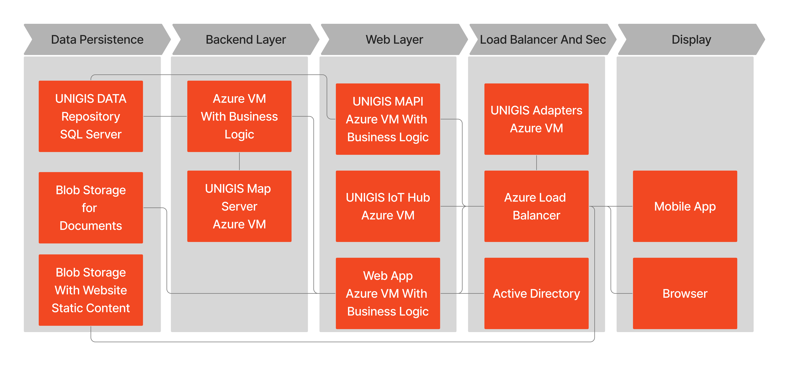
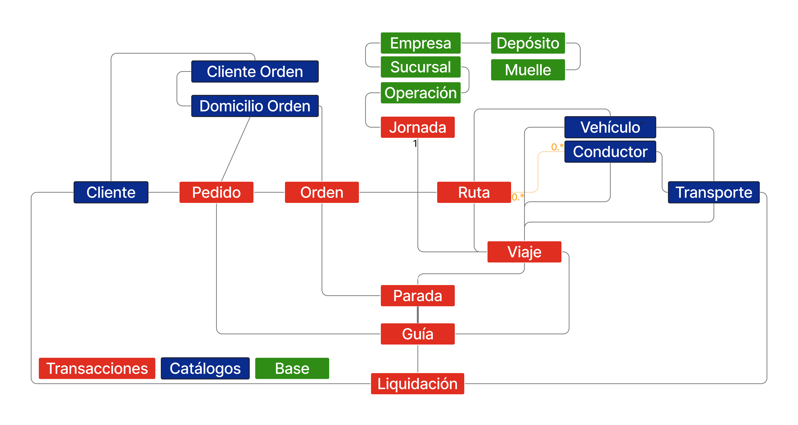

Arquitectura Funcional y Técnica
================================

Opciones de Implementación
---------------------------

.. container:: justified-text

 UNIGIS TMS cuenta con tres modelos de implementación que permite automatizar para ser más agiles y centrar en la calidad y mejora del producto.

 On-Cloud: UNIGIS Cloud. (opción default)
    La opción recomendada 100%, la cual se encuentra hosteada por UNIGIS TMS con proveedores on cloud de primer nivel como lo son: Azure y Century link.

 - Mejor soporte. 
 - Alta disponibilidad.
 - Alta seguridad.
 - Mejor conexión. 
 - Mejor tiempo de respuesta.
 - Mejor tiempo de actualizaciones. 
 - Mayor tecnología. 

 On-Premise: Client Infrastructure.
    La opción tradicional que se despliega que despliega todas las aplicaciones y componentes de UNIGIS implementados en la infraestructura de la nube del cliente, incluidos los datos geoespaciales y el motor de optimización. Modelo de caja de arena. empresas con políticas estrictas para proteger los datos internos o procesos críticos que se implementarán en nubes externas.

.. container:: justified-text

 Hybrid: UNIGIS Cloud & On demand.
    Servidor web, aplicaciones y de bases de datos implementado en las instalaciones (lado del cliente). Los datos de tráfico de mapas, el motor de optimización y las API GIS están en la nube UNIGIS. Este despliegue requiere de una conexión a Internet confiable de alto rendimiento.

 Tecnologías que conforman la solución UNIGIS TMS:
 Frameworks, Tecnologías y Lenguajes de Programación.

Layouts
--------

Las capas de la infraestructura funcional presentan el siguiente flujo funcional corresponde a la solución On-cloud recomendada para el producto: 

.. container:: justified-text

    Persistencias de Datos > Capa Backend > Web Layer > Peticiones de Usuario > Display > Usuarios (HUB/IoT)
    
    - Solución basada en el ecosistema MSFT. (Microsoft)
    - Arquitectura SOA.
    - Procesos de Back-End + Job Queues.
    - Propietario de la solución. No aplicaciones externas.
    - Escalabilidad horizontal y alta compatibilidad.

    UNIGIS Endpoint tiene la capacidad de realizar una nativa integración con otras aplicaciones como ERP’s, CRM’s o WMS, este Endpoint puede ser Cloud/On Premise se comunica de dos maneras: con adapters o de manera directa.

    Datos de entrada:
    - Adaptadores propios UNIGIS. (Adapters) Es una pieza de software custom que transforma la información de entrada a los diferentes servicios.
    - Directa. Consumo de los servicios directos.
    
    Datos de salida:
    - SyncOuts. Pieza de software custom basada en un modelo UNIGIS EDF (Event Driver framework) basado en eventos, es decir, se configura los tipos de eventos que requiera información para comunicar en tiempo real los datos relevantes a cada tipo de evento.
    - UNIGIS MAPI WS (Librería estándar)
    
    Logístics: Datos maestros / catálogos (Clientes, Ubicaciones, Productos, Depósitos, Vehículos, Tarifas, etc.) y datos tradicionales (Ordenes, Entregas, Rutas, Envíos, Facturas, Etc.).
    GPS (Dispositivos y integración de proveedores): Posiciones, Alertas, Telemática, Comandos.
    
    Geographic: Codificación Geográfica de Avance y Reserva, Indicaciones de Conducción, Mapas Deslizantes, Mapas Estáticos, Áreas, Distancia, Etc.
    Authentication (SSO)
    
    Otros: Zona Horaria, Geografía o Tracking. 

UNIGIS HUB
-----------

.. container:: justified-text

    UNIGIS HUB es una pieza o un componente de software intermedia con el propósito de recibir e integrar información de distintas fuentes como lo son GPS, proveedores GPS, aplicaciones móviles, entre otras señales o transferencia de información que se requiera se adapta a tecnología on premise u on cloud.  
    Como único servidor intermedio transmite y distribuyen sin importar el tipo de tecnología implementada en el usuario, es decir, la solución UNIGIS HUB es capaz de integrar entre distintas tecnologías on premise u on cloud para transferir información en tiempo real.

.. image:: Sources.png
    :align: Center

.. container:: justified-text

 - UNIGIS HUB IoT Integración empresarial.
 - + 300 AVL/ GPS Proveedor integrados.
 - + 50,000 Dispositivos/Vehículos integrados.
 - +50 MM eventos diarios (posicionamientos, sensores).
 - Múltiples fuentes: IoT Eventos (GPS), proveedores terceros, dispositivos móviles, UNIGIS Apps.
 - Operación en tiempo real.

Modelo de Datos
----------------

.. container:: justified-text

    UNIGIS implementa un repositorio de datos único multi cliente (UNIGIS_DataRepository) su desarrollo del tipo Code First: no triggers (Sin desencadenantes), no stored procedures (Sin procedimientos almacenados), lo cual nos dice que explícitamente son datos de fácil navegación con nomenclatura en español (Tablas, campos, indicies, etc.), en cuanto a la seguridad la integridad del modelo de datos es asegurado con foreing keys obligatorias.

Entidades Core
--------------
.. container:: justified-text

    Permite a los programadores trabajar con datos en forma de objetos y propiedades funcionales, por ejemplo, empresa, sucursal o operación como entidades base, sin tener que pensar en las tablas de las bases de datos subyacentes y en las columnas en las que se almacenan estos datos, se pueden crear y mantener aplicaciones orientadas a datos con menos código que en las aplicaciones tradicionales.
 
    Se divide en tres tipos de entidades: Entidades Base, Catálogos y entidades Transaccionales.

.. image:: Entidades.png
    :align: center
    :width: 650px
    :height: 450px

Descripción General
--------------------

.. container:: justified-text

    UNIGIS TMS contiene diferentes entidades y relaciones durante los diferentes procesos donde se pueden ver representados mediante un diagrama de flujo de datos, dentro del siguiente diagrama se representa una estructura base en función de los módulos del producto y como se relacionan entre sí. Así mismo como se almacenan, organizan y se acceden a los datos.
 
    Diagrama de flujo de datos:

.. image:: Overviewlight.png
    :align: center
    :class: only-light

Base
    La estructura base se compone de la empresa, sucursales y operaciones, las entidades que son importantes para iniciar la operación dentro de UNIGIS TMS.

.. container:: justified-text

    En donde se entiende como una empresa (Unidad Organizacional) puede contar con ninguna, una o más sucursales dependiendo de la forma de trabajo, que a su vez una sucursal o no, puede disponer de 1 o más operaciones especializadas a cada forma de trabajo. Cada operación va a ejecutarse en una Jornada de trabajo preprogramada. 

    La operación es la segmentación de cada forma de trabajo para cada empresa, por lo que es importante definir sus comportamientos, configuraciones, grupos de usuarios, datos y procesos de forma especializada para iniciar a definir la ejecución. 

    La ejecución representada por jornadas o planificación del día pueden ser por órdenes múltiples a disposición de la modalidad de trabajo de la empresa.

Órdenes
    La estructura de órdenes es la resolución de los pedidos de cada cliente:

.. image:: Ordeneslight.png
    :align: center
    :class: only-light

.. container:: justified-text

    Un cliente o dador de carga puede contar con distintos clientes que a su vez esos clientes pueden estar referenciados a un tercer domicilio donde se pretende finalizar un pedido. Permitiendo abarcar pedidos de clientes de nuestro cliente.

    El cliente es quien levanta 1 o más pedidos en donde se inicia un compromiso de servicio a entregar, recolectar y/o visitar dependiendo de la complejidad. El pedido contiene una lista de ítems o productos a unas fechas pactadas lo cual establece un nivel de servicio y restricciones que se deben tomar en cuenta (Variables logísticas y/o ubicación geográfica).

    Establecido el pedido o solicitud de transporte esto se pueden referenciar en N cantidad de órdenes. Las ordenes perteneces a una única jornada, operación y fechas por su naturaleza del pedido. (Multi tienda, troncal, reenvíos, pick up, delivery, etc).

Planeación y ruteo
    Toda orden necesita de una planeación con todas las entidades relacionas al tipo de operación necesaria para finalizar la orden.

.. image:: Planeaciónlight.png
    :align: center
    :class: only-light

.. image:: Planeaciónblack.png
    :align: center
    :class: only-dark

.. container:: justified-text

    Una orden ya establecida puede generar una o más rutas de recolección y entrega, una ruta dispone de un plan a ejecutar con todos las entidades correspondientes para llevar a cabo de manera optimizada la operación. Cada ruta contiene recursos asignados utilizados para lograr el objetivo de la orden.

    Puede contener uno o más conductores, tipo de vehículo, uno o más vehículos según sus características del domicilio destino, en caso de recolección puede relacionarse con un muelle o deposito de origen o destino.

Ejecución y Tracking
    La ejecución de la ruta se convierte en un viaje que contiene parte fundamental del flujo de datos en tiempo real.

.. image:: Trackingblack.png
    :align: center
    :class: only-dark

.. container:: justified-text

    Un viaje se compone de una secuencia de paradas planificadas o no planificadas, todas relacionadas a una única orden. Las paradas no planificadas pueden ser de tipo servicios, control, mantenimiento o distintas cuestiones alternas por ejecución del viaje.

    Cada parada es una transacción que resulta en diferentes estados según su ejecución (Entregado, no entregado, pendiente, etc.).

Tarifación 
    Al finalizar un circuito punto a punto el modelo de datos realiza una finalización y liquidación del viaje lo cual contiene entidades que valorizan todo el proceso del producto.

.. image:: Tarifaciónlight.png
    :align: center
    :class: only-light

.. image:: Tarifaciónblack.png
    :align: center
    :class: only-dark

.. container:: justified-text
    
    Una liquidación es el conjunto de una o más guías de un mismo tipo para un periodo de tiempo previamente establecidos. Permite obtener la valorización final de todas las entidades que han sido involucradas hasta cumplir el objetivo. 

    Una guía es 100 porciento configurable de costos de tarifación como de venta. Estos costos contienen pedidos, viajes y paradas, el tarificador realiza los cálculos sobre las guías previamente configurables.

Workflows
---------
.. container:: justified-text

    Toda entidad que contiene una actividad relacional posse un workflow, estos workflows son completadas en un determinado orden de estados y transiciones para alcanzar un objetivo del producto. Estos estados y transacciones son 100% configurables a medida del negocio, es decir, solo se limitan las transiciones por grupos de usuarios, atributos de la entidad (tipo de orden, categoría de viaje, tipo de pedido, etc.) o jerarquía en la estructura base, lo cual nos dice que no están fijas por código. Permiten agregar procesos que se ejecutan en cada transición, y en esta secuencia se pueden automatizar por determinadas medidas del negocio esto hace que las entidades cambien de estados.

.. image:: workflowblack.png
    :align: center
    :class: only-dark

Modelo de Seguridad y Usuarios
-------------------------------

.. container:: justified-text

    Los accesos al sistema se segmentan por Grupos con niveles de acceso y permisos los cuales contienen datos, workflows, módulos del sistema y acciones que puede realizar “N” cantidad de usuarios asignados a un grupo. Estos grupos y usuarios Los perfiles limitan a ciertas acciones dentro del sistema como por ejemplo un conductor, transporte, administrador, monitor o un perfil que se desea configurar para una autogestión de permisos de forma predefinida. Se usa una autentificación externa SSO con LDAP y OAUTH.

.. image:: muslight.png
    :align: center
    :class: only-light

.. image:: musblack.png
    :align: center
    :class: only-dark

Arquitectura de Integración 
----------------------------

UNIGIS MAPI
-----------

.. container:: justified-text

    UNIGIS MAPI es una arquitectura que integran web services que con ayuda de una herramienta como SoapUI o Postman permite realizar validaciones de servicios o solicitudes de diferentes indoles para un intercambio de información segura, completa y confiable de UNIGIS.

    UNIGIS MAPI es la arquitectura de integración.
    - Arquitectura de Servicio (SOA) de Web Services construida sobre framework .NET.
    - Integra todas la funciones y servicios disponibles en UNIGIS para el intercambio de información I/O con aplicaciones externas y dispositivos (IoT).
    - Contiene las validaciones y reglas de negocios para asegurar la consistencia del modelo y las aplicaciones.
    - Tecnologías de integración SOAP (XML) y API REST (JSON).
    - Seguridad mediante HTTPS y API Keys por cada instalación.
    - UNIGIS MAPI dispone con más de 100 métodos (Solicitudes).

    Algunos de los métodos I/O mas comunes sobre las estructuras base, transaccional de las operaciones y catálogos maestros son los siguientes.

.. image:: MAPI1.png
    :align: center
    :width: 650px
    :height: 350px

.. container:: justified-text

    Uso y Recomendaciones
    1.	Request & Response.

    Por cada solicitud (Request) MAPI tiene una respuesta (Response).

    - Respuesta Simple: Devuelve un valor generalmente numérico que informa que el procesamiento de datos fue exitoso o que hubo un error (código de error).

    - Respuesta Compleja: Devuelve una relación de entidades con sus datos. Si la respuesta es vacia el servicio no pudo encontrar información con los parámetros enviados.

    2.	SOAP o REST.

    UNIGIS MAPI permite integrar bajo tecnologías SOAP (XML) o REST (JSON) decidiendo el cliente y proyecto cual es la mejor opción. Algunas herramientas de ayuda para el consumo de la MAPI UNIGIS son SOAPUI o POSTMAN.

    Por ejemplo, en una solicitud para crear orden pedido. La herramienta muestra un Request (Solicitud) en lenguaje XML en donde un usuario puede agregar los datos requeridos para ejecutar la solicitud sobre el web service correspondiente. Al finalizar la herramienta muestra un Response (Respuesta) con las observaciones finales de la solicitud ya que fue correcta o ejecutada incorrectamente.

Tipo de integraciones
---------------------

.. container:: justified-text

    Tipos de Integraciones.

    1. Servicios con MAPI Estándar (Directa)

    Uso de MAPI estándar con las funciones disponibles. Solo requiere desarrollo por parte del equipo cliente. Por configuración y parámetros del sistema se puede cambiar el comportamiento de algunos métodos. 
    
    2. Servicios con MAPI Custom.

    Cuando el cliente o proyecto requiere una personalización de la integración se construye un custom wrapper que consume los servicios estándar de MAPI. Requiere mantenimiento posterior.
    
    3.	Adapters Custom.

    Cuando no se pueden consumir los servicios MAPI por limitaciones técnicas se construyen componente ad-hoc (Programas generalmente, independientes) para el proyecto. Incluyen todas las reglas de validación necesarias para la consistencia en UNIGIS. Existen adapters disponibles para reutilizar o adaptarlos.
    
    4.	Ingregaciones con SYNC OUTs

    Adicional a MAPI la arquitectura UNIGIS dispone de mecanismos de “Aviso en tiempo real” para sistemas externos de los eventos o cambios que ocurran en el sistema, llamados SYNC OUTS. Estos eventos pueden ser, cambios de estados en entidades, nuevos registros en entidades o transacciones, entre otros.
    
    Características de los SYNC OUT:

    - Monitorean creación de entidades: viaje, orden, guía, alarma o ruta.
    - Monitorean cambios de estados en entidades como: viaje, orden, guía, ruta, parada, liquidación, pedido, incidencia.
    - Hacen uso de los estados ya configurados en los workflows de UNIGIS.
    - Envían en tiempo real los datos a un servicio SOAP o REST desarrollado por el cliente, con la estructura, seguridad, campos, etc, definidos.
    - Realiza reintento y genera logs para tener trazabilidad de lo ocurrido.
    - Son muy flexibles y configurables para adaptarse fácilmente a distintos escenarios incluso algunos muy completos de integración en tiempo real.
