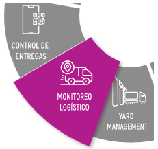
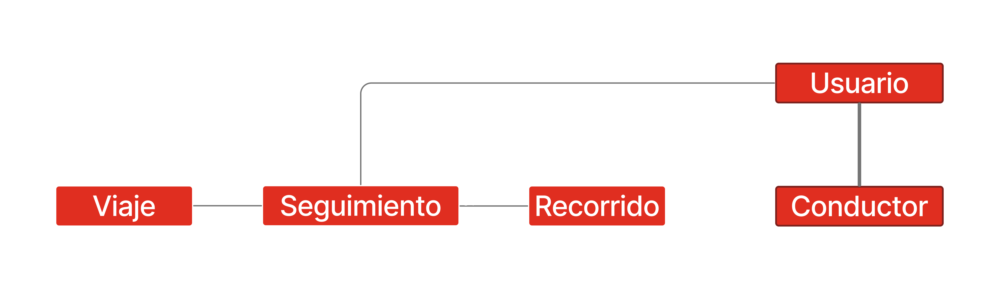
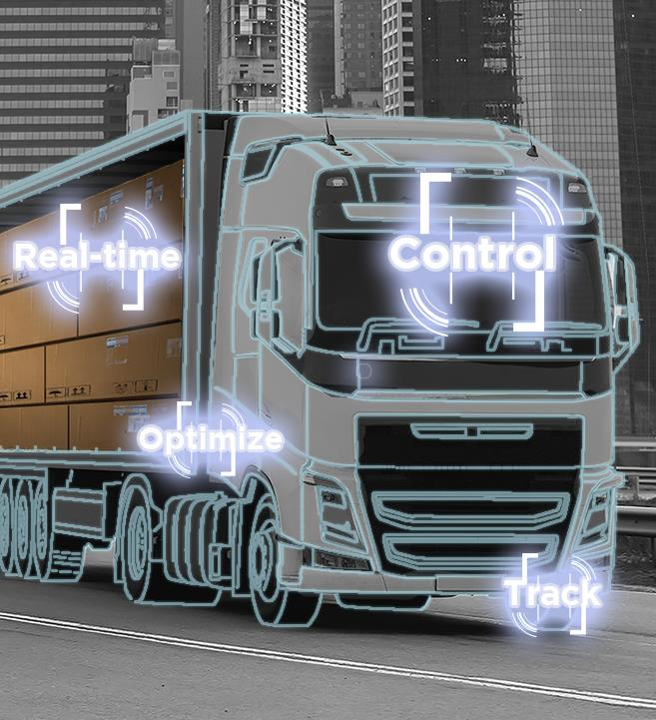
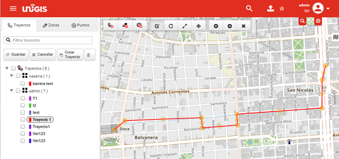
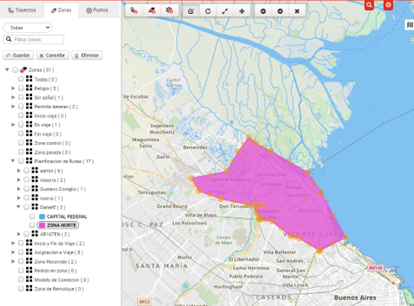

Tracking
========

Entidades
----------

.. container:: justified-text

    Estas entidades forman la base del módulo Smart Tracking del producto UNIGIS TMS, permitiendo la gestión de viajes, el seguimiento en tiempo real, la gestión de usuarios y conductores, y el registro detallado de los viajes realizados.

    Usuario: Esta entidad representa la asignación de usuarios para controlar la ejecución del viaje. Los usuarios pueden pertenecer a perfiles como cliente, conductor, domicilio, depósito, etc.

    Conductor: El conductor es el usuario autorizado para acceder al viaje y responsable de llevar a cabo la planificación de la ruta con los permisos y estados establecidos.

    Viaje: Cada viaje tiene un único seguimiento asociado y un recorrido asignado a través de su seguimiento.

    Seguimiento: Esta entidad complementa al viaje y representa el estado del vehículo durante el seguimiento en tiempo real. Se relaciona de forma uno a uno con el viaje y realiza actividades exclusivas de seguimiento, con un workflow que incluye estados como nulo, activo, pausado y finalizado.

    Recorrido: Otro complemento del viaje, el recorrido es un conjunto de elementos geográficos asociados al seguimiento de cada viaje. Incluye geocercas de inicio y fin de viaje, paradas, zonas de riesgo y trayectos a recorrer.

    Alarmas: Las alarmas son notificaciones generadas durante el seguimiento en tiempo real de un viaje previamente planificado. Se generan en respuesta a condiciones o eventos específicos y pueden configurarse por tipo de notificación asignado a una geocerca, transición de flujo de trabajo o eventos.

.. image:: entidadeslight.png
    :align: center
    :class: only-light

Monitoreo Logístico
--------------------

.. container:: justified-text

    El módulo "Tracking" para viajes ofrece una integración completa y continua con herramientas de tecnología inteligente como la Aplicación UNIGIS GPS Tracker, compatibilidad con sensores, UNIGIS X Deliveries y la plataforma UNIGIS TMS especializada. Estas herramientas permiten la recopilación, procesamiento y visualización de datos en tiempo real, proporcionando una visibilidad completa y actualizada del progreso y estado de los viajes. Esta visibilidad es invaluable para la gestión logística, la seguridad, la eficiencia operativa y la toma de decisiones informada.

    En la pantalla Home del módulo de Tracking, se muestran indicadores específicos según la jornada de interés o el día seleccionado. Toda la información presente en el módulo corresponde a la jornada seleccionada, incluyendo indicadores de viajes en tiempo real con el porcentaje de viajes activos o finalizados, así como el porcentaje de visitas y entregas al cliente (domicilio orden). Se presenta un resumen total de la jornada.

Activación de Viajes
--------------------

.. container:: justified-text
   
    Dentro del contexto de los viajes, cada uno cuenta con un conjunto de paradas asociadas a órdenes/pedidos, que incluyen elementos geográficos a controlar para realizar activaciones, estadías o finalizaciones de viaje. Estos accesos al viaje se pueden activar de diversas maneras y eventos durante el flujo de trabajo. En el producto UNIGIS TMS, existen diferentes métodos para activarlos.

    Durante un viaje activo, el sistema recopila datos, como la distancia recorrida por kilómetro y hora, el control de geocercas, las estadías, los tiempos, el control de visitas a las paradas, el workflow vinculado, el control de excesos de velocidad, las alertas, el tiempo estimado de llegada (ETA) a la próxima parada y el trayecto recorrido punto a punto.

Monitoreo
-----------

.. container:: justified-text
    
    El monitoreo en el módulo de Tracking es fundamental para la gestión efectiva de viajes y vehículos en tiempo real. El monitoreo se lleva a cabo utilizando tecnologías de seguimiento avanzadas que permiten recopilar, procesar y visualizar datos en tiempo real sobre la ubicación, el estado y otros parámetros relevantes. Viajes asignados por operación y usuario de torre de control.

    Al seleccionar por viaje o vehículo se puede consultar información del vehículo, detección, estadías, alarmas, paradas, recorrido y toda la información en caso de contar con un viaje asignado; en caso contrario, se puede consultar en tiempo real el estado de los vehículos. Dividir por zona u operación el monitoreo de los viajes. Elementos geográficos digitalizados por editor, Alarmas en tiempo real. Detalle de un elemento en particular, estado de la conexión. Selección de modos vista. Detalle. búsqueda.

    Los clústeres se usan para identificar los activos, en este caso, para identificar el estado de los vehículos y el estado de las paradas de una región del país o zona en particular según se aplique dinámicamente a varias escalas aumentará o disminuirá su agrupamiento. Se representa el estado del vehículo por un círculo y el estado de las paradas por una barra donde se segmenta por los colores asignados en la configuración. El clúster se actualiza cada 30seg su posición y estado del viaje.

.. image:: Imagen8.png
    :align: Center

.. container:: justified-text

    Vehículos

    El seguimiento y la gestión efectiva de los vehículos son fundamentales para el éxito del módulo de Tracking, especialmente en entornos como la gestión de flotas de transporte, logística y servicios de entrega. La entidad Vehículo proporciona una visibilidad centralizada de la ubicación y el estado de cada vehículo en la flota, lo que permite una gestión eficiente de la operación, la optimización de rutas, la programación de mantenimiento y la mejora de la seguridad y el cumplimiento normativo por flujos de trabajo configurados para la gestión de los vehículos.

.. image:: Imagen9.png
    :align: Center

.. container:: justified-text
    
    Conductores

    Los "conductores" se refieren a los factores o variables que influyen en las decisiones y operaciones relacionadas con la gestión del transporte. Estos conductores pueden variar dependiendo del contexto, los flujos de trabajo, el sector de la industria y las necesidades de transporte. Dentro de la opción “conductores” se permite realizar la gestión y consulta de los conductores registrados, así como mantener una comunicación directa.

    Jornadas

    Las "jornadas" se refieren a los turnos de trabajo de los conductores y otros actores involucrados en las operaciones de transporte. La gestión efectiva de las jornadas es fundamental para garantizar que las operaciones de transporte se realicen de manera eficiente y cumpliendo con los requisitos legales y de seguridad. Dentro del Módulo de Tracking se puede realizar la gestión de las jornadas, así como su planificación, creación, monitoreo y consulta de esta.

.. image:: Imagen10.png
    :align: left

Viajes

.. container:: justified-text

 La opción “viajes” se permite dar seguimiento a todo tipo de transacción específica de transporte que debe ser gestionada y coordinada en el flujo de trabajo establecido. Desde un punto inicial hasta la entrega final de la carga, con un enfoque en la planificación eficiente, la asignación de recursos adecuada y el seguimiento en tiempo real para garantizar operaciones de transporte exitosas.

 Se visualiza todo tipo de información relacionada al viaje deseado como semáforo, alarmas, vehículos, Timeline, paradas, eventos, cálculos de recorridos. Para un conjunto de viajes se permite asignar un usuario para el monitoreo de este. Permite que el agente de monitoreo pueda únicamente ver los viajes asignados.

 Detalle de un elemento en particular y seguimiento en tiempo real es el factor principal de la opción de viajes, lo que permite a los agentes y conductores mantenerse informados sobre la ubicación, cambios de estados, el estado del viaje, entre otros factores que se consideren relevantes en la operación en todo momento.

 Si surgen problemas durante un viaje, como retrasos, desvíos o cambios en las condiciones de entrega, el agente puede visualizar y ayudar a gestionar estas excepciones y tomar medidas correctivas según sea necesario.

 Se genera y mantiene la documentación relevante para cada viaje, incluidos los documentos de transporte, facturas, registros de entrega y cualquier otra información asociada. Cada reporte dentro del módulo de tracking se puede configurar a medida de las necesidades que se presente.

 Se recopilan o consulta en tiempo real de datos sobre cada viaje para su posterior análisis y evaluación del rendimiento, por ejemplo, la secuencia planificada contra la secuencia real de la planificación el cual ayuda a evaluar la ruta planeada permite eventos extraordinarios por semáforo y puntaje para identificar áreas de mejora y optimización en las operaciones de transporte. Considerando el tiempo de servicio, el agente de monitoreo puede realizar el cálculo del trayecto en tiempo real dependiendo el detalle del tiempo entre paradas, estadías, zonas, entre otros factores que se toman en cuenta para monitorear.

 Paradas

 Las "paradas" se refieren a los puntos de recogida o entrega a lo largo de una ruta de transporte. Cada parada representa un lugar específico donde se carga, descarga o transfiere la carga durante el curso de un viaje. Las paradas son elementos fundamentales en la planificación y ejecución eficiente de rutas de transporte, y su gestión efectiva es crucial para garantizar la entrega exitosa de la carga en los lugares designados. Se visualizan datos importantes correspondientes a cada parada.

 Eventos

 Los "eventos" se refieren a los sucesos o acciones significativas que ocurren durante el proceso de transporte y logística. Estos eventos pueden incluir una amplia variedad de situaciones y actividades que afectan el movimiento y la entrega de la carga. La capacidad de rastrear y gestionar estos eventos es fundamental para garantizar una operación fluida y eficiente.

 Alarmas

 Las alarmas o notificaciones son herramientas importantes que se utilizan para informar a los involucrados de un viaje sobre eventos críticos, cambios en el estado de los envíos o cualquier otra situación que requiera atención inmediata. Estas alarmas y notificaciones se configuran dentro del TMS para alertar a los usuarios sobre eventos específicos y ayudarles a tomar medidas rápidas y adecuadas. Toda la información relaciona a alarmas por el tipo de alarma.

 Mensajes

 Las comunicaciones automatizadas, notificaciones, mensajes, llamadas que informan sobre el estado y el progreso de las entregas, vehículos y otras operaciones logísticas dentro del sistema. Estos mensajes son esenciales para mantener a los usuarios y operadores informados sobre eventos críticos y cambios en el flujo de trabajo en tiempo real.

UNIGIS Editor
--------------

.. container:: justified-text

    UNIGIS Editor es una herramienta de edición de elementos geográficos dividida en trayectos, zonas y puntos. Permite a los usuarios crear, modificar y gestionar las rutas de transporte y las zonas geográficas dentro de UNIGIS TMS. Estas funcionalidades son esenciales para georreferenciar y optimizar la planificación de rutas, asignar recursos de manera eficiente y cumplir con los requisitos específicos de los clientes y las operaciones logísticas.

.. container:: justified-text

    Trayectos

    Dentro del Editor, se permite crear trayectos de forma manual, a partir del recorrido de un vehículo o directamente desde el importador de trayectos desde un archivo de formato CCB. Esta edición del trayecto permite recorridos más eficientes y optimizados para garantizar entregas.

    Zonas

    La edición de zonas permite definir, crear, editar, gestionar y clasificar el área geográfica que interactúa con otros factores como alarmas, detecciones, tipos de zona, entre otras opciones de edición libre por medio de herramientas integradas de diseño geográfico. Estas áreas geográficas proporcionan funcionalidades que facilitan la configuración y administración de estas áreas geográficas.

.. container:: justified-text

    Puntos

    Además de los trayectos y las zonas, UNIGIS Editor también permite la creación y gestión de puntos geográficos. Estos puntos pueden utilizarse para marcar ubicaciones específicas importantes en el contexto de la planificación de rutas y la logística. La capacidad de trabajar con puntos en el editor proporciona una mayor flexibilidad y precisión en la definición de las áreas geográficas y los recorridos de transporte.

UNIGIS Emulator
---------------

.. container:: justified-text

    UNIGIS Emulator es una herramienta diseñada para simular o emular las funciones y operaciones de un viaje utilizando una ID específica en un entorno virtual. Este entorno virtual reproduce las condiciones de zonas y recorridos establecidos para dicho viaje. Esta herramienta es especialmente útil para propósitos de desarrollo, pruebas o capacitación, ya que permite a los usuarios experimentar con un viaje simulado sin afectar los procesos dentro de la operación real.

    El viaje simulado incluye varias zonas, como las zonas de inicio y fin del viaje, zonas de control y de mantenimiento, así como el recorrido planificado. UNIGIS Emulator garantiza que se representen adecuadamente todos los casos y eventos relevantes para asegurar que el sistema funcione correctamente. Además, unifica inteligentemente el uso horario de diferentes distribuidores de GPS, lo que contribuye a una simulación más precisa y confiable.

.. image:: Imagen14.png
    :align: center
