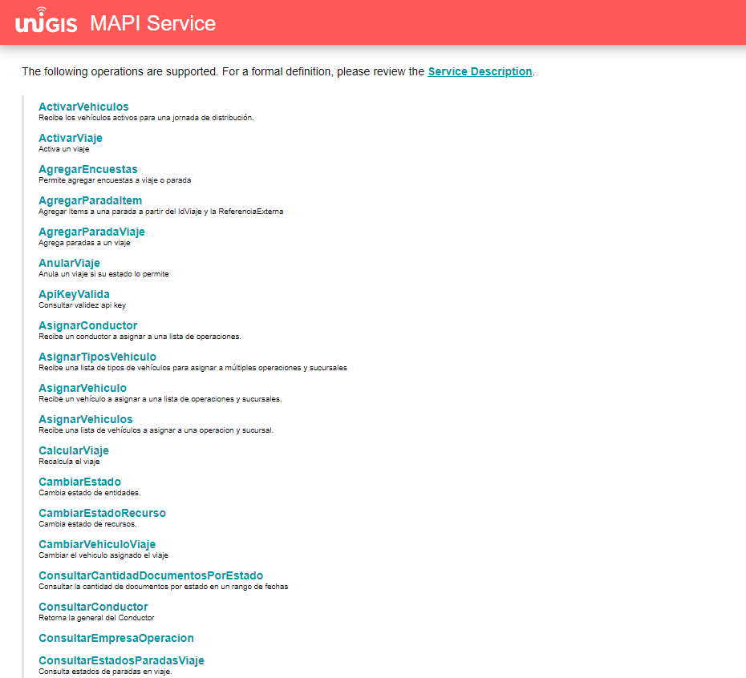
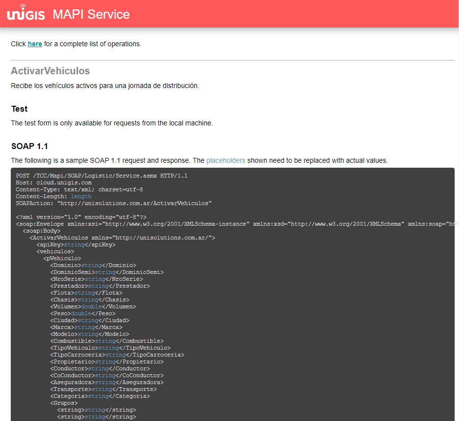

MAPI Logistic Services
=========================

Descripción 
--------------

.. container:: justified-text

    Las soluciones geográficas UNIGIS ofrecen en forma nativa una arquitectura de integración con otras aplicaciones externas a través de servicios denominada “UNIGIS Web Services” que responde a los estándares de interoperabilidad entre sistemas de la industria informática SOA / Web Services. Esta arquitectura garantiza la confiabilidad, seguridad, escalabilidad y eficiencia de los sistemas bajo la responsabilidad y buen uso de los estándares mencionados y los servicios que a continuación se describen.

    UNIGIS Web Services ofrece servicios geográficos para diferentes usos e integración con aplicaciones externas como, por ejemplo, para recibir eventos desde múltiples sistemas externos de posicionamiento AVL/GPS, para geo codificación de direcciones y Web Mapping, para integración de ruteo y control logístico (tracking) con sistemas propietarios de cada cliente, para aplicaciones de CallCenter e IVR, para dotar de capacidad geográfica a los puntos de venta, etc.

Características
-----------------
.. container:: justified-text

    Incluye los servicios (métodos) para la creación de Viajes (rutas) y Paradas pre-rutadas (órdenes o pedidos). Permite re-rutear para obtener los tiempos de visita a cada cliente (parada). En la interfaz se sincronizan automáticamente los catálogos de clientes, vehículos y transportistas. También crea los parámetros necesarios en las tablas del repositorio del sistema UNIGIS.

    Además, incluye los servicios para permitir el seguimiento de la ejecución de la distribución en tiempo real. Mediante esta interfaz el sistema informa el estado de los Viajes, el cumplimiento o atraso en las entregas de los pedidos (Paradas), el estado y ubicación geográfica de los Vehículos, etc.

    Se detalla a continuación un cuadro resumen de todos los servicios definidos para cada una de las Interfaces del grupo “Logistic”. Luego se describe también cada servicio (método) en particular, con sus respectivos parámetros, valores de retorno, etc.

    Para tener acceso a los servicios UNIGIS se requiere autorización. Los servicios pueden requerir el uso de una APIKEY provista por UNISOLUTIONS, la misma será solicitada por los webservice en cada petición.

    En general, se recomienda el uso de los servicios en forma asincrónica y sin control de estado (stateless), lo cual requiere la validación de credenciales en cada solicitud o pedido de servicio. Los servicios disponibles se pueden configurar para su uso según el perfil o rol del usuario.

    Los servicios aprovechan todos los estándares que ofrece la plataforma web de Microsoft IIS (Internet Information Services) y pueden ser publicados sobre protocolo http o https (si se requiere de mayor seguridad para una comunicación cifrada). También se pueden incorporar certificados de validación de autenticidad si así lo requiere el cliente.

Pre Requisitos
----------------
-	Contar con la aplicación SOAP UI, Postman  o servicios propios, y poder realizar las solicitudes de la MAPI.

-	Contar con un ambiente de pruebas o producción.

-	Tener la liga creada para ejecución de la MAPI.

- Esto es diferente para cada cliente puesto que se genera con su nombre empresarial, a continuación, se comparte un ejemplo del link:

https:/dominio/cliente/Mapi/SOAP/Logistic/Service.asmx

o	Si con cuenta con Postman puede descargarlo mediante el siguiente link:

https://www.postman.com/downloads/

.. note::
    
    El dominio cambia de acuerdo con el ambiente ya sea de pruebas o producción.
    
    En la sección de cliente, va el nombre de quien usará la MAPI.

Forma de Uso 
-----------------

.. container:: justified-tex

  Para poder utilizar la MAPI, es necesario contar con un ambiente de pruebas o de producción dependiendo el caso. 

  Si tiene la aplicación se SOAP UI, Postman o similares, deberá solicitar a UNIGIS las ligas correspondientes para poder utilizar el servicio.

  Una vez que tenga instalada cualquier aplicación podrá facilitarse una liga que contiene todos los servicios que opera actualmente UNIGIS; a continuación se agrega una liga de ejemplo funcional:

  https://cloud.unigis.com/TCC/Mapi/SOAP/Logistic/Service.asmx

  Al ingresar podrá visualizar un listado de los servicios:

.. container:: justified-tex

  Dentro de cada servicio se pueden visualizar los nodos con una breve descripción del servicio, que son requeridos para poder realizar una petición:

Podrá copiar y pegar y reemplazar los nodos con información del cliente en cada petición se cuenta con caso exitoso o fallido.

.. note:: 
  
  Para un caso exitoso recibiremos una respuesta 200 OK.

  Para el caso fallido solo se recibirá una respuesta -99 de error y deberá revisar la información de los nodos o realizar una revisión más a detalle para identificar si alguna variable se encuentra activa.

Web Services
-----------------

1.1. ActivarVehículos
~~~~~~~~~~~~~~~~~~~~~~~~~~~

.. container:: justified-text

    Permite sincronizar los vehículos y su disponibilidad para el cálculo de rutas óptimas para una jornada de distribución. Valida la existencia y realiza las actualizaciones evitando duplicados.

.. list-table:: Entrada
    :widths: 10 10 45
    :header-rows: 1

    * - Parámetros Entrada
      - Tipo de Dato
      - Descripción
    * - Vehículos
      - List<pVehiculo>
      - Lista de Vehículos.
    * - CódigoSucursal
      - String
      - Código de Sucursal.

.. list-table:: Retorno
    :widths: 10 10 45
    :header-rows: 1

    * - Parámetros Retorno
      - Tipo de Dato
      - Descripción
    * - Resultado
      - Boolean
      - Indica si el resultado de la operación fue exitoso o no.  1: OK ejecución correcta  0: ERROR ocurrió algún problema en la ejecución del servicio.

1.2. ActivarViaje
~~~~~~~~~~~~~~~~~~~

.. container:: justified-text

    Permite activar desde una aplicación externa el inicio de un Viaje y por lo tanto activar el control logístico de UNIGIS Tracking, control de rutas, paradas, eventos, etc. Sino los Viajes se podrán activar desde la misma plataforma de UNIGIS.

.. list-table:: Entrada
    :widths: 10 10 45
    :header-rows: 1

    * - Parámetros Entrada
      - Tipo de Dato
      - Descripción
    * - IdViaje
      - Integer
      - Identificación del Viaje para consultar su estado.
    * - FechaCambioEstado
      - DateTime
      - Permite informar la fecha de cambio de estado 0001-01-01T00:00:00.

.. list-table:: Retorno
    :widths: 10 10 45
    :header-rows: 1

    * - Parámetros Retorno
      - Tipo de Dato
      - Descripción. 
    * - Resultado
      - Boolean
      - Indica si el resultado de la operación fue exitoso o no. True: OK ejecución correcta, se relacionaron los viajes False: ERROR ocurrió algún problema en la ejecución del servicio, la ApiKey no es válida o el tipo de relación indicado no existe.

1.3. AgregarEncuentas
~~~~~~~~~~~~~~~~~~~~~~~~

Permite agregar encuentas a viajes o paradas.

.. list-table:: Entrada
    :widths: 10 10 45
    :header-rows: 1

    * - Parámetros Entrada
      - Tipo de Dato
      - Descripción. 
    * - Login
      - String
      - Usuario con el que se van a registrar las encuestas.
    * - Encuesta
      - List<pEncuesta>
      - Lista de encuentas.

Ejemplo:

.. code-block:: XML

 <soap:Envelope xmlns:xsi="http://www.w3.org/2001/XMLSchema-instance" xmlns:xsd="http://www.w3.org/2001/XMLSchema" xmlns:soap="http://schemas.xmlsoap.org/soap/envelope/">
  <soap:Body>
    <AgregarEncuestas xmlns="http://unisolutions.com.ar/">
      <ApiKey>1234</ApiKey>
      <Login>admin</Login>
      <Encuestas>
        <pEncuesta>
          <IdViaje>12144</IdViaje>
          <IdParada>297290</IdParada>
          <Encuesta>SATISFACCION CLIENTE</Encuesta>
          <Fecha>2022-02-02</Fecha>
          <Preguntas>
            <pPregunta>
              <Pregunta>LA ENTREGA LLEGO PUNTUAL?</Pregunta>
              <Respuesta>SI</Respuesta>
              <Observaciones>Observacion 1 MAPI</Observaciones>
            </pPregunta>
            <pPregunta>
              <Pregunta>LA MERCADERIA ESTA EN BUEN ESTADO?</Pregunta>
              <Respuesta>SI</Respuesta>
              <Observaciones>Observacion 2 MAPI</Observaciones>
            </pPregunta>
          </Preguntas>
        </pEncuesta>
      </Encuestas>
    </AgregarEncuestas>
  </soap:Body>
 </soap:Envelope>

.. list-table:: Retorno
    :widths: 10 10 45
    :header-rows: 1

    * - Parámetros Retorno
      - Tipo de Dato
      - Descripción. 
    * - Resultado
      - Boolean
      - Indica si el resultado de la operación fue exitoso o no. True: OK ejecución correcta, se relacionaron los viajes False: ERROR ocurrió algún problema en la ejecución del servicio, la ApiKey no es válida o el tipo de relación indicado no existe.

1.4. AgregarParadaItem
~~~~~~~~~~~~~~~~~~~~~~~~

Agregar Ítems a una parada a partir del IdViaje y la ReferenciaExterna.

.. list-table:: Entrada
    :widths: 10 10 45
    :header-rows: 1

    * - Parámetros Entrada
      - Tipo de Dato
      - Descripción. 
    * - IdViaje
      - Int
      - Número de viaje asignado por UNIGIS.
    * - ReferenciaExternaPara
      - String
      - Referencia que se asigna a la parada que se le agregaran ítems.
    * - Encuesta
      - List<ParadaItem>
      - Lista de ítems.

.. list-table:: Retorno
    :widths: 10 10 45
    :header-rows: 1

    * - Parámetros Retorno
      - Tipo de Dato
      - Descripción. 
    * - Resultado
      - Int
      - Indica si el resultado de la operación fue exitoso o no. 1: OK ejecución correcta  O código de error según tabla de código de errores. 0: ERROR ocurrió algún problema en la ejecución del servicio.

1.5. AgregarParadaViaje
~~~~~~~~~~~~~~~~~~~~~~~~

.. container:: justified-text

    Permite agregar una parada a un viaje existente, el método recibe una lista de pParada y un IdViaje (Unigis) al cual agregarle dichas paradas, es condición necesaria que el viaje exista y no se encuentre finalizado.

    Cabe destacar que el comportamiento de sincronización de los datos de la parada es idéntico al método CrearViaje y el número de secuencia indicado en el objeto pParada será el orden de visita en el cual se agregaran la/s nuevas paradas en cuestión.

.. list-table:: Entrada
    :widths: 10 10 45
    :header-rows: 1

    * - Parámetros Entrada
      - Tipo de Dato
      - Descripción 
    * - ApiKey
      - String
      - Api Key.
    * - IdViaje
      - Integer
      - IdViaje Unigis al cual agregarle la/s paradas.
    * - Paradas
      - List<pParadas>
      - Lista de pParada (tipo de dato complejo con la información de la parada).

Ejemplo: 

.. code-block:: xml

  <soapenv:Envelope xmlns:soapenv="http://schemas.xmlsoap.org/soap/envelope/" xmlns:unis="http://unisolutions.com.ar/">
   <soapenv:Header/>
   <soapenv:Body>
      <AgregarParadaViaje xmlns:mime="http://schemas.xmlsoap.org/wsdl/mime/" xmlns:jca="http://xmlns.oracle.com/pcbpel/wsdl/jca/" xmlns:ns4="http://xmlns.oracle.com/pcbpel/adapter/db/SOA/CrearParadaPRN-UNIGIS/consultarParadaPRN" xmlns:soapenc="http://schemas.xmlsoap.org/soap/encoding/" xmlns:ns3="http://xmlns.oracle.com/pcbpel/adapter/aq/SOA/CrearParadaPRN-UNIGIS/consultarParadaPRNAQ" xmlns:ns5="http://xmlns.oracle.com/pcbpel/adapter/db/SOA/CrearParadaPRN-UNIGIS/consultarParadaUnidadesPRN" xmlns:wsdl="http://schemas.xmlsoap.org/wsdl/" xmlns:soap12="http://schemas.xmlsoap.org/wsdl/soap12/" xmlns:pc="http://xmlns.oracle.com/pcbpel/" xmlns:plt="http://schemas.xmlsoap.org/ws/2003/05/partner-link/" xmlns:tm="http://microsoft.com/wsdl/mime/textMatching/" xmlns:http="http://schemas.xmlsoap.org/wsdl/http/" xmlns:soap="http://schemas.xmlsoap.org/wsdl/soap/" xmlns:unis="http://unisolutions.com.ar/" xmlns="http://unisolutions.com.ar/">
	   <unis:ApiKey>85-16-FD-C1-4E-0</unis:ApiKey>
	   <unis:idViaje>5950</unis:idViaje>
	   <unis:Paradas>
	      <unis:pParada>
	         <unis:Secuencia>1</unis:Secuencia>
	         <unis:RefDocumento>122452</unis:RefDocumento>
	         <unis:RefDocumentoAdicional>NORMAL</unis:RefDocumentoAdicional>
	         <unis:RefDocumentoPedido>354136112</unis:RefDocumentoPedido>
	         <unis:Descripcion>FRENO BENDIX</unis:Descripcion>
	         <unis:Direccion>AVENIDA 44 A NRO. 59 - 77</unis:Direccion>
	         <unis:Localidad>MEDELLÍN</unis:Localidad>
	         <unis:Partido>MEDELLÍN</unis:Partido>
	         <unis:Provincia>ANTIOQUIA</unis:Provincia>
	         <unis:Pais>COL</unis:Pais>
	         <unis:InicioHorarioPlanificado>?</unis:InicioHorarioPlanificado>
               <unis:FinHorarioPlanificado>?</unis:FinHorarioPlanificado>
	         <unis:Latitud>0</unis:Latitud>
	         <unis:Longitud>0</unis:Longitud>
	         <unis:Volumen>11</unis:Volumen>
	         <unis:Peso>17</unis:Peso>
	         <unis:Bulto>1</unis:Bulto>
	         <unis:Pallets>0</unis:Pallets>
	         <unis:Telefono>45122927</unis:Telefono>
	         <unis:Email/>
	         <unis:TiempoEstadia>1</unis:TiempoEstadia>
	         <unis:InicioHorario1>0800</unis:InicioHorario1>
	         <unis:FinHorario1>2000</unis:FinHorario1>
	         <unis:InicioHorario2>0800</unis:InicioHorario2>
	         <unis:FinHorario2>2000</unis:FinHorario2>
	         <unis:Distancia>1</unis:Distancia>
	         <unis:FechaLlegadaCargue>0001-01-01T00:00:00</unis:FechaLlegadaCargue>
             <unis:FechaEntradaCargue>2024-04-01T00:00:00</unis:FechaEntradaCargue>
             <unis:FechaSalidaCargue>2024-04-01T00:00:00</unis:FechaSalidaCargue>
             <unis:FechaLlegadaDescargue>2024-04-01T00:00:00</unis:FechaLlegadaDescargue>
             <unis:FechaEntradaDescargue>2024-04-01T00:00:00</unis:FechaEntradaDescargue>
             <unis:FechaSalidaDescargue>2024-04-01T00:00:00</unis:FechaSalidaDescargue>
	         <unis:Observaciones>EN CASO DE NOVEDAD LLAMAR AL 316-8323894</unis:Observaciones>
	         <unis:Varchar1>MEDELLÍN</unis:Varchar1>
	         <unis:Varchar2>PAQUETERIA</unis:Varchar2>
	         <unis:RequiereControl>false</unis:RequiereControl>
	         <unis:InicioHorarioPlanificado>0800</unis:InicioHorarioPlanificado>
	         <unis:FinHorarioPlanificado>2000</unis:FinHorarioPlanificado>
	         <unis:Valor_Declarado>796000</unis:Valor_Declarado>
			 <unis:DescripcionMercancia>PRODUCTOS VARIOS</unis:DescripcionMercancia>
			 <unis:HorasPlanCarga>1</unis:HorasPlanCarga>
			 <unis:MinutosPlanCarga>30</unis:MinutosPlanCarga>
			 <unis:HorasPlanDescarga>1</unis:HorasPlanDescarga>
			 <unis:MinutosPlanDescarga>30</unis:MinutosPlanDescarga>
			 <unis:Origen>MEDELLÍN – ANTIOQUIA</unis:Origen>
			 <unis:Origen>MEDELLÍN - ANTIOQUIA</unis:Origen>
			 <unis:Destino>MEDELLÍN – ANTIOQUIA</unis:Destino>
	      </unis:pParada>
	   </unis:Paradas>
	</AgregarParadaViaje>
   </soapenv:Body>
  </soapenv:Envelope>

.. list-table:: Retorno
    :widths: 10 10 45
    :header-rows: 1

    * - Parámetros Retorno
      - Tipo de Dato
      - Descripción
    * - Resultado
      - List <AgregarParadaResponse>
      - Respuesta del servicio, lista de AgregarParadaResponse (tipo de dato complejo).

1.6 AnularViaje
~~~~~~~~~~~~~~~~

.. container:: justified-text
    
    Permite anular un Viaje creado recientemente mientras que el mismo no haya sido activado aun, es decir, que el Viaje no se encuentre aun en ejecución. El sistema asume que el Viaje corresponde a la Jornada activa. 
    
.. important::
  
  No se eliminan los maestros sincronizados.

.. list-table:: Entrada
    :widths: 10 10 45
    :header-rows: 1

    * - Parámetros Entrada
      - Tipo de Dato
      - Descripción
    * - ApiKey	
      - String	
      - Token de autorización asignado al cliente.
    * - IdViaje	
      - Integer	
      - Identificación del Viaje para consultar su estado.
    * - FechaCambioEstado		
      - 
      - Permite informar la fecha de cambio de estado 0001-01-01T00:00:00.
  
.. list-table:: Retorno
    :widths: 10 10 45
    :header-rows: 1

    * - Parámetros Retorno
      - Tipo de Dato
      - Descripción
    * - Resultado
      - Boolean
      - Indica si el resultado de la operación fue exitoso o no.  True: OK ejecución correcta, se anuló el viaje y todos sus elementos relacionados False: ERROR   ocurrió algún problema en la ejecución del servicio, ej. el viaje ya está iniciado o finalizado y por ende no se puede anular.

1.7 ApiKeyValida
~~~~~~~~~~~~~~~~~~~~

Permite validar la ApiKey que será enviada en cada una de las peticiones realizadas a los métodos del webservice.

.. list-table:: Entrada
    :widths: 10 10 45
    :header-rows: 1

    * - Parámetros Entrada
      - Tipo de Dato
      - Descripción
    * - ApiKeyValida
      - String
      - Token de autorización.

Ejemplo:

.. code-block:: xml
  
 <soap:Envelope xmlns:xsi="http://www.w3.org/2001/XMLSchema-instance" xmlns:xsd="http://www.w3.org/2001/XMLSchema" xmlns:soap="http://schemas.xmlsoap.org/soap/envelope/">
   <soap:Body>
     <ApiKeyValida xmlns="http://unigis.com/">
       <s>1234</s>
     </ApiKeyValida>
   </soap:Body>
 </soap:Envelope>

.. list-table:: Retorno
    :widths: 10 10 45
    :header-rows: 1

    * - Parámetros Retorno
      - Tipo de Dato
      - Descripción
    * - Resultado
      - Boolean
      - Si la validación es correcta, devolverá un “true” o “false” en caso contrario.

1.8 Asignar Conductor
~~~~~~~~~~~~~~~~~~~~~~~

Recibe un conductor a asignar a una lista de operaciones.

.. list-table:: Entrada
    :widths: 10 10 45
    :header-rows: 1

    * - Parámetros Entrada
      - Tipo de Dato
      - Descripción
    * - Conductor
      - String
      - Ingresar la referencia externa del conductor que se quiere asignar.
    * - CódigoOperación
      - List<CodigoOperaciónRequest>
      - Lista de operaciones a las que se asignara el conductor.
    
.. list-table:: Retorno
    :widths: 10 10 45
    :header-rows: 1

    * - Parámetros Retorno
      - Tipo de Dato
      - Descripción
    * - Resultado
      - List<AgregarParadaResponse>
      - Respuesta del servicio, lista de AgregarParadaResponse (tipo de dato complejo).

1.9 AsignarTiposVehiculo
~~~~~~~~~~~~~~~~~~~~~~~~~~

Recibe una lista de tipos de vehículos para asignar a múltiples operaciones y sucursales.

.. list-table:: Entrada
    :widths: 10 10 45
    :header-rows: 1

    * - Parámetros Entrada
      - Tipo de Dato
      - Descripción
    * - BorrarAsignaciones
      - Bool
      - Ingresar en true si se quiere borrar las asignaciones previas del tipo vehículo.
    * - pTipoVehiculo
      - pTipoVehiculo
      - Lista de tipos de vehículo.

.. list-table:: Retorno
    :widths: 10 10 45
    :header-rows: 1

    * - Parámetros Retorno
      - Tipo de Dato
      - Descripción
    * - Resultado
      - Int
      - Indica si el resultado de la operación fue exitoso o no. 1: OK ejecución correcta  O código de error según tabla de código de errores.  0: ERROR ocurrió algún problema en la ejecución del servicio.

1.10. AsignarVehiculo
~~~~~~~~~~~~~~~~~~~~~~~~~~

Recibe un vehículo a asignar a una lista de operaciones y sucursales.

.. list-table:: Entrada
    :widths: 10 10 45
    :header-rows: 1

    * - Parámetros Entrada
      - Tipo de Dato
      - Descripción
    * - Vehiculo
      - String
      - Dominio del vehículo.
    * - borrarAsignaciones
      - Bool
      - Ingresar en true si se quiere borrar las asignaciones previas del vehículo.
    * - CodigosSucursalOperacion
      - List<CodigoSucursalOperación>
      - Objeto complejo.

Ejemplo:

.. code-block:: xml

 <soap:Envelope xmlns:xsi="http://www.w3.org/2001/XMLSchema-instance" xmlns:xsd="http://www.w3.org/2001/XMLSchema" xmlns:soap="http://schemas.xmlsoap.org/soap/envelope/">
  <soap:Body>
    <AsignarVehiculo xmlns="http://unisolutions.com.ar/">
      <apiKey>1234</apiKey>
      <vehiculo>SOP6578</vehiculo>
      <codigosSucursalOperacion>
        <codigoSucursalOperacionRequest>
          <codigoSucursal>T-CABA</codigoSucursal>
          <codigoOperacion>1</codigoOperacion>
          <cantidad>10</cantidad>
          <cantidadMaxima>20</cantidadMaxima>
        </codigoSucursalOperacionRequest>
        </codigosSucursalOperacion>
      <borrarAsignaciones>0</borrarAsignaciones>
    </AsignarVehiculo>
  </soap:Body>
 </soap:Envelope>

.. list-table:: Retorno
    :widths: 10 10 45
    :header-rows: 1

    * - Parámetros Retorno
      - Tipo de Dato
      - Descripción. 
    * - Resultado
      - Int
      - Indica si el resultado de la operación fue exitoso o no. 1: OK ejecución correcta  O código de error según tabla de código de errores.  0: ERROR ocurrió algún problema en la ejecución del servicio.

1.11. AsignarVehiculos
~~~~~~~~~~~~~~~~~~~~~~~~~~~~

Recibe una lista de vehículos a asignar a una lista de operaciones y sucursales.

.. list-table:: Entrada
    :widths: 10 10 45
    :header-rows: 1

    * - Parámetros Entrada
      - Tipo de Dato
      - Descripción
    * - Vehiculo
      - List<String>
      - Dominio del vehículo.
    * - borrarAsignaciones
      - Bool
      - Ingresar en true si se quiere borrar las asignaciones previas del vehículo.
    * - CodigosOperacion
      - String
      - Referencia de la operación para asignar.
    * - CodigosSucursal
      - String
      - Referencia de la operación para asignar los vehículos.

.. list-table:: Retorno
    :widths: 10 10 45
    :header-rows: 1

    * - Parámetros Retorno
      - Tipo de Dato
      - Descripción
    * - Resultado
      - Int
      - Indica si el resultado de la operación fue exitoso o no. 1: OK ejecución correcta O código de error según tabla de código de errores.  0: ERROR ocurrió algún problema en la ejecución del servicio.

1.12. CalcularViaje
~~~~~~~~~~~~~~~~~~~~~~~

Realiza un recalculo del viaje.

.. list-table:: Entrada
    :widths: 10 10 45
    :header-rows: 1

    * - Parámetros Entrada
      - Tipo de Dato
      - Descripción
    * - IdViaje
      - Int
      - Número del viaje asignado por UNIGIS.
    * - MantenerSecuencia
      - Bool
      - No se utiliza en el método.

.. list-table:: Retorno
    :widths: 10 10 45
    :header-rows: 1

    * - Parámetros Retorno
      - Tipo de Dato
      - Descripción
    * - Resultado
      - Int
      - False si no encuentra el viaje y true después de la asignación de recalculo exitosa.

1.13. CambiarEstado
~~~~~~~~~~~~~~~~~~~~~~~

Permite realizar el cambio de estado de diferentes entidades.

.. list-table:: Entrada
    :widths: 10 10 45
    :header-rows: 1

    * - Parámetros Entrada
      - Tipo de Dato
      - Descripción
    * - Entidad
      - String
      - Nombre de la entidad donde se realizará el cambio de estado.
    * - ReferenciaExterna
      - String
      - Referencia de la entidad si el cambio se quiere hacer desde este campo.
    * - Identidad
      - Int
      - Id de la entidad a cambiar estado.
    * - IdEstado
      - Int
      - Id del estado al que va a cambiar la entidad.

Ejemplo de cambio de entidad Parada:

.. code-block:: xml
  
 <soap:Envelope xmlns:xsi="http://www.w3.org/2001/XMLSchema-instance" xmlns:xsd="http://www.w3.org/2001/XMLSchema" xmlns:soap="http://schemas.xmlsoap.org/soap/envelope/">
  <soap:Body>
    <cambiarEstado xmlns="http://www.unisolutions.com.ar/UNIGIS/Data/">
      <IdParada>69525</IdParada>
      <IdEstado>3</IdEstado>
      <IdMotivo>1</IdMotivo>
      <observaciones>Modificado por Servicios</observaciones>
      <!--<pics>
        <ParadaItemCantidad>
          <IdParadaItemCantidad>int</IdParadaItemCantidad>
          <IdParadaItem>int</IdParadaItem>
          <Cantidad>double</Cantidad>
          <FechaCreacion>dateTime</FechaCreacion>
          <Login>string</Login>
          <IdMotivo>long</IdMotivo>
          <IdParada>int</IdParada>
          <CantidadSecundaria>double</CantidadSecundaria>
          <IdUnidadMedida>int</IdUnidadMedida>
          <IdUnidadMedidaSecundaria>int</IdUnidadMedidaSecundaria>
        </ParadaItemCantidad>
        <ParadaItemCantidad>
          <IdParadaItemCantidad>int</IdParadaItemCantidad>
          <IdParadaItem>int</IdParadaItem>
          <Cantidad>double</Cantidad>
          <FechaCreacion>dateTime</FechaCreacion>
          <Login>string</Login>
          <IdMotivo>long</IdMotivo>
          <IdParada>int</IdParada>
          <CantidadSecundaria>double</CantidadSecundaria>
          <IdUnidadMedida>int</IdUnidadMedida>
          <IdUnidadMedidaSecundaria>int</IdUnidadMedidaSecundaria>
        </ParadaItemCantidad>
      </pics>-->
     <!-- <valor_control>string</valor_control>
      <ticks_utc>long</ticks_utc>
      <id_encuesta>int</id_encuesta>-->
      <respuestas>
        <EncuestaSolucionRespuesta>
          <IdEncuestaSolucionRespuesta>1</IdEncuestaSolucionRespuesta>
          <IdEncuestaSolucion>1</IdEncuestaSolucion>
          <IdEncuestaPregunta>1</IdEncuestaPregunta>
          <Respuesta>Servivios</Respuesta>
          <Observaciones>Serviciod</Observaciones>
          <RespuestaArchivos>
            <EncuestaSolucionRespuestaArchivo xsi:nil="true" />
            <EncuestaSolucionRespuestaArchivo xsi:nil="true" />
          </RespuestaArchivos>
        </EncuestaSolucionRespuesta>
        <!--<EncuestaSolucionRespuesta>
          <IdEncuestaSolucionRespuesta>int</IdEncuestaSolucionRespuesta>
          <IdEncuestaSolucion>int</IdEncuestaSolucion>
          <IdEncuestaPregunta>int</IdEncuestaPregunta>
          <Respuesta>string</Respuesta>
          <Observaciones>string</Observaciones>
          <RespuestaArchivos>
            <EncuestaSolucionRespuestaArchivo xsi:nil="true" />
            <EncuestaSolucionRespuestaArchivo xsi:nil="true" />
          </RespuestaArchivos>
        </EncuestaSolucionRespuesta>-->
      </respuestas>
      <!--<latitud>double</latitud>
      <longitud>double</longitud>-->
    </cambiarEstado>
  </soap:Body>
 </soap:Envelope>}

.. list-table:: Retorno
    :widths: 10 10 45
    :header-rows: 1

    * - Parámetros Retorno
      - Tipo de Dato
      - Descripción
    * - Resultado
      - Boolean
      - Indica si el resultado de la operación fue exitoso o no. True: OK ejecución correcta, se relacionaron los viajes False: ERROR ocurrió algún problema en la ejecución del servicio, la ApiKey no es válida o el tipo de relación indicado no existe.

1.14. CambiarEstadoRecurso
~~~~~~~~~~~~~~~~~~~~~~~~~~~~

Permite cambiar el estado de los recursos ingresados.

.. list-table:: Entrada
    :widths: 10 10 45
    :header-rows: 1

    * - Parámetros Entrada
      - Tipo de Dato
      - Descripción
    * - Entidad
      - String
      - Nombre de la entidad donde se realizará el cambio de estado.
    * - ReferenciaExterna
      - String
      - Referencia de la entidad si el cambio se quiere hacer desde este campo.
    * - Identidad
      - Int
      - Id de la entidad a cambiar estado.
    * - Login
      - String
      - Usuario que va a registrar el cambio de estado.
    * - Motivo
      - String
      - Motivo en caso de alguna incidencia.
    * - ValidarTranscicion
      - Bool
      - Validar que la transición sea válida antes del cambio de estado.
    * - MismoEstado
      - Bool
      - Permitir guardar el cambio de estado aun cuando sea el mismo.
    * - Observaciones
      - String 
      - Comentario libre.

.. list-table:: Retorno
    :widths: 10 10 45
    :header-rows: 1

    * - Parámetros Retorno
      - Tipo de Dato
      - Descripción
    * - Resultado
      - Boolean
      - Indica si el resultado de la operación fue exitoso o no. True: OK ejecución correcta, se relacionaron los viajes False: ERROR ocurrió algún problema en la ejecución del servicio, la ApiKey no es válida o el tipo de relación indicado no existe.

1.15. CambiarVehiculoViaje
~~~~~~~~~~~~~~~~~~~~~~~~~~~~

.. container:: justified-text

    Permite cambiar el vehículo asignado a un viaje. Las asignaciones de operadores al viaje no son modificadas. Puede indicarse la referencia al viaje vía el parámetro IdViaje, indicando el identificador de viaje otorgado por UNIGIS al haberlo creado.

    Opcionalmente se puede utilizar la referencia externa utilizada por el consumidor del servicio al momento de crear el viaje, para esto se debe pasar IdViaje en -1 tal que sea ignorado y se le de relevancia a la referencia externa. 

    Si existiera más de un viaje con la referencia externa indicada se tomará el último viaje creado que coincida con la referencia y que este activo.

.. list-table:: Entrada
    :widths: 10 10 45
    :header-rows: 1

    * - Parámetros Entrada
      - Tipo de Dato
      - Descripción
    * - IdViaje
      - Integer
      - Identificación única del viaje. Se envía -1 si se desea ignorar en función de la referencia externa.
    * - ReferenciaExterna
      - String
      - Referencia única externa al viaje, si existe ambigüedad se toma el viaje más reciente con dicha referencia.
    * - Dominio
      - String
      - Placa/Dominio/Identificación del nuevo vehículo a asignar al viaje.

.. list-table:: Retorno
    :widths: 10 10 45
    :header-rows: 1

    * - Parámetros Retorno
      - Tipo de Dato
      - Descripción
    * - Resultado
      - Boolean
      - Verdadero en caso de realizar el cambio.

1.16. ConsultarCantidadDocumentosPorEstado
~~~~~~~~~~~~~~~~~~~~~~~~~~~~~~~~~~~~~~~~~~~~

Permite realizar la consulta de documentos por un rango de fechas de un estado.

.. list-table:: Entrada
    :widths: 10 10 45
    :header-rows: 1

    * - Parámetros Entrada
      - Tipo de Dato
      - Descripción
    * - FechaDesde
      - DateTime
      - Fecha inicial de consulta.
    * - FechaHasta
      - DateTime
      - Fecha inicial de consulta.
    * - EstadoDocumento
      - String
      - Descripción del estado de documento a consultar.

.. list-table:: Retorno
    :widths: 10 10 45
    :header-rows: 1

    * - Parámetros Retorno
      - Tipo de Dato
      - Descripción 
    * - Resultado
      - Boolean
      - Verdadero en caso de realizar el cambio.

1.17. ConsultarConductor
~~~~~~~~~~~~~~~~~~~~~~~~~~~~~~~~

Recupera la información general del conductor desde cualquier parámetro que se ingrese.

.. list-table:: Entrada
    :widths: 10 10 45
    :header-rows: 1

    * - Parámetros Entrada
      - Tipo de Dato
      - Descripción
    * - ReferenciaExterna
      - String
      - Referencia del conductor.
    * - NroDocumento
      - String
      - Identificador de documento.
    * - NroLicencia
      - String
      - Numéro de la licencia.

.. list-table:: Retorno
    :widths: 10 10 45
    :header-rows: 1

    * - Parámetros Retorno
      - Tipo de Dato
      - Descripción
    * - Resultado
      - pConductor
      - Objeto complejo.

1.18. ConsultarEmpresaOperación 
~~~~~~~~~~~~~~~~~~~~~~~~~~~~~~~~~~~~

Permite obtener la razón social de la empresa a la cual pertenece la operación consultada.

.. list-table:: Entrada
    :widths: 10 10 45
    :header-rows: 1

    * - Parámetros Entrada
      - Tipo de Dato
      - Descripción
    * - OperationReference
      - String
      - Referencia de la operación que se desea consultar.

.. list-table:: Retorno
    :widths: 10 10 45
    :header-rows: 1

    * - Parámetros Retorno
      - Tipo de Dato
      - Descripción
    * - Resultado
      - String
      - Razón social de la empresa ligada a la operación consultada.

1.19. ConsultarEstadosParadasViaje
~~~~~~~~~~~~~~~~~~~~~~~~~~~~~~~~~~~~~

Consulta estados de paradas en viaje.

.. list-table:: Entrada
    :widths: 10 10 45
    :header-rows: 1

    * - Parámetros Entrada
      - Tipo de Dato
      - Descripción
    * - IdViaje
      - Int
      - Id del viaje UNIGIS.

Ejemplo:

.. code-block:: xml
  
  <soapenv:Envelope xmlns:soapenv="http://schemas.xmlsoap.org/soap/envelope/" xmlns:unis="http://unisolutions.com.ar/">
   <soapenv:Header/>
   <soapenv:Body>
      <unis:ConsultarEstadosParadasViaje>         
         <unis:Apikey>1234</unis:Apikey>
         <unis:IdViaje>{{_IdViaje}}</unis:IdViaje>
      </unis:ConsultarEstadosParadasViaje>
   </soapenv:Body>
 </soapenv:Envelope>

.. list-table:: Retorno
    :widths: 10 10 45
    :header-rows: 1

    * - Parámetros Retorno
      - Tipo de Dato
      - Descripción
    * - Resultado
      - pEstadosViaje
      - Objeto complejo.

1.20. ConsultarEtiquetas
~~~~~~~~~~~~~~~~~~~~~~~~~~~~

Permite consultar la etiqueta o etiquetas asignadas a una parada del viaje.

.. list-table:: Entrada
    :widths: 10 10 45
    :header-rows: 1

    * - Parámetros Entrada
      - Tipo de Dato
      - Descripción
    * - ApiKey
      - String
      - ApiKey.
    * - Fromld
      - Integer
      - Id de la etiqueta-parada que se desea consultar.
    * - FromDate
      - DateTime
      - Fecha de inicio de rango de búsqueda de la fecha de creación de la etiqueta.
    * - ToDate
      - DateTime
      - Fecha de fin de rango de búsqueda de la fecha de creación de la etiqueta.

.. list-table:: Retorno
    :widths: 10 10 45
    :header-rows: 1

    * - Parámetros Retorno
      - Tipo de Dato
      - Descripción
    * - Resultado
      - ConsultarEtiquetasResponse
      - Tipo de dato complejo con toda la información de la consulta (ver datos completos de la ficha detallados más adelante).

1.21. ConsultarMapaVehiculo
~~~~~~~~~~~~~~~~~~~~~~~~~~~~~~~

Retorna un tipo de datos complejo con la URL del mapa, geo codificación reversa y TimeZone de la última posición del vehículo.

.. list-table:: Entrada
    :widths: 10 10 45
    :header-rows: 1

    * - Parámetros Entrada
      - Tipo de Dato
      - Descripción
    * - ApiKey
      - String
      - ApiKey.
    * - Dominio
      - String
      - Dominio por consultar.
    * - DevolverMapa
      - Boolean
      - Flag que indica si la respuesta deberá contener la URL del mapa.
    * - DevolverGeoReversa
      - Boolean
      - Flag que indica si la respuesta deberá contener la geo codificación reversa.
    * - DevolverTimeZone
      - Boolean
      - Flag que indica si la respuesta deberá contener el time zone del vehículo.

.. list-table:: Retorno
    :widths: 10 10 45
    :header-rows: 1

    * - Parámetros Retorno
      - Tipo de Dato
      - Descripción
    * - Resultado (*)
      - ConsultarMapaVehiculoResultado
      - Tipo de datos complejo con la respuesta del WS.

1.22. ConsultarMapaVehiculoBatch
~~~~~~~~~~~~~~~~~~~~~~~~~~~~~~~~~~

.. container:: justified-text

    Basado en el servicio ConsultarMapaVehiculo, retorna una lista de objetos ConsultarVehiculoResultado de modo batch para los vehículos que no estén dados de baja.

1.23. ConsultarOrdenEntrega
~~~~~~~~~~~~~~~~~~~~~~~~~~~~~~

Servicio que retorna un tipo de dato complejo con la información de la orden de entrega. Si la sucursal y operación son vacíos tomara el primero por defecto.

.. list-table:: Entrada
    :widths: 10 10 45
    :header-rows: 1

    * - Parámetros Entrada
      - Tipo de Dato
      - Descripción 
    * - ApiKey
      - String
      - ApiKey.
    * - RefDocumento
      - String
      - Referencia externa de la orden.
    * - Sucursal
      - String
      - Referencia externa de la sucursal.
    * - Operación
      - String
      - Referencia externa de la operación.
    * - TipoOperación
      - String
      - Referencia externa del tipo de operación.

Ejemplo:

.. code-block:: xml

 <soap:Envelope xmlns:xsi="http://www.w3.org/2001/XMLSchema-instance" xmlns:xsd="http://www.w3.org/2001/XMLSchema" xmlns:soap="http://schemas.xmlsoap.org/soap/envelope/">
  <soap:Body>
    <ConsultarOrdenEntrega xmlns="http://unisolutions.com.ar/">
      <ApiKey>1234</ApiKey>
      <RefDocumento>941511379</RefDocumento>
      <Sucursal>T-CABA</Sucursal>
      <Operacion>DELIV-JUG</Operacion>
      <TipoOperacion>TDISTR-1</TipoOperacion>
    </ConsultarOrdenEntrega>
  </soap:Body>
 </soap:Envelope>

.. list-table:: Retorno
    :widths: 10 10 45
    :header-rows: 1

    * - Parámetros Retorno
      - Tipo de Dato
      - Descripción
    * - Resultado (*)
      - pOrdenEntrega
      - Objeto con la información relativa a la orden de entrega.

1.24. ConsultarOrdenPedido
~~~~~~~~~~~~~~~~~~~~~~~~~~~~

Servicio que retorna un tipo de dato complejo con la información del pedido.

.. list-table:: Entrada
    :widths: 10 10 45
    :header-rows: 1

    * - Parámetros Entrada
      - Tipo de Dato
      - Descripción
    * - ApiKey
      - String
      - ApiKey.
    * - ReferenciaExterna
      - String
      - Referencia externa del pedido.

.. list-table:: Retorno
    :widths: 10 10 45
    :header-rows: 1

    * - Parámetros Retorno
      - Tipo de Dato
      - Descripción
    * - Resultado (*)
      - pOrdenPedido
      - Objeto con la información relativa al pedido.

Ejemplo:

.. code-block:: xml

  <soap:Envelope xmlns:soap="http://www.w3.org/2003/05/soap-envelope" xmlns:xsi="http://www.w3.org/2001/XMLSchema-instance" xmlns:xsd="http://www.w3.org/2001/XMLSchema">
   <soap:Body>
      <ConsultarOrdenPedidoResponse xmlns="http://unisolutions.com.ar/">
         <ConsultarOrdenPedidoResult>
            <RefDocumento>6406851792</RefDocumento>
            <RefDocumentoAdicional>28703072</RefDocumentoAdicional>
            <Fecha>2020-08-03T00:00:00</Fecha>
            <FechaEntrega>2020-08-05T12:00:00</FechaEntrega>
            <FechaEntregaOriginal xsi:nil="true"/>
            <Cliente>
               <RefCliente>6400001929</RefCliente>
               <RazonSocial>DISTRIBUIDORA SMART. S.A. DE</RazonSocial>
               <Localidad>Tultitlán</Localidad>
               <Latitud>0</Latitud>
               <Longitud>0</Longitud>
               <RefDomicilioExterno>6400000352</RefDomicilioExterno>
               <DomicilioDescripcion>DISTRIBUIDORA  S.A. DE</DomicilioDescripcion>
               <InicioHorario1>0</InicioHorario1>
               <InicioHorario2>0</InicioHorario2>
               <FinHorario1>0</FinHorario1>
               <FinHorario2>0</FinHorario2>
               <TiempoEspera>360</TiempoEspera>
               <Varchar1>SUC 170 DISTRIBUIDRA </Varchar1>
               <Varchar2>000212577</Varchar2>
               <Int1>0</Int1>
               <Int2>0</Int2>
               <Float1>0</Float1>
               <Float2>0</Float2>
            </Cliente>
            <Descripcion>DISTRIBUIDORA SMART, SA DE</Descripcion>
            <TipoPedido>FTL</TipoPedido>
            <Estado>Planeacion</Estado>
            <Direccion>Avenida valles de las alamedas 7 y 8. CP 54940. Tultitlan Edo de Mexico</Direccion>
            <Calle>Avenida valles de las alamedas 7 y 8. CP 54940. Tultitlan Edo de Mexico</Calle>
            <Partido>Local</Partido>
            <Provincia>México</Provincia>
            <InicioHorario1>700</InicioHorario1>
            <FinHorario1>700</FinHorario1>
            <InicioHorario2>0</InicioHorario2>
            <FinHorario2>0</FinHorario2>
            <TiempoEspera>360</TiempoEspera>
            <Volumen>0.054017664</Volumen>
            <Peso>0</Peso>
            <Bulto>1</Bulto>
            <Pallets>0</Pallets>
            <Distancia>0</Distancia>
            <Latitud>19.5902525</Latitud>
            <Longitud>-99.1813606</Longitud>
            <Observaciones/>
            <Varchar1>SUC 170 DISTRIBUIDRA SMART</Varchar1>
            <Varchar2>000212577</Varchar2>
            <Int1>0</Int1>
            <Int2>0</Int2>
            <CodigoPostal>57205</CodigoPostal>
            <UrlB2C>https://cloudmx.unigis.com/EJEMPLO/B2C/OrderBase/Details?reference=EAAAAC5nL5Kn0wWeNer+kwWx0LY5YG9ZFsGzaryEAH+EYqEm&amp;UTC_difference=-1</UrlB2C>
            <EstadoDetalle>
               <RefDocumento>6406851792</RefDocumento>
               <Estado>Planeacion</Estado>
               <EstadoFecha>2020-08-04T01:57:18.627Z</EstadoFecha>
               <ValidarTransicion xsi:nil="true"/>
            </EstadoDetalle>
            <Items>
               <pOrdenPedidoItem>
                  <RefDocumento>00006520010145875327</RefDocumento>
                  <RefDocumentoAdicional>G28243569</RefDocumentoAdicional>
                  <Producto>
                     <RefProducto>A3</RefProducto>
                     <Volumen>0</Volumen>
                     <Peso>0</Peso>
                     <Bultos>0</Bultos>
                     <Alto>0</Alto>
                     <Ancho>0</Ancho>
                     <Profundidad>0</Profundidad>
                     <Apilable>0</Apilable>
                  </Producto>
                  <Cantidad>1</Cantidad>
                  <Volumen>0.054017663999999986</Volumen>
                  <Peso>0</Peso>
                  <Bulto>1</Bulto>
                  <Pallets>0</Pallets>
                  <ImporteCosto>0</ImporteCosto>
                  <FechaEntrega xsi:nil="true"/>
                  <Varchar1>APP</Varchar1>
                  <Varchar2>7/22/2020 12:25:28 PM</Varchar2>
                  <Int1>0</Int1>
                  <Int2>0</Int2>
                  <Descripcion>A3</Descripcion>
                  <IdPedidoItem>3450466</IdPedidoItem>
                  <Unidades>3</Unidades>
                  <ReferenciaCantidad>0</ReferenciaCantidad>
                  <ReferenciaValor>0</ReferenciaValor>
                  <ProcesarVolumetria>1</ProcesarVolumetria>
                  <Apilable>0</Apilable>
                  <Alto>0</Alto>
                  <Ancho>0</Ancho>
                  <Profundidad>0</Profundidad>
               </pOrdenPedidoItem>
            </Items>
            <Documentos>
               <pDocumento>
                  <TipoDocumento>Facturas</TipoDocumento>
                  <Referencia>6410696196</Referencia>
                  <FechaEmision>2020-08-11T03:00:00</FechaEmision>
                  <FechaExpiracion>2090-08-11T03:00:00</FechaExpiracion>
                  <Categoria>28703072</Categoria>
                  <Clase>26419.47</Clase>
                  <Observaciones>6406851792</Observaciones>
                  <ForzarActualizacion xsi:nil="true"/>
               </pDocumento>
            </Documentos>
            <IdPedido>607620</IdPedido>
            <GrupoRutas>0</GrupoRutas>
            <InicioHorarioRecoleccion1>0</InicioHorarioRecoleccion1>
            <InicioHorarioRecoleccion2>0</InicioHorarioRecoleccion2>
            <FinHorarioRecoleccion1>0</FinHorarioRecoleccion1>
            <FinHorarioRecoleccion2>0</FinHorarioRecoleccion2>
            <Unidades>0</Unidades>
            <ValorDeclarado>0</ValorDeclarado>
            <Float1>0</Float1>
            <Float2>0</Float2>
         </ConsultarOrdenPedidoResult>
      </ConsultarOrdenPedidoResponse>
   </soap:Body>
  </soap:Envelope>

1.25. ConsultarOrdenPedidoId
~~~~~~~~~~~~~~~~~~~~~~~~~~~~~~~

Servicio que retorna un tipo de dato complejo con la información del pedido.

.. list-table:: Entrada
    :widths: 10 10 45
    :header-rows: 1

    * - Parámetros Entrada
      - Tipo de Dato
      - Descripción
    * - ApiKey
      - String
      - ApiKey.
    * - IdPedido
      - Int
      - Id de pedido asignado.

Ejemplo:

.. code-block:: xml

 <soap:Envelope xmlns:xsi="http://www.w3.org/2001/XMLSchema-instance" xmlns:xsd="http://www.w3.org/2001/XMLSchema" xmlns:soap="http://schemas.xmlsoap.org/soap/envelope/">
  <soap:Body>
    <ConsultarOrdenPedidoId xmlns="http://unisolutions.com.ar/">
      <ApiKey>1234</ApiKey>
      <IdPedido>37516</IdPedido>
    </ConsultarOrdenPedidoId>
  </soap:Body>
 </soap:Envelope>

.. list-table:: Retorno
    :widths: 10 10 45
    :header-rows: 1

    * - Parámetros Retorno
      - Tipo de Dato
      - Descripción 
    * - Resultado (*)
      - pOrdenPedido
      - Objeto con la información relativa al pedido.

1.26. ConsultarParada 
~~~~~~~~~~~~~~~~~~~~~~~~

.. container:: justified-text
    
    Permite consultar el estado de una entrega o Parada dentro de un Viaje indicando el código de secuencia de este o la referencia de Cliente. El sistema devuelve el estado de esta, si se encuentra pendiente o ya fue cumplida y sus horarios.

.. list-table:: Entrada
    :widths: 10 10 45
    :header-rows: 1

    * - Parámetros Entrada
      - Tipo de Dato
      - Descripción
    * - IdViaje
      - Integer
      - Identificación del Viaje para consultar su estado. Si se ingresa el Viaje se debe ingresar también la Secuencia que identifica a la Parada / Cliente a consultar.
    * - RefCliente
      - String
      - Se puede indicar también la Referencia del Cliente Identificación del Viaje para consultar su estado. Este número identificador es el retornado al crear un viaje con el método “CrearViaje”. En el caso que se ingresen los 3 datos, el Sistema prioriza la búsqueda por el IdViaje y Secuencia.
    * - RefDocumento
      - String
      - Referencia al documento del sistema externo asociado a la parada (Factura/Remito/Comprobante).
    * - RefDocumentoAdicional
      - String
      - Referencia al documento adicional del sistema externo asociado a la parada (Factura/Remito/Comprobante).
    * - Secuencia
      - Integer
      - Indica el número de secuencia de la Parada / Cliente dentro del Viaje.

Ejemplo:

.. code-block:: xml

 <soap:Envelope xmlns:xsi="http://www.w3.org/2001/XMLSchema-instance" xmlns:xsd="http://www.w3.org/2001/XMLSchema" xmlns:soap="http://schemas.xmlsoap.org/soap/envelope/">
  <soap:Body>
    <ConsultarParada xmlns="http://unisolutions.com.ar/">
      <ApiKey>1234</ApiKey>
      <IdViaje>20</IdViaje>
      <Secuencia>1</Secuencia>
      <RefDocumento>941460149</RefDocumento>
      <RefDocumentoAdicional>55204780189</RefDocumentoAdicional>
      <RefCliente>6298</RefCliente>
    </ConsultarParada>
  </soap:Body>
 </soap:Envelope>

.. list-table:: Retorno
    :widths: 10 10 45
    :header-rows: 1

    * - Parámetros Retorno
      - Tipo de Dato
      - Descripción
    * - Resultado (*)
      - ConsultarParadaResultado
      - Tipo de dato complejo con toda la información de la consulta (ver datos completos de la ficha detallados más adelante).

1.27. ConsultarParadaPorId
~~~~~~~~~~~~~~~~~~~~~~~~~~~~~~~

.. container:: justified-text

    Permite consultar el estado de una entrega o Parada dentro de un Viaje indicando el código de secuencia de este o la referencia de Cliente. El sistema devuelve el estado de esta, si se encuentra pendiente o ya fue cumplida y sus horarios.

.. list-table:: Entrada
    :widths: 10 10 45
    :header-rows: 1

    * - Parámetros Entrada
      - Tipo de Dato
      - Descripción
    * - IdViaje
      - Integer
      - Identificación del Viaje para consultar su estado. Si se ingresa el Viaje se debe ingresar también la Secuencia que identifica a la Parada / Cliente a consultar.
    * - RefCliente
      - String
      - Se puede indicar también la Referencia del Cliente Identificación del Viaje para consultar su estado. Este número identificador es el retornado al crear un viaje con el método “CrearViaje”. En el caso que se ingresen los 3 datos, el Sistema prioriza la búsqueda por el IdViaje y Secuencia.
    * - RefDocumento
      - String
      - Referencia al documento del sistema externo asociado a la parada (Factura/Remito/Comprobante).
    * - RefDocumentoAdicional
      - String
      - Referencia al documento adicional del sistema externo asociado a la parada (Factura/Remito/Comprobante).
    * - Secuencia
      - Integer
      - Indica el número de secuencia de la Parada / Cliente dentro del Viaje.

Ejemplo:

.. code-block:: xml

 <soap:Envelope xmlns:xsi="http://www.w3.org/2001/XMLSchema-instance" xmlns:xsd="http://www.w3.org/2001/XMLSchema" xmlns:soap="http://schemas.xmlsoap.org/soap/envelope/">
  <soap:Body>
    <ConsultarParadaPorId xmlns="http://unisolutions.com.ar/">
      <ApiKey>1234</ApiKey>
      <IdParada>36</IdParada>
    </ConsultarParadaPorId>
  </soap:Body>
 </soap:Envelope>

.. list-table:: Retorno
    :widths: 10 10 45
    :header-rows: 1

    * - Parámetros Retorno
      - Tipo de Dato
      - Descripción. 
    * - Resultado (*)
      - ConsultarParadaResultado
      - Tipo de dato complejo con toda la información de la consulta (ver datos completos de la ficha detallados más adelante).

1.28. ConsultarParadaTranceEstado
~~~~~~~~~~~~~~~~~~~~~~~~~~~~~~~~~~~~~~

Permite consultar información de trace de la parada de un estado en especifico.

.. list-table:: Entrada
    :widths: 10 10 45
    :header-rows: 1

    * - Parámetros Entrada
      - Tipo de Dato
      - Descripción
    * - IdParada
      - Int
      - Identificador de la parada.
    * - RefDocumento
      - String
      - Referencia externa de la parada.
    * - EstadoParada
      - String
      - Referencia del estado de la parada.
    * - TipoFecha
      - String
      - Solo recibe fechaOrigen o FechaCreacion.
    * - Fecha
      - DateTime
      - Fecha si quiere consultar.

Ejemplo:

.. code-block:: xml

 <soap:Envelope xmlns:xsi="http://www.w3.org/2001/XMLSchema-instance" xmlns:xsd="http://www.w3.org/2001/XMLSchema" xmlns:soap="http://schemas.xmlsoap.org/soap/envelope/">
  <soap:Body>
    <ConsultarParadaTraceEstado xmlns="http://unisolutions.com.ar/">
      <ApiKey>1234</ApiKey>
      <IdParada>30</IdParada>
      <RefDocumento></RefDocumento>
      <EstadoParada>5</EstadoParada>
      <TipoFecha></TipoFecha>
      <Fecha>2018-08-23</Fecha>
      <IgnorarEstadoParada>0</IgnorarEstadoParada>
    </ConsultarParadaTraceEstado>
  </soap:Body>
 </soap:Envelope>

.. list-table:: Retorno
    :widths: 10 10 45
    :header-rows: 1

    * - Parámetros Retorno
      - Tipo de Dato
      - Descripción
    * - Resultado (*)
      - pRecursoExtended
      - Objeto con los trace de la parada.

1.29. ConsultarRecursos
~~~~~~~~~~~~~~~~~~~~~~~~~~~

Permite consultar la información de los recursos.

.. list-table:: Entrada
    :widths: 10 10 45
    :header-rows: 1

    * - Parámetros Entrada
      - Tipo de Dato
      - Descripción 
    * - Tipo de Recurso
      - String
      - Referencia externa del tipo de recurso a consultar.
    * - ReferenciaRecurso
      - String
      - Referencia externa del recurso.
    * - EstadoRecurso
      - String
      - Referencia del estado de recurso.
    * - TipoUbicacion
      - String
      - Entidad Deposito, viaje, clienteOrden, conductor, transporte, cliente, domicilioOrden, parada.
    * - ReferenciaUbicación
      - String
      - Referencia externa de la entidad.
    * - FechaDesde
      - DateTime
      - Rango de fechas inicio.
    * - FechaHasta
      - DateTime
      - Rango de fechas fin.

Ejemplo:

.. code-block:: xml

 <soap:Envelope xmlns:xsi="http://www.w3.org/2001/XMLSchema-instance" xmlns:xsd="http://www.w3.org/2001/XMLSchema" xmlns:soap="http://schemas.xmlsoap.org/soap/envelope/">
  <soap:Body>
    <ConsultarRecursos xmlns="http://unisolutions.com.ar/">
      <apiKey>1234</apiKey>
      <consultarRecursos>
        <TipoRecurso>Pallets</TipoRecurso>
        <ReferenciaRecurso>pallets</ReferenciaRecurso>
       <EstadoRecurso>Disponible</EstadoRecurso>
        <TipoUbicacion>deposito</TipoUbicacion>
        <ReferenciaUbicacion>TORTUGUITAS</ReferenciaUbicacion>
        <FechaDesde>2021-03-01T13:00:00</FechaDesde>
        <FechaHasta>2021-04-30T13:00:00</FechaHasta>
      </consultarRecursos>
    </ConsultarRecursos>
  </soap:Body>
 </soap:Envelope>

.. list-table:: Retorno
    :widths: 10 10 45
    :header-rows: 1

    * - Parámetros Retorno
      - Tipo de Dato
      - Descripción
    * - Resultado (*)
      - pRecursoExtended
      - Objeto con los trace del recurso.

1.30. ConsultarRecursoVehiculo
~~~~~~~~~~~~~~~~~~~~~~~~~~~~~~~~

Consulta los recursos del vehículo 

.. list-table:: Entrada
    :widths: 10 10 45
    :header-rows: 1

    * - Parámetros Entrada
      - Tipo de Dato
      - Descripción
    * - Dominio
      - String
      - Referencia externa del tipo de recurso a consultar.
    * - ReferenciaRecurso
      - String
      - Referencia externa del recurso.
    * - Estado
      - String
      - n/a
    * - EstadoRecurso
      - String
      - Referencia del estado de recurso.
    * - FechaCreacion
      - String
      - Entidad Deposito, viaje, clienteOrden, conductor, transporte, cliente, domicilioOrden, parada.
    * - FechaEstadoRecurso
      - String
      - Referencia externa de la entidad.
    * - FechaModificacion
      - DateTime
      - Rango de fechas inicio.

Ejemplo:

.. code-block:: xml

 <soap:Envelope xmlns:xsi="http://www.w3.org/2001/XMLSchema-instance" xmlns:xsd="http://www.w3.org/2001/XMLSchema" xmlns:soap="http://schemas.xmlsoap.org/soap/envelope/">
  <soap:Body>
    <ConsultarRecursoVehiculo xmlns="http://unisolutions.com.ar/">
      <ApiKey>1234</ApiKey>
      <Dominio>car15</Dominio>
      <ReferenciaRecurso></ReferenciaRecurso>
      <Estado></Estado>
      <EstadoRecurso></EstadoRecurso>
      <FechaCreacion>2018-08-21</FechaCreacion>
    </ConsultarRecursoVehiculo>
  </soap:Body>
  </soap:Envelope>

.. list-table:: Retorno
    :widths: 10 10 45
    :header-rows: 1

    * - Parámetros Retorno
      - Tipo de Dato
      - Descripción
    * - Resultado (*)
      - pRecursoVehiculo
      - Objeto complejo.

1.31. ConsultarTransicionesEstadoViaje
~~~~~~~~~~~~~~~~~~~~~~~~~~~~~~~~~~~~~~~~~~

Regresa la información de todas las transiciones o cambios de estados por los que ha pasado el viaje.

.. list-table:: Entrada
    :widths: 10 10 45
    :header-rows: 1

    * - Parámetros Entrada
      - Tipo de Dato
      - Descripción
    * - IdViaje
      - Int
      - Id del viaje.
    * - ReferenciaExterna
      - String
      - Referencia externa del viaje.
    * - Operación
      - String
      - Referencia de la operación asignada al viaje.
    * - EstadoViaje
      - String
      - Estado que se busca consultar en el viaje.
    * - TipoFecha
      - String
      - FechaOrigen o FechaCreacion.

Ejemplo:

.. code-block:: xml

 <soap:Envelope xmlns:xsi="http://www.w3.org/2001/XMLSchema-instance" xmlns:xsd="http://www.w3.org/2001/XMLSchema" xmlns:soap="http://schemas.xmlsoap.org/soap/envelope/">
  <soap:Body>
    <ConsultarTransicionesEstadoViaje xmlns="http://unisolutions.com.ar/">
      <Fecha>2021-04-28T13:00:00</Fecha>
      <ApiKey>1234</ApiKey>
      <IdViaje>6034</IdViaje>
      <ReferenciaExterna>SMK-SERV0303-1</ReferenciaExterna>
      <Operacion>Operacion Default</Operacion>
      <EstadoViaje>INICIAL</EstadoViaje>
      <TipoFecha/>
    </ConsultarTransicionesEstadoViaje>
  </soap:Body>
 </soap:Envelope>

.. list-table:: Retorno
    :widths: 10 10 45
    :header-rows: 1

    * - Parámetros Retorno
      - Tipo de Dato
      - Descripción
    * - Resultado (*)
      - ConsultarViajeResultadoBasic
      - Objeto complejo.

1.32. ConsultarVehiculo
~~~~~~~~~~~~~~~~~~~~~~~~~~

.. container:: justified-text

  Permite consultar la existencia o no de un vehículo. Retorna la cantidad de vehículos que se ajustan al dominio/placa o identificación pasada como parámetro. Puede existir más de un vehículo con igual identificación para prestadores diferentes.

.. list-table:: Entrada
    :widths: 10 10 45
    :header-rows: 1

    * - Parámetros Entrada
      - Tipo de Dato
      - Descripción.
    * - Dominio
      - String
      - Placa/Dominio/Identificación del vehículo a consultar.

.. list-table:: Retorno
    :widths: 10 10 45
    :header-rows: 1

    * - Parámetros Retorno
      - Tipo de Dato
      - Descripción
    * - Resultado (*)
      - Integer
      - Retorna la cantidad de vehículos que se ajustan a la placa/dominio o identificación pasada como parámetro.

1.33. ConsultarViaje
~~~~~~~~~~~~~~~~~~~~~~~~

.. container:: justified-text

  Permite consultar el estado del Viaje indicado, si ya ha finalizado o sigue en ejecución y en tal caso cuál es su estatus en la plataforma UNIGIS. Informa cual es la última Parada visitada (cliente y nro. de documento correspondiente) y a qué hora se realizó.

.. list-table:: Entrada
    :widths: 10 10 45
    :header-rows: 1

    * - Parámetros Entrada
      - Tipo de Dato
      - Descripción
    * - IdViaje
      - Integer
      - Identificación del Viaje para consultar su estado. Este número identificador es el retornado al crear un viaje con el método “CrearViaje”.

Ejemplo:

.. code-block:: xml

 <soap:Envelope xmlns:xsi="http://www.w3.org/2001/XMLSchema-instance" xmlns:xsd="http://www.w3.org/2001/XMLSchema" xmlns:soap="http://schemas.xmlsoap.org/soap/envelope/">
  <soap:Body>
    <ConsultarViaje xmlns="http://unisolutions.com.ar/">
      <ApiKey>1234</ApiKey>
      <IdViaje>3252</IdViaje>
    </ConsultarViaje>
  </soap:Body>
 </soap:Envelope>

.. list-table:: Retorno
    :widths: 10 10 45
    :header-rows: 1

    * - Parámetros Retorno
      - Tipo de Dato
      - Descripción
    * - Resultado (*)
      - ConsultarViajeResultado
      - Tipo de dato complejo con toda la información de la consulta (ver datos completos de la ficha detallados más adelante).

1.34. ConsultarViajePorFechas 
~~~~~~~~~~~~~~~~~~~~~~~~~~~~~~~~~~~

Permite regresar información de una lista de viajes con un rango de fechas, los parámetros serán utilizados para permitir devolver el detalle de estos.

.. list-table:: Entrada
    :widths: 10 10 45
    :header-rows: 1

    * - Parámetros Entrada
      - Tipo de Dato
      - Descripción
    * - FechaJornadaDesde
      - DateTime
      - Fecha inicio de las jornadas a consultar viajes.
    * - FechaJornadaHasta
      - DateTime
      - Fecha fin de las jornadas a consultar viajes.
    * - Pagina
      - DateTime
      - Paginación para regresar el resultado.
    * - CargarParadas
      - Bool
      - Permite regresar información de las paradas, default true.
    * - CargarItems
      - Bool
      - Permite regresar información de los ítems, default true.
    * - CargarIncidencias
      - Bool
      - Permite regresar información de las incidencias, default true.
    * - CargarRecursos
      - Bool
      - Permite regresar información de los recursos, default true.
    * - CargarEstadoParada
      - Bool
      - Permite regresar información de los recursos, default true.
    * - CargarUltimaParadaVisitada
      - Bool
      - Permite regresar el ultimo estado, default true.
    * - CargarTransporte
      - Bool
      - Permite regresar información del transporte, default true.

.. list-table:: Retorno
    :widths: 10 10 45
    :header-rows: 1

    * - Parámetros Retorno
      - Tipo de Dato
      - Descripción
    * - Resultado (*)
      - ConsultarViajeResultado
      - Tipo de dato complejo con toda la información de la consulta (ver datos completos de la ficha detallados más adelante).

1.35. ConsultarViajeReferenciaExterna
~~~~~~~~~~~~~~~~~~~~~~~~~~~~~~~~~~~~~~~~

Permite consultar un viaje por la referencia externa del mismo.

.. list-table:: Entrada
    :widths: 10 10 45
    :header-rows: 1

    * - Parámetros Entrada
      - Tipo de Dato
      - Descripción
    * - Apikey
      - String
      - ApiKey.
    * - ReferenciaExterna
      - String
      - Referencia externa del viaje con el que se realizará la consulta.

.. list-table:: Retorno
    :widths: 10 10 45
    :header-rows: 1

    * - Parámetros Retorno
      - Tipo de Dato
      - Descripción
    * - Resultado (*)
      - List<ConsultarViajeResultado>
      - List<ConsultarViajeResultado>	Tipo de dato complejo con toda la información de la consulta (ver datos completos de la ficha detallados).

1.36. ViajeReferenciaExternaFechaJornada
~~~~~~~~~~~~~~~~~~~~~~~~~~~~~~~~~~~~~~~~~~~~~

Permite consultar un viaje por la referencia externa del mismo y por la fecha de la jornada. "ConsultarViajeReferenciaExternaFechaJornada".

.. list-table:: Entrada
    :widths: 10 10 45
    :header-rows: 1

    * - Parámetros Entrada
      - Tipo de Dato
      - Descripción
    * - Apikey
      - String
      - ApiKey.
    * - ReferenciaExterna
      - String
      - Referencia externa del viaje con el que se realizará la consulta.
    * - FechaViaje
      - DateTime
      - Fecha de la jornada donde se realiza el viaje consultado.

.. list-table:: Retorno
    :widths: 10 10 45
    :header-rows: 1

    * - Parámetros Retorno
      - Tipo de Dato
      - Descripción
    * - Resultado (*)
      - List<ConsultarViajeResultado>
      - Tipo de dato complejo con toda la información de la consulta.

1.37. ConsultarViajesPorDomicilioOrden
~~~~~~~~~~~~~~~~~~~~~~~~~~~~~~~~~~~~~~~~

Busca los viajes activos del domicilio orden y los finalizados e inactivos del día de la fecha.

.. list-table:: Entrada
    :widths: 10 10 45
    :header-rows: 1

    * - Parámetros Entrada
      - Tipo de Dato
      - Descripción
    * - Apikey
      - String
      - ApiKey.
    * - Empresa
      - String
      - Referencia externa del viaje con el que se realizará la consulta.
    * - DomicilioOrden
      - String
      - Domicilio especificado en la orden de entrega.
    * - EstadosRequeridos
      - List<String>
      - Estado del viaje que desea ser consultado (Activo, Inactivo o Finalizado).
    * - Fecha
      - DateTime
      - Fecha de la jornada que contiene el viaje a consultar. Si no se especifica, se toma la fecha del día.

.. list-table:: Retorno
    :widths: 10 10 45
    :header-rows: 1

    * - Parámetros Retorno
      - Tipo de Dato
      - Descripción
    * - Resultado
      - ConsultarViajeResultado
      - Tipo de dato complejo con toda la  información de la consulta (ver datos completos de la ficha detallados más adelante).

1.38. ConsultarViajesPorTransicion
~~~~~~~~~~~~~~~~~~~~~~~~~~~~~~~~~~~~~~

Busca los viajes activos del domicilio orden y los finalizados e inactivos del día de la fecha y estado especificado.

.. list-table:: Entrada
    :widths: 10 10 45
    :header-rows: 1

    * - Parámetros Entrada
      - Tipo de Dato
      - Descripción
    * - Apikey
      - String
      - ApiKey.
    * - FechaDesde
      - DateTime
      - Fecha inicio de la jornada a consultar.
    * - FechaHasta
      - String
      - Fecha fin de la jornada a consultar.
    * - Operacion
      - String
      - Referencia externa de la operación.
    * - EstadoViaje
      - String
      - Referencia externa del estado de viaje a consultar.

.. list-table:: Retorno
    :widths: 10 10 45
    :header-rows: 1

    * - Parámetros Retorno
      - Tipo de Dato
      - Descripción
    * - Resultado
      - List<ConsultarViajeResultado>
      - Tipo de dato complejo con toda la información de la consulta.

1.39. CrearBeneficiariosTransporte
~~~~~~~~~~~~~~~~~~~~~~~~~~~~~~~~~~~~~~~~~~~

Permite crear beneficiarios los cuales se puede asignar transporte.

.. list-table:: Entrada
    :widths: 10 10 45
    :header-rows: 1

    * - Parámetros Entrada
      - Tipo de Dato
      - Descripción
    * - Beneficiarios
      - List<pBeneficiario>
      - Lista de beneficiários a asignar al transporte.

.. list-table:: Retorno
    :widths: 10 10 45
    :header-rows: 1

    * - Parámetros Retorno
      - Tipo de Dato
      - Descripción
    * - Resultado
      - Int
      - Indica si el resultado de la operación fue exitoso o no. 1: OK ejecución correcta O código de error según tabla de código de errores. 0: ERROR ocurrió algún problema en la ejecución del servicio.

1.40. CrearClientesDadores
~~~~~~~~~~~~~~~~~~~~~~~~~~~~~~

Crea o modifica el maestro de clientes dadores de la carga.

.. list-table:: Entrada
    :widths: 10 10 45
    :header-rows: 1

    * - Parámetros Entrada
      - Tipo de Dato
      - Descripción
    * - Apikey
      - String
      - ApiKey.
    * - Clientes
      - List<pClienteDador>
      - Lista de los clientes dadores a crear o modificar.

Ejemplo:

.. code-block:: xml

 <soap:Envelope xmlns:xsi="http://www.w3.org/2001/XMLSchema-instance" xmlns:xsd="http://www.w3.org/2001/XMLSchema" xmlns:soap="http://schemas.xmlsoap.org/soap/envelope/">
  <soap:Body>
    <CrearClientesDadores xmlns="http://unisolutions.com.ar/">
      <apiKey>1234</apiKey>
      <clientes>
        <pClienteDador>
          <ReferenciaExterna>Materiales Medicos</ReferenciaExterna>
          <RazonSocial>Materiales Medicos sa </RazonSocial>
          <NombreFantasia>FARMA SA</NombreFantasia>
          <Cuit>FAY0909095TU</Cuit>
          <Telefono1>558669752</Telefono1>
          <Telefono2>565887898</Telefono2>
          <Direccion>Blvd. Miguel de Cervantes Saavedra 259</Direccion>
          <Localidad>Miguel HIdalgo</Localidad>
          <eMailGestorDeFlota>mario.urbina@unigis.com</eMailGestorDeFlota>
          <CentroDeCosto></CentroDeCosto>
          <IdEstado>1</IdEstado>
          <IntegrarRNDC>false</IntegrarRNDC>
        </pClienteDador>
      </clientes>
    </CrearClientesDadores>
  </soap:Body>
 </soap:Envelope>

.. list-table:: Retorno
    :widths: 10 10 45
    :header-rows: 1

    * - Parámetros Retorno
      - Tipo de Dato
      - Descripción
    * - Resultado
      - Int
      - Indica si el resultado de la operación fue exitoso o no. 1: OK ejecución correcta O código de error según tabla de código de errores. 0: ERROR ocurrió algún problema en la ejecución del servicio.

1.41. CrearClientesOrden
~~~~~~~~~~~~~~~~~~~~~~~~~~~

Crea o modifica el maestro de clientes de las órdenes.

.. list-table:: Entrada
    :widths: 10 10 45
    :header-rows: 1

    * - Parámetros Entrada
      - Tipo de Dato
      - Descripción
    * - Apikey
      - String
      - ApiKey.
    * - Clientes
      - ListList<pCliente>
      - Lista de los clientes dadores a crear o modificar.
    * - CodigoSucursal
      - String
      - Sucursal a la que pertenece el cliente.
    * - Clientes
      - String
      - Operación a la que pertenece el cliente.

.. list-table:: Retorno
    :widths: 10 10 45
    :header-rows: 1

    * - Parámetros Retorno
      - Tipo de Dato
      - Descripción. 
    * - Resultado
      - List<ConsultarViajeResultado>
      - Tipo de dato complejo con toda la información de la consulta.

1.42. CrearCodigosControl
~~~~~~~~~~~~~~~~~~~~~~~~~~~~~

Crea códigos de control. 

.. list-table:: Entrada
    :widths: 10 10 45
    :header-rows: 1

    * - Parámetros Entrada
      - Tipo de Dato
      - Descripción
    * - Apikey
      - String
      - ApiKey.
    * - CodigosdeControl
      - List<pCodigoControl>
      - Lista de los códigos de control a crear.

.. list-table:: Retorno
    :widths: 10 10 45
    :header-rows: 1

    * - Parámetros Retorno
      - Tipo de Dato
      - Descripción. 
    * - Resultado
      - Int
      - 1: OK ejecución correcta O código de error según tabla de código de  errores. 0: ERROR ocurrió algún problema en la  ejecución del servicio.

1.43. CrearConductores
~~~~~~~~~~~~~~~~~~~~~~~~~~

Crea o modifica conductores.

.. list-table:: Entrada
    :widths: 10 10 45
    :header-rows: 1

    * - Parámetros Entrada
      - Tipo de Dato
      - Descripción
    * - Apikey
      - String
      - ApiKey.
    * - CodigosdeControl
      - List<pConductor>
      - Lista de los conductores a crear.

.. list-table:: Retorno
    :widths: 10 10 45
    :header-rows: 1

    * - Parámetros Retorno
      - Tipo de Dato
      - Descripción. 
    * - Resultado
      - Int
      - 1: OK ejecución correcta O código de error según tabla de código de  errores. 0: ERROR ocurrió algún problema en la  ejecución del servicio.

1.44. CrearCustodios
~~~~~~~~~~~~~~~~~~~~~~~~~

Crea o modifica custodios.

.. list-table:: Entrada
    :widths: 10 10 45
    :header-rows: 1

    * - Parámetros Entrada
      - Tipo de Dato
      - Descripción
    * - Apikey
      - String
      - ApiKey.
    * - CodigosdeControl
      - List<pCustodio>
      - Lista de los custodios a crear.

.. list-table:: Retorno
    :widths: 10 10 45
    :header-rows: 1

    * - Parámetros Retorno
      - Tipo de Dato
      - Descripción. 
    * - Resultado
      - Int
      - 1: OK ejecución correcta O código de error según tabla de código de  errores. 0: ERROR ocurrió algún problema en la  ejecución del servicio.

1.45. CrearDocumentos
~~~~~~~~~~~~~~~~~~~~~~~~

Crea o modifica documentos

.. list-table:: Entrada
    :widths: 10 10 45
    :header-rows: 1

    * - Parámetros Entrada
      - Tipo de Dato
      - Descripción
    * - Apikey
      - String
      - ApiKey.
    * - CodigosdeControl
      - List<pDocumento>
      - Lista de los documentos a crear.

Ejemplo:

.. code-block:: xml
  
  <soap:Envelope xmlns:xsi="http://www.w3.org/2001/XMLSchema-instance" xmlns:xsd="http://www.w3.org/2001/XMLSchema" xmlns:soap="http://schemas.xmlsoap.org/soap/envelope/">
  <soap:Body>
    <ObtenerGuiasLiquidacionPorId xmlns="http://unisolutions.com.ar/">
      <ApiKey>1234</ApiKey>
      <IdsGuias>
        <int>1391</int>
        <int>1392</int>
      </IdsGuias>
    </ObtenerGuiasLiquidacionPorId>
  </soap:Body>
 </soap:Envelope>

.. list-table:: Retorno
    :widths: 10 10 45
    :header-rows: 1

    * - Parámetros Retorno
      - Tipo de Dato
      - Descripción
    * - Resultado
      - Int
      - 1: OK ejecución correcta O código de error según tabla de código de  errores. 0: ERROR ocurrió algún problema en la  ejecución del servicio.

1.46. CrearEmpresasCustodia
~~~~~~~~~~~~~~~~~~~~~~~~~~~~~~

Crea o modifica empresas de custódia.

.. list-table:: Entrada
    :widths: 10 10 45
    :header-rows: 1

    * - Parámetros Entrada
      - Tipo de Dato
      - Descripción
    * - Apikey
      - String
      - ApiKey.
    * - CodigosdeControl
      - List<pEmpresaCustodia>
      - Lista de las empresas custodia a crear.

.. list-table:: Retorno
    :widths: 10 10 45
    :header-rows: 1

    * - Parámetros Retorno
      - Tipo de Dato
      - Descripción. 
    * - Resultado
      - Int
      - 1: OK ejecución correcta O código de error según tabla de código de  errores. 0: ERROR ocurrió algún problema en la  ejecución del servicio.

1.47. CrearFormasPagoCliente
~~~~~~~~~~~~~~~~~~~~~~~~~~~~~~~~

Crea o modifica empresas de custódia.

.. list-table:: Entrada
    :widths: 10 10 45
    :header-rows: 1

    * - Parámetros Entrada
      - Tipo de Dato
      - Descripción
    * - Apikey
      - String
      - ApiKey.
    * - CodigosdeControl
      - List<pClienteFormaPago>
      - Lista de formas de pago.

.. list-table:: Retorno
    :widths: 10 10 45
    :header-rows: 1

    * - Parámetros Retorno
      - Tipo de Dato
      - Descripción
    * - Resultado
      - Int
      - 1: OK ejecución correcta O código de error según tabla de código de  errores. 0: ERROR ocurrió algún problema en la  ejecución del servicio.

1.48. CrearGuiasLiquidacion
~~~~~~~~~~~~~~~~~~~~~~~~~~~~~~

Permite crear Guías de Liquidación, sus Incidencias y crear los viajes asociados.

.. list-table:: Entrada
    :widths: 10 10 45
    :header-rows: 1

    * - Parámetros Entrada
      - Tipo de Dato
      - Descripción
    * - Apikey
      - String
      - ApiKey.
    * - CodigosdeControl
      - List<pGuiaLiquidacion>
      - Lista de guías.

.. list-table:: Retorno
    :widths: 10 10 45
    :header-rows: 1

    * - Parámetros Retorno
      - Tipo de Dato
      - Descripción
    * - Resultado
      - Int
      - 1: OK ejecución correcta O código de error según tabla de código de  errores. 0: ERROR ocurrió algún problema en la  ejecución del servicio.

1.49. CrearOrdenesDeTrabajo
~~~~~~~~~~~~~~~~~~~~~~~~~~~~~~

Permite crear ordenes de trabajo. Aplica para "CrearOrdenesDetrabajo" 2.

.. list-table:: Entrada
    :widths: 10 10 45
    :header-rows: 1

    * - Parámetros Entrada
      - Tipo de Dato
      - Descripción
    * - Apikey
      - String
      - ApiKey.
    * - CodigosdeControl
      - List<pOrdenTrabajo>
      - Lista de ordenes de trabajo.

.. list-table:: Retorno
    :widths: 10 10 45
    :header-rows: 1

    * - Parámetros Retorno
      - Tipo de Dato
      - Descripción 
    * - Resultado
      - Int
      - 1: OK ejecución correcta O código de error según tabla de código de  errores. 0: ERROR ocurrió algún problema en la  ejecución del servicio.

1.50. CrearOrdenesEntrega
~~~~~~~~~~~~~~~~~~~~~~~~~~~~~~~~

.. container:: justified-text

  Permite crear las órdenes de entrega para su planificación en el sistema de ruteo UNIGIS, sincroniza maestros (Clientes, Domicilios y Productos). Valida la existencia de ordenes previas y realiza las actualizaciones evitando duplicados.

  Se detalla aquí también las fuentes para la generación de la información de cabecera:

.. list-table:: Entrada
    :widths: 10 10 45
    :header-rows: 1

    * - Parámetros Entrada
      - Tipo de Dato
      - Descripción
    * - Ordenes
      - List<pOrdenEntrega>
      - Lista de Ordenes.

Ejemplo:

.. code-block:: xml

 <soap:Envelope xmlns:xsi="http://www.w3.org/2001/XMLSchema-instance" xmlns:xsd="http://www.w3.org/2001/XMLSchema" xmlns:soap="http://schemas.xmlsoap.org/soap/envelope/">
  <soap:Body>
    <CrearOrdenesEntrega xmlns="http://unisolutions.com.ar/">
      <apiKey>1234</apiKey>
      <entregas>
        <pOrdenEntrega>
            <Operacion>DELIV-JUG</Operacion>
            <RefDocumento>T-CABA</RefDocumento>
            <RefDocumentoPedido>28072020</RefDocumentoPedido>
            <Tipo>DISTRIBUCION</Tipo>
            <TipoOrden>D</TipoOrden>
            <CategoriaOrden/>
            <FechaJornada>2020-08-21T00:00:00</FechaJornada>
            <Cliente>
                <RefCliente>106607</RefCliente>
                <RazonSocial>SERVICIOS PARA LA HIGIENE S.A - CA</RazonSocial>
                <Latitud xsi:nil="true"/>
                <Longitud xsi:nil="true"/>
                <RefDomicilioExterno>106607</RefDomicilioExterno>
                <DomicilioDescripcion>SERVICIOS PARA LA HIGIENE S.A</DomicilioDescripcion>
                <InicioHorario1 xsi:nil="true"/>
                <InicioHorario2 xsi:nil="true"/>
                <FinHorario1 xsi:nil="true"/>
                <FinHorario2 xsi:nil="true"/>
                <TiempoEspera xsi:nil="true"/>
                <Int1>0</Int1>
                <Int2>0</Int2>
                <Float1>0</Float1>
                <Float2>0</Float2>
            </Cliente>
            <Descripcion>SERVICIOS PARA LA HIGIENE S.A</Descripcion>
            <Direccion>Punta Arenas PB 1410</Direccion>
            <Calle>Punta Arenas</Calle>
            <NroPuerta>1410</NroPuerta>
            <Barrio>Paternal</Barrio>
            <Provincia>Capital Federal</Provincia>
            <Pais>ARGENTINA</Pais>
            <InicioHorario1>600</InicioHorario1>
            <FinHorario1>1200</FinHorario1>
            <InicioHorario2>0</InicioHorario2>
            <FinHorario2>1</FinHorario2>
            <TiempoEspera>60</TiempoEspera>
            <CrearDomicilio xsi:nil="true"/>
            <Orden>0</Orden>
            <InicioHorarioPlanificado>2020-08-21T00:00:00</InicioHorarioPlanificado>
            <FinHorarioPlanificado>2020-08-21T00:00:00</FinHorarioPlanificado>
            <Volumen>13</Volumen>
            <Peso>1543</Peso>
            <Bulto>0</Bulto>
            <Pallets>9</Pallets>
            <Distancia xsi:nil="true"/>
            <Latitud>-34.5938642619308</Latitud>
            <Longitud>-58.4700528558757</Longitud>
            <Varchar1>15/12/2018</Varchar1>
            <Varchar2>11113634</Varchar2>
            <Int1>20</Int1>
            <Int2>0</Int2>
            <IdRuta>0</IdRuta>
            <PreOrden xsi:nil="true"/>
            <GrupoConsolidacion xsi:nil="true"/>
            <PrioridadAbsoluta xsi:nil="true"/>
            <GrupoRutas xsi:nil="true"/>
            <TiempoLatencia xsi:nil="true"/>
            <TiempoEsperaPromedio xsi:nil="true"/>
            <Email>{{_email}}</Email>    
            <Items>
                <pOrdenEntregaItem>
                    <IdOrdenItem>0</IdOrdenItem>
                    <RefDocumento>000020</RefDocumento>
                    <Producto>
                        <RefProducto>387818</RefProducto>
                        <Descripcion>LEGO MARVEL THOR XL 15u</Descripcion>
                        <Volumen>2</Volumen>
                        <Peso>3</Peso>
                        <Bultos>0</Bultos>
                        <Alto>1.02</Alto>
                        <Ancho>2.04</Ancho>
                        <Profundidad>3</Profundidad>
                        <Apilable>0</Apilable>
                    </Producto>
                    <Cantidad>3</Cantidad>
                    <Volumen>2</Volumen>
                    <Peso>3</Peso>
                    <Bulto>4</Bulto>
                    <Pallets>0</Pallets>
                    <LPN>CA</LPN>
                    <PrecioUnitario>0</PrecioUnitario>
                </pOrdenEntregaItem>            
            </Items>
            <Servicios/>
            <Fotos/>
            <ParadaItems/>
            <Costo>0</Costo>
            <InicioVisita>0</InicioVisita>
            <FinVisita>0</FinVisita>
            <Unidades>0</Unidades>
        </pOrdenEntrega>
      </entregas>
    </CrearOrdenesEntrega>
  </soap:Body>
 </soap:Envelope>

.. list-table:: Retorno
    :widths: 10 10 45
    :header-rows: 1

    * - Parámetros Retorno
      - Tipo de Dato
      - Descripción
    * - Resultado
      - Int
      - 1: OK ejecución correcta O código de error según tabla de código de  errores. 0: ERROR ocurrió algún problema en la  ejecución del servicio.

1.51. CrearOrdenesPedido
~~~~~~~~~~~~~~~~~~~~~~~~~~~

.. container:: justified-text

  Permite crear las órdenes de pedido para su planificación en el sistema de ruteo UNIGIS, sincroniza maestros (Clientes, Domicilios y Productos). Valida la existencia de ordenes previas y realiza las actualizaciones evitando duplicados.

.. list-table:: Entrada
    :widths: 10 10 45
    :header-rows: 1

    * - Parámetros Entrada
      - Tipo de Dato
      - Descripción
    * - Ordenes
      - List<pOrdenPedido>
      - Lista de Ordenes.

Ejemplo:

.. code-block:: XML

  <soapenv:Envelope xmlns:soapenv="http://schemas.xmlsoap.org/soap/envelope/" xmlns:unis="http://unisolutions.com.ar/">
   <soapenv:Header/>
   <soapenv:Body>
   <unis:CrearOrdenesPedido>
         <unis:apiKey>02-82-B2-FD-84-8</unis:apiKey>
         <unis:pedidos>
            <unis:pOrdenPedido>
               <unis:RefDocumento>06111117_test</unis:RefDocumento>
               <unis:RefDocumentoAdicional>46084312611</unis:RefDocumentoAdicional>
               <unis:Fecha>2023-03-15T10:10:10Z</unis:Fecha>
               <unis:FechaEntrega>2023-03-18T10:10:10Z</unis:FechaEntrega>
               <unis:FechaEntregaOriginal>2023-03-18T10:10:10Z</unis:FechaEntregaOriginal>
               <unis:Cliente>
                 <unis:RefCliente>1006</unis:RefCliente>
                  <unis:RazonSocial>STO 006 BOSQUE</unis:RazonSocial>
                  <unis:Latitud>10.9459154979</unis:Latitud>
                  <unis:Longitud>-74.8221843130</unis:Longitud>
                  <unis:RefDomicilioExterno>1006</unis:RefDomicilioExterno>
                  <unis:DomicilioDescripcion>STO 006 BOSQUE</unis:DomicilioDescripcion>
                  <unis:InicioHorario1>0</unis:InicioHorario1>
                  <unis:InicioHorario2>0</unis:InicioHorario2>
                  <unis:FinHorario1>0</unis:FinHorario1>
                  <unis:FinHorario2>0</unis:FinHorario2>
                  <unis:TiempoEspera>0</unis:TiempoEspera>
                  <unis:IgnorarOperacion>true</unis:IgnorarOperacion>
                  <unis:IgnorarOperacionDomicilioOrden>true</unis:IgnorarOperacionDomicilioOrden>
               </unis:Cliente>
               <unis:Descripcion>STO 006 BOSQUE</unis:Descripcion>
               <unis:CodigoSucursal>Centro Logistico Bombona</unis:CodigoSucursal>
               <unis:TipoPedido>GRANOS</unis:TipoPedido>
               <unis:Estado>Confirmado</unis:Estado>
               <unis:InicioHorario1>500</unis:InicioHorario1>
               <unis:FinHorario1>1400</unis:FinHorario1>
               <unis:InicioHorario2>0</unis:InicioHorario2>
               <unis:FinHorario2>0</unis:FinHorario2>
               <unis:TiempoEspera>30</unis:TiempoEspera>
               <unis:Volumen>0</unis:Volumen>
               <unis:Peso>0</unis:Peso>
               <unis:Bulto>0</unis:Bulto>
               <unis:Pallets>0</unis:Pallets>
               <unis:Distancia>0</unis:Distancia>
               <unis:Latitud>10.9459154979</unis:Latitud>
               <unis:Longitud>-74.8221843130</unis:Longitud>
               <unis:Observaciones>Sin Observaciones</unis:Observaciones>
               <unis:Varchar1>SAO</unis:Varchar1>
               <unis:Varchar2>No Contaminante</unis:Varchar2>
               <unis:B2CPassword>089054929</unis:B2CPassword>
               <unis:Int1>0</unis:Int1>
               <unis:Int2>0</unis:Int2>
               <unis:Tipo>D</unis:Tipo>
               <unis:Categoria>Arrume negro</unis:Categoria>
               <unis:Prioridad>Z001</unis:Prioridad>
               <unis:depositoLlegada>
                  <unis:RefDepositoExterno>GR001</unis:RefDepositoExterno>
                  <unis:Descripcion>Centro Logistico Bombona GR001</unis:Descripcion>
                  <unis:InicioHorario>0</unis:InicioHorario>
                  <unis:FinHorario>0</unis:FinHorario>
                  <unis:TiempoEspera>0</unis:TiempoEspera>
                  <unis:Latitud>0</unis:Latitud>
                  <unis:Longitud>0</unis:Longitud>
                  <unis:X>0</unis:X>
                  <unis:Y>0</unis:Y>
               </unis:depositoLlegada>
               <unis:CodigoOperacion>8051</unis:CodigoOperacion>
               <unis:Items>
                  <unis:pOrdenPedidoItem>
                     <unis:RefDocumento>089054929</unis:RefDocumento>
                     <unis:Producto>
                        <unis:RefProducto>000000000000000027</unis:RefProducto>
                        <unis:Descripcion>PAPA PASTUSA</unis:Descripcion>
                        <unis:Volumen>0.598</unis:Volumen>
                        <unis:Peso>4500</unis:Peso>
                        <unis:Bultos>0</unis:Bultos>
                        <unis:Alto>0.000000</unis:Alto>
                        <unis:Ancho>0.000000</unis:Ancho>
                        <unis:Profundidad>0.000000</unis:Profundidad>
                        <unis:Apilable>0</unis:Apilable>
                     </unis:Producto>
                     <unis:Cantidad>1</unis:Cantidad>
                     <unis:Volumen>0.598</unis:Volumen>
                     <unis:Peso>4500</unis:Peso>
                     <unis:Bulto>0</unis:Bulto>
                     <unis:Pallets>0</unis:Pallets>
                     <unis:ImporteCosto>0</unis:ImporteCosto>
                     <unis:FechaEntrega>2023-03-18T10:10:10Z</unis:FechaEntrega>
                     <unis:Int1>0</unis:Int1>
                     <unis:Int2>0</unis:Int2>
                     <unis:Descripcion>PAPA PASTUSA</unis:Descripcion>
                     <unis:ReferenciaValor>-1</unis:ReferenciaValor>
                     <unis:VigenciaDesde>2023-03-18T10:10:10Z</unis:VigenciaDesde>
                     <unis:VigenciaHasta>2023-03-18T10:10:10Z</unis:VigenciaHasta>
                     <unis:ProcesarVolumetria>1</unis:ProcesarVolumetria>
                  </unis:pOrdenPedidoItem>
               </unis:Items>
               <unis:FechaRecoleccion>2023-03-18T10:10:10Z</unis:FechaRecoleccion>
               <unis:usarProductos>true</unis:usarProductos>
               <unis:Datetime1>2023-03-18T10:10:10Z</unis:Datetime1>
               <unis:Datetime2>2023-03-18T10:10:10Z</unis:Datetime2>
               <unis:Datetime3>2023-03-18T10:10:10Z</unis:Datetime3>
               <unis:VigenciaDesde>2023-03-18T10:10:10Z</unis:VigenciaDesde>
               <unis:VigenciaHasta>2023-03-18T10:10:10Z</unis:VigenciaHasta>
               <unis:altaProductos>true</unis:altaProductos>
               <unis:obligarProductoItems>true</unis:obligarProductoItems>
            </unis:pOrdenPedido>
         </unis:pedidos>
      </unis:CrearOrdenesPedido>
   </soapenv:Body>
 </soapenv:Envelope>

.. list-table:: Retorno
    :widths: 10 10 45
    :header-rows: 1

    * - Parámetros Retorno
      - Tipo de Dato
      - Descripción 
    * - Resultado
      - Int
      - 1: OK ejecución correcta O código de error según tabla de código de  errores. 0: ERROR ocurrió algún problema en la  ejecución del servicio.

1.52. CrearPacks
~~~~~~~~~~~~~~~~~

Método que permite el registro de pack y tipo packs que serán utilizados dentro del Order Management.

.. list-table:: Entrada
    :widths: 10 10 45
    :header-rows: 1

    * - Parámetros Entrada
      - Tipo de Dato
      - Descripción
    * - Ordenes
      - List<pPack>
      - Lista de packs a registrar.

.. list-table:: Retorno
    :widths: 10 10 45
    :header-rows: 1

    * - Parámetros Retorno
      - Tipo de Dato
      - Descripción
    * - Resultado
      - Boolean
      - Indica si el resultado de la operación fue exitoso o no. 1: OK ejecución correcta 0: ERROR ocurrió algún problema en la ejecución del servicio.

1.53. CrearProductos
~~~~~~~~~~~~~~~~~~~~~~~~~~~~

Crea o modifica el catálogo de productos.

.. list-table:: Entrada
    :widths: 10 10 45
    :header-rows: 1

    * - Parámetros Entrada
      - Tipo de Dato
      - Descripción
    * - ApiKey
      - String
      - ApiKey.
    * - Lista de Productos
      - List<pProducto>
      - Lista de los productos a crear.

Ejemplo:

.. code-block:: xml

  <soapenv:Envelope xmlns:soapenv="http://schemas.xmlsoap.org/soap/envelope/"
    xmlns:unis="http://unisolutions.com.ar/">
    <soapenv:Header />
    <soapenv:Body>
        <unis:CrearProductos>
            <!--Optional:-->
            <unis:apiKey>1234</unis:apiKey>
            <!--Optional:-->
            <unis:productos>
                <!--Zero
                or more repetitions:-->
                <unis:pProducto>
                    <!--Optional:-->
                    <unis:RefProducto>{{_RefProducto}}</unis:RefProducto>
                    <!--Optional:codigo
                    producto-->
                    <unis:Descripcion>Marty McFly A Escala</unis:Descripcion>
                    <!--Optional:descripcion
                    producto-->
                    <unis:Volumen>23</unis:Volumen>
                    <!--Optional:volumen
                    total del la unidad, es el resultado de multiplicar largo, ancho y
                    profundidad-->
                    <unis:Peso>1.39</unis:Peso>
                    <!--Optional:peso
                    producto en kg-->
                    <unis:Bultos>2</unis:Bultos>
                    <!--Optional:colocar
                    uno dado que se esta declarando un solo producto-->
                    <unis:Alto>11.75</unis:Alto>
                    <!--Optional:alto
                    maximo de la unidad-->
                    <unis:Ancho>28.19</unis:Ancho>
                    <!--Optional:
                    ancho maximo de la unidad-->
                    <unis:Profundidad>47.98</unis:Profundidad>
                    <!--Optional:profundidad
                    maxima de la unidad-->
                    <unis:Apilable>1</unis:Apilable>
                    <!--Optional:1
                    si se puede colocar un producto encima de el, 0 lo contrario-->
                    <unis:Rotacion>true</unis:Rotacion>
                    <!--Optional:true
                    si permite rotar el producto, sino false-->
                    <unis:Codigo>657</unis:Codigo>
                    <!--Optional:codigo
                    EAN-->
                    <unis:RazonSocial>TOYS SA</unis:RazonSocial>
       
                    <!--Optional:-->
                    <unis:Linea>Autos A Escala</unis:Linea>
                    <!--Optional:-->
                    <unis:SubLinea>Volver Al Futuro</unis:SubLinea>
                    <!--Optional:-->
                    <unis:UnidadMedida>cm</unis:UnidadMedida>
                    <!--Optional:-->
                    <unis:TiempoDescarga>2</unis:TiempoDescarga>
                    <!--Optional:si
                    hay algun tiempo de descarga por unidad colocarlo, sino colocar 0-->
                    <unis:Costo>0</unis:Costo>
                    <!--Optional:si
                    hay algun costo por unidad colocarlo, sino colocar 0-->
                </unis:pProducto>
            </unis:productos>
        </unis:CrearProductos>
    </soapenv:Body>
 </soapenv:Envelope>

.. list-table:: Retorno
    :widths: 10 10 45
    :header-rows: 1

    * - Parámetros Retorno
      - Tipo de Dato
      - Descripción
    * - Resultado
      - Boolean
      - Indica si el resultado de la operación fue exitoso o no. 1: OK ejecución correcta o código de error según tabla de código de errores. 0: ERROR ocurrió algún problema en la ejecución del servicio.

1.54. CrearPropietarios
~~~~~~~~~~~~~~~~~~~~~~~~~~~~~

Crea / modifica Propietarios.

.. list-table:: Entrada
    :widths: 10 10 45
    :header-rows: 1

    * - Parámetros Entrada
      - Tipo de Dato
      - Descripción
    * - ApiKey
      - String
      - ApiKey.
    * - Lista de Propietarios
      - List<pPropietario>
      - Lista de los propietarios a crear o modificar.
    
.. list-table:: Retorno
    :widths: 10 10 45
    :header-rows: 1

    * - Parámetros Retorno
      - Tipo de Dato
      - Descripción
    * - Resultado
      - Boolean
      - Indica si el resultado de la operación fue exitoso o no. 1: OK ejecución correcta o código de error según tabla de código de errores. 0: ERROR ocurrió algún problema en la ejecución del servicio.

1.55. CrearRecursos
~~~~~~~~~~~~~~~~~~~~~~

Crea o modifica el catálogo de recursos

.. list-table:: Entrada
    :widths: 10 10 45
    :header-rows: 1

    * - Parámetros Entrada
      - Tipo de Dato
      - Descripción
    * - ApiKey
      - String
      - ApiKey.
    * - Lista de Propietarios
      - List<pRecurso>
      - Lista de los recursos a crear.
    
.. list-table:: Retorno
    :widths: 10 10 45
    :header-rows: 1

    * - Parámetros Retorno
      - Tipo de Dato
      - Descripción
    * - Resultado
      - Boolean
      - Indica si el resultado de la operación fue exitoso o no. 1: OK ejecución correcta o código de error según tabla de código de errores. 0: ERROR ocurrió algún problema en la ejecución del servicio.

1.56. CrearRemito
~~~~~~~~~~~~~~~~~~~~

Crea un remito asociado a una orden de entrega.

.. list-table:: Entrada
    :widths: 10 10 45
    :header-rows: 1

    * - Parámetros Entrada
      - Tipo de Dato
      - Descripción
    * - ApiKey
      - String
      - ApiKey.
    * - Remito a crear
      - pRemito
      - Información del remito a crear.
    
.. list-table:: Retorno
    :widths: 10 10 45
    :header-rows: 1

    * - Parámetros Retorno
      - Tipo de Dato
      - Descripción
    * - Resultado
      - Boolean
      - Indica si el resultado de la operación fue exitoso o no. 1: OK ejecución correcta o código de error según tabla de código de errores. 0: ERROR ocurrió algún problema en la ejecución del servicio.

1.57. CrearRuta 
~~~~~~~~~~~~~~~~~~~~

Crea una ruta.

.. list-table:: Entrada
    :widths: 10 10 45
    :header-rows: 1

    * - Parámetros Entrada
      - Tipo de Dato
      - Descripción
    * - ApiKey
      - String
      - ApiKey.
    * - Ruta a crear
      - pRuta
      - Información de la ruta a crear.

Ejemplo:

.. code-block:: xml

 <soap:Envelope xmlns:xsi="http://www.w3.org/2001/XMLSchema-instance" xmlns:xsd="http://www.w3.org/2001/XMLSchema" xmlns:soap="http://schemas.xmlsoap.org/soap/envelope/">
  <soap:Body>
    <CrearRuta xmlns="http://unisolutions.com.ar/">
            <apiKey>1234</apiKey>
       <ruta>    
	        <IdRuta>0</IdRuta>
            <FechaHoraSalida>2023-11-09T12:00:00</FechaHoraSalida>
            <FechaHoraLlegada>2023-11-09T19:00:00</FechaHoraLlegada>
            <Conductor>DIEGOCATZ</Conductor>
            <TipoVehiculo>A3</TipoVehiculo>
            <Ruta>100</Ruta>
            <Descripcion>HNK - COBRANZAS - ESCENARIO 1</Descripcion>
            <CantidadOrdenes>1</CantidadOrdenes>
            <ReferenciaExterna>HNK-R1</ReferenciaExterna>
            <Sucursal>T-CABA</Sucursal>
            <Operacion>DELIV-JUG</Operacion> 
            <Estado>INICIAL</Estado>
            <EstadoJornada>1</EstadoJornada>
            <IdJornada>0</IdJornada>
            <Varchar1>Pruebas Cobranzas HNK Caso 1</Varchar1>
			<Ordenes>
				<pOrdenEntrega>
					<Operacion>DELIV-JUG</Operacion>
					<RefDocumento>T-CABA</RefDocumento>
					<RefDocumentoPedido>28072020</RefDocumentoPedido>
					<Tipo>DISTRIBUCION</Tipo>
					<TipoOrden>D</TipoOrden>
					<CategoriaOrden/>
					<FechaJornada>2023-11-09T00:00:00</FechaJornada>
					<Cliente>
						<RefCliente>106607</RefCliente>
						<RazonSocial>SERVICIOS PARA LA HIGIENE S.A - CA</RazonSocial>
						<Latitud xsi:nil="true"/>
						<Longitud xsi:nil="true"/>
						<RefDomicilioExterno>106607</RefDomicilioExterno>
						<DomicilioDescripcion>SERVICIOS PARA LA HIGIENE S.A</DomicilioDescripcion>
						<InicioHorario1 xsi:nil="true"/>
						<InicioHorario2 xsi:nil="true"/>
						<FinHorario1 xsi:nil="true"/>
						<FinHorario2 xsi:nil="true"/>
						<TiempoEspera xsi:nil="true"/>
						<Int1>0</Int1>
						<Int2>0</Int2>
						<Float1>0</Float1>
						<Float2>0</Float2>
					</Cliente>
					<Descripcion>SERVICIOS PARA LA HIGIENE S.A</Descripcion>
					<Direccion>Punta Arenas PB 1410</Direccion>
					<Calle>Punta Arenas</Calle>
					<NroPuerta>1410</NroPuerta>
					<Barrio>Paternal</Barrio>
					<Provincia>Capital Federal</Provincia>
					<Pais>ARGENTINA</Pais>
					<InicioHorario1>600</InicioHorario1>
					<FinHorario1>1200</FinHorario1>
					<InicioHorario2>0</InicioHorario2>
					<FinHorario2>1</FinHorario2>
					<TiempoEspera>60</TiempoEspera>
					<CrearDomicilio xsi:nil="true"/>
					<Orden>0</Orden>
					<InicioHorarioPlanificado>2023-11-09T12:00:00</InicioHorarioPlanificado>
					<FinHorarioPlanificado>2023-11-09T19:00:00</FinHorarioPlanificado>
					<Volumen>12.594</Volumen>
					<Peso>1543.32</Peso>
					<Bulto>0</Bulto>
					<Pallets>9</Pallets>
					<Distancia xsi:nil="true"/>
					<Latitud>-34.5938642619308</Latitud>
					<Longitud>-58.4700528558757</Longitud>
					<Varchar1>15/12/2018</Varchar1>
					<Varchar2>11113634</Varchar2>
					<Int1>20</Int1>
					<Int2>0</Int2>
					<IdRuta>0</IdRuta>
					<PreOrden xsi:nil="true"/>
					<GrupoConsolidacion xsi:nil="true"/>
					<PrioridadAbsoluta xsi:nil="true"/>
					<GrupoRutas xsi:nil="true"/>
					<TiempoLatencia xsi:nil="true"/>
					<TiempoEsperaPromedio xsi:nil="true"/>
					<Email>{{_email}}</Email>    
					<Items>
						<pOrdenEntregaItem>
							<IdOrdenItem>0</IdOrdenItem>
							<RefDocumento>000010</RefDocumento>
							<Producto>
								<RefProducto>387818</RefProducto>
								<Descripcion>LEGO MARVEL THOR XL 15u</Descripcion>
								<Volumen>2.0000000000000001E-1</Volumen>
								<Peso>2.475E1</Peso>
								<Bultos>0</Bultos>
								<Alto>0</Alto>
								<Ancho>0</Ancho>
								<Profundidad>0</Profundidad>
								<Apilable>0</Apilable>
							</Producto>
							<Cantidad>3.0E0</Cantidad>
							<Volumen>2.0000000000000001E-1</Volumen>
							<Peso>2.475E1</Peso>
							<Bulto>3.0E0</Bulto>
							<Pallets>0</Pallets>
							<LPN>CA</LPN>
							<PrecioUnitario>1.3987E1</PrecioUnitario>
						</pOrdenEntregaItem>            
					</Items>
					<Servicios/>
					<Fotos/>
					<ParadaItems/>
					<Costo>0</Costo>
					<InicioVisita>0</InicioVisita>
					<FinVisita>0</FinVisita>
					<Unidades>0</Unidades>
				</pOrdenEntrega>
            </Ordenes>
       </ruta>
	</CrearRuta>
  </soap:Body>
 </soap:Envelope>

.. list-table:: Retorno
    :widths: 10 10 45
    :header-rows: 1

    * - Parámetros Retorno
      - Tipo de Dato
      - Descripción
    * - Resultado
      - Boolean
      - Indica si el resultado de la operación fue exitoso o no. 1: OK ejecución correcta o código de error según tabla de código de errores. 0: ERROR ocurrió algún problema en la ejecución del servicio.

1.58. CrearTiposImpuestoCliente
~~~~~~~~~~~~~~~~~~~~~~~~~~~~~~~~~~~~

Permite crear tipos de impuesto por cliente.

.. list-table:: Entrada
    :widths: 10 10 45
    :header-rows: 1

    * - Parámetros Entrada
      - Tipo de Dato
      - Descripción
    * - ApiKey
      - String
      - ApiKey.
    * - Lista de impuestos
      - List<pClienteTipoImpuesto>
      - Información de tipos de impuestos a crear por cliente.
    
.. list-table:: Retorno
    :widths: 10 10 45
    :header-rows: 1

    * - Parámetros Retorno
      - Tipo de Dato
      - Descripción
    * - Resultado
      - Boolean
      - Indica si el resultado de la operación fue exitoso o no. 1: OK ejecución correcta o código de error según tabla de código de errores. 0: ERROR ocurrió algún problema en la ejecución del servicio.

1.59. CrearTipoVehiculo
~~~~~~~~~~~~~~~~~~~~~~~~~~~~~~

Crear tipos de vehículo.

.. list-table:: Entrada
    :widths: 10 10 45
    :header-rows: 1

    * - Parámetros Entrada
      - Tipo de Dato
      - Descripción
    * - ApiKey
      - String
      - ApiKey.
    * - Lista de tipos de vehículos
      - List<pTipovehiculo>
      - Información de tipos de vehículo a crear.

Ejemplo:

.. code-block:: xml

 <soap:Envelope xmlns:xsi="http://www.w3.org/2001/XMLSchema-instance" xmlns:xsd="http://www.w3.org/2001/XMLSchema" xmlns:soap="http://schemas.xmlsoap.org/soap/envelope/">
  <soap:Body>
    <CrearTipoVehiculo xmlns="http://unisolutions.com.ar/">
      <ApiKey>string</ApiKey>
      <TipoVehiculo>
        <pTipoVehiculo>
               <Deposito>PILAR</Deposito>
               <RefVehiculoExterno>{{_RefVehiculo}}</RefVehiculoExterno>
               <Descripcion>PRUEBA UNIGIS</Descripcion>
               <PesoMaximo>1</PesoMaximo>
               <VolumenMaximo>1</VolumenMaximo>
               <BultosMaximo>1</BultosMaximo>
               <DistanciaMaxima>9999</DistanciaMaxima>
               <VelocidadMedia>50</VelocidadMedia>
               <Cantidad>1</Cantidad>
               <Ancho>1</Ancho>
               <Alto>1</Alto>
               <Profundidad>1</Profundidad>
               <VelocidadDepositos>50</VelocidadDepositos>
               <TiempoMaximoJornada>600</TiempoMaximoJornada>
               <VelocidadDepositoLlegada>50</VelocidadDepositoLlegada>
               <Primario>true</Primario>
               <Secundario>false</Secundario>
               <VehSecObligatorio>false</VehSecObligatorio>
               <PrimarioRouting>true</PrimarioRouting>
               <PermiteMultiplesDepositos>false</PermiteMultiplesDepositos>
               <Custodia>false</Custodia>
               <Reutilizable>true</Reutilizable>
               <Color>38823</Color>
               <TiempoMaximo>600</TiempoMaximo>
               <TiempoCarga>50</TiempoCarga>
        </pTipoVehiculo>
      </TipoVehiculo>
    </CrearTipoVehiculo>
  </soap:Body>
 </soap:Envelope>

.. list-table:: Retorno
    :widths: 10 10 45
    :header-rows: 1

    * - Parámetros Retorno
      - Tipo de Dato
      - Descripción
    * - Resultado
      - Boolean
      - Indica si el resultado de la operación fue exitoso o no. 1: OK ejecución correcta o código de error según tabla de código de errores. 0: ERROR ocurrió algún problema en la ejecución del servicio.

1.60. CrearTransportes
~~~~~~~~~~~~~~~~~~~~~~~~~

Crea o modifica líneas transportistas.

.. list-table:: Entrada
    :widths: 10 10 45
    :header-rows: 1

    * - Parámetros Entrada
      - Tipo de Dato
      - Descripción
    * - ApiKey
      - String
      - ApiKey.
    * - Transportes
      - List<pTransporte>
      - Lista de transportes a crear.
    
.. list-table:: Retorno
    :widths: 10 10 45
    :header-rows: 1

    * - Parámetros Retorno
      - Tipo de Dato
      - Descripción. 
    * - Resultado
      - Boolean
      - Indica si el resultado de la operación fue exitoso o no. 1: OK ejecución correcta o código de error según tabla de código de errores. 0: ERROR ocurrió algún problema en la ejecución del servicio.

1.61. CrearVehiculos
~~~~~~~~~~~~~~~~~~~~~~~~

Permite sincronizar los vehículos. Valida la existencia y realiza las actualizaciones evitando duplicados.

El método CrearVehiculos no valida existencia.

El método CrearVehiculos_ValidarExistencia si valida existencia. 

Aplica para CrearVehiculos_ValidarExistencia.

.. list-table:: Entrada
    :widths: 10 10 45
    :header-rows: 1

    * - Parámetros Entrada
      - Tipo de Dato
      - Descripción
    * - Vehiculos
      - List<pVehiculo>
      - Lista de vehículos.

Ejemplo:

.. code-block:: XML

  <soapenv:Envelope xmlns:soapenv="http://schemas.xmlsoap.org/soap/envelope/" xmlns:unis="http://unisolutions.com.ar/">
   <soapenv:Header/>
   <soapenv:Body>
      <unis:CrearVehiculos>
         <!--Optional:-->
         <unis:apiKey>?</unis:apiKey>
         <!--Optional:-->
         <unis:vehiculos>
            <!--Zero or more repetitions:-->
            <unis:pVehiculo>
               <!--Optional:-->
               <unis:Dominio>MTJ5229</unis:Dominio>
               <!--Optional:-->
               <unis:DominioSemi>MTJ5229</unis:DominioSemi>
               <!--Optional:-->
               <unis:ReferenciaExterna>PARTICULAR</unis:ReferenciaExterna>
               <!--Optional:-->
               <unis:NroSerie>NVMTJ5229</unis:NroSerie>
               <!--Optional:-->
               <unis:Prestador>UNIGIS</unis:Prestador>
               <!--Optional:-->
               <unis:Flota>X</unis:Flota>
               <!--Optional:-->
               <unis:Chasis>1</unis:Chasis>
               <unis:Volumen>1</unis:Volumen>
               <unis:Peso>1</unis:Peso>
               <!--Optional:-->
               <unis:Ciudad>No Determinada</unis:Ciudad>
               <!--Optional:-->
               <unis:Marca>INDEFINIDA</unis:Marca>
               <!--Optional:-->
               <unis:Modelo>NO DETERMINADO</unis:Modelo>
               <!--Optional:-->
               <unis:Combustible>INDEFINIDO</unis:Combustible>
               <!--Optional:-->
               <unis:RefTipoVehiculo>?</unis:RefTipoVehiculo>
				<!--Optional:-->
               <unis:TipoVehiculo>PARTICULA</unis:TipoVehiculo>
               <!--Optional:-->
               <unis:TipoCarroceria>NO DETERMINADO</unis:TipoCarroceria>
               <!--Optional:-->
               <unis:Propietario>No Determinado</unis:Propietario>
               <!--Optional:-->
               <unis:Conductor>CONDUCTOR</unis:Conductor>
               <!--Optional:-->
               <unis:CoConductor></unis:CoConductor>
               <!--Optional:-->
               <unis:Aseguradora>No Determinada</unis:Aseguradora>
               <!--Optional:-->
               <unis:Contrato>1</unis:Contrato>
               <!--Optional:-->
               <unis:Transporte>No Determinado</unis:Transporte>
               <!--Optional:-->
               <unis:Categoria>No Determinado</unis:Categoria>
               <!--Optional:-->
               <unis:TipoCarga></unis:TipoCarga>
               <!--Optional:-->
               <unis:Grupos>
                  <!--Zero or more repetitions:-->
                  <unis:string>1</unis:string>
               </unis:Grupos>
               <!--Optional:-->
               <unis:FechaFabricacion>0001-01-01T00:00:00</unis:FechaFabricacion>
               <!--Optional:-->
               <unis:IdEstado>-1</unis:IdEstado>
            </unis:pVehiculo>
         </unis:vehiculos>
      </unis:CrearVehiculos>
   </soapenv:Body>
 </soapenv:Envelope>

.. list-table:: Retorno
    :widths: 10 10 45
    :header-rows: 1

    * - Parámetros Retorno
      - Tipo de Dato
      - Descripción
    * - Resultado
      - Boolean
      - Indica si el resultado de la operación fue exitoso o no. 1: OK ejecución correcta o código de error según tabla de código de errores. 0: ERROR ocurrió algún problema en la ejecución del servicio.

1.62. CrearViaje
~~~~~~~~~~~~~~~~~~

.. container:: justified-tex

    Permite crear un Viaje dentro de la plataforma UNIGIS. El Viaje incluye el vehículo que lo realiza, los depósitos (bodegas), las paradas (órdenes o pedidos), el trayecto (si existe) y el flujo de seguimiento (criterios de control), entre otros parámetros. Las Paradas se ingresan con la secuencia de visita dentro de la Ruta (es decir, el orden numérico 1, 2, 3...). 

    La entidad de Viaje en UNIGIS concentra toda la información que se generara luego durante la ejecución de la ruta en cuanto a horarios de visita (planificado vs real), eventos de posición, alarmas por desvíos, ingresos en zonas no permitidas, tiempos de detención, etc.

    Los datos de los catálogos como Transportes, Vehículos y Clientes son sincronizados automáticamente con el catálogo interno dentro de UNIGIS a través de la misma interfase (es decir, el sistema valida siempre la existencia del dato y en tal caso realiza una actualización de la nueva información, sino crea el registro).

    Existen datos propios que no se requieren por la interfase ya que el sistema lo integra desde su propia configuración interna y el perfil del usuario que accede a la interfase (ej. fechas). De igual forma se crean entidades necesarias en UNIGIS como son las Jornadas que agrupan los Viajes dentro de una misma fecha.

.. list-table:: Entrada
    :widths: 10 10 45
    :header-rows: 1

    * - Parámetros Entrada
      - Tipo de Dato
      - Descripción
    * - Dominio
      - String
      - Dominio (placa) del vehículo.
    * - FechaViaje
      - DateTime
      - Indica la fecha y hora de inicio planificado del viaje. Especialmente importante ya que el sistema UNIGIS deducirá por la fecha la Jornada a la que pertenece el Viaje, y la primera vez es creada automáticamente.
    * - Referencia
      - String
      - Referencia de dato externo en el sistema que utiliza la interfaz.
    * - Transporte (*)
      - Transporte
      - Ficha completa de la empresa de Transporte que realiza el Viaje (ver datos completos de la ficha detallados más adelante).
    * - Conductor (*)
      - Conductor
      - Ficha completa del conductor (ver datos completos de la ficha detallados más adelante).
    * - DepositoSalida
      - Deposito
      - Ficha completa del depósito/bodega de donde parte el vehículo. (Ver datos completos de la ficha detallados más adelante).
    * - DepositoLlegada
      - Deposito
      - Ficha completa del depósito/bodega a donde llega el vehículo. (Ver datos completos de la ficha detallados más adelante).
    * - Observaciones
      - String
      - Observaciones del viaje.
    * - Paradas (*)
      - List<pParada>
      - Lista ordenada de las Paradas o Pedidos dentro del Viaje que van a ser controlados por el sistema. Se ingresan en la secuencia correcta de visita (ver datos completos de la lista de Paradas detallados más adelante).
    * - Cliente (*)
      - pCliente
      - Ficha completa del cliente.
    * - Login
      - String
      - Usuario que hace el registro del viaje.

Ejemplo:

.. code-block:: xml

 <soap:Envelope xmlns:xsi="http://www.w3.org/2001/XMLSchema-instance" xmlns:xsd="http://www.w3.org/2001/XMLSchema" xmlns:soap="http://schemas.xmlsoap.org/soap/envelope/">
  <soap:Body>
    <CrearViaje xmlns="http://unisolutions.com.ar/">
      <ApiKey>1234</ApiKey>
      <Dominio>car15</Dominio>
      <FechaViaje>{{_fecha}}</FechaViaje>
      <Referencia>{{_RefAdic}}</Referencia>
      <Observaciones>creada por servicios</Observaciones>
      <transporte>
        <RazonSocial>MT CARGAS SRL</RazonSocial>
        <NombreFantasia>MT CARGAS SRL</NombreFantasia>
        <CUIT>404476       </CUIT>
        <Direccion>Rep??blica Argentina 5292</Direccion>
        <Localidad>Tortuguitas</Localidad>
        <!--<Telefono1>string</Telefono1>
        <Telefono2>string</Telefono2>
        <EMail>string</EMail>-->
        <IdEstadoTransporte>1</IdEstadoTransporte>
        <IdTipoTransporte>1</IdTipoTransporte>
        <Calificacion xsi:nil="true" />
        <Contacto1>Carlos Leccadito</Contacto1>
        <CodigoPostal xsi:nil="true" />
        <ReferenciaExterna>REF-EXTERNA</ReferenciaExterna>
        <IdTransporte>2</IdTransporte>
      </transporte>
      <cliente>
        <RefCliente>6288</RefCliente>
        <RazonSocial>FORD - COMEDOR PLANTA 3 - PTA. 5</RazonSocial>
        <Telefono/>
        <Telefono2/>
        <Telefono3/>
        <EMail/>
        <Direccion/>
        <Calle/>
        <NumeroPuerta/>
        <EntreCalle/>
        <Barrio/>
        <Localidad>Ciudad Autónoma de Buenos Aires</Localidad>
        <Partido/>
        <Provincia/>
        <Pais>Argentina</Pais>
        <Latitud>-34.446679</Latitud>
        <Longitud>-58.698604</Longitud>
        <RefDomicilioExterno/>
        <DomicilioDescripcion/>
        <!--<InicioHorario1/>
        <InicioHorario2/>
        <FinHorario1/>
        <FinHorario2/>
        <TiempoEspera/>
        <Varchar1/>
        <Varchar2/>
        <Grupo>44</Grupo>
        <NumeroDocumento/>
        <TipoDocumento/>
        <DomicilioCodigoPostal/>-->
        <!--<DomicilioFiscal>
          <Direccion>string</Direccion>
          <Calle>string</Calle>
          <NumeroPuerta>string</NumeroPuerta>
          <EntreCalle>string</EntreCalle>
          <Barrio>string</Barrio>
          <Localidad>string</Localidad>
          <Partido>string</Partido>
          <Provincia>string</Provincia>
          <Pais>string</Pais>
          <Latitud>double</Latitud>
          <Longitud>double</Longitud>
          <InicioHorario1>int</InicioHorario1>
          <InicioHorario2>int</InicioHorario2>
          <FinHorario1>int</FinHorario1>
          <FinHorario2>int</FinHorario2>
          <TiempoEspera>int</TiempoEspera>
          <Int1>int</Int1>
          <Int2>int</Int2>
          <Varchar1>string</Varchar1>
          <Varchar2>string</Varchar2>
          <Float1>double</Float1>
          <Float2>double</Float2>
          <GrupoRutas>int</GrupoRutas>
          <CargaExclusiva>boolean</CargaExclusiva>
          <CodigoPostal>string</CodigoPostal>
          <EMail>string</EMail>
        </DomicilioFiscal>-->
        <!--<CampoDinamico>
          <CampoValor>
            <Campo>string</Campo>
            <Valor>string</Valor>
          </CampoValor>
          <CampoValor>
            <Campo>string</Campo>
            <Valor>string</Valor>
          </CampoValor>
        </CampoDinamico>-->
        <Contacto/>
        <Int1/>
        <Int2/>
        <Float1/>
        <Float2/>
        <CargaExclusiva>false</CargaExclusiva>
        <IgnorarOperacion>true</IgnorarOperacion>
        <CrearDomicilioOrden>false</CrearDomicilioOrden>
        <ActualizarDomicilioOrden>false</ActualizarDomicilioOrden>
        <ValidarDomicilioOrden>false</ValidarDomicilioOrden>
      </cliente>
      <depositoSalida>
            <RefDepositoExterno>TORTUGUITAS</RefDepositoExterno>
            <InicioHorario>0</InicioHorario>
            <FinHorario>2359</FinHorario>
            <TiempoEspera>30</TiempoEspera>
            <Latitud>-34.4604000534923</Latitud>
            <Longitud>-58.7155652044021</Longitud>
            <X xsi:nil="true" />
            <Y xsi:nil="true" />
      </depositoSalida>
      <depositoLlegada>
            <RefDepositoExterno>TORTUGUITAS</RefDepositoExterno>
            <InicioHorario>0</InicioHorario>
            <FinHorario>2359</FinHorario>
            <TiempoEspera>30</TiempoEspera>
            <Latitud>-34.4604000534923</Latitud>
            <Longitud>-58.7155652044021</Longitud>
            <X xsi:nil="true" />
            <Y xsi:nil="true" />
      </depositoLlegada>
      <conductor>
        <Login>carlos</Login>
        <Nombre>carlos                  </Nombre>
        <Apellido>corona                  </Apellido>
        <ReferenciaExterna />
        <NroDocumento>54275427            </NroDocumento>
        <SincronizarUsuario>true</SincronizarUsuario>
        <Grupo>admin</Grupo>
        <Licencia>34523153                </Licencia>
        <Expedicion>2020-10-29T03:00:00</Expedicion>
        <Vencimiento>2024-10-29T03:00:00</Vencimiento>
        <Categoria />
        <TipoDocumento>DNI</TipoDocumento>
        <transportes>
         <pTransporte>
           <RazonSocial>MT CARGAS SRL</RazonSocial>
           <NombreFantasia>MT CARGAS SRL</NombreFantasia>
           <CUIT>404476       </CUIT>
           <Direccion>Rep??blica Argentina 5292</Direccion>
           <Localidad>Tortuguitas</Localidad>
           <!--<Telefono1>string</Telefono1>
           <Telefono2>string</Telefono2>
           <EMail>string</EMail>-->
           <IdEstadoTransporte>1</IdEstadoTransporte>
           <IdTipoTransporte>1</IdTipoTransporte>
           <Calificacion xsi:nil="true" />
           <Contacto1>Carlos Leccadito</Contacto1>
           <CodigoPostal xsi:nil="true" />
           <ReferenciaExterna>REF-EXTERNA</ReferenciaExterna>
           <IdTransporte>2</IdTransporte>
         </pTransporte>
        </transportes>
      </conductor>
      <login>admin</login>
      <Paradas>
        <pParada><!--1-->
            <Secuencia>1</Secuencia>
            <RefDocumento>FIAPE</RefDocumento>
            <Descripcion>FCA FIAT CHRYSLER AUTOM BRASIL LTDA-JEEP</Descripcion>
            <Latitud>0</Latitud>
            <Longitud>0</Longitud>
            <Volumen>0</Volumen>
            <Peso>0</Peso>
            <Bulto>117</Bulto>
            <Valor>0</Valor>
            <Pallets>0</Pallets>
            <TiempoEstadia>60</TiempoEstadia>
            <InicioHorario1>904</InicioHorario1>
            <FinHorario1>934</FinHorario1>
            <InicioHorario2 xsi:nil="true" />
            <FinHorario2 xsi:nil="true" />
            <Distancia xsi:nil="true" />
            <Observaciones xsi:nil="true" />
            <RequiereControl xsi:nil="true" />
            <InicioHorarioPlanificado>{{_fechaincio}}</InicioHorarioPlanificado>
            <FinHorarioPlanificado>{{_fechafin}}</FinHorarioPlanificado>
            <cliente>
                <RefCliente>6288</RefCliente>
                <Latitud>-34.446679</Latitud>
                <Longitud>-58.698604</Longitud>
                <RefDomicilioExterno>19527</RefDomicilioExterno>
                <InicioHorario1>600</InicioHorario1>
                <FinHorario1>1600</FinHorario1>
                <InicioHorario2 xsi:nil="true"/>
                <FinHorario2 xsi:nil="true"/>
                <TiempoEspera>30</TiempoEspera>
                <IgnorarOperacion>false</IgnorarOperacion>
                <IgnorarOperacionDomicilioOrden>false</IgnorarOperacionDomicilioOrden>
                <CrearDomicilioOrden>false</CrearDomicilioOrden>
                <ActualizarDomicilioOrden>false</ActualizarDomicilioOrden>
                <ValidarDomicilioOrden>false</ValidarDomicilioOrden>
            </cliente>
            <Pais>Argentina</Pais>
            <Orden>
             <ReferenciaClienteDador>Juguettos</ReferenciaClienteDador>
             <RazonSocialClienteDador>Juguettos</RazonSocialClienteDador>
             <NombreFantasiaClienteDador>Juguettos</NombreFantasiaClienteDador>
             <ReferenciaOrdenCliente>6288</ReferenciaOrdenCliente>
             <RazonSocialOrdenCliente>FORD - COMEDOR PLANTA 3 - PTA. 5</RazonSocialOrdenCliente>
             <DescripcionDomicilioOrden/>
             <DireccionDomicilioOrden>HENRY FORD Y PANAMERICANA S/N</DireccionDomicilioOrden>
             <ReferenciaExternaOrden>{{_RefAdic}}-1</ReferenciaExternaOrden>
            </Orden>
            <!--<Estados>
             <pEstadoParada xsi:nil="true" />
             <pEstadoParada xsi:nil="true" />
            </Estados>
            <Incidencias>
             <pIncidencia xsi:nil="true" />
             <pIncidencia xsi:nil="true" />
            </Incidencias>
            <Items>
             <pParadaItem xsi:nil="true" />
             <pParadaItem xsi:nil="true" />
            </Items>
            <CampoDinamico>
             <CampoValor xsi:nil="true" />
             <CampoValor xsi:nil="true" />
            </CampoDinamico>
            <Recursos>
             <pRecursos xsi:nil="true" />
             <pRecursos xsi:nil="true" />
            </Recursos>-->
            <ClienteDador>
             <ReferenciaExterna>Juguettos</ReferenciaExterna>
             <RazonSocial>Juguettos</RazonSocial>
             <NombreFantasia>Juguettos</NombreFantasia>
             <Cuit>20-2222222-2 </Cuit>
             <Telefono1/>
             <Telefono2/>
             <Direccion>Pellegrini 635</Direccion>
             <Localidad>Ciudad Autónoma de Buenos Aires</Localidad>
             <eMailGestorDeFlota/>
             <CentroDeCosto/>
             <operaciones xsi:nil="true" />
             <IdEstado>1</IdEstado>
            </ClienteDador>
            <Estado/>
            <ReferenciaExternaEstado/>
            <Valor_Declarado/>
            <_Costo/>
            <Int_1/>
            <Int_2/>
            <Float_1/>
            <Float_2/>
            <Inicio_Visita>{{_fechaincio}}</Inicio_Visita>
            <Fin_Visita/>
            <Inicio_VisitaReal/>
            <Fin_VisitaReal/>
            <Fecha_UltimaModificacion/>
            <TiempoDetencionMinimo>30</TiempoDetencionMinimo>
            <IdParada/>
            <IdOrden/>
            <sumarizarTotalesDesdeItems>true</sumarizarTotalesDesdeItems>
        </pParada>
        <pParada><!--2-->
            <Secuencia>2</Secuencia>
            <RefDocumento>800006357</RefDocumento>
            <Descripcion>PLASCAR INDUSTRIA  DE COMPONENTE</Descripcion>
            <Latitud>0</Latitud>
            <Longitud>0</Longitud>
            <Volumen>0</Volumen>
            <Peso>0</Peso>
            <Bulto>1</Bulto>
            <Valor>0</Valor>
            <Pallets>0</Pallets>
            <TiempoEstadia>60</TiempoEstadia>
            <InicioHorario1>1501</InicioHorario1>
            <FinHorario1>1601</FinHorario1>
            <InicioHorario2 xsi:nil="true" />
            <FinHorario2 xsi:nil="true" />
            <Distancia xsi:nil="true" />
            <Observaciones xsi:nil="true" />
            <RequiereControl xsi:nil="true" />
            <InicioHorarioPlanificado>{{_fechaincio}}</InicioHorarioPlanificado>
            <FinHorarioPlanificado>{{_fechafin}}</FinHorarioPlanificado>
            <cliente>
                <RefCliente>6288</RefCliente>
                <Latitud xsi:nil="true"/>
                <Longitud xsi:nil="true"/>
                <RefDomicilioExterno>19515</RefDomicilioExterno>
                <InicioHorario1 xsi:nil="true"/>
                <FinHorario1 xsi:nil="true"/>
                <InicioHorario2 xsi:nil="true"/>
                <FinHorario2 xsi:nil="true"/>
                <TiempoEspera xsi:nil="true"/>
            </cliente>
            <Pais>Argentina</Pais>
            <Orden>
             <ReferenciaClienteDador>Juguettos</ReferenciaClienteDador>
             <RazonSocialClienteDador>Juguettos</RazonSocialClienteDador>
             <NombreFantasiaClienteDador>Juguettos</NombreFantasiaClienteDador>
             <ReferenciaOrdenCliente>6288</ReferenciaOrdenCliente>
             <RazonSocialOrdenCliente>FORD - COMEDOR PLANTA 3 - PTA. 5</RazonSocialOrdenCliente>
             <DescripcionDomicilioOrden/>
             <DireccionDomicilioOrden>HENRY FORD Y PANAMERICANA S/N</DireccionDomicilioOrden>
             <ReferenciaExternaOrden>{{_RefAdic}}-2</ReferenciaExternaOrden>
            </Orden>
            <!--<CampoDinamico>
             <CampoValor xsi:nil="true" />
             <CampoValor xsi:nil="true" />
            </CampoDinamico>
            <Recursos>
             <pRecursos xsi:nil="true" />
             <pRecursos xsi:nil="true" />
            </Recursos>
            <Estados>
             <pEstadoParada xsi:nil="true" />
             <pEstadoParada xsi:nil="true" />
            </Estados>
            <Incidencias>
             <pIncidencia xsi:nil="true" />
             <pIncidencia xsi:nil="true" />
            </Incidencias>
            <Items>
             <pParadaItem xsi:nil="true" />
             <pParadaItem xsi:nil="true" />
            </Items>-->
            <ClienteDador>
             <ReferenciaExterna>Juguettos</ReferenciaExterna>
             <RazonSocial>Juguettos</RazonSocial>
             <NombreFantasia>Juguettos</NombreFantasia>
             <Cuit>20-2222222-2 </Cuit>
             <Telefono1>99999999                </Telefono1>
             <Telefono2>88888888</Telefono2>
             <Direccion>Pellegrini 635</Direccion>
             <Localidad>Ciudad Autónoma de Buenos Aires</Localidad>
             <eMailGestorDeFlota/>
             <CentroDeCosto/>
             <operaciones xsi:nil="true" />
             <IdEstado>1</IdEstado>
            </ClienteDador>
            <Estado/>
            <ReferenciaExternaEstado>string</ReferenciaExternaEstado>
            <Valor_Declarado/>
            <_Costo/>
            <Int_1/>
            <Int_2/>
            <Float_1/>
            <Float_2/>
            <Inicio_Visita>{{_fechaincio}}</Inicio_Visita>
            <Fin_Visita/>
            <Inicio_VisitaReal/>
            <Fin_VisitaReal/>
            <Fecha_UltimaModificacion/>
            <TiempoDetencionMinimo>30</TiempoDetencionMinimo>
            <IdParada/>
            <IdOrden/>
            <sumarizarTotalesDesdeItems>true</sumarizarTotalesDesdeItems>
        </pParada>
        <pParada><!--3-->
            <Secuencia>3</Secuencia>
            <RefDocumento>800006214</RefDocumento>
            <Descripcion>METAGAL INDUSTRIA E COMERCIO LTDA</Descripcion>
            <Latitud>0</Latitud>
            <Longitud>0</Longitud>
            <Volumen>0</Volumen>
            <Peso>0</Peso>
            <Bulto>4</Bulto>
            <Valor>0</Valor>
            <Pallets>0</Pallets>
            <TiempoEstadia>60</TiempoEstadia>
            <InicioHorario1>2000</InicioHorario1>
            <FinHorario1>2100</FinHorario1>
            <InicioHorario2 xsi:nil="true" />
            <FinHorario2 xsi:nil="true" />
            <Distancia xsi:nil="true" />
            <Observaciones xsi:nil="true" />
            <RequiereControl xsi:nil="true" />
            <InicioHorarioPlanificado>{{_fechaincio}}</InicioHorarioPlanificado>
            <FinHorarioPlanificado>{{_fechafin}}</FinHorarioPlanificado>
            <cliente>
                <RefCliente>6288</RefCliente>
                <Latitud xsi:nil="true"/>
                <Longitud xsi:nil="true"/>
                <RefDomicilioExterno>19527</RefDomicilioExterno>
                <InicioHorario1 xsi:nil="true"/>
                <FinHorario1 xsi:nil="true"/>
                <InicioHorario2 xsi:nil="true"/>
                <FinHorario2 xsi:nil="true"/>
                <TiempoEspera xsi:nil="true"/>
            </cliente>
            <Pais>Argentina</Pais>
            <Orden>
             <ReferenciaClienteDador>Juguettos</ReferenciaClienteDador>
             <RazonSocialClienteDador>Juguettos</RazonSocialClienteDador>
             <NombreFantasiaClienteDador>Juguettos</NombreFantasiaClienteDador>
             <ReferenciaOrdenCliente>6288</ReferenciaOrdenCliente>
             <RazonSocialOrdenCliente>FORD - COMEDOR PLANTA 3 - PTA. 5</RazonSocialOrdenCliente>
             <DescripcionDomicilioOrden/>
             <DireccionDomicilioOrden>HENRY FORD Y PANAMERICANA S/N</DireccionDomicilioOrden>
             <ReferenciaExternaOrden>{{_RefAdic}}-3</ReferenciaExternaOrden>
            </Orden>
            <!--<CampoDinamico>
             <CampoValor xsi:nil="true" />
             <CampoValor xsi:nil="true" />
            </CampoDinamico>
            <Recursos>
             <pRecursos xsi:nil="true" />
             <pRecursos xsi:nil="true" />
            </Recursos>
            <Estados>
             <pEstadoParada xsi:nil="true" />
             <pEstadoParada xsi:nil="true" />
            </Estados>
            <Incidencias>
             <pIncidencia xsi:nil="true" />
             <pIncidencia xsi:nil="true" />
            </Incidencias>
            <Items>
             <pParadaItem xsi:nil="true" />
             <pParadaItem xsi:nil="true" />
            </Items>-->
            <ClienteDador>
             <ReferenciaExterna>Juguettos</ReferenciaExterna>
             <RazonSocial>Juguettos</RazonSocial>
             <NombreFantasia>Juguettos</NombreFantasia>
             <Cuit>20-2222222-2 </Cuit>
             <Telefono1>99999999                </Telefono1>
             <Telefono2>88888888</Telefono2>
             <Direccion>Pellegrini 635</Direccion>
             <Localidad>Ciudad Autónoma de Buenos Aires</Localidad>
             <eMailGestorDeFlota/>
             <CentroDeCosto/>
             <operaciones xsi:nil="true" />
             <IdEstado>1</IdEstado>
            </ClienteDador>
            <Estado/>
            <ReferenciaExternaEstado>string</ReferenciaExternaEstado>
            <Valor_Declarado/>
            <_Costo/>
            <Int_1/>
            <Int_2/>
            <Float_1/>
            <Float_2/>
            <Inicio_Visita>{{_fechaincio}}</Inicio_Visita>
            <Fin_Visita/>
            <Inicio_VisitaReal/>
            <Fin_VisitaReal/>
            <Fecha_UltimaModificacion/>
            <TiempoDetencionMinimo>30</TiempoDetencionMinimo>
            <IdParada/>
            <IdOrden/>
            <sumarizarTotalesDesdeItems>true</sumarizarTotalesDesdeItems>
        </pParada>
      </Paradas>
    </CrearViaje>
  </soap:Body>
 </soap:Envelope>

.. list-table:: Retorno
    :widths: 10 10 45
    :header-rows: 1

    * - Parámetros Retorno
      - Tipo de Dato
      - Descripción
    * - Resultado
      - Integer
      - Devuelve el código de error en caso de suceder alguno (ver Lista de Errores) < 0 o bien la identificación de viaje.

1.63. CrearViaje2
~~~~~~~~~~~~~~~~~~~~~~~~~~~

.. container:: justified-tex

  Este servicio está basado en CrearViaje anexando la funcionalidad de sincronización de vehículos al realizar una búsqueda por dominio. De no existir el vehículo en cuestión, se sincronizará el prestador (si el mismo no es encontrado se producirá un error) y se creará el vehículo con los datos provistos en la entidad vehículo. A su vez se hacen accesibles los campos “varchar1”, “varchar2” y “varchar3” para la carga de datos extra por parte del cliente.

.. list-table:: Entrada
    :widths: 10 10 45
    :header-rows: 1

    * - Parámetros Entrada
      - Tipo de Dato
      - Descripción
    * - Dominio
      - String
      - Dominio (placa) del vehículo.
    * - FechaViaje
      - DateTime
      - Indica la fecha y hora de inicio planificado del viaje. Especialmente importante ya que el sistema UNIGIS deducirá por la fecha la Jornada a la que pertenece el Viaje, y la primera vez es creada automáticamente.
    * - Referencia
      - String
      - Referencia de dato externo en el sistema que utiliza la interfaz.
    * - Transporte (*)
      - pTransporte
      - Ficha completa de la empresa de Transporte que realiza el Viaje (ver datos completos de la ficha detallados más adelante).
    * - DepositoSalida
      - pDeposito
      - Ficha completa del depósito/bodega de donde parte el vehículo. (Ver datos completos de la ficha detallados más adelante).
    * - DepositoLlegada
      - pDeposito
      - Ficha completa del depósito/bodega a donde llega el vehículo. (Ver datos completos de la ficha detallados más adelante).
    * - Conductor (*)
      - pConductor
      - Ficha completa del conductor (ver datos completos de la ficha detallados más adelante).
    * - Login
      - String
      - 
    * - Prestador
      - String
      - Prestador de eventos del vehículo.
    * - Varchar1
      - String
      - Campo de datos disponible para anexar datos al Viaje.
    * - Varchar2
      - String
      - Campo de datos disponible para anexar datos al Viaje.
    * - Varchar3
      - String
      - Campo de datos disponible para anexar datos al Viaje.
    * - Observaciones
      - String
      - Observaciones del viaje.
    * - Paradas (*)
      - List<pParada>
      - Lista ordenada de las Paradas o Pedidos dentro del Viaje que van a ser controlados por el sistema. Se ingresan en la secuencia correcta de visita (ver datos completos de la lista de Paradas detallados más adelante).
    * - Cliente (*)
      - pCliente
      - Ficha completa del cliente.

Ejemplo:

.. code-block:: xml

 <soap:Envelope xmlns:xsi="http://www.w3.org/2001/XMLSchema-instance" xmlns:xsd="http://www.w3.org/2001/XMLSchema" xmlns:soap="http://schemas.xmlsoap.org/soap/envelope/">
  <soap:Body>
    <CrearViaje2 xmlns="http://unisolutions.com.ar/">
      <ApiKey>1234</ApiKey>
      <Dominio>car15</Dominio>
      <FechaViaje>{{_fecha}}</FechaViaje>
      <Referencia>{{_RefAdic}}-2</Referencia>
      <Observaciones>Creado a travez de Servicios</Observaciones>
      <transporte>
        <RazonSocial>MT CARGAS SRL</RazonSocial>
        <NombreFantasia>MT CARGAS SRL</NombreFantasia>
        <CUIT>404476       </CUIT>
        <Direccion>Rep??blica Argentina 5292</Direccion>
        <Localidad>Tortuguitas</Localidad>
        <!--<Telefono1>string</Telefono1>
        <Telefono2>string</Telefono2>
        <EMail>string</EMail>-->
        <IdEstadoTransporte>1</IdEstadoTransporte>
        <IdTipoTransporte>1</IdTipoTransporte>
        <Calificacion xsi:nil="true" />
        <Contacto1>Carlos Leccadito</Contacto1>
        <CodigoPostal xsi:nil="true" />
        <ReferenciaExterna>REF-EXTERNA</ReferenciaExterna>
        <IdTransporte>2</IdTransporte>
      </transporte>
      <cliente>
        <RefCliente>6271</RefCliente>
        <RazonSocial>BORCHES JUAN PABLO</RazonSocial>
        <!--<Telefono>string</Telefono>-->
        <!--<Direccion>string</Direccion>-->
        <!--<Calle>string</Calle>
        <NumeroPuerta>string</NumeroPuerta>
        <EntreCalle>string</EntreCalle>
        <Barrio>Almagro</Barrio>
        <Localidad>Almagro</Localidad>
        <Partido>string</Partido>
        <Provincia>CABA</Provincia>
        <Pais>Argentina</Pais>-->
        <Latitud>-58.537314</Latitud>
        <Longitud>-33.00066</Longitud>
        <!--<RefDomicilioExterno>string</RefDomicilioExterno>
        <DomicilioDescripcion>string</DomicilioDescripcion>-->
        <!--<InicioHorario1>int</InicioHorario1>
        <InicioHorario2>int</InicioHorario2>
        <FinHorario1>int</FinHorario1>
        <FinHorario2>int</FinHorario2>
        <TiempoEspera>int</TiempoEspera>
        <Varchar1>string</Varchar1>
        <Varchar2>string</Varchar2>
        <Grupo>string</Grupo>
        <NumeroDocumento>string</NumeroDocumento>
        <TipoDocumento>string</TipoDocumento>
        <DomicilioCodigoPostal>string</DomicilioCodigoPostal>
        <DomicilioFiscal>
          <Direccion>string</Direccion>
          <Calle>string</Calle>
          <NumeroPuerta>string</NumeroPuerta>
          <EntreCalle>string</EntreCalle>
          <Barrio>string</Barrio>
          <Localidad>string</Localidad>
          <Partido>string</Partido>
          <Provincia>string</Provincia>
          <Pais>string</Pais>
          <Latitud>double</Latitud>
          <Longitud>double</Longitud>
          <InicioHorario1>int</InicioHorario1>
          <InicioHorario2>int</InicioHorario2>
          <FinHorario1>int</FinHorario1>
          <FinHorario2>int</FinHorario2>
          <TiempoEspera>int</TiempoEspera>
          <Int1>int</Int1>
          <Int2>int</Int2>
          <Varchar1>string</Varchar1>
          <Varchar2>string</Varchar2>
          <Float1>double</Float1>
          <Float2>double</Float2>
          <GrupoRutas>int</GrupoRutas>
          <CargaExclusiva>boolean</CargaExclusiva>
          <CodigoPostal>string</CodigoPostal>
          <EMail>string</EMail>
        </DomicilioFiscal>
        <CampoDinamico>
          <CampoValor>
            <Campo>string</Campo>
            <Valor>string</Valor>
          </CampoValor>
          <CampoValor>
            <Campo>string</Campo>
            <Valor>string</Valor>
          </CampoValor>
        </CampoDinamico>
        <Contacto>string</Contacto>
        <Int1>int</Int1>
        <Int2>int</Int2>
        <Float1>double</Float1>
        <Float2>double</Float2>
        <CargaExclusiva>boolean</CargaExclusiva>-->
        <IgnorarOperacion>false</IgnorarOperacion>
        <IgnorarOperacionDomicilioOrden>false</IgnorarOperacionDomicilioOrden>
        <!--<CrearDomicilioOrden>boolean</CrearDomicilioOrden>
        <ActualizarDomicilioOrden>boolean</ActualizarDomicilioOrden>
        <ValidarDomicilioOrden>boolean</ValidarDomicilioOrden>-->
      </cliente>
      <depositoSalida>
                    <RefDepositoExterno>TORTUGUITAS</RefDepositoExterno>
                    <InicioHorario>0</InicioHorario>
                    <FinHorario>0</FinHorario>
                    <TiempoEspera>0</TiempoEspera>
                    <Latitud>0</Latitud>
                    <Longitud>0</Longitud>
                    <X xsi:nil="true" />
                    <Y xsi:nil="true" />
      </depositoSalida>
      <depositoLlegada>
                    <RefDepositoExterno>TORTUGUITAS</RefDepositoExterno>
                    <InicioHorario>0</InicioHorario>
                    <FinHorario>0</FinHorario>
                    <TiempoEspera>0</TiempoEspera>
                    <Latitud>0</Latitud>
                    <Longitud>0</Longitud>
                    <X xsi:nil="true" />
                    <Y xsi:nil="true" />
      </depositoLlegada>
      <conductor>
                    <Nombre>carlos                  </Nombre>
                    <Apellido>corona                  </Apellido>
                    <ReferenciaExterna />
                    <NroDocumento>54275427            </NroDocumento>
                    <SincronizarUsuario xsi:nil="true" />
                    <Expedicion>0001-01-01T00:00:00</Expedicion>
                    <Vencimiento>0001-01-01T00:00:00</Vencimiento>
                    <TipoDocumento>DNI       </TipoDocumento>
      </conductor>
      <login>admin</login>
      <prestador>UNIGIS              </prestador>
      <Paradas>
        <pParada><!--1-->
            <Secuencia>1</Secuencia>
            <RefDocumento>FIAPE</RefDocumento>
            <Descripcion>FCA FIAT CHRYSLER AUTOM BRASIL LTDA-JEEP</Descripcion>
            <Latitud>0</Latitud>
            <Longitud>0</Longitud>
            <Volumen>0</Volumen>
            <Peso>0</Peso>
            <Bulto>117</Bulto>
            <Valor>0</Valor>
            <Pallets>0</Pallets>
            <TiempoEstadia>60</TiempoEstadia>
            <InicioHorario1>904</InicioHorario1>
            <FinHorario1>934</FinHorario1>
            <InicioHorario2 xsi:nil="true" />
            <FinHorario2 xsi:nil="true" />
            <Distancia xsi:nil="true" />
            <Observaciones xsi:nil="true" />
            <RequiereControl xsi:nil="true" />
            <InicioHorarioPlanificado>{{_fechaincio}}</InicioHorarioPlanificado>
            <FinHorarioPlanificado>{{_fechafin}}</FinHorarioPlanificado>
            <cliente>
                <RefCliente>6288</RefCliente>
                <Latitud>-34.446679</Latitud>
                <Longitud>-58.698604</Longitud>
                <RefDomicilioExterno>19515</RefDomicilioExterno>
                <InicioHorario1>600</InicioHorario1>
                <FinHorario1>1600</FinHorario1>
                <InicioHorario2 xsi:nil="true"/>
                <FinHorario2 xsi:nil="true"/>
                <TiempoEspera>30</TiempoEspera>
                <IgnorarOperacion>true</IgnorarOperacion>
                <IgnorarOperacionDomicilioOrden>true</IgnorarOperacionDomicilioOrden>
            </cliente>
            <Items>
              <pParadaItem>
                <Producto>
                  <RefProducto>387818</RefProducto>
                  <Descripcion>LEGO MARVEL THOR XL 15u</Descripcion>
                  <VolumenProducto>54000</VolumenProducto>
                  <Peso>0.7</Peso>
                  <Alto>45</Alto>
                  <Ancho>60</Ancho>
                  <Profundidad>20</Profundidad>
                  <Rotacion>true</Rotacion>
                  <Codigo>5</Codigo>
                  <Linea>1</Linea>
                </Producto>
                <RefDocumento>33345678</RefDocumento>
                <RefDocumentoAdicional>33345678</RefDocumentoAdicional>
                <Descripcion>LEGO MARVEL THOR XL 15u</Descripcion>
                <Cantidad>20</Cantidad>
                <Bulto>1</Bulto>
                <Unidades>1</Unidades>
                <!--<Peso/>-->
                <Pallets>0.00584</Pallets>
                <Volumen>10.5125</Volumen>
                <Bultos/>
                <Alto/>
                <Ancho/>
                <Profundidad/>
                <Apilable>1</Apilable>
                <!--<ImporteCosto/>
                <FechaEntrega/>-->
                <LPN>?</LPN>
                <EstadoPedidoItem/>
                <Motivo/>
                <UnidadMedida/>
                <IdPedidoItem>325303</IdPedidoItem>
                <ReferenciaCantidad/>
                <ReferenciaValor/>
                <!--<VigenciaDesde>0001-01-01T00:00:00</VigenciaDesde>
                <VigenciaHasta>0001-01-01T00:00:00</VigenciaHasta>-->
                <ProcesarVolumetria>0</ProcesarVolumetria>
                <Varchar1>9.1271268</Varchar1>
                <!--<Varchar2/>
                <Int1/>
                <Int2/>-->
              </pParadaItem>
              <pParadaItem>
                <Producto>
                  <RefProducto>387802</RefProducto>
                  <Descripcion>VELADORA CITRONELLA ESTRELLA BLANCA1/12U</Descripcion>
                  <VolumenProducto>20000</VolumenProducto>
                  <Peso>1</Peso>
                  <Alto>50</Alto>
                  <Ancho>20</Ancho>
                  <Profundidad>20</Profundidad>
                  <Rotacion>true</Rotacion>
                  <Codigo>5</Codigo>
                  <Linea>1</Linea>
                </Producto>
                <RefDocumento>TEST1406</RefDocumento>
                <RefDocumentoAdicional>TEST1406</RefDocumentoAdicional>
                <Descripcion>VELADORA CITRONELLA ESTRELLA BLANCA1/12U</Descripcion>
                <Cantidad>20</Cantidad>
                <Bulto>1</Bulto>
                <Unidades>1</Unidades>
                <!--<Peso/>-->
                <Pallets>1</Pallets>
                <!--<Volumen>20000</Volumen>-->
                <Bultos/>
                <Alto/>
                <Ancho/>
                <Profundidad/>
                <Apilable>1</Apilable>
                <!--<ImporteCosto/>
                <FechaEntrega/>-->
                <LPN>?</LPN>
                <EstadoPedidoItem/>
                <Motivo/>
                <UnidadMedida/>
                <IdPedidoItem/>
                <ReferenciaCantidad/>
                <ReferenciaValor/>
                <VigenciaDesde>{{_fechaincio}}</VigenciaDesde>
                <VigenciaHasta>{{_fechafin}}</VigenciaHasta>
                <ProcesarVolumetria>0</ProcesarVolumetria>
                <Varchar1>9.1271268</Varchar1>
                <!--<Varchar2/>
                <Int1/>
                <Int2/>-->
              </pParadaItem>
            </Items>
            </pParada>
        <pParada><!--2-->
            <RefDocumento>800006357</RefDocumento>
            <Descripcion>PLASCAR INDUSTRIA  DE COMPONENTE</Descripcion>
            <Latitud>0</Latitud>
            <Longitud>0</Longitud>
            <Volumen>0</Volumen>
            <Peso>0</Peso>
            <Bulto>1</Bulto>
            <Valor>0</Valor>
            <Pallets>0</Pallets>
            <TiempoEstadia>60</TiempoEstadia>
            <InicioHorario1>1501</InicioHorario1>
            <FinHorario1>1601</FinHorario1>
            <InicioHorario2 xsi:nil="true" />
            <FinHorario2 xsi:nil="true" />
            <Distancia xsi:nil="true" />
            <Observaciones xsi:nil="true" />
            <RequiereControl xsi:nil="true" />
            <InicioHorarioPlanificado>{{_fechaincio}}</InicioHorarioPlanificado>
            <FinHorarioPlanificado>{{_fechafin}}</FinHorarioPlanificado>
            <cliente>
                <RefCliente>6288</RefCliente>
                <Latitud>-34.446679</Latitud>
                <Longitud>-58.698604</Longitud>
                <RefDomicilioExterno>19526</RefDomicilioExterno>
                <InicioHorario1>600</InicioHorario1>
                <FinHorario1>1600</FinHorario1>
                <InicioHorario2 xsi:nil="true"/>
                <FinHorario2 xsi:nil="true"/>
                <TiempoEspera>30</TiempoEspera>
                <IgnorarOperacion>true</IgnorarOperacion>
                <IgnorarOperacionDomicilioOrden>true</IgnorarOperacionDomicilioOrden>
            </cliente>
            <Items>
              <pParadaItem>
                <Producto>
                  <RefProducto>387818</RefProducto>
                  <Descripcion>LEGO MARVEL THOR XL 15u</Descripcion>
                  <VolumenProducto>54000</VolumenProducto>
                  <Peso>0.7</Peso>
                  <Alto>45</Alto>
                  <Ancho>60</Ancho>
                  <Profundidad>20</Profundidad>
                  <Rotacion>true</Rotacion>
                  <Codigo>5</Codigo>
                  <Linea>1</Linea>
                </Producto>
                <RefDocumento>33345678</RefDocumento>
                <RefDocumentoAdicional>33345678</RefDocumentoAdicional>
                <Descripcion>LEGO MARVEL THOR XL 15u</Descripcion>
                <Cantidad>20</Cantidad>
                <Bulto>1</Bulto>
                <Unidades>1</Unidades>
                <!--<Peso/>-->
                <Pallets>0.00584</Pallets>
                <Volumen>10.5125</Volumen>
                <Bultos/>
                <Alto/>
                <Ancho/>
                <Profundidad/>
                <Apilable>1</Apilable>
                <!--<ImporteCosto/>
                <FechaEntrega/>-->
                <LPN>?</LPN>
                <EstadoPedidoItem/>
                <Motivo/>
                <UnidadMedida/>
                <IdPedidoItem>325303</IdPedidoItem>
                <ReferenciaCantidad/>
                <ReferenciaValor/>
                <!--<VigenciaDesde>0001-01-01T00:00:00</VigenciaDesde>
                <VigenciaHasta>0001-01-01T00:00:00</VigenciaHasta>-->
                <ProcesarVolumetria>0</ProcesarVolumetria>
                <Varchar1>9.1271268</Varchar1>
                <!--<Varchar2/>
                <Int1/>
                <Int2/>-->
              </pParadaItem>
              <pParadaItem>
                <Producto>
                  <RefProducto>387802</RefProducto>
                  <Descripcion>VELADORA CITRONELLA ESTRELLA BLANCA1/12U</Descripcion>
                  <VolumenProducto>20000</VolumenProducto>
                  <Peso>1</Peso>
                  <Alto>50</Alto>
                  <Ancho>20</Ancho>
                  <Profundidad>20</Profundidad>
                  <Rotacion>true</Rotacion>
                  <Codigo>5</Codigo>
                  <Linea>1</Linea>
                </Producto>
                <RefDocumento>TEST1406</RefDocumento>
                <RefDocumentoAdicional>TEST1406</RefDocumentoAdicional>
                <Descripcion>VELADORA CITRONELLA ESTRELLA BLANCA1/12U</Descripcion>
                <Cantidad>20</Cantidad>
                <Bulto>1</Bulto>
                <Unidades>1</Unidades>
                <!--<Peso/>-->
                <Pallets>1</Pallets>
                <!--<Volumen>20000</Volumen>-->
                <Bultos/>
                <Alto/>
                <Ancho/>
                <Profundidad/>
                <Apilable>1</Apilable>
                <!--<ImporteCosto/>
                <FechaEntrega/>-->
                <LPN>?</LPN>
                <EstadoPedidoItem/>
                <Motivo/>
                <UnidadMedida/>
                <IdPedidoItem/>
                <ReferenciaCantidad/>
                <ReferenciaValor/>
                <VigenciaDesde>{{_fechaincio}}</VigenciaDesde>
                <VigenciaHasta>{{_fechafin}}</VigenciaHasta>
                <ProcesarVolumetria>0</ProcesarVolumetria>
                <Varchar1>9.1271268</Varchar1>
                <!--<Varchar2/>
                <Int1/>
                <Int2/>-->
              </pParadaItem>
            </Items>
            </pParada>
        <pParada><!--3-->
            <Secuencia>3</Secuencia>
            <RefDocumento>800006214</RefDocumento>
            <Descripcion>METAGAL INDUSTRIA E COMERCIO LTDA</Descripcion>
            <Latitud>0</Latitud>
            <Longitud>0</Longitud>
            <Volumen>0</Volumen>
            <Peso>0</Peso>
            <Bulto>4</Bulto>
            <Valor>0</Valor>
            <Pallets>0</Pallets>
            <TiempoEstadia>60</TiempoEstadia>
            <InicioHorario1>2000</InicioHorario1>
            <FinHorario1>2100</FinHorario1>
            <InicioHorario2 xsi:nil="true" />
            <FinHorario2 xsi:nil="true" />
            <Distancia xsi:nil="true" />
            <Observaciones xsi:nil="true" />
            <RequiereControl xsi:nil="true" />
            <InicioHorarioPlanificado>{{_fechaincio}}</InicioHorarioPlanificado>
            <FinHorarioPlanificado>{{_fechafin}}</FinHorarioPlanificado>
            <cliente>
                <RefCliente>6288</RefCliente>
                <Latitud>-34.446679</Latitud>
                <Longitud>-58.698604</Longitud>
                <RefDomicilioExterno>19527</RefDomicilioExterno>
                <InicioHorario1>600</InicioHorario1>
                <FinHorario1>1600</FinHorario1>
                <InicioHorario2 xsi:nil="true"/>
                <FinHorario2 xsi:nil="true"/>
                <TiempoEspera>30</TiempoEspera>
                <IgnorarOperacion>true</IgnorarOperacion>
                <IgnorarOperacionDomicilioOrden>true</IgnorarOperacionDomicilioOrden>
            </cliente>
            <Items>
              <pParadaItem>
                <Producto>
                  <RefProducto>387818</RefProducto>
                  <Descripcion>LEGO MARVEL THOR XL 15u</Descripcion>
                  <VolumenProducto>54000</VolumenProducto>
                  <Peso>0.7</Peso>
                  <Alto>45</Alto>
                  <Ancho>60</Ancho>
                  <Profundidad>20</Profundidad>
                  <Rotacion>true</Rotacion>
                  <Codigo>5</Codigo>
                  <Linea>1</Linea>
                </Producto>
                <RefDocumento>33345678</RefDocumento>
                <RefDocumentoAdicional>33345678</RefDocumentoAdicional>
                <Descripcion>LEGO MARVEL THOR XL 15u</Descripcion>
                <Cantidad>20</Cantidad>
                <Bulto>1</Bulto>
                <Unidades>1</Unidades>
                <!--<Peso/>-->
                <Pallets>0.00584</Pallets>
                <Volumen>10.5125</Volumen>
                <Bultos/>
                <Alto/>
                <Ancho/>
                <Profundidad/>
                <Apilable>1</Apilable>
                <!--<ImporteCosto/>
                <FechaEntrega/>-->
                <LPN>?</LPN>
                <EstadoPedidoItem/>
                <Motivo/>
                <UnidadMedida/>
                <IdPedidoItem>325303</IdPedidoItem>
                <ReferenciaCantidad/>
                <ReferenciaValor/>
                <!--<VigenciaDesde>0001-01-01T00:00:00</VigenciaDesde>
                <VigenciaHasta>0001-01-01T00:00:00</VigenciaHasta>-->
                <ProcesarVolumetria>0</ProcesarVolumetria>
                <Varchar1>9.1271268</Varchar1>
                <!--<Varchar2/>
                <Int1/>
                <Int2/>-->
              </pParadaItem>
              <pParadaItem>
                <Producto>
                  <RefProducto>387802</RefProducto>
                  <Descripcion>VELADORA CITRONELLA ESTRELLA BLANCA1/12U</Descripcion>
                  <VolumenProducto>20000</VolumenProducto>
                  <Peso>1</Peso>
                  <Alto>50</Alto>
                  <Ancho>20</Ancho>
                  <Profundidad>20</Profundidad>
                  <Rotacion>true</Rotacion>
                  <Codigo>5</Codigo>
                  <Linea>1</Linea>
                </Producto>
                <RefDocumento>TEST1406</RefDocumento>
                <RefDocumentoAdicional>TEST1406</RefDocumentoAdicional>
                <Descripcion>VELADORA CITRONELLA ESTRELLA BLANCA1/12U</Descripcion>
                <Cantidad>20</Cantidad>
                <Bulto>1</Bulto>
                <Unidades>1</Unidades>
                <!--<Peso/>-->
                <Pallets>1</Pallets>
                <!--<Volumen>20000</Volumen>-->
                <Bultos/>
                <Alto/>
                <Ancho/>
                <Profundidad/>
                <Apilable>1</Apilable>
                <!--<ImporteCosto/>
                <FechaEntrega/>-->
                <LPN>?</LPN>
                <EstadoPedidoItem/>
                <Motivo/>
                <UnidadMedida/>
                <IdPedidoItem/>
                <ReferenciaCantidad/>
                <ReferenciaValor/>
                <VigenciaDesde>{{_fechaincio}}</VigenciaDesde>
                <VigenciaHasta>{{_fechafin}}</VigenciaHasta>
                <ProcesarVolumetria>0</ProcesarVolumetria>
                <Varchar1>9.1271268</Varchar1>
                <!--<Varchar2/>
                <Int1/>
                <Int2/>-->
              </pParadaItem>
            </Items>
            </pParada>
      </Paradas>
    </CrearViaje2>
  </soap:Body>
 </soap:Envelope>

.. list-table:: Retorno
    :widths: 10 10 45
    :header-rows: 1

    * - Parámetros Retorno
      - Tipo de Dato
      - Descripción 
    * - Resultado
      - Integer
      - Devuelve el código de error en caso de suceder alguno (ver Lista de Errores) < 0 o bien la identificación de viaje.

1.64. CrearViaje3
~~~~~~~~~~~~~~~~~~~~~~

.. container:: justified-tex

    El presente servicio se basa en CrearViaje2, agregando la sincronización de operaciones. La misma se realizará en base a los datos de operación, empresa y sucursal ingresados. En el caso que la operación no sea encontrada se procederá a su creación (los flujos y recorridos asignados deberán ser corregidos por el usuario posteriormente).

.. list-table:: Entrada
    :widths: 10 10 45
    :header-rows: 1

    * - Parámetros Entrada
      - Tipo de Dato
      - Descripción
    * - Dominio
      - String
      - Dominio (placa) del vehículo.
    * - Empresa 
      - String 
      - Razón social de la empresa.
    * - Sucursal 
      - String 
      - Referencia externa/decripción de la sucursal. 
    * - Operación 
      - String
      - Operación del viaje.
    * - FechaViaje
      - DateTime
      - Indica la fecha y hora de inicio planificado del viaje. Especialmente importante ya que el sistema UNIGIS deducirá por la fecha la Jornada a la que pertenece el Viaje, y la primera vez es creada automáticamente.
    * - Referencia
      - String
      - Referencia de dato externo en el sistema que utiliza la interfaz.
    * - Transporte (*)
      - pTransporte
      - Ficha completa de la empresa de Transporte que realiza el Viaje (ver datos completos de la ficha detallados más adelante).
    * - DepositoSalida
      - pDeposito
      - Ficha completa del depósito/bodega de donde parte el vehículo. (Ver datos completos de la ficha detallados más adelante).
    * - DepositoLlegada
      - pDeposito
      - Ficha completa del depósito/bodega a donde llega el vehículo. (Ver datos completos de la ficha detallados más adelante).
    * - Conductor (*)
      - pConductor
      - Ficha completa del conductor (ver datos completos de la ficha detallados más adelante).
    * - Login
      - String
      - 
    * - Prestador
      - String
      - Prestador de eventos del vehículo.
    * - Varchar1
      - String
      - Campo de datos disponible para anexar datos al Viaje.
    * - Varchar2
      - String
      - Campo de datos disponible para anexar datos al Viaje.
    * - Varchar3
      - String
      - Campo de datos disponible para anexar datos al Viaje.
    * - Observaciones
      - String
      - Observaciones del viaje.
    * - Paradas (*)
      - List<pParada>
      - Lista ordenada de las Paradas o Pedidos dentro del Viaje que van a ser controlados por el sistema. Se ingresan en la secuencia correcta de visita (ver datos completos de la lista de Paradas detallados más adelante).
    * - Cliente (*)
      - pCliente
      - Ficha completa del cliente.

Ejemplo:

.. code-block:: xml

 <soap:Envelope xmlns:xsi="http://www.w3.org/2001/XMLSchema-instance" xmlns:xsd="http://www.w3.org/2001/XMLSchema" xmlns:soap="http://schemas.xmlsoap.org/soap/envelope/">
  <soap:Body>
    <CrearViaje3 xmlns="http://unisolutions.com.ar/">
      <ApiKey>1234</ApiKey>
      <Empresa>TOYS SA</Empresa>
      <Sucursal>TOYS - CABA </Sucursal>
      <Operacion>DELIVERY DE JUGUETES</Operacion>
      <Dominio>car15</Dominio>
      <FechaViaje>{{_fecha}}</FechaViaje>
      <Referencia>{{_RefAdic}}-3</Referencia>
      <Observaciones>Creado a travez de Servicios</Observaciones>
      <transporte>
        <RazonSocial>MT CARGAS SRL</RazonSocial>
        <NombreFantasia>MT CARGAS SRL</NombreFantasia>
        <CUIT>404476       </CUIT>
        <Direccion>Rep??blica Argentina 5292</Direccion>
        <Localidad>Tortuguitas</Localidad>
        <!--<Telefono1>string</Telefono1>
        <Telefono2>string</Telefono2>
        <EMail>string</EMail>-->
        <IdEstadoTransporte>1</IdEstadoTransporte>
        <IdTipoTransporte>1</IdTipoTransporte>
        <Calificacion xsi:nil="true" />
        <Contacto1>Carlos Leccadito</Contacto1>
        <CodigoPostal xsi:nil="true" />
        <ReferenciaExterna>REF-EXTERNA</ReferenciaExterna>
        <IdTransporte>2</IdTransporte>
      </transporte>
      <cliente>
        <RefCliente>6271</RefCliente>
        <RazonSocial>BORCHES JUAN PABLO</RazonSocial>
        <!--<Telefono>string</Telefono>-->
        <!--<Direccion>string</Direccion>-->
        <!--<Calle>string</Calle>
        <NumeroPuerta>string</NumeroPuerta>
        <EntreCalle>string</EntreCalle>
        <Barrio>Almagro</Barrio>
        <Localidad>Almagro</Localidad>
        <Partido>string</Partido>
        <Provincia>CABA</Provincia>
        <Pais>Argentina</Pais>-->
        <Latitud>-58.537314</Latitud>
        <Longitud>-33.00066</Longitud>
        <!--<RefDomicilioExterno>string</RefDomicilioExterno>
        <DomicilioDescripcion>string</DomicilioDescripcion>-->
        <!--<InicioHorario1>int</InicioHorario1>
        <InicioHorario2>int</InicioHorario2>
        <FinHorario1>int</FinHorario1>
        <FinHorario2>int</FinHorario2>
        <TiempoEspera>int</TiempoEspera>
        <Varchar1>string</Varchar1>
        <Varchar2>string</Varchar2>
        <Grupo>string</Grupo>
        <NumeroDocumento>string</NumeroDocumento>
        <TipoDocumento>string</TipoDocumento>
        <DomicilioCodigoPostal>string</DomicilioCodigoPostal>
        <DomicilioFiscal>
          <Direccion>string</Direccion>
          <Calle>string</Calle>
          <NumeroPuerta>string</NumeroPuerta>
          <EntreCalle>string</EntreCalle>
          <Barrio>string</Barrio>
          <Localidad>string</Localidad>
          <Partido>string</Partido>
          <Provincia>string</Provincia>
          <Pais>string</Pais>
          <Latitud>double</Latitud>
          <Longitud>double</Longitud>
          <InicioHorario1>int</InicioHorario1>
          <InicioHorario2>int</InicioHorario2>
          <FinHorario1>int</FinHorario1>
          <FinHorario2>int</FinHorario2>
          <TiempoEspera>int</TiempoEspera>
          <Int1>int</Int1>
          <Int2>int</Int2>
          <Varchar1>string</Varchar1>
          <Varchar2>string</Varchar2>
          <Float1>double</Float1>
          <Float2>double</Float2>
          <GrupoRutas>int</GrupoRutas>
          <CargaExclusiva>boolean</CargaExclusiva>
          <CodigoPostal>string</CodigoPostal>
          <EMail>string</EMail>
        </DomicilioFiscal>
        <CampoDinamico>
          <CampoValor>
            <Campo>string</Campo>
            <Valor>string</Valor>
          </CampoValor>
          <CampoValor>
            <Campo>string</Campo>
            <Valor>string</Valor>
          </CampoValor>
        </CampoDinamico>
        <Contacto>string</Contacto>
        <Int1>int</Int1>
        <Int2>int</Int2>
        <Float1>double</Float1>
        <Float2>double</Float2>
        <CargaExclusiva>boolean</CargaExclusiva>-->
        <IgnorarOperacion>false</IgnorarOperacion>
        <IgnorarOperacionDomicilioOrden>false</IgnorarOperacionDomicilioOrden>
        <!--<CrearDomicilioOrden>boolean</CrearDomicilioOrden>
        <ActualizarDomicilioOrden>boolean</ActualizarDomicilioOrden>
        <ValidarDomicilioOrden>boolean</ValidarDomicilioOrden>-->
      </cliente>
      <depositoSalida>
                    <RefDepositoExterno>TORTUGUITAS</RefDepositoExterno>
                    <InicioHorario>0</InicioHorario>
                    <FinHorario>0</FinHorario>
                    <TiempoEspera>0</TiempoEspera>
                    <Latitud>0</Latitud>
                    <Longitud>0</Longitud>
                    <X xsi:nil="true" />
                    <Y xsi:nil="true" />
      </depositoSalida>
      <depositoLlegada>
                    <RefDepositoExterno>TORTUGUITAS</RefDepositoExterno>
                    <InicioHorario>0</InicioHorario>
                    <FinHorario>0</FinHorario>
                    <TiempoEspera>0</TiempoEspera>
                    <Latitud>0</Latitud>
                    <Longitud>0</Longitud>
                    <X xsi:nil="true" />
                    <Y xsi:nil="true" />
      </depositoLlegada>
      <conductor>
                    <Nombre>carlos                  </Nombre>
                    <Apellido>corona                  </Apellido>
                    <ReferenciaExterna />
                    <NroDocumento>54275427            </NroDocumento>
                    <SincronizarUsuario xsi:nil="true" />
                    <Expedicion>0001-01-01T00:00:00</Expedicion>
                    <Vencimiento>0001-01-01T00:00:00</Vencimiento>
                    <TipoDocumento>DNI       </TipoDocumento>
      </conductor>
      <login>Admin</login>
      <prestador>UNIGIS              </prestador>
      <Paradas>
        <pParada><!--1-->
            <Secuencia>1</Secuencia>
            <RefDocumento>FIAPE</RefDocumento>
            <Descripcion>FCA FIAT CHRYSLER AUTOM BRASIL LTDA-JEEP</Descripcion>
            <Latitud>0</Latitud>
            <Longitud>0</Longitud>
            <Volumen>0</Volumen>
            <Peso>0</Peso>
            <Bulto>117</Bulto>
            <Valor>0</Valor>
            <Pallets>0</Pallets>
            <TiempoEstadia>60</TiempoEstadia>
            <InicioHorario1>904</InicioHorario1>
            <FinHorario1>934</FinHorario1>
            <InicioHorario2 xsi:nil="true" />
            <FinHorario2 xsi:nil="true" />
            <Distancia xsi:nil="true" />
            <Observaciones xsi:nil="true" />
            <RequiereControl xsi:nil="true" />
            <InicioHorarioPlanificado>{{_fechaincio}}</InicioHorarioPlanificado>
            <FinHorarioPlanificado>{{_fechafin}}</FinHorarioPlanificado>
            <cliente>
                <RefCliente>6288</RefCliente>
                <Latitud>-34.446679</Latitud>
                <Longitud>-58.698604</Longitud>
                <RefDomicilioExterno>19515</RefDomicilioExterno>
                <InicioHorario1>600</InicioHorario1>
                <FinHorario1>1600</FinHorario1>
                <InicioHorario2 xsi:nil="true"/>
                <FinHorario2 xsi:nil="true"/>
                <TiempoEspera>30</TiempoEspera>
                <CargaExclusiva>false</CargaExclusiva>
                <IgnorarOperacion>true</IgnorarOperacion>
                <IgnorarOperacionDomicilioOrden>true</IgnorarOperacionDomicilioOrden>
                <CrearDomicilioOrden>false</CrearDomicilioOrden>
                <ActualizarDomicilioOrden>true</ActualizarDomicilioOrden>
                <ValidarDomicilioOrden>false</ValidarDomicilioOrden>
            </cliente>
            <Items>
              <pParadaItem>
                <Producto>
                  <RefProducto>387818</RefProducto>
                  <Descripcion>LEGO MARVEL THOR XL 15u</Descripcion>
                  <VolumenProducto>54000</VolumenProducto>
                  <Peso>0.7</Peso>
                  <Alto>45</Alto>
                  <Ancho>60</Ancho>
                  <Profundidad>20</Profundidad>
                  <Rotacion>true</Rotacion>
                  <Codigo>5</Codigo>
                  <Linea>1</Linea>
                </Producto>
                <RefDocumento>33345678</RefDocumento>
                <RefDocumentoAdicional>33345678</RefDocumentoAdicional>
                <Descripcion>LEGO MARVEL THOR XL 15u</Descripcion>
                <Cantidad>20</Cantidad>
                <Bulto>1</Bulto>
                <Unidades>1</Unidades>
                <!--<Peso/>-->
                <Pallets>0.00584</Pallets>
                <Volumen>10.5125</Volumen>
                <Bultos/>
                <Alto/>
                <Ancho/>
                <Profundidad/>
                <Apilable>1</Apilable>
                <!--<ImporteCosto/>
                <FechaEntrega/>-->
                <LPN>?</LPN>
                <EstadoPedidoItem/>
                <Motivo/>
                <UnidadMedida/>
                <IdPedidoItem>325303</IdPedidoItem>
                <ReferenciaCantidad/>
                <ReferenciaValor/>
                <!--<VigenciaDesde>0001-01-01T00:00:00</VigenciaDesde>
                <VigenciaHasta>0001-01-01T00:00:00</VigenciaHasta>-->
                <ProcesarVolumetria>0</ProcesarVolumetria>
                <Varchar1>9.1271268</Varchar1>
                <!--<Varchar2/>
                <Int1/>
                <Int2/>-->
              </pParadaItem>
              <pParadaItem>
                <Producto>
                  <RefProducto>387802</RefProducto>
                  <Descripcion>VELADORA CITRONELLA ESTRELLA BLANCA1/12U</Descripcion>
                  <VolumenProducto>20000</VolumenProducto>
                  <Peso>1</Peso>
                  <Alto>50</Alto>
                  <Ancho>20</Ancho>
                  <Profundidad>20</Profundidad>
                  <Rotacion>true</Rotacion>
                  <Codigo>5</Codigo>
                  <Linea>1</Linea>
                </Producto>
                <RefDocumento>TEST1406</RefDocumento>
                <RefDocumentoAdicional>TEST1406</RefDocumentoAdicional>
                <Descripcion>VELADORA CITRONELLA ESTRELLA BLANCA1/12U</Descripcion>
                <Cantidad>20</Cantidad>
                <Bulto>1</Bulto>
                <Unidades>1</Unidades>
                <!--<Peso/>-->
                <Pallets>1</Pallets>
                <!--<Volumen>20000</Volumen>-->
                <Bultos/>
                <Alto/>
                <Ancho/>
                <Profundidad/>
                <Apilable>1</Apilable>
                <!--<ImporteCosto/>
                <FechaEntrega/>-->
                <LPN>?</LPN>
                <EstadoPedidoItem/>
                <Motivo/>
                <UnidadMedida/>
                <IdPedidoItem/>
                <ReferenciaCantidad/>
                <ReferenciaValor/>
                <VigenciaDesde>{{_fechaincio}}</VigenciaDesde>
                <VigenciaHasta>{{_fechafin}}</VigenciaHasta>
                <ProcesarVolumetria>0</ProcesarVolumetria>
                <Varchar1>9.1271268</Varchar1>
                <!--<Varchar2/>
                <Int1/>
                <Int2/>-->
              </pParadaItem>
            </Items>
            </pParada>
        <pParada><!--2-->
            <RefDocumento>800006357</RefDocumento>
            <Descripcion>PLASCAR INDUSTRIA  DE COMPONENTE</Descripcion>
            <Latitud>0</Latitud>
            <Longitud>0</Longitud>
            <Volumen>0</Volumen>
            <Peso>0</Peso>
            <Bulto>1</Bulto>
            <Valor>0</Valor>
            <Pallets>0</Pallets>
            <TiempoEstadia>60</TiempoEstadia>
            <InicioHorario1>1501</InicioHorario1>
            <FinHorario1>1601</FinHorario1>
            <InicioHorario2 xsi:nil="true" />
            <FinHorario2 xsi:nil="true" />
            <Distancia xsi:nil="true" />
            <Observaciones xsi:nil="true" />
            <RequiereControl xsi:nil="true" />
            <InicioHorarioPlanificado>{{_fechaincio}}</InicioHorarioPlanificado>
            <FinHorarioPlanificado>{{_fechafin}}</FinHorarioPlanificado>
            <cliente>
                <RefCliente>6288</RefCliente>
                <Latitud>-34.446679</Latitud>
                <Longitud>-58.698604</Longitud>
                <RefDomicilioExterno>19526</RefDomicilioExterno>
                <InicioHorario1>600</InicioHorario1>
                <FinHorario1>1600</FinHorario1>
                <InicioHorario2 xsi:nil="true"/>
                <FinHorario2 xsi:nil="true"/>
                <TiempoEspera>30</TiempoEspera>
                <IgnorarOperacion>true</IgnorarOperacion>
                <IgnorarOperacionDomicilioOrden>true</IgnorarOperacionDomicilioOrden>
            </cliente>
            <Items>
              <pParadaItem>
                <Producto>
                  <RefProducto>387818</RefProducto>
                  <Descripcion>LEGO MARVEL THOR XL 15u</Descripcion>
                  <VolumenProducto>54000</VolumenProducto>
                  <Peso>0.7</Peso>
                  <Alto>45</Alto>
                  <Ancho>60</Ancho>
                  <Profundidad>20</Profundidad>
                  <Rotacion>true</Rotacion>
                  <Codigo>5</Codigo>
                  <Linea>1</Linea>
                </Producto>
                <RefDocumento>33345678</RefDocumento>
                <RefDocumentoAdicional>33345678</RefDocumentoAdicional>
                <Descripcion>LEGO MARVEL THOR XL 15u</Descripcion>
                <Cantidad>20</Cantidad>
                <Bulto>1</Bulto>
                <Unidades>1</Unidades>
                <!--<Peso/>-->
                <Pallets>0.00584</Pallets>
                <Volumen>10.5125</Volumen>
                <Bultos/>
                <Alto/>
                <Ancho/>
                <Profundidad/>
                <Apilable>1</Apilable>
                <!--<ImporteCosto/>
                <FechaEntrega/>-->
                <LPN>?</LPN>
                <EstadoPedidoItem/>
                <Motivo/>
                <UnidadMedida/>
                <IdPedidoItem>325303</IdPedidoItem>
                <ReferenciaCantidad/>
                <ReferenciaValor/>
                <!--<VigenciaDesde>0001-01-01T00:00:00</VigenciaDesde>
                <VigenciaHasta>0001-01-01T00:00:00</VigenciaHasta>-->
                <ProcesarVolumetria>0</ProcesarVolumetria>
                <Varchar1>9.1271268</Varchar1>
                <!--<Varchar2/>
                <Int1/>
                <Int2/>-->
              </pParadaItem>
              <pParadaItem>
                <Producto>
                  <RefProducto>387802</RefProducto>
                  <Descripcion>VELADORA CITRONELLA ESTRELLA BLANCA1/12U</Descripcion>
                  <VolumenProducto>20000</VolumenProducto>
                  <Peso>1</Peso>
                  <Alto>50</Alto>
                  <Ancho>20</Ancho>
                  <Profundidad>20</Profundidad>
                  <Rotacion>true</Rotacion>
                  <Codigo>5</Codigo>
                  <Linea>1</Linea>
                </Producto>
                <RefDocumento>TEST1406</RefDocumento>
                <RefDocumentoAdicional>TEST1406</RefDocumentoAdicional>
                <Descripcion>VELADORA CITRONELLA ESTRELLA BLANCA1/12U</Descripcion>
                <Cantidad>20</Cantidad>
                <Bulto>1</Bulto>
                <Unidades>1</Unidades>
                <!--<Peso/>-->
                <Pallets>1</Pallets>
                <!--<Volumen>20000</Volumen>-->
                <Bultos/>
                <Alto/>
                <Ancho/>
                <Profundidad/>
                <Apilable>1</Apilable>
                <!--<ImporteCosto/>
                <FechaEntrega/>-->
                <LPN>?</LPN>
                <EstadoPedidoItem/>
                <Motivo/>
                <UnidadMedida/>
                <IdPedidoItem/>
                <ReferenciaCantidad/>
                <ReferenciaValor/>
                <VigenciaDesde>{{_fechaincio}}</VigenciaDesde>
                <VigenciaHasta>{{_fechafin}}</VigenciaHasta>
                <ProcesarVolumetria>0</ProcesarVolumetria>
                <Varchar1>9.1271268</Varchar1>
                <!--<Varchar2/>
                <Int1/>
                <Int2/>-->
              </pParadaItem>
            </Items>
            </pParada>
        <pParada><!--3-->
            <Secuencia>3</Secuencia>
            <RefDocumento>800006214</RefDocumento>
            <Descripcion>METAGAL INDUSTRIA E COMERCIO LTDA</Descripcion>
            <Latitud>0</Latitud>
            <Longitud>0</Longitud>
            <Volumen>0</Volumen>
            <Peso>0</Peso>
            <Bulto>4</Bulto>
            <Valor>0</Valor>
            <Pallets>0</Pallets>
            <TiempoEstadia>60</TiempoEstadia>
            <InicioHorario1>2000</InicioHorario1>
            <FinHorario1>2100</FinHorario1>
            <InicioHorario2 xsi:nil="true" />
            <FinHorario2 xsi:nil="true" />
            <Distancia xsi:nil="true" />
            <Observaciones xsi:nil="true" />
            <RequiereControl xsi:nil="true" />
            <InicioHorarioPlanificado>{{_fechaincio}}</InicioHorarioPlanificado>
            <FinHorarioPlanificado>{{_fechafin}}</FinHorarioPlanificado>
            <cliente>
                <RefCliente>6288</RefCliente>
                <Latitud>-34.446679</Latitud>
                <Longitud>-58.698604</Longitud>
                <RefDomicilioExterno>19527</RefDomicilioExterno>
                <InicioHorario1>600</InicioHorario1>
                <FinHorario1>1600</FinHorario1>
                <InicioHorario2 xsi:nil="true"/>
                <FinHorario2 xsi:nil="true"/>
                <TiempoEspera>30</TiempoEspera>
                <IgnorarOperacion>true</IgnorarOperacion>
                <IgnorarOperacionDomicilioOrden>true</IgnorarOperacionDomicilioOrden>
            </cliente>
            <Items>
              <pParadaItem>
                <Producto>
                  <RefProducto>387818</RefProducto>
                  <Descripcion>LEGO MARVEL THOR XL 15u</Descripcion>
                  <VolumenProducto>54000</VolumenProducto>
                  <Peso>0.7</Peso>
                  <Alto>45</Alto>
                  <Ancho>60</Ancho>
                  <Profundidad>20</Profundidad>
                  <Rotacion>true</Rotacion>
                  <Codigo>5</Codigo>
                  <Linea>1</Linea>
                </Producto>
                <RefDocumento>33345678</RefDocumento>
                <RefDocumentoAdicional>33345678</RefDocumentoAdicional>
                <Descripcion>LEGO MARVEL THOR XL 15u</Descripcion>
                <Cantidad>20</Cantidad>
                <Bulto>1</Bulto>
                <Unidades>1</Unidades>
                <!--<Peso/>-->
                <Pallets>0.00584</Pallets>
                <Volumen>10.5125</Volumen>
                <Bultos/>
                <Alto/>
                <Ancho/>
                <Profundidad/>
                <Apilable>1</Apilable>
                <!--<ImporteCosto/>
                <FechaEntrega/>-->
                <LPN>?</LPN>
                <EstadoPedidoItem/>
                <Motivo/>
                <UnidadMedida/>
                <IdPedidoItem>325303</IdPedidoItem>
                <ReferenciaCantidad/>
                <ReferenciaValor/>
                <!--<VigenciaDesde>0001-01-01T00:00:00</VigenciaDesde>
                <VigenciaHasta>0001-01-01T00:00:00</VigenciaHasta>-->
                <ProcesarVolumetria>0</ProcesarVolumetria>
                <Varchar1>9.1271268</Varchar1>
                <!--<Varchar2/>
                <Int1/>
                <Int2/>-->
              </pParadaItem>
              <pParadaItem>
                <Producto>
                  <RefProducto>387802</RefProducto>
                  <Descripcion>VELADORA CITRONELLA ESTRELLA BLANCA1/12U</Descripcion>
                  <VolumenProducto>20000</VolumenProducto>
                  <Peso>1</Peso>
                  <Alto>50</Alto>
                  <Ancho>20</Ancho>
                  <Profundidad>20</Profundidad>
                  <Rotacion>true</Rotacion>
                  <Codigo>5</Codigo>
                  <Linea>1</Linea>
                </Producto>
                <RefDocumento>TEST1406</RefDocumento>
                <RefDocumentoAdicional>TEST1406</RefDocumentoAdicional>
                <Descripcion>VELADORA CITRONELLA ESTRELLA BLANCA1/12U</Descripcion>
                <Cantidad>20</Cantidad>
                <Bulto>1</Bulto>
                <Unidades>1</Unidades>
                <!--<Peso/>-->
                <Pallets>1</Pallets>
                <!--<Volumen>20000</Volumen>-->
                <Bultos/>
                <Alto/>
                <Ancho/>
                <Profundidad/>
                <Apilable>1</Apilable>
                <!--<ImporteCosto/>
                <FechaEntrega/>-->
                <LPN>?</LPN>
                <EstadoPedidoItem/>
                <Motivo/>
                <UnidadMedida/>
                <IdPedidoItem/>
                <ReferenciaCantidad/>
                <ReferenciaValor/>
                <VigenciaDesde>{{_fechaincio}}</VigenciaDesde>
                <VigenciaHasta>{{_fechafin}}</VigenciaHasta>
                <ProcesarVolumetria>0</ProcesarVolumetria>
                <Varchar1>9.1271268</Varchar1>
                <!--<Varchar2/>
                <Int1/>
                <Int2/>-->
              </pParadaItem>
            </Items>
            </pParada>
      </Paradas>
    </CrearViaje3>
  </soap:Body>
 </soap:Envelope>

.. list-table:: Retorno
    :widths: 10 10 45
    :header-rows: 1

    * - Parámetros Retorno
      - Tipo de Dato
      - Descripción
    * - Resultado
      - Integer
      - Devuelve el código de error en caso de suceder alguno (ver Lista de Errores) < 0 o bien la identificación de viaje.

1.65. CrearViaje4
~~~~~~~~~~~~~~~~~~~~

.. container:: justified-tex

    Este servicio está basado en CrearViaje3, retornando la FechaHora del último reporte UTC del vehículo utilizado en la creación del viaje.

.. list-table:: Entrada
    :widths: 10 10 45
    :header-rows: 1

    * - Parámetros Entrada
      - Tipo de Dato
      - Descripción
    * - Dominio
      - String
      - Dominio (placa) del vehículo.
    * - Empresa 
      - String 
      - Razón social de la empresa.
    * - Sucursal 
      - String 
      - Referencia externa/decripción de la sucursal. 
    * - Operación 
      - 
      - Operación del viaje.
    * - FechaViaje
      - DateTime
      - Indica la fecha y hora de inicio planificado del viaje. Especialmente importante ya que el sistema UNIGIS deducirá por la fecha la Jornada a la que pertenece el Viaje, y la primera vez es creada automáticamente.
    * - Referencia
      - String
      - Referencia de dato externo en el sistema que utiliza la interfaz.
    * - Transporte (*)
      - pTransporte
      - Ficha completa de la empresa de Transporte que realiza el Viaje (ver datos completos de la ficha detallados más adelante).
    * - DepositoSalida
      - pDeposito
      - Ficha completa del depósito/bodega de donde parte el vehículo. (Ver datos completos de la ficha detallados más adelante).
    * - DepositoLlegada
      - pDeposito
      - Ficha completa del depósito/bodega a donde llega el vehículo. (Ver datos completos de la ficha detallados más adelante).
    * - Conductor (*)
      - pConductor
      - Ficha completa del conductor (ver datos completos de la ficha detallados más adelante).
    * - Login
      - String
      - 
    * - Prestador
      - String
      - Prestador de eventos del vehículo.
    * - Varchar1
      - String
      - Campo de datos disponible para anexar datos al Viaje.
    * - Varchar2
      - String
      - Campo de datos disponible para anexar datos al Viaje.
    * - Varchar3
      - String
      - Campo de datos disponible para anexar datos al Viaje.
    * - Observaciones
      - String
      - Observaciones del viaje.
    * - Paradas (*)
      - List<pParada>
      - Lista ordenada de las Paradas o Pedidos dentro del Viaje que van a ser controlados por el sistema. Se ingresan en la secuencia correcta de visita (ver datos completos de la lista de Paradas detallados más adelante).
    * - Cliente (*)
      - pCliente
      - Ficha completa del cliente.

Ejemplo:

.. code-block:: xml

 <soap:Envelope xmlns:xsi="http://www.w3.org/2001/XMLSchema-instance" xmlns:xsd="http://www.w3.org/2001/XMLSchema" xmlns:soap="http://schemas.xmlsoap.org/soap/envelope/">
  <soap:Body>
 <CrearViaje4 xmlns="http://unisolutions.com.ar/">
         <ApiKey>1234</ApiKey>
         <Empresa>TOYS SA</Empresa>
         <Sucursal>TOYS - CABA </Sucursal>
         <Operacion>DELIVERY DE JUGUETES</Operacion>
         <Dominio>car15</Dominio>
         <FechaViaje>{{_fecha}}</FechaViaje>
         <Referencia>{{_RefAdic}}-4</Referencia>
         <conductor>
            <Login>carlos</Login>
            <SincronizarUsuario>true</SincronizarUsuario>
         </conductor>
         <Paradas>
          <pParada><!--1-->
            <Secuencia>1</Secuencia>
            <RefDocumento>FIAPE</RefDocumento>
            <Descripcion>FCA FIAT CHRYSLER AUTOM BRASIL LTDA-JEEP</Descripcion>
            <Latitud>0</Latitud>
            <Longitud>0</Longitud>
            <Volumen>0</Volumen>
            <Peso>0</Peso>
            <Bulto>117</Bulto>
            <Valor>0</Valor>
            <Pallets>0</Pallets>
            <TiempoEstadia>60</TiempoEstadia>
            <InicioHorario1>904</InicioHorario1>
            <FinHorario1>934</FinHorario1>
            <InicioHorario2 xsi:nil="true" />
            <FinHorario2 xsi:nil="true" />
            <Distancia xsi:nil="true" />
            <Observaciones xsi:nil="true" />
            <RequiereControl xsi:nil="true" />
            <InicioHorarioPlanificado>{{_fechaincio}}</InicioHorarioPlanificado>
            <FinHorarioPlanificado>{{_fechafin}}</FinHorarioPlanificado>
            <cliente>
                <RefCliente>6288</RefCliente>
                <Latitud>-34.446679</Latitud>
                <Longitud>-58.698604</Longitud>
                <RefDomicilioExterno>19515</RefDomicilioExterno>
                <InicioHorario1>600</InicioHorario1>
                <FinHorario1>1600</FinHorario1>
                <InicioHorario2 xsi:nil="true"/>
                <FinHorario2 xsi:nil="true"/>
                <TiempoEspera>30</TiempoEspera>
                <IgnorarOperacion>true</IgnorarOperacion>
                <IgnorarOperacionDomicilioOrden>true</IgnorarOperacionDomicilioOrden>
            </cliente>
            <Items>
              <pParadaItem>
                <Producto>
                  <RefProducto>387818</RefProducto>
                  <Descripcion>LEGO MARVEL THOR XL 15u</Descripcion>
                  <VolumenProducto>54000</VolumenProducto>
                  <Peso>0.7</Peso>
                  <Alto>45</Alto>
                  <Ancho>60</Ancho>
                  <Profundidad>20</Profundidad>
                  <Rotacion>true</Rotacion>
                  <Codigo>5</Codigo>
                  <Linea>1</Linea>
                </Producto>
                <RefDocumento>33345678</RefDocumento>
                <RefDocumentoAdicional>33345678</RefDocumentoAdicional>
                <Descripcion>LEGO MARVEL THOR XL 15u</Descripcion>
                <Cantidad>20</Cantidad>
                <Bulto>1</Bulto>
                <Unidades>1</Unidades>
                <!--<Peso/>-->
                <Pallets>0.00584</Pallets>
                <Volumen>10.5125</Volumen>
                <Bultos/>
                <Alto/>
                <Ancho/>
                <Profundidad/>
                <Apilable>1</Apilable>
                <!--<ImporteCosto/>
                <FechaEntrega/>-->
                <LPN>?</LPN>
                <EstadoPedidoItem/>
                <Motivo/>
                <UnidadMedida/>
                <IdPedidoItem>325303</IdPedidoItem>
                <ReferenciaCantidad/>
                <ReferenciaValor/>
                <!--<VigenciaDesde>0001-01-01T00:00:00</VigenciaDesde>
                <VigenciaHasta>0001-01-01T00:00:00</VigenciaHasta>-->
                <ProcesarVolumetria>0</ProcesarVolumetria>
                <Varchar1>9.1271268</Varchar1>
                <!--<Varchar2/>
                <Int1/>
                <Int2/>-->
              </pParadaItem>
              <pParadaItem>
                <Producto>
                  <RefProducto>387802</RefProducto>
                  <Descripcion>VELADORA CITRONELLA ESTRELLA BLANCA1/12U</Descripcion>
                  <VolumenProducto>20000</VolumenProducto>
                  <Peso>1</Peso>
                  <Alto>50</Alto>
                  <Ancho>20</Ancho>
                  <Profundidad>20</Profundidad>
                  <Rotacion>true</Rotacion>
                  <Codigo>5</Codigo>
                  <Linea>1</Linea>
                </Producto>
                <RefDocumento>TEST1406</RefDocumento>
                <RefDocumentoAdicional>TEST1406</RefDocumentoAdicional>
                <Descripcion>VELADORA CITRONELLA ESTRELLA BLANCA1/12U</Descripcion>
                <Cantidad>20</Cantidad>
                <Bulto>1</Bulto>
                <Unidades>1</Unidades>
                <!--<Peso/>-->
                <Pallets>1</Pallets>
                <!--<Volumen>20000</Volumen>-->
                <Bultos/>
                <Alto/>
                <Ancho/>
                <Profundidad/>
                <Apilable>1</Apilable>
                <!--<ImporteCosto/>
                <FechaEntrega/>-->
                <LPN>?</LPN>
                <EstadoPedidoItem/>
                <Motivo/>
                <UnidadMedida/>
                <IdPedidoItem/>
                <ReferenciaCantidad/>
                <ReferenciaValor/>
                <VigenciaDesde>{{_fechaincio}}</VigenciaDesde>
                <VigenciaHasta>{{_fechafin}}</VigenciaHasta>
                <ProcesarVolumetria>0</ProcesarVolumetria>
                <Varchar1>9.1271268</Varchar1>
                <!--<Varchar2/>
                <Int1/>
                <Int2/>-->
              </pParadaItem>
            </Items>
            </pParada>
          <pParada><!--2-->
            <RefDocumento>800006357</RefDocumento>
            <Descripcion>PLASCAR INDUSTRIA  DE COMPONENTE</Descripcion>
            <Latitud>0</Latitud>
            <Longitud>0</Longitud>
            <Volumen>0</Volumen>
            <Peso>0</Peso>
            <Bulto>1</Bulto>
            <Valor>0</Valor>
            <Pallets>0</Pallets>
            <TiempoEstadia>60</TiempoEstadia>
            <InicioHorario1>1501</InicioHorario1>
            <FinHorario1>1601</FinHorario1>
            <InicioHorario2 xsi:nil="true" />
            <FinHorario2 xsi:nil="true" />
            <Distancia xsi:nil="true" />
            <Observaciones xsi:nil="true" />
            <RequiereControl xsi:nil="true" />
            <InicioHorarioPlanificado>{{_fechaincio}}</InicioHorarioPlanificado>
            <FinHorarioPlanificado>{{_fechafin}}</FinHorarioPlanificado>
            <cliente>
                <RefCliente>6288</RefCliente>
                <Latitud>-34.446679</Latitud>
                <Longitud>-58.698604</Longitud>
                <RefDomicilioExterno>19526</RefDomicilioExterno>
                <InicioHorario1>600</InicioHorario1>
                <FinHorario1>1600</FinHorario1>
                <InicioHorario2 xsi:nil="true"/>
                <FinHorario2 xsi:nil="true"/>
                <TiempoEspera>30</TiempoEspera>
                <IgnorarOperacion>true</IgnorarOperacion>
                <IgnorarOperacionDomicilioOrden>true</IgnorarOperacionDomicilioOrden>
            </cliente>
            <Items>
              <pParadaItem>
                <Producto>
                  <RefProducto>387818</RefProducto>
                  <Descripcion>LEGO MARVEL THOR XL 15u</Descripcion>
                  <VolumenProducto>54000</VolumenProducto>
                  <Peso>0.7</Peso>
                  <Alto>45</Alto>
                  <Ancho>60</Ancho>
                  <Profundidad>20</Profundidad>
                  <Rotacion>true</Rotacion>
                  <Codigo>5</Codigo>
                  <Linea>1</Linea>
                </Producto>
                <RefDocumento>33345678</RefDocumento>
                <RefDocumentoAdicional>33345678</RefDocumentoAdicional>
                <Descripcion>LEGO MARVEL THOR XL 15u</Descripcion>
                <Cantidad>20</Cantidad>
                <Bulto>1</Bulto>
                <Unidades>1</Unidades>
                <!--<Peso/>-->
                <Pallets>0.00584</Pallets>
                <Volumen>10.5125</Volumen>
                <Bultos/>
                <Alto/>
                <Ancho/>
                <Profundidad/>
                <Apilable>1</Apilable>
                <!--<ImporteCosto/>
                <FechaEntrega/>-->
                <LPN>?</LPN>
                <EstadoPedidoItem/>
                <Motivo/>
                <UnidadMedida/>
                <IdPedidoItem>325303</IdPedidoItem>
                <ReferenciaCantidad/>
                <ReferenciaValor/>
                <!--<VigenciaDesde>0001-01-01T00:00:00</VigenciaDesde>
                <VigenciaHasta>0001-01-01T00:00:00</VigenciaHasta>-->
                <ProcesarVolumetria>0</ProcesarVolumetria>
                <Varchar1>9.1271268</Varchar1>
                <!--<Varchar2/>
                <Int1/>
                <Int2/>-->
              </pParadaItem>
              <pParadaItem>
                <Producto>
                  <RefProducto>387802</RefProducto>
                  <Descripcion>VELADORA CITRONELLA ESTRELLA BLANCA1/12U</Descripcion>
                  <VolumenProducto>20000</VolumenProducto>
                  <Peso>1</Peso>
                  <Alto>50</Alto>
                  <Ancho>20</Ancho>
                  <Profundidad>20</Profundidad>
                  <Rotacion>true</Rotacion>
                  <Codigo>5</Codigo>
                  <Linea>1</Linea>
                </Producto>
                <RefDocumento>TEST1406</RefDocumento>
                <RefDocumentoAdicional>TEST1406</RefDocumentoAdicional>
                <Descripcion>VELADORA CITRONELLA ESTRELLA BLANCA1/12U</Descripcion>
                <Cantidad>20</Cantidad>
                <Bulto>1</Bulto>
                <Unidades>1</Unidades>
                <!--<Peso/>-->
                <Pallets>1</Pallets>
                <!--<Volumen>20000</Volumen>-->
                <Bultos/>
                <Alto/>
                <Ancho/>
                <Profundidad/>
                <Apilable>1</Apilable>
                <!--<ImporteCosto/>
                <FechaEntrega/>-->
                <LPN>?</LPN>
                <EstadoPedidoItem/>
                <Motivo/>
                <UnidadMedida/>
                <IdPedidoItem/>
                <ReferenciaCantidad/>
                <ReferenciaValor/>
                <VigenciaDesde>{{_fechaincio}}</VigenciaDesde>
                <VigenciaHasta>{{_fechafin}}</VigenciaHasta>
                <ProcesarVolumetria>0</ProcesarVolumetria>
                <Varchar1>9.1271268</Varchar1>
                <!--<Varchar2/>
                <Int1/>
                <Int2/>-->
              </pParadaItem>
            </Items>
            </pParada>
          <pParada><!--3-->
            <Secuencia>3</Secuencia>
            <RefDocumento>800006214</RefDocumento>
            <Descripcion>METAGAL INDUSTRIA E COMERCIO LTDA</Descripcion>
            <Latitud>0</Latitud>
            <Longitud>0</Longitud>
            <Volumen>0</Volumen>
            <Peso>0</Peso>
            <Bulto>4</Bulto>
            <Valor>0</Valor>
            <Pallets>0</Pallets>
            <TiempoEstadia>60</TiempoEstadia>
            <InicioHorario1>2000</InicioHorario1>
            <FinHorario1>2100</FinHorario1>
            <InicioHorario2 xsi:nil="true" />
            <FinHorario2 xsi:nil="true" />
            <Distancia xsi:nil="true" />
            <Observaciones xsi:nil="true" />
            <RequiereControl xsi:nil="true" />
            <InicioHorarioPlanificado>{{_fechaincio}}</InicioHorarioPlanificado>
            <FinHorarioPlanificado>{{_fechafin}}</FinHorarioPlanificado>
            <cliente>
                <RefCliente>6288</RefCliente>
                <Latitud>-34.446679</Latitud>
                <Longitud>-58.698604</Longitud>
                <RefDomicilioExterno>19527</RefDomicilioExterno>
                <InicioHorario1>600</InicioHorario1>
                <FinHorario1>1600</FinHorario1>
                <InicioHorario2 xsi:nil="true"/>
                <FinHorario2 xsi:nil="true"/>
                <TiempoEspera>30</TiempoEspera>
                <IgnorarOperacion>true</IgnorarOperacion>
                <IgnorarOperacionDomicilioOrden>true</IgnorarOperacionDomicilioOrden>
            </cliente>
            <Items>
              <pParadaItem>
                <Producto>
                  <RefProducto>387818</RefProducto>
                  <Descripcion>LEGO MARVEL THOR XL 15u</Descripcion>
                  <VolumenProducto>54000</VolumenProducto>
                  <Peso>0.7</Peso>
                  <Alto>45</Alto>
                  <Ancho>60</Ancho>
                  <Profundidad>20</Profundidad>
                  <Rotacion>true</Rotacion>
                  <Codigo>5</Codigo>
                  <Linea>1</Linea>
                </Producto>
                <RefDocumento>33345678</RefDocumento>
                <RefDocumentoAdicional>33345678</RefDocumentoAdicional>
                <Descripcion>LEGO MARVEL THOR XL 15u</Descripcion>
                <Cantidad>20</Cantidad>
                <Bulto>1</Bulto>
                <Unidades>1</Unidades>
                <!--<Peso/>-->
                <Pallets>0.00584</Pallets>
                <Volumen>10.5125</Volumen>
                <Bultos/>
                <Alto/>
                <Ancho/>
                <Profundidad/>
                <Apilable>1</Apilable>
                <!--<ImporteCosto/>
                <FechaEntrega/>-->
                <LPN>?</LPN>
                <EstadoPedidoItem/>
                <Motivo/>
                <UnidadMedida/>
                <IdPedidoItem>325303</IdPedidoItem>
                <ReferenciaCantidad/>
                <ReferenciaValor/>
                <!--<VigenciaDesde>0001-01-01T00:00:00</VigenciaDesde>
                <VigenciaHasta>0001-01-01T00:00:00</VigenciaHasta>-->
                <ProcesarVolumetria>0</ProcesarVolumetria>
                <Varchar1>9.1271268</Varchar1>
                <!--<Varchar2/>
                <Int1/>
                <Int2/>-->
              </pParadaItem>
              <pParadaItem>
                <Producto>
                  <RefProducto>387802</RefProducto>
                  <Descripcion>VELADORA CITRONELLA ESTRELLA BLANCA1/12U</Descripcion>
                  <VolumenProducto>20000</VolumenProducto>
                  <Peso>1</Peso>
                  <Alto>50</Alto>
                  <Ancho>20</Ancho>
                  <Profundidad>20</Profundidad>
                  <Rotacion>true</Rotacion>
                  <Codigo>5</Codigo>
                  <Linea>1</Linea>
                </Producto>
                <RefDocumento>TEST1406</RefDocumento>
                <RefDocumentoAdicional>TEST1406</RefDocumentoAdicional>
                <Descripcion>VELADORA CITRONELLA ESTRELLA BLANCA1/12U</Descripcion>
                <Cantidad>20</Cantidad>
                <Bulto>1</Bulto>
                <Unidades>1</Unidades>
                <!--<Peso/>-->
                <Pallets>1</Pallets>
                <!--<Volumen>20000</Volumen>-->
                <Bultos/>
                <Alto/>
                <Ancho/>
                <Profundidad/>
                <Apilable>1</Apilable>
                <!--<ImporteCosto/>
                <FechaEntrega/>-->
                <LPN>?</LPN>
                <EstadoPedidoItem/>
                <Motivo/>
                <UnidadMedida/>
                <IdPedidoItem/>
                <ReferenciaCantidad/>
                <ReferenciaValor/>
                <VigenciaDesde>{{_fechaincio}}</VigenciaDesde>
                <VigenciaHasta>{{_fechafin}}</VigenciaHasta>
                <ProcesarVolumetria>0</ProcesarVolumetria>
                <Varchar1>9.1271268</Varchar1>
                <!--<Varchar2/>
                <Int1/>
                <Int2/>-->
              </pParadaItem>
            </Items>
            </pParada>
         </Paradas>
      </CrearViaje4>
  </soap:Body>
 </soap:Envelope>

.. list-table:: Retorno
    :widths: 10 10 45
    :header-rows: 1

    * - Parámetros Retorno
      - Tipo de Dato
      - Descripción
    * - Resultado
      - Integer
      - Devuelve el código de error en caso de suceder alguno (ver Lista de Errores) < 0 o bien la identificación de viaje.

1.66. CrearViaje5
~~~~~~~~~~~~~~~~~~~~

.. container:: justified-tex

    Servicio basado en CrearViaje4, sincroniza el depósito de salida y llegada mediante RefDepositoExterno y la operación a través del tipo de operación indicada. De no existir el depósito, el método podrá crearlo.

.. list-table:: Entrada
    :widths: 10 10 45
    :header-rows: 1

    * - Parámetros Entrada
      - Tipo de Dato
      - Descripción
    * - Dominio
      - String
      - Dominio (placa) del vehículo.
    * - Empresa 
      - String 
      - Razón social de la empresa.
    * - Sucursal 
      - String 
      - Referencia externa/decripción de la sucursal. 
    * - TipoOperación 
      - String
      - Tipo operación del viaje.
    * - FechaViaje
      - DateTime
      - Indica la fecha y hora de inicio planificado del viaje. Especialmente importante ya que el sistema UNIGIS deducirá por la fecha la Jornada a la que pertenece el Viaje, y la primera vez es creada automáticamente.
    * - Referencia
      - String
      - Referencia de dato externo en el sistema que utiliza la interfaz.
    * - Transporte (*)
      - pTransporte
      - Ficha completa de la empresa de Transporte que realiza el Viaje (ver datos completos de la ficha detallados más adelante).
    * - DepositoSalida
      - pDeposito
      - Ficha completa del depósito/bodega de donde parte el vehículo. (Ver datos completos de la ficha detallados más adelante).
    * - DepositoLlegada
      - pDeposito
      - Ficha completa del depósito/bodega a donde llega el vehículo. (Ver datos completos de la ficha detallados más adelante).
    * - Conductor (*)
      - pConductor
      - Ficha completa del conductor (ver datos completos de la ficha detallados más adelante).
    * - Login
      - String
      - 
    * - Observaciones
      - String
      - Observaciones del viaje.
    * - Paradas (*)
      - List<pParada>
      - Lista ordenada de las Paradas o Pedidos dentro del Viaje que van a ser controlados por el sistema. Se ingresan en la secuencia correcta de visita (ver datos completos de la lista de Paradas detallados más adelante).
    * - Cliente (*)
      - pCliente
      - Ficha completa del cliente.

Ejemplo:

.. code-block:: xml
   
   <soap:Envelope xmlns:xsi="http://www.w3.org/2001/XMLSchema-instance" xmlns:xsd="http://www.w3.org/2001/XMLSchema" xmlns:soap="http://schemas.xmlsoap.org/soap/envelope/">
   <soap:Body>
    <CrearViaje5 xmlns="http://unisolutions.com.ar/">
      <ApiKey>1234</ApiKey>
      <Empresa>TOYS SA</Empresa>
      <Sucursal>TOYS - CABA </Sucursal>
      <TipoOperacion>TDISTR-1</TipoOperacion>
      <Dominio>car15</Dominio>
      <FechaViaje>{{_fecha}}</FechaViaje>
      <Referencia>{{_RefAdic}}-5</Referencia>
      <Observaciones>Creado a travez de servicios</Observaciones>
      <transporte>
        <RazonSocial>MT CARGAS SRL</RazonSocial>
        <NombreFantasia>MT CARGAS SRL</NombreFantasia>
        <CUIT>404476       </CUIT>
        <Direccion>Rep??blica Argentina 5292</Direccion>
        <Localidad>Tortuguitas</Localidad>
        <!--<Telefono1>string</Telefono1>
        <Telefono2>string</Telefono2>
        <EMail>string</EMail>-->
        <IdEstadoTransporte>1</IdEstadoTransporte>
        <IdTipoTransporte>1</IdTipoTransporte>
        <Calificacion xsi:nil="true" />
        <Contacto1>Carlos Leccadito</Contacto1>
        <CodigoPostal xsi:nil="true" />
        <ReferenciaExterna>REF-EXTERNA</ReferenciaExterna>
        <IdTransporte>2</IdTransporte>
      </transporte>
      <cliente>
        <RefCliente>6271</RefCliente>
        <RazonSocial>BORCHES JUAN PABLO</RazonSocial>
        <!--<Telefono>string</Telefono>-->
        <!--<Direccion>string</Direccion>-->
        <!--<Calle>string</Calle>
        <NumeroPuerta>string</NumeroPuerta>
        <EntreCalle>string</EntreCalle>
        <Barrio>Almagro</Barrio>
        <Localidad>Almagro</Localidad>
        <Partido>string</Partido>
        <Provincia>CABA</Provincia>
        <Pais>Argentina</Pais>-->
        <Latitud>-58.537314</Latitud>
        <Longitud>-33.00066</Longitud>
        <!--<RefDomicilioExterno>string</RefDomicilioExterno>
        <DomicilioDescripcion>string</DomicilioDescripcion>-->
        <!--<InicioHorario1>int</InicioHorario1>
        <InicioHorario2>int</InicioHorario2>
        <FinHorario1>int</FinHorario1>
        <FinHorario2>int</FinHorario2>
        <TiempoEspera>int</TiempoEspera>
        <Varchar1>string</Varchar1>
        <Varchar2>string</Varchar2>
        <Grupo>string</Grupo>
        <NumeroDocumento>string</NumeroDocumento>
        <TipoDocumento>string</TipoDocumento>
        <DomicilioCodigoPostal>string</DomicilioCodigoPostal>
        <DomicilioFiscal>
          <Direccion>string</Direccion>
          <Calle>string</Calle>
          <NumeroPuerta>string</NumeroPuerta>
          <EntreCalle>string</EntreCalle>
          <Barrio>string</Barrio>
          <Localidad>string</Localidad>
          <Partido>string</Partido>
          <Provincia>string</Provincia>
          <Pais>string</Pais>
          <Latitud>double</Latitud>
          <Longitud>double</Longitud>
          <InicioHorario1>int</InicioHorario1>
          <InicioHorario2>int</InicioHorario2>
          <FinHorario1>int</FinHorario1>
          <FinHorario2>int</FinHorario2>
          <TiempoEspera>int</TiempoEspera>
          <Int1>int</Int1>
          <Int2>int</Int2>
          <Varchar1>string</Varchar1>
          <Varchar2>string</Varchar2>
          <Float1>double</Float1>
          <Float2>double</Float2>
          <GrupoRutas>int</GrupoRutas>
          <CargaExclusiva>boolean</CargaExclusiva>
          <CodigoPostal>string</CodigoPostal>
          <EMail>string</EMail>
        </DomicilioFiscal>
        <CampoDinamico>
          <CampoValor>
            <Campo>string</Campo>
            <Valor>string</Valor>
          </CampoValor>
          <CampoValor>
            <Campo>string</Campo>
            <Valor>string</Valor>
          </CampoValor>
        </CampoDinamico>
        <Contacto>string</Contacto>
        <Int1>int</Int1>
        <Int2>int</Int2>
        <Float1>double</Float1>
        <Float2>double</Float2>
        <CargaExclusiva>boolean</CargaExclusiva>-->
        <IgnorarOperacion>false</IgnorarOperacion>
        <IgnorarOperacionDomicilioOrden>false</IgnorarOperacionDomicilioOrden>
        <!--<CrearDomicilioOrden>boolean</CrearDomicilioOrden>
        <ActualizarDomicilioOrden>boolean</ActualizarDomicilioOrden>
        <ValidarDomicilioOrden>boolean</ValidarDomicilioOrden>-->
      </cliente>
      <depositoSalida>
                    <RefDepositoExterno>TORTUGUITAS</RefDepositoExterno>
                    <InicioHorario>0</InicioHorario>
                    <FinHorario>0</FinHorario>
                    <TiempoEspera>0</TiempoEspera>
                    <Latitud>0</Latitud>
                    <Longitud>0</Longitud>
                    <X xsi:nil="true" />
                    <Y xsi:nil="true" />
      </depositoSalida>
      <depositoLlegada>
                    <RefDepositoExterno>TORTUGUITAS</RefDepositoExterno>
                    <InicioHorario>0</InicioHorario>
                    <FinHorario>0</FinHorario>
                    <TiempoEspera>0</TiempoEspera>
                    <Latitud>0</Latitud>
                    <Longitud>0</Longitud>
                    <X xsi:nil="true" />
                    <Y xsi:nil="true" />
      </depositoLlegada>
      <conductor>
        <Login>carlos</Login>
        <Nombre>carlos                  </Nombre>
        <Apellido>corona                  </Apellido>
        <ReferenciaExterna />
        <NroDocumento>54275427            </NroDocumento>
        <SincronizarUsuario>true</SincronizarUsuario>
        <Grupo>admin</Grupo>
        <Licencia>34523153                </Licencia>
        <Expedicion>2020-10-29T03:00:00</Expedicion>
        <Vencimiento>2024-10-29T03:00:00</Vencimiento>
        <Categoria />
        <TipoDocumento>DNI</TipoDocumento>
        <transportes>
         <pTransporte>
           <RazonSocial>MT CARGAS SRL</RazonSocial>
           <NombreFantasia>MT CARGAS SRL</NombreFantasia>
           <CUIT>404476       </CUIT>
           <Direccion>Rep??blica Argentina 5292</Direccion>
           <Localidad>Tortuguitas</Localidad>
           <!--<Telefono1>string</Telefono1>
           <Telefono2>string</Telefono2>
           <EMail>string</EMail>-->
           <IdEstadoTransporte>1</IdEstadoTransporte>
           <IdTipoTransporte>1</IdTipoTransporte>
           <Calificacion xsi:nil="true" />
           <Contacto1>Carlos Leccadito</Contacto1>
           <CodigoPostal xsi:nil="true" />
           <ReferenciaExterna>REF-EXTERNA</ReferenciaExterna>
           <IdTransporte>2</IdTransporte>
         </pTransporte>
        </transportes>
      </conductor>
      <login>admin</login>
      <Paradas>
        <pParada><!--1-->
            <Secuencia>1</Secuencia>
            <RefDocumento>FIAPE</RefDocumento>
            <Descripcion>FCA FIAT CHRYSLER AUTOM BRASIL LTDA-JEEP</Descripcion>
            <Latitud>0</Latitud>
            <Longitud>0</Longitud>
            <Volumen>0</Volumen>
            <Peso>0</Peso>
            <Bulto>117</Bulto>
            <Valor>0</Valor>
            <Pallets>0</Pallets>
            <TiempoEstadia>60</TiempoEstadia>
            <InicioHorario1>904</InicioHorario1>
            <FinHorario1>934</FinHorario1>
            <InicioHorario2 xsi:nil="true" />
            <FinHorario2 xsi:nil="true" />
            <Distancia xsi:nil="true" />
            <Observaciones xsi:nil="true" />
            <RequiereControl xsi:nil="true" />
            <InicioHorarioPlanificado>{{_fechaincio}}</InicioHorarioPlanificado>
            <FinHorarioPlanificado>{{_fechafin}}</FinHorarioPlanificado>
            <cliente>
                <RefCliente>6288</RefCliente>
                <Latitud>-34.446679</Latitud>
                <Longitud>-58.698604</Longitud>
                <RefDomicilioExterno>19515</RefDomicilioExterno>
                <InicioHorario1>600</InicioHorario1>
                <FinHorario1>1600</FinHorario1>
                <InicioHorario2 xsi:nil="true"/>
                <FinHorario2 xsi:nil="true"/>
                <TiempoEspera>30</TiempoEspera>
                <IgnorarOperacion>true</IgnorarOperacion>
                <IgnorarOperacionDomicilioOrden>true</IgnorarOperacionDomicilioOrden>
            </cliente>
            <Items>
              <pParadaItem>
                <Producto>
                  <RefProducto>387818</RefProducto>
                  <Descripcion>LEGO MARVEL THOR XL 15u</Descripcion>
                  <VolumenProducto>54000</VolumenProducto>
                  <Peso>0.7</Peso>
                  <Alto>45</Alto>
                  <Ancho>60</Ancho>
                  <Profundidad>20</Profundidad>
                  <Rotacion>true</Rotacion>
                  <Codigo>5</Codigo>
                  <Linea>1</Linea>
                </Producto>
                <RefDocumento>33345678</RefDocumento>
                <RefDocumentoAdicional>33345678</RefDocumentoAdicional>
                <Descripcion>LEGO MARVEL THOR XL 15u</Descripcion>
                <Cantidad>20</Cantidad>
                <Bulto>1</Bulto>
                <Unidades>1</Unidades>
                <!--<Peso/>-->
                <Pallets>0.00584</Pallets>
                <Volumen>10.5125</Volumen>
                <Bultos/>
                <Alto/>
                <Ancho/>
                <Profundidad/>
                <Apilable>1</Apilable>
                <!--<ImporteCosto/>
                <FechaEntrega/>-->
                <LPN>?</LPN>
                <EstadoPedidoItem/>
                <Motivo/>
                <UnidadMedida/>
                <IdPedidoItem>325303</IdPedidoItem>
                <ReferenciaCantidad/>
                <ReferenciaValor/>
                <!--<VigenciaDesde>0001-01-01T00:00:00</VigenciaDesde>
                <VigenciaHasta>0001-01-01T00:00:00</VigenciaHasta>-->
                <ProcesarVolumetria>0</ProcesarVolumetria>
                <Varchar1>9.1271268</Varchar1>
                <!--<Varchar2/>
                <Int1/>
                <Int2/>-->
              </pParadaItem>
              <pParadaItem>
                <Producto>
                  <RefProducto>387802</RefProducto>
                  <Descripcion>VELADORA CITRONELLA ESTRELLA BLANCA1/12U</Descripcion>
                  <VolumenProducto>20000</VolumenProducto>
                  <Peso>1</Peso>
                  <Alto>50</Alto>
                  <Ancho>20</Ancho>
                  <Profundidad>20</Profundidad>
                  <Rotacion>true</Rotacion>
                  <Codigo>5</Codigo>
                  <Linea>1</Linea>
                </Producto>
                <RefDocumento>TEST1406</RefDocumento>
                <RefDocumentoAdicional>TEST1406</RefDocumentoAdicional>
                <Descripcion>VELADORA CITRONELLA ESTRELLA BLANCA1/12U</Descripcion>
                <Cantidad>20</Cantidad>
                <Bulto>1</Bulto>
                <Unidades>1</Unidades>
                <!--<Peso/>-->
                <Pallets>1</Pallets>
                <!--<Volumen>20000</Volumen>-->
                <Bultos/>
                <Alto/>
                <Ancho/>
                <Profundidad/>
                <Apilable>1</Apilable>
                <!--<ImporteCosto/>
                <FechaEntrega/>-->
                <LPN>?</LPN>
                <EstadoPedidoItem/>
                <Motivo/>
                <UnidadMedida/>
                <IdPedidoItem/>
                <ReferenciaCantidad/>
                <ReferenciaValor/>
                <VigenciaDesde>{{_fechaincio}}</VigenciaDesde>
                <VigenciaHasta>{{_fechafin}}</VigenciaHasta>
                <ProcesarVolumetria>0</ProcesarVolumetria>
                <Varchar1>9.1271268</Varchar1>
                <!--<Varchar2/>
                <Int1/>
                <Int2/>-->
              </pParadaItem>
            </Items>
            </pParada>
        <pParada><!--2-->
            <RefDocumento>800006357</RefDocumento>
            <Descripcion>PLASCAR INDUSTRIA  DE COMPONENTE</Descripcion>
            <Latitud>0</Latitud>
            <Longitud>0</Longitud>
            <Volumen>0</Volumen>
            <Peso>0</Peso>
            <Bulto>1</Bulto>
            <Valor>0</Valor>
            <Pallets>0</Pallets>
            <TiempoEstadia>60</TiempoEstadia>
            <InicioHorario1>1501</InicioHorario1>
            <FinHorario1>1601</FinHorario1>
            <InicioHorario2 xsi:nil="true" />
            <FinHorario2 xsi:nil="true" />
            <Distancia xsi:nil="true" />
            <Observaciones xsi:nil="true" />
            <RequiereControl xsi:nil="true" />
            <InicioHorarioPlanificado>{{_fechaincio}}</InicioHorarioPlanificado>
            <FinHorarioPlanificado>{{_fechafin}}</FinHorarioPlanificado>
            <cliente>
                <RefCliente>6288</RefCliente>
                <Latitud>-34.446679</Latitud>
                <Longitud>-58.698604</Longitud>
                <RefDomicilioExterno>19526</RefDomicilioExterno>
                <InicioHorario1>600</InicioHorario1>
                <FinHorario1>1600</FinHorario1>
                <InicioHorario2 xsi:nil="true"/>
                <FinHorario2 xsi:nil="true"/>
                <TiempoEspera>30</TiempoEspera>
                <IgnorarOperacion>true</IgnorarOperacion>
                <IgnorarOperacionDomicilioOrden>true</IgnorarOperacionDomicilioOrden>
            </cliente>
            <Items>
              <pParadaItem>
                <Producto>
                  <RefProducto>387818</RefProducto>
                  <Descripcion>LEGO MARVEL THOR XL 15u</Descripcion>
                  <VolumenProducto>54000</VolumenProducto>
                  <Peso>0.7</Peso>
                  <Alto>45</Alto>
                  <Ancho>60</Ancho>
                  <Profundidad>20</Profundidad>
                  <Rotacion>true</Rotacion>
                  <Codigo>5</Codigo>
                  <Linea>1</Linea>
                </Producto>
                <RefDocumento>33345678</RefDocumento>
                <RefDocumentoAdicional>33345678</RefDocumentoAdicional>
                <Descripcion>LEGO MARVEL THOR XL 15u</Descripcion>
                <Cantidad>20</Cantidad>
                <Bulto>1</Bulto>
                <Unidades>1</Unidades>
                <!--<Peso/>-->
                <Pallets>0.00584</Pallets>
                <Volumen>10.5125</Volumen>
                <Bultos/>
                <Alto/>
                <Ancho/>
                <Profundidad/>
                <Apilable>1</Apilable>
                <!--<ImporteCosto/>
                <FechaEntrega/>-->
                <LPN>?</LPN>
                <EstadoPedidoItem/>
                <Motivo/>
                <UnidadMedida/>
                <IdPedidoItem>325303</IdPedidoItem>
                <ReferenciaCantidad/>
                <ReferenciaValor/>
                <!--<VigenciaDesde>0001-01-01T00:00:00</VigenciaDesde>
                <VigenciaHasta>0001-01-01T00:00:00</VigenciaHasta>-->
                <ProcesarVolumetria>0</ProcesarVolumetria>
                <Varchar1>9.1271268</Varchar1>
                <!--<Varchar2/>
                <Int1/>
                <Int2/>-->
              </pParadaItem>
              <pParadaItem>
                <Producto>
                  <RefProducto>387802</RefProducto>
                  <Descripcion>VELADORA CITRONELLA ESTRELLA BLANCA1/12U</Descripcion>
                  <VolumenProducto>20000</VolumenProducto>
                  <Peso>1</Peso>
                  <Alto>50</Alto>
                  <Ancho>20</Ancho>
                  <Profundidad>20</Profundidad>
                  <Rotacion>true</Rotacion>
                  <Codigo>5</Codigo>
                  <Linea>1</Linea>
                </Producto>
                <RefDocumento>TEST1406</RefDocumento>
                <RefDocumentoAdicional>TEST1406</RefDocumentoAdicional>
                <Descripcion>VELADORA CITRONELLA ESTRELLA BLANCA1/12U</Descripcion>
                <Cantidad>20</Cantidad>
                <Bulto>1</Bulto>
                <Unidades>1</Unidades>
                <!--<Peso/>-->
                <Pallets>1</Pallets>
                <!--<Volumen>20000</Volumen>-->
                <Bultos/>
                <Alto/>
                <Ancho/>
                <Profundidad/>
                <Apilable>1</Apilable>
                <!--<ImporteCosto/>
                <FechaEntrega/>-->
                <LPN>?</LPN>
                <EstadoPedidoItem/>
                <Motivo/>
                <UnidadMedida/>
                <IdPedidoItem/>
                <ReferenciaCantidad/>
                <ReferenciaValor/>
                <VigenciaDesde>{{_fechaincio}}</VigenciaDesde>
                <VigenciaHasta>{{_fechafin}}</VigenciaHasta>
                <ProcesarVolumetria>0</ProcesarVolumetria>
                <Varchar1>9.1271268</Varchar1>
                <!--<Varchar2/>
                <Int1/>
                <Int2/>-->
              </pParadaItem>
            </Items>
            </pParada>
        <pParada><!--3-->
            <Secuencia>3</Secuencia>
            <RefDocumento>800006214</RefDocumento>
            <Descripcion>METAGAL INDUSTRIA E COMERCIO LTDA</Descripcion>
            <Latitud>0</Latitud>
            <Longitud>0</Longitud>
            <Volumen>0</Volumen>
            <Peso>0</Peso>
            <Bulto>4</Bulto>
            <Valor>0</Valor>
            <Pallets>0</Pallets>
            <TiempoEstadia>60</TiempoEstadia>
            <InicioHorario1>2000</InicioHorario1>
            <FinHorario1>2100</FinHorario1>
            <InicioHorario2 xsi:nil="true" />
            <FinHorario2 xsi:nil="true" />
            <Distancia xsi:nil="true" />
            <Observaciones xsi:nil="true" />
            <RequiereControl xsi:nil="true" />
            <InicioHorarioPlanificado>{{_fechaincio}}</InicioHorarioPlanificado>
            <FinHorarioPlanificado>{{_fechafin}}</FinHorarioPlanificado>
            <cliente>
                <RefCliente>6288</RefCliente>
                <Latitud>-34.446679</Latitud>
                <Longitud>-58.698604</Longitud>
                <RefDomicilioExterno>19527</RefDomicilioExterno>
                <InicioHorario1>600</InicioHorario1>
                <FinHorario1>1600</FinHorario1>
                <InicioHorario2 xsi:nil="true"/>
                <FinHorario2 xsi:nil="true"/>
                <TiempoEspera>30</TiempoEspera>
                <IgnorarOperacion>true</IgnorarOperacion>
                <IgnorarOperacionDomicilioOrden>true</IgnorarOperacionDomicilioOrden>
            </cliente>
            <Items>
              <pParadaItem>
                <Producto>
                  <RefProducto>387818</RefProducto>
                  <Descripcion>LEGO MARVEL THOR XL 15u</Descripcion>
                  <VolumenProducto>54000</VolumenProducto>
                  <Peso>0.7</Peso>
                  <Alto>45</Alto>
                  <Ancho>60</Ancho>
                  <Profundidad>20</Profundidad>
                  <Rotacion>true</Rotacion>
                  <Codigo>5</Codigo>
                  <Linea>1</Linea>
                </Producto>
                <RefDocumento>33345678</RefDocumento>
                <RefDocumentoAdicional>33345678</RefDocumentoAdicional>
                <Descripcion>LEGO MARVEL THOR XL 15u</Descripcion>
                <Cantidad>20</Cantidad>
                <Bulto>1</Bulto>
                <Unidades>1</Unidades>
                <!--<Peso/>-->
                <Pallets>0.00584</Pallets>
                <Volumen>10.5125</Volumen>
                <Bultos/>
                <Alto/>
                <Ancho/>
                <Profundidad/>
                <Apilable>1</Apilable>
                <!--<ImporteCosto/>
                <FechaEntrega/>-->
                <LPN>?</LPN>
                <EstadoPedidoItem/>
                <Motivo/>
                <UnidadMedida/>
                <IdPedidoItem>325303</IdPedidoItem>
                <ReferenciaCantidad/>
                <ReferenciaValor/>
                <!--<VigenciaDesde>0001-01-01T00:00:00</VigenciaDesde>
                <VigenciaHasta>0001-01-01T00:00:00</VigenciaHasta>-->
                <ProcesarVolumetria>0</ProcesarVolumetria>
                <Varchar1>9.1271268</Varchar1>
                <!--<Varchar2/>
                <Int1/>
                <Int2/>-->
              </pParadaItem>
              <pParadaItem>
                <Producto>
                  <RefProducto>387802</RefProducto>
                  <Descripcion>VELADORA CITRONELLA ESTRELLA BLANCA1/12U</Descripcion>
                  <VolumenProducto>20000</VolumenProducto>
                  <Peso>1</Peso>
                  <Alto>50</Alto>
                  <Ancho>20</Ancho>
                  <Profundidad>20</Profundidad>
                  <Rotacion>true</Rotacion>
                  <Codigo>5</Codigo>
                  <Linea>1</Linea>
                </Producto>
                <RefDocumento>TEST1406</RefDocumento>
                <RefDocumentoAdicional>TEST1406</RefDocumentoAdicional>
                <Descripcion>VELADORA CITRONELLA ESTRELLA BLANCA1/12U</Descripcion>
                <Cantidad>20</Cantidad>
                <Bulto>1</Bulto>
                <Unidades>1</Unidades>
                <!--<Peso/>-->
                <Pallets>1</Pallets>
                <!--<Volumen>20000</Volumen>-->
                <Bultos/>
                <Alto/>
                <Ancho/>
                <Profundidad/>
                <Apilable>1</Apilable>
                <!--<ImporteCosto/>
                <FechaEntrega/>-->
                <LPN>?</LPN>
                <EstadoPedidoItem/>
                <Motivo/>
                <UnidadMedida/>
                <IdPedidoItem/>
                <ReferenciaCantidad/>
                <ReferenciaValor/>
                <VigenciaDesde>{{_fechaincio}}</VigenciaDesde>
                <VigenciaHasta>{{_fechafin}}</VigenciaHasta>
                <ProcesarVolumetria>0</ProcesarVolumetria>
                <Varchar1>9.1271268</Varchar1>
                <!--<Varchar2/>
                <Int1/>
                <Int2/>-->
              </pParadaItem>
            </Items>
            </pParada>
      </Paradas>
    </CrearViaje5>
  </soap:Body>
 </soap:Envelope>

.. list-table:: Retorno
    :widths: 10 10 45
    :header-rows: 1

    * - Parámetros Retorno
      - Tipo de Dato
      - Descripción
    * - Resultado
      - Integer
      - Devuelve el código de error en caso de suceder alguno (ver Lista de Errores) < 0 o bien la identificación de viaje.

1.67. CrearViaje6
~~~~~~~~~~~~~~~~~~~~

.. container:: justified-tex

    Crea un viaje sincronizando maestros y creando seguimiento para control. Sincroniza también Empresa, sucursal, operación y vehículo en caso de existir el prestador. Permite asignar el recorrido dinámicamente.

.. list-table:: Entrada
    :widths: 10 10 45
    :header-rows: 1

    * - Parámetros Entrada
      - Tipo de Dato
      - Descripción
    * - Dominio
      - String
      - Dominio (placa) del vehículo.
    * - Empresa 
      - String 
      - Razón social de la empresa.
    * - Sucursal 
      - String 
      - Referencia externa/decripción de la sucursal. 
    * - Operación 
      - String
      - Operación del viaje.
    * - FechaViaje
      - DateTime
      - Indica la fecha y hora de inicio planificado del viaje. Especialmente importante ya que el sistema UNIGIS deducirá por la fecha la Jornada a la que pertenece el Viaje, y la primera vez es creada automáticamente.
    * - Referencia
      - String
      - Referencia de dato externo en el sistema que utiliza la interfaz.
    * - Transporte (*)
      - pTransporte
      - Ficha completa de la empresa de Transporte que realiza el Viaje (ver datos completos de la ficha detallados más adelante).
    * - DepositoSalida
      - pDeposito
      - Ficha completa del depósito/bodega de donde parte el vehículo. (Ver datos completos de la ficha detallados más adelante).
    * - DepositoLlegada
      - pDeposito
      - Ficha completa del depósito/bodega a donde llega el vehículo. (Ver datos completos de la ficha detallados más adelante).
    * - Conductor (*)
      - pConductor
      - Ficha completa del conductor (ver datos completos de la ficha detallados más adelante).
    * - Login
      - String
      - 
    * - Prestador
      - String
      - Prestador de eventos del vehículo.
    * - Varchar1
      - String
      - Campo de datos disponible para anexar datos al Viaje.
    * - Varchar2
      - String
      - Campo de datos disponible para anexar datos al Viaje.
    * - Varchar3
      - String
      - Campo de datos disponible para anexar datos al Viaje.
    * - Observaciones
      - String
      - Observaciones del viaje.
    * - Paradas (*)
      - List<pParada>
      - Lista ordenada de las Paradas o Pedidos dentro del Viaje que van a ser controlados por el sistema. Se ingresan en la secuencia correcta de visita (ver datos completos de la lista de Paradas detallados más adelante).
    * - Cliente (*)
      - pCliente
      - Ficha completa del cliente.

Ejemplo:

.. code-block:: xml

 <soap:Envelope xmlns:xsi="http://www.w3.org/2001/XMLSchema-instance" xmlns:xsd="http://www.w3.org/2001/XMLSchema" xmlns:soap="http://schemas.xmlsoap.org/soap/envelope/">
  <soap:Body>
    <CrearViaje6 xmlns="http://unisolutions.com.ar/">
      <ApiKey>1234</ApiKey>
      <Empresa>TOYS SA</Empresa>
      <Sucursal>TOYS - CABA </Sucursal>
      <Operacion>DELIVERY DE JUGUETES</Operacion>
      <Recorrido>World</Recorrido>
      <Dominio>car15</Dominio>
      <FechaViaje>{{_fecha}}</FechaViaje>
      <Referencia>{{_RefAdic}}-6</Referencia>
      <Observaciones>Creado a traves de servicios</Observaciones>
      <transporte>
        <RazonSocial>MT CARGAS SRL</RazonSocial>
        <NombreFantasia>MT CARGAS SRL</NombreFantasia>
        <CUIT>404476       </CUIT>
        <Direccion>Rep??blica Argentina 5292</Direccion>
        <Localidad>Tortuguitas</Localidad>
        <!--<Telefono1>string</Telefono1>
        <Telefono2>string</Telefono2>
        <EMail>string</EMail>-->
        <IdEstadoTransporte>1</IdEstadoTransporte>
        <IdTipoTransporte>1</IdTipoTransporte>
        <Calificacion xsi:nil="true" />
        <Contacto1>Carlos Leccadito</Contacto1>
        <CodigoPostal xsi:nil="true" />
        <ReferenciaExterna>REF-EXTERNA</ReferenciaExterna>
        <IdTransporte>2</IdTransporte>
      </transporte>
      <cliente>
        <RefCliente>6271</RefCliente>
        <RazonSocial>BORCHES JUAN PABLO</RazonSocial>
        <!--<Telefono>string</Telefono>-->
        <!--<Direccion>string</Direccion>-->
        <!--<Calle>string</Calle>
        <NumeroPuerta>string</NumeroPuerta>
        <EntreCalle>string</EntreCalle>
        <Barrio>Almagro</Barrio>
        <Localidad>Almagro</Localidad>
        <Partido>string</Partido>
        <Provincia>CABA</Provincia>
        <Pais>Argentina</Pais>-->
        <Latitud>-58.537314</Latitud>
        <Longitud>-33.00066</Longitud>
        <!--<RefDomicilioExterno>string</RefDomicilioExterno>
        <DomicilioDescripcion>string</DomicilioDescripcion>-->
        <!--<InicioHorario1>int</InicioHorario1>
        <InicioHorario2>int</InicioHorario2>
        <FinHorario1>int</FinHorario1>
        <FinHorario2>int</FinHorario2>
        <TiempoEspera>int</TiempoEspera>
        <Varchar1>string</Varchar1>
        <Varchar2>string</Varchar2>
        <Grupo>string</Grupo>
        <NumeroDocumento>string</NumeroDocumento>
        <TipoDocumento>string</TipoDocumento>
        <DomicilioCodigoPostal>string</DomicilioCodigoPostal>
        <DomicilioFiscal>
          <Direccion>string</Direccion>
          <Calle>string</Calle>
          <NumeroPuerta>string</NumeroPuerta>
          <EntreCalle>string</EntreCalle>
          <Barrio>string</Barrio>
          <Localidad>string</Localidad>
          <Partido>string</Partido>
          <Provincia>string</Provincia>
          <Pais>string</Pais>
          <Latitud>double</Latitud>
          <Longitud>double</Longitud>
          <InicioHorario1>int</InicioHorario1>
          <InicioHorario2>int</InicioHorario2>
          <FinHorario1>int</FinHorario1>
          <FinHorario2>int</FinHorario2>
          <TiempoEspera>int</TiempoEspera>
          <Int1>int</Int1>
          <Int2>int</Int2>
          <Varchar1>string</Varchar1>
          <Varchar2>string</Varchar2>
          <Float1>double</Float1>
          <Float2>double</Float2>
          <GrupoRutas>int</GrupoRutas>
          <CargaExclusiva>boolean</CargaExclusiva>
          <CodigoPostal>string</CodigoPostal>
          <EMail>string</EMail>
        </DomicilioFiscal>
        <CampoDinamico>
          <CampoValor>
            <Campo>string</Campo>
            <Valor>string</Valor>
          </CampoValor>
          <CampoValor>
            <Campo>string</Campo>
            <Valor>string</Valor>
          </CampoValor>
        </CampoDinamico>
        <Contacto>string</Contacto>
        <Int1>int</Int1>
        <Int2>int</Int2>
        <Float1>double</Float1>
        <Float2>double</Float2>
        <CargaExclusiva>boolean</CargaExclusiva>-->
        <IgnorarOperacion>false</IgnorarOperacion>
        <IgnorarOperacionDomicilioOrden>false</IgnorarOperacionDomicilioOrden>
        <!--<CrearDomicilioOrden>boolean</CrearDomicilioOrden>
        <ActualizarDomicilioOrden>boolean</ActualizarDomicilioOrden>
        <ValidarDomicilioOrden>boolean</ValidarDomicilioOrden>-->
      </cliente>
      <depositoSalida>
                    <RefDepositoExterno>TORTUGUITAS</RefDepositoExterno>
                    <InicioHorario>0</InicioHorario>
                    <FinHorario>0</FinHorario>
                    <TiempoEspera>0</TiempoEspera>
                    <Latitud>0</Latitud>
                    <Longitud>0</Longitud>
                    <X xsi:nil="true" />
                    <Y xsi:nil="true" />
      </depositoSalida>
      <depositoLlegada>
                    <RefDepositoExterno>TORTUGUITAS</RefDepositoExterno>
                    <InicioHorario>0</InicioHorario>
                    <FinHorario>0</FinHorario>
                    <TiempoEspera>0</TiempoEspera>
                    <Latitud>0</Latitud>
                    <Longitud>0</Longitud>
                    <X xsi:nil="true" />
                    <Y xsi:nil="true" />
      </depositoLlegada>
      <conductor>
                    <Nombre>carlos                  </Nombre>
                    <Apellido>corona                  </Apellido>
                    <ReferenciaExterna />
                    <NroDocumento>54275427            </NroDocumento>
                    <SincronizarUsuario xsi:nil="true" />
                    <Expedicion>0001-01-01T00:00:00</Expedicion>
                    <Vencimiento>0001-01-01T00:00:00</Vencimiento>
                    <TipoDocumento>DNI       </TipoDocumento>
      </conductor>
      <login>admin</login>
      <prestador>UNIGIS</prestador>
      <Paradas>
        <pParada><!--1-->
            <Secuencia>1</Secuencia>
            <RefDocumento>FIAPE</RefDocumento>
            <Descripcion>FCA FIAT CHRYSLER AUTOM BRASIL LTDA-JEEP</Descripcion>
            <Latitud>0</Latitud>
            <Longitud>0</Longitud>
            <Volumen>0</Volumen>
            <Peso>0</Peso>
            <Bulto>117</Bulto>
            <Valor>0</Valor>
            <Pallets>0</Pallets>
            <TiempoEstadia>60</TiempoEstadia>
            <InicioHorario1>904</InicioHorario1>
            <FinHorario1>934</FinHorario1>
            <InicioHorario2 xsi:nil="true" />
            <FinHorario2 xsi:nil="true" />
            <Distancia xsi:nil="true" />
            <Observaciones xsi:nil="true" />
            <RequiereControl xsi:nil="true" />
            <InicioHorarioPlanificado>{{_fechaincio}}</InicioHorarioPlanificado>
            <FinHorarioPlanificado>{{_fechafin}}</FinHorarioPlanificado>
            <cliente>
                <RefCliente>6288</RefCliente>
                <Latitud>-34.446679</Latitud>
                <Longitud>-58.698604</Longitud>
                <RefDomicilioExterno>19515</RefDomicilioExterno>
                <InicioHorario1>600</InicioHorario1>
                <FinHorario1>1600</FinHorario1>
                <InicioHorario2 xsi:nil="true"/>
                <FinHorario2 xsi:nil="true"/>
                <TiempoEspera>30</TiempoEspera>
                <IgnorarOperacion>true</IgnorarOperacion>
                <IgnorarOperacionDomicilioOrden>true</IgnorarOperacionDomicilioOrden>
            </cliente>
            <Items>
              <pParadaItem>
                <Producto>
                  <RefProducto>387818</RefProducto>
                  <Descripcion>LEGO MARVEL THOR XL 15u</Descripcion>
                  <VolumenProducto>54000</VolumenProducto>
                  <Peso>0.7</Peso>
                  <Alto>45</Alto>
                  <Ancho>60</Ancho>
                  <Profundidad>20</Profundidad>
                  <Rotacion>true</Rotacion>
                  <Codigo>5</Codigo>
                  <Linea>1</Linea>
                </Producto>
                <RefDocumento>33345678</RefDocumento>
                <RefDocumentoAdicional>33345678</RefDocumentoAdicional>
                <Descripcion>LEGO MARVEL THOR XL 15u</Descripcion>
                <Cantidad>20</Cantidad>
                <Bulto>1</Bulto>
                <Unidades>1</Unidades>
                <!--<Peso/>-->
                <Pallets>0.00584</Pallets>
                <Volumen>10.5125</Volumen>
                <Bultos/>
                <Alto/>
                <Ancho/>
                <Profundidad/>
                <Apilable>1</Apilable>
                <!--<ImporteCosto/>
                <FechaEntrega/>-->
                <LPN>?</LPN>
                <EstadoPedidoItem/>
                <Motivo/>
                <UnidadMedida/>
                <IdPedidoItem>325303</IdPedidoItem>
                <ReferenciaCantidad/>
                <ReferenciaValor/>
                <!--<VigenciaDesde>0001-01-01T00:00:00</VigenciaDesde>
                <VigenciaHasta>0001-01-01T00:00:00</VigenciaHasta>-->
                <ProcesarVolumetria>0</ProcesarVolumetria>
                <Varchar1>9.1271268</Varchar1>
                <!--<Varchar2/>
                <Int1/>
                <Int2/>-->
              </pParadaItem>
              <pParadaItem>
                <Producto>
                  <RefProducto>387802</RefProducto>
                  <Descripcion>VELADORA CITRONELLA ESTRELLA BLANCA1/12U</Descripcion>
                  <VolumenProducto>20000</VolumenProducto>
                  <Peso>1</Peso>
                  <Alto>50</Alto>
                  <Ancho>20</Ancho>
                  <Profundidad>20</Profundidad>
                  <Rotacion>true</Rotacion>
                  <Codigo>5</Codigo>
                  <Linea>1</Linea>
                </Producto>
                <RefDocumento>TEST1406</RefDocumento>
                <RefDocumentoAdicional>TEST1406</RefDocumentoAdicional>
                <Descripcion>VELADORA CITRONELLA ESTRELLA BLANCA1/12U</Descripcion>
                <Cantidad>20</Cantidad>
                <Bulto>1</Bulto>
                <Unidades>1</Unidades>
                <!--<Peso/>-->
                <Pallets>1</Pallets>
                <!--<Volumen>20000</Volumen>-->
                <Bultos/>
                <Alto/>
                <Ancho/>
                <Profundidad/>
                <Apilable>1</Apilable>
                <!--<ImporteCosto/>
                <FechaEntrega/>-->
                <LPN>?</LPN>
                <EstadoPedidoItem/>
                <Motivo/>
                <UnidadMedida/>
                <IdPedidoItem/>
                <ReferenciaCantidad/>
                <ReferenciaValor/>
                <VigenciaDesde>{{_fechaincio}}</VigenciaDesde>
                <VigenciaHasta>{{_fechafin}}</VigenciaHasta>
                <ProcesarVolumetria>0</ProcesarVolumetria>
                <Varchar1>9.1271268</Varchar1>
                <!--<Varchar2/>
                <Int1/>
                <Int2/>-->
              </pParadaItem>
            </Items>
            </pParada>
        <pParada><!--2-->
            <RefDocumento>800006357</RefDocumento>
            <Descripcion>PLASCAR INDUSTRIA  DE COMPONENTE</Descripcion>
            <Latitud>0</Latitud>
            <Longitud>0</Longitud>
            <Volumen>0</Volumen>
            <Peso>0</Peso>
            <Bulto>1</Bulto>
            <Valor>0</Valor>
            <Pallets>0</Pallets>
            <TiempoEstadia>60</TiempoEstadia>
            <InicioHorario1>1501</InicioHorario1>
            <FinHorario1>1601</FinHorario1>
            <InicioHorario2 xsi:nil="true" />
            <FinHorario2 xsi:nil="true" />
            <Distancia xsi:nil="true" />
            <Observaciones xsi:nil="true" />
            <RequiereControl xsi:nil="true" />
            <InicioHorarioPlanificado>{{_fechaincio}}</InicioHorarioPlanificado>
            <FinHorarioPlanificado>{{_fechafin}}</FinHorarioPlanificado>
            <cliente>
                <RefCliente>6288</RefCliente>
                <Latitud>-34.446679</Latitud>
                <Longitud>-58.698604</Longitud>
                <RefDomicilioExterno>19526</RefDomicilioExterno>
                <InicioHorario1>600</InicioHorario1>
                <FinHorario1>1600</FinHorario1>
                <InicioHorario2 xsi:nil="true"/>
                <FinHorario2 xsi:nil="true"/>
                <TiempoEspera>30</TiempoEspera>
                <IgnorarOperacion>true</IgnorarOperacion>
                <IgnorarOperacionDomicilioOrden>true</IgnorarOperacionDomicilioOrden>
            </cliente>
            <Items>
              <pParadaItem>
                <Producto>
                  <RefProducto>387818</RefProducto>
                  <Descripcion>LEGO MARVEL THOR XL 15u</Descripcion>
                  <VolumenProducto>54000</VolumenProducto>
                  <Peso>0.7</Peso>
                  <Alto>45</Alto>
                  <Ancho>60</Ancho>
                  <Profundidad>20</Profundidad>
                  <Rotacion>true</Rotacion>
                  <Codigo>5</Codigo>
                  <Linea>1</Linea>
                </Producto>
                <RefDocumento>33345678</RefDocumento>
                <RefDocumentoAdicional>33345678</RefDocumentoAdicional>
                <Descripcion>LEGO MARVEL THOR XL 15u</Descripcion>
                <Cantidad>20</Cantidad>
                <Bulto>1</Bulto>
                <Unidades>1</Unidades>
                <!--<Peso/>-->
                <Pallets>0.00584</Pallets>
                <Volumen>10.5125</Volumen>
                <Bultos/>
                <Alto/>
                <Ancho/>
                <Profundidad/>
                <Apilable>1</Apilable>
                <!--<ImporteCosto/>
                <FechaEntrega/>-->
                <LPN>?</LPN>
                <EstadoPedidoItem/>
                <Motivo/>
                <UnidadMedida/>
                <IdPedidoItem>325303</IdPedidoItem>
                <ReferenciaCantidad/>
                <ReferenciaValor/>
                <!--<VigenciaDesde>0001-01-01T00:00:00</VigenciaDesde>
                <VigenciaHasta>0001-01-01T00:00:00</VigenciaHasta>-->
                <ProcesarVolumetria>0</ProcesarVolumetria>
                <Varchar1>9.1271268</Varchar1>
                <!--<Varchar2/>
                <Int1/>
                <Int2/>-->
              </pParadaItem>
              <pParadaItem>
                <Producto>
                  <RefProducto>387802</RefProducto>
                  <Descripcion>VELADORA CITRONELLA ESTRELLA BLANCA1/12U</Descripcion>
                  <VolumenProducto>20000</VolumenProducto>
                  <Peso>1</Peso>
                  <Alto>50</Alto>
                  <Ancho>20</Ancho>
                  <Profundidad>20</Profundidad>
                  <Rotacion>true</Rotacion>
                  <Codigo>5</Codigo>
                  <Linea>1</Linea>
                </Producto>
                <RefDocumento>TEST1406</RefDocumento>
                <RefDocumentoAdicional>TEST1406</RefDocumentoAdicional>
                <Descripcion>VELADORA CITRONELLA ESTRELLA BLANCA1/12U</Descripcion>
                <Cantidad>20</Cantidad>
                <Bulto>1</Bulto>
                <Unidades>1</Unidades>
                <!--<Peso/>-->
                <Pallets>1</Pallets>
                <!--<Volumen>20000</Volumen>-->
                <Bultos/>
                <Alto/>
                <Ancho/>
                <Profundidad/>
                <Apilable>1</Apilable>
                <!--<ImporteCosto/>
                <FechaEntrega/>-->
                <LPN>?</LPN>
                <EstadoPedidoItem/>
                <Motivo/>
                <UnidadMedida/>
                <IdPedidoItem/>
                <ReferenciaCantidad/>
                <ReferenciaValor/>
                <VigenciaDesde>{{_fechaincio}}</VigenciaDesde>
                <VigenciaHasta>{{_fechafin}}</VigenciaHasta>
                <ProcesarVolumetria>0</ProcesarVolumetria>
                <Varchar1>9.1271268</Varchar1>
                <!--<Varchar2/>
                <Int1/>
                <Int2/>-->
              </pParadaItem>
            </Items>
            </pParada>
        <pParada><!--3-->
            <Secuencia>3</Secuencia>
            <RefDocumento>800006214</RefDocumento>
            <Descripcion>METAGAL INDUSTRIA E COMERCIO LTDA</Descripcion>
            <Latitud>0</Latitud>
            <Longitud>0</Longitud>
            <Volumen>0</Volumen>
            <Peso>0</Peso>
            <Bulto>4</Bulto>
            <Valor>0</Valor>
            <Pallets>0</Pallets>
            <TiempoEstadia>60</TiempoEstadia>
            <InicioHorario1>2000</InicioHorario1>
            <FinHorario1>2100</FinHorario1>
            <InicioHorario2 xsi:nil="true" />
            <FinHorario2 xsi:nil="true" />
            <Distancia xsi:nil="true" />
            <Observaciones xsi:nil="true" />
            <RequiereControl xsi:nil="true" />
            <InicioHorarioPlanificado>{{_fechaincio}}</InicioHorarioPlanificado>
            <FinHorarioPlanificado>{{_fechafin}}</FinHorarioPlanificado>
            <cliente>
                <RefCliente>6288</RefCliente>
                <Latitud>-34.446679</Latitud>
                <Longitud>-58.698604</Longitud>
                <RefDomicilioExterno>19527</RefDomicilioExterno>
                <InicioHorario1>600</InicioHorario1>
                <FinHorario1>1600</FinHorario1>
                <InicioHorario2 xsi:nil="true"/>
                <FinHorario2 xsi:nil="true"/>
                <TiempoEspera>30</TiempoEspera>
                <IgnorarOperacion>true</IgnorarOperacion>
                <IgnorarOperacionDomicilioOrden>true</IgnorarOperacionDomicilioOrden>
            </cliente>
            <Items>
              <pParadaItem>
                <Producto>
                  <RefProducto>387818</RefProducto>
                  <Descripcion>LEGO MARVEL THOR XL 15u</Descripcion>
                  <VolumenProducto>54000</VolumenProducto>
                  <Peso>0.7</Peso>
                  <Alto>45</Alto>
                  <Ancho>60</Ancho>
                  <Profundidad>20</Profundidad>
                  <Rotacion>true</Rotacion>
                  <Codigo>5</Codigo>
                  <Linea>1</Linea>
                </Producto>
                <RefDocumento>33345678</RefDocumento>
                <RefDocumentoAdicional>33345678</RefDocumentoAdicional>
                <Descripcion>LEGO MARVEL THOR XL 15u</Descripcion>
                <Cantidad>20</Cantidad>
                <Bulto>1</Bulto>
                <Unidades>1</Unidades>
                <!--<Peso/>-->
                <Pallets>0.00584</Pallets>
                <Volumen>10.5125</Volumen>
                <Bultos/>
                <Alto/>
                <Ancho/>
                <Profundidad/>
                <Apilable>1</Apilable>
                <!--<ImporteCosto/>
                <FechaEntrega/>-->
                <LPN>?</LPN>
                <EstadoPedidoItem/>
                <Motivo/>
                <UnidadMedida/>
                <IdPedidoItem>325303</IdPedidoItem>
                <ReferenciaCantidad/>
                <ReferenciaValor/>
                <!--<VigenciaDesde>0001-01-01T00:00:00</VigenciaDesde>
                <VigenciaHasta>0001-01-01T00:00:00</VigenciaHasta>-->
                <ProcesarVolumetria>0</ProcesarVolumetria>
                <Varchar1>9.1271268</Varchar1>
                <!--<Varchar2/>
                <Int1/>
                <Int2/>-->
              </pParadaItem>
              <pParadaItem>
                <Producto>
                  <RefProducto>387802</RefProducto>
                  <Descripcion>VELADORA CITRONELLA ESTRELLA BLANCA1/12U</Descripcion>
                  <VolumenProducto>20000</VolumenProducto>
                  <Peso>1</Peso>
                  <Alto>50</Alto>
                  <Ancho>20</Ancho>
                  <Profundidad>20</Profundidad>
                  <Rotacion>true</Rotacion>
                  <Codigo>5</Codigo>
                  <Linea>1</Linea>
                </Producto>
                <RefDocumento>TEST1406</RefDocumento>
                <RefDocumentoAdicional>TEST1406</RefDocumentoAdicional>
                <Descripcion>VELADORA CITRONELLA ESTRELLA BLANCA1/12U</Descripcion>
                <Cantidad>20</Cantidad>
                <Bulto>1</Bulto>
                <Unidades>1</Unidades>
                <!--<Peso/>-->
                <Pallets>1</Pallets>
                <!--<Volumen>20000</Volumen>-->
                <Bultos/>
                <Alto/>
                <Ancho/>
                <Profundidad/>
                <Apilable>1</Apilable>
                <!--<ImporteCosto/>
                <FechaEntrega/>-->
                <LPN>?</LPN>
                <EstadoPedidoItem/>
                <Motivo/>
                <UnidadMedida/>
                <IdPedidoItem/>
                <ReferenciaCantidad/>
                <ReferenciaValor/>
                <VigenciaDesde>{{_fechaincio}}</VigenciaDesde>
                <VigenciaHasta>{{_fechafin}}</VigenciaHasta>
                <ProcesarVolumetria>0</ProcesarVolumetria>
                <Varchar1>9.1271268</Varchar1>
                <!--<Varchar2/>
                <Int1/>
                <Int2/>-->
              </pParadaItem>
            </Items>
            </pParada>
      </Paradas>
    </CrearViaje6>
  </soap:Body>
 </soap:Envelope>

.. list-table:: Retorno
    :widths: 10 10 45
    :header-rows: 1

    * - Parámetros Retorno
      - Tipo de Dato
      - Descripción
    * - Resultado
      - Integer
      - Devuelve el código de error en caso de suceder alguno (ver Lista de Errores) < 0 o bien la identificación de viaje.

1.68. CrearViajeCompleto
~~~~~~~~~~~~~~~~~~~~~~~~~~~~~~

.. container:: justified-tex
    
    Concentra los métodos de creación de viajes (CrearViaje, CrearViaje2, CrearViaje3, CrearViaje4, CrearViaje5, CrearViaje6), especificando el parámetro ‘CrearViajeNumero’ el número de método a utilizar.

.. list-table:: Entrada
    :widths: 10 10 45
    :header-rows: 1

    * - Parámetros Entrada
      - Tipo de Dato
      - Descripción
    * - CrearViajeNumero
      - Int
      - El número de crear viaje 1, 2, 3, 4, 5, 6.
    * - Dominio
      - String
      - Dominio (placa) del vehículo.
    * - FechaViaje
      - DateTime
      - Fecha en que se ejecuta el viaje.
    * - FechaInicioPlan
      - DateTime
      - Fecha de planificación estimada.
    * - FechaFinPlan
      - DateTime
      - Fecha fin de planificación.
    * - FechaInicioCarga
      - DateTime
      - Fecha inicio de carga de mercancía.
    * - FechaFinCarga
      - DateTime
      - Fecha fin de carga de mercancía. 
    * - FechaArribo
      - DateTime
      - Fecha de arribo durante la ejecución del viaje.
    * - Referencia
      - String
      - Referencia de dato externo en el sistema que utiliza la interfaz.
    * - Descripcion
      - String
      - Descripción libre para el viaje.
    * - Observaciones
      - String
      - Observaciones del viaje.
    * - Transporte (*)
      - pTransporte
      - Ficha completa de la empresa de Transporte que realiza el Viaje (ver datos completos de la ficha detallados más adelante).
    * - DepositoSalida
      - pDeposito
      - Ficha completa del depósito/bodega de donde parte el vehículo. (Ver datos completos de la ficha detallados más adelante).
    * - DepositoLlegada
      - pDeposito
      - Ficha completa del depósito/bodega a donde llega el vehículo. (Ver datos completos de la ficha detallados más adelante).
    * - Conductor (*)
      - pConductor
      - Ficha completa del conductor (ver datos completos de la ficha detallados más adelante).
    * - Login
      - String
      - 
    * - Prestador
      - String
      - Prestador de eventos del vehículo.
    * - Varchar1
      - String
      - Campo de datos disponible para anexar datos al Viaje.
    * - Varchar2
      - String
      - Campo de datos disponible para anexar datos al Viaje.
    * - Varchar3
      - String
      - Campo de datos disponible para anexar datos al Viaje.
    * - Varchar4
      - String
      - Campo de datos disponible para anexar datos al Viaje.
    * - Varchar5
      - String
      - Campo de datos disponible para anexar datos al Viaje.
    * - Varchar6
      - String
      - Campo de datos disponible para anexar datos al Viaje.
    * - Paradas (*)
      - List<pParada>
      - Lista ordenada de las Paradas o Pedidos dentro del Viaje que van a ser controlados por el sistema. Se ingresan en la secuencia correcta de visita (ver datos completos de la lista de Paradas detallados más adelante).
    * - Cliente (*)
      - pCliente
      - Ficha completa del cliente.
    * - Empresa 
      - String 
      - Razón social de la empresa.
    * - Sucursal 
      - String 
      - Referencia externa/decripción de la sucursal. 
    * - Operación 
      - String
      - Operación del viaje.
    * - TipoOperación 
      - String
      - Tipo operación del viaje.
    * - Recorrido 
      - String 
      - Referencia del recorrido.
    * - VehiculoSecundario
      - String 
      - Dominio del vehículo secundario asignado al viaje.
    * - Categoria
      - String
      - Categoría a la que corresponde el viaje.
    * - KmsPlan
      - Double
      - Número de Km estimados para el recorrido del viaje.
    * - TipoViaje
      - String
      - Tipo del viaje.
    * - TipoVehiculo 
      - String 
      - Descripción del tipo de vehículo utilizado.
    * - TipoJornada
      - String
      - Tipo de jornada.
    * - TipoCarga
      - String
      - Tipo de carga que manejará durante el viaje.
    * - DescripcionZona
      - String
      - Si hay zonas se asigna una descripción.
    * - Origen
      - String 
      - Se define para el municipio origen generalmente usado para RNDC.
    * - Destino 
      - String 
      - Se define para el municipio destino generalmente usado para RNDC.
    * - FormatoCarga
      - String 
      - Determina el tipo de carga que llevará el viaje.
    * - UnidadMedidaCapacidad
      - String
      - Descripción de la unidad de medida a utilizar.
    * - TipoEmpaque
      - String 
      - Descripción del tipo de empaque.
    * - Recursos (*)
      - pRecurso
      - Objeto complejo.
    * - PreCosto
      - Double
      - 
    * - Float1
      - Double
      -
    * - Float2
      - Double
      - 
    * - PreImporte
      - Double
      - 

Ejemplo:

.. code-block:: xml

  <soapenv:Envelope xmlns:soapenv="http://schemas.xmlsoap.org/soap/envelope/" xmlns:unis="http://unisolutions.com.ar/">
   <soapenv:Header/>
   <soapenv:Body>
      <unis:CrearViajeCompleto>
         <!--Optional:-->
         <unis:crearviaje>
            <unis:CrearViajeNumero>6</unis:CrearViajeNumero>
            <!--Optional:-->
            <unis:ApiKey>1</unis:ApiKey>
            <!--Optional:-->
            <unis:Dominio>56AJ6F</unis:Dominio>
            <unis:FechaViaje>2019-06-06T10:31:00.000Z</unis:FechaViaje>
            <unis:FechaInicioPlan>2019-06-06T10:31:00.000Z</unis:FechaInicioPlan>
            <unis:FechaFinPlan>2019-10-16T10:31:00.000Z</unis:FechaFinPlan>
            <unis:FechaInicioCarga>2019-10-16T10:31:00.000Z</unis:FechaInicioCarga>
            <unis:FechaFinCarga>2019-10-16T10:31:00.000Z</unis:FechaFinCarga>
            <unis:FechaArribo>2019-10-16T10:31:00.000Z</unis:FechaArribo>
            <!--Optional:-->
            <unis:Referencia>na3ssssss</unis:Referencia>
            <!--Optional:-->
            <unis:Observaciones>nas3ssss</unis:Observaciones>
            <!--Optional:-->
            <unis:transporte>
            <!--Optional:-->
               <unis:RazonSocial>No Determinado</unis:RazonSocial>
               <!--Optional:-->
               <unis:NombreFantasia>No Determinado</unis:NombreFantasia>
            </unis:transporte>
            <!--Optional:-->
            <unis:cliente>
               <!--Optional:-->
               <unis:RefCliente>1002</unis:RefCliente>
            <!--Optional:-->
            <unis:RazonSocial>Philips Lighting Argentina S.A</unis:RazonSocial>
            </unis:cliente>
            <!--Optional:-->
            <unis:depositoSalida>
               <!--Optional:-->
            <unis:RefDepositoExterno>MÉRIDA</unis:RefDepositoExterno>
            <!--Optional:-->
            <unis:Descripcion>MÉRIDA</unis:Descripcion>
            </unis:depositoSalida>
            <!--Optional:-->
            <unis:depositoLlegada>
               <!--Optional:-->
            <unis:RefDepositoExterno>WALMART</unis:RefDepositoExterno>
            <!--Optional:-->
            <unis:Descripcion>WALMART</unis:Descripcion>
            </unis:depositoLlegada>
            <!--Optional:-->
            <unis:conductor>
               <!--Optional:-->
            <unis:Login>GJPG01</unis:Login>
            <!--Optional:-->
            <unis:Nombre>GJPG01</unis:Nombre>
            <!--Optional:-->
            <unis:Apellido>GJPG01</unis:Apellido>
            <!--Optional:-->
            <unis:ReferenciaExterna>GJPG01</unis:ReferenciaExterna>
            </unis:conductor>
            <!--Optional:-->
            <unis:login>GJPG01</unis:login>
            <!--Optional:-->
            <unis:prestador></unis:prestador>
            <!--Optional:-->
            <unis:varchar1></unis:varchar1>
            <!--Optional:-->
            <unis:varchar2></unis:varchar2>
            <!--Optional:-->
            <unis:varchar3></unis:varchar3>
            <!--Optional:-->
            <unis:Empresa>UNISOLUTIONS</unis:Empresa>
            <!--Optional:-->
            <unis:Sucursal>UNISOLUTIONS</unis:Sucursal>
            <!--Optional:-->
            <unis:Operacion>UNISOLUTIONS</unis:Operacion>
            <!--Optional:-->
            <unis:TipoOperacion>?</unis:TipoOperacion>
            <!--Optional:-->
            <unis:Recorrido></unis:Recorrido>
            <!--Optional:-->
            <unis:VehiculoSecundario>?</unis:VehiculoSecundario>
            <!--Optional:-->
            <unis:Categoria>?</unis:Categoria>
            <unis:KmsPlan>1</unis:KmsPlan>
            <!--Optional:-->
            <unis:TipoViaje>?</unis:TipoViaje>
         </unis:crearviaje>
      </unis:CrearViajeCompleto>
   </soapenv:Body>
 </soapenv:Envelope>

.. list-table:: Retorno
    :widths: 10 10 45
    :header-rows: 1

    * - Parámetros Retorno
      - Tipo de Dato
      - Descripción
    * - Resultado
      - Integer
      - Devuelve el código de error en caso de suceder alguno (ver Lista de Errores) < 0 o bien la identificación de viaje.

1.69. CreateDeposits
~~~~~~~~~~~~~~~~~~~~~~

Crear o Modificar depósitos.

.. list-table:: Entrada
    :widths: 10 10 45
    :header-rows: 1

    * - Parámetros Entrada
      - Tipo de Dato
      - Descripción
    * - Apikey
      - String
      - ApiKey.
    * - Depositos
      - List<pDeposito>
      - Lista de depósitos a crear o modificar.
    
.. list-table:: Retorno
    :widths: 10 10 45
    :header-rows: 1

    * - Parámetros Retorno
      - Tipo de Dato
      - Descripción
    * - Resultado
      - Int
      - Indica si el resultado de la operación fue exitoso o no. 1: OK ejecución correcta o código de error según tabla de código de errores. 0: ERROR ocurrió algún problema en la ejecución del servicio.

1.70. EliminarDocumento
~~~~~~~~~~~~~~~~~~~~~~~~~~

Baja lógica de documentos.

.. list-table:: Entrada
    :widths: 10 10 45
    :header-rows: 1

    * - Parámetros Entrada
      - Tipo de Dato
      - Descripción
    * - Apikey
      - String
      - ApiKey.
    * - Referencia
      - String
      - Referencia del documento.
    
.. list-table:: Retorno
    :widths: 10 10 45
    :header-rows: 1

    * - Parámetros Retorno
      - Tipo de Dato
      - Descripción. 
    * - Resultado
      - Int
      - Indica si el resultado de la operación fue exitoso o no. 1: OK ejecución correcta o código de error según tabla de código de errores. 0: ERROR ocurrió algún problema en la ejecución del servicio.

1.71. EliminarDomiciliosOrden
~~~~~~~~~~~~~~~~~~~~~~~~~~~~~~~

Elimina de forma lógica los domicilio orden.

.. list-table:: Entrada
    :widths: 10 10 45
    :header-rows: 1

    * - Parámetros Entrada
      - Tipo de Dato
      - Descripción
    * - Apikey
      - String
      - ApiKey.
    * - Clientes para eliminar domicilios
      - Int
      - Lista de clientes a los que se le eliminarán los domicilios.
    
.. list-table:: Retorno
    :widths: 10 10 45
    :header-rows: 1

    * - Parámetros Retorno
      - Tipo de Dato
      - Descripción. 
    * - Resultado
      - Int
      - Indica si el resultado de la operación fue exitoso o no. 1: OK ejecución correcta o código de error según tabla de código de errores. 0: ERROR ocurrió algún problema en la ejecución del servicio.

1.72. EliminaRecurso
~~~~~~~~~~~~~~~~~~~~~~~~~~

Elimina recurso desde una referencia.

.. list-table:: Entrada
    :widths: 10 10 45
    :header-rows: 1

    * - Parámetros Entrada
      - Tipo de Dato
      - Descripción
    * - Apikey
      - String
      - ApiKey.
    * - ReferenciaRecurso
      - String
      - Refrencia del recurso.

.. list-table:: Retorno
    :widths: 10 10 45
    :header-rows: 1

    * - Parámetros Retorno
      - Tipo de Dato
      - Descripción
    * - Resultado
      - Int
      - Indica si el resultado de la operación fue exitoso o no. 1: OK ejecución correcta o código de error según tabla de código de errores. 0: ERROR ocurrió algún problema en la ejecución del servicio.

1.73. EliminarOrdenesEntrega
~~~~~~~~~~~~~~~~~~~~~~~~~~~~~~~~~

.. container:: justified-tex

    Permite eliminar las órdenes de entrega, no sincroniza maestros (Clientes, Domicilios y Productos). Valida la existencia de estas realizando bajas lógicas. Solo permite eliminar las órdenes que no hayan sido ruteadas.
.. important::

  No se eliminan los maestros sincronizados.

.. list-table:: Entrada
    :widths: 10 10 45
    :header-rows: 1

    * - Parámetros Entrada
      - Tipo de Dato
      - Descripción
    * - Ordenes 
      - List<pOrdenEntrega>
      - Lista de ordenes.

.. list-table:: Retorno
    :widths: 10 10 45
    :header-rows: 1

    * - Parámetros Retorno
      - Tipo de Dato
      - Descripción
    * - Resultado
      - Int
      - Indica si el resultado de la operación fue exitoso o no. 1: OK ejecución correcta o código de error según tabla de código de errores. 0: ERROR ocurrió algún problema en la ejecución del servicio.

1.74. EliminarOrdenesPedido
~~~~~~~~~~~~~~~~~~~~~~~~~~~~~~

.. container:: justified-tex

    Permite eliminar las órdenes de pedido, no sincroniza maestros (Clientes, Domicilios y Productos). Valida la existencia de estas realizando bajas lógicas.

.. important::

    No se eliminan los maestros sincronizados.

.. list-table:: Entrada
    :widths: 10 10 45
    :header-rows: 1

    * - Parámetros Entrada
      - Tipo de Dato
      - Descripción
    * - Ordenes 
      - List<pOrdenPedido>
      - Lista de ordenes.

.. list-table:: Retorno
    :widths: 10 10 45
    :header-rows: 1

    * - Parámetros Retorno
      - Tipo de Dato
      - Descripción
    * - Resultado
      - Boolean
      - Indica si el resultado de la operación fue exitoso o no. 1: OK ejecución correcta o código de error según tabla de código de errores. 0: ERROR ocurrió algún problema en la ejecución del servicio.

1.75. EliminarParadaItem
~~~~~~~~~~~~~~~~~~~~~~~~~~~~~~~~~~~~

Eliminar un ítem de una parada utilizando la fecha de la jornada para búsqueda.

.. list-table:: Entrada
    :widths: 10 10 45
    :header-rows: 1

    * - Parámetros Entrada
      - Tipo de Dato
      - Descripción
    * - Apikey
      - String
      - ApiKey.
    * - ReferenciaExternaParada
      - String
      - Referencia con la que se reconoce a la parada.
    * - ReferenciaExternaItem
      - String
      - Referencia con la que se reconoce al ítem de la parada.
    * - Fecha
      - DateTime
      - Fecha de la jornada en donde se hará la búsqueda.
    * - sucursal
      - String
      - Sucursal asociada a la parada y al viaje.
    * - Operación
      - String
      - Operación asociada a la parada y al viaje.
      
.. list-table:: Retorno
    :widths: 10 10 45
    :header-rows: 1

    * - Parámetros Retorno
      - Tipo de Dato
      - Descripción 
    * - Resultado
      - Int
      - Indica si el resultado de la operación fue exitoso o no. 1: OK ejecución correcta o código de error según tabla de código de errores. 0: ERROR ocurrió algún problema en la ejecución del servicio.

1.76. EliminarParadaItemDesdeViaje
~~~~~~~~~~~~~~~~~~~~~~~~~~~~~~~~~~~~

.. list-table:: Entrada
    :widths: 10 10 45
    :header-rows: 1

    * - Parámetros Entrada
      - Tipo de Dato
      - Descripción
    * - Apikey
      - String
      - ApiKey.
    * - ReferenciaExternaParada
      - String
      - Referencia con la que se reconoce a la parada.
    * - ReferenciaExternaItem
      - String
      - Referencia con la que se reconoce al ítem de la parada.
    * - Fecha
      - DateTime
      - Fecha de la jornada en donde se hará la búsqueda.
    * - sucursal
      - String
      - Sucursal asociada a la parada y al viaje.
    * - Operación
      - String
      - Operación asociada a la parada y al viaje.
    * - IdViaje
      - Integer
      - Id del viaje donde se encuentra la parada y el ítem que será eliminado.
      
.. list-table:: Retorno
    :widths: 10 10 45
    :header-rows: 1

    * - Parámetros Retorno
      - Tipo de Dato
      - Descripción 
    * - Resultado
      - Int
      - Indica si el resultado de la operación fue exitoso o no. 1: OK ejecución correcta o código de error según tabla de código de errores. 0: ERROR ocurrió algún problema en la ejecución del servicio.

1.77. FinalizarViaje
~~~~~~~~~~~~~~~~~~~~~~~~~

Permite finalizar un viaje.

.. list-table:: Entrada
    :widths: 10 10 45
    :header-rows: 1

    * - Parámetros Entrada
      - Tipo de Dato
      - Descripción
    * - Apikey
      - String
      - ApiKey.
    * - IdViaje
      - Integer
      - Id UNIGIS del viaje a finalizar.
      
.. list-table:: Retorno
    :widths: 10 10 45
    :header-rows: 1

    * - Parámetros Retorno
      - Tipo de Dato
      - Descripción 
    * - Resultado
      - Boolean
      - Flag que indica la eliminación del viaje (true = finalizado).

1.78. ModificarCantidadRecibidaOrdenItems
~~~~~~~~~~~~~~~~~~~~~~~~~~~~~~~~~~~~~~~~~~~~

Se modifican los campos de cantidad en ítems, aplica para "ModificarCantidadRecibidaOrdenItems2".

.. list-table:: Entrada
    :widths: 10 10 45
    :header-rows: 1

    * - Parámetros Entrada
      - Tipo de Dato
      - Descripción
    * - Ordenes
      - List<pOrdenModificar>
      - Lista de Ordenes a modificar.
      
.. list-table:: Retorno
    :widths: 10 10 45
    :header-rows: 1

    * - Parámetros Retorno
      - Tipo de Dato
      - Descripción 
    * - Resultado
      - Boolean
      - Indica si el resultado de la operación fue exitoso o no. 1: OK ejecución correcta. 0: ERROR ocurrió algún problema en la ejecución del servicio.

1.79. ModificarEstadoDocumento
~~~~~~~~~~~~~~~~~~~~~~~~~~~~~~~~~~~~

Modificar el estado de documentos por IdDocumento de forma masiva.

.. list-table:: Entrada
    :widths: 10 10 45
    :header-rows: 1

    * - Parámetros Entrada
      - Tipo de Dato
      - Descripción
    * - Estado
      - <pEstadoDocumento>
      - Información del documento a cambiar de estado.
      
.. list-table:: Retorno
    :widths: 10 10 45
    :header-rows: 1

    * - Parámetros Retorno
      - Tipo de Dato
      - Descripción
    * - Resultado
      - Boolean
      - Indica si el resultado de la operación fue exitoso o no. 1: OK ejecución correcta. 0: ERROR ocurrió algún problema en la ejecución del servicio.

1.80. ModificarEstadoGuia
~~~~~~~~~~~~~~~~~~~~~~~~~~~~

Modifica el estado de una guía.

.. list-table:: Entrada
    :widths: 10 10 45
    :header-rows: 1

    * - Parámetros Entrada
      - Tipo de Dato
      - Descripción
    * - Estado guia
      - <pEstadoGuia>
      - Información de la guía a cambiar de estado.
      
.. list-table:: Retorno
    :widths: 10 10 45
    :header-rows: 1

    * - Parámetros Retorno
      - Tipo de Dato
      - Descripción
    * - Resultado
      - Boolean
      - Indica si el resultado de la operación fue exitoso o no. 1: OK ejecución correcta. 0: ERROR ocurrió algún problema en la ejecución del servicio.

1.81. ModificarEstadoLiquidacion
~~~~~~~~~~~~~~~~~~~~~~~~~~~~~~~~~~~~~~~~~~

Modifica el estado de una liquidación.

.. list-table:: Entrada
    :widths: 10 10 45
    :header-rows: 1

    * - Parámetros Entrada
      - Tipo de Dato
      - Descripción
    * - Estado liquidación
      - <pEstadoLiquidacion>
      - Información de la liquidación a cambiar de estado.

Ejemplo:

.. code-block:: xml

 <soap:Envelope xmlns:xsi="http://www.w3.org/2001/XMLSchema-instance" xmlns:xsd="http://www.w3.org/2001/XMLSchema" xmlns:soap="http://schemas.xmlsoap.org/soap/envelope/">
  <soap:Body>
    <ModificarEstadoLiquidacion xmlns="http://unisolutions.com.ar/">
      <ApiKey>1234</ApiKey>
      <estado>
        <IdLiquidacion>1</IdLiquidacion>
        <ReferenciaLiquidacion>29072020</ReferenciaLiquidacion>
        <Estado>INICIAL</Estado>
        <Observaciones>Modificacion por Servicios</Observaciones>
        <ActualizarReferencia>false</ActualizarReferencia>
      </estado>
    </ModificarEstadoLiquidacion>
  </soap:Body>
 </soap:Envelope>

.. list-table:: Retorno
    :widths: 10 10 45
    :header-rows: 1

    * - Parámetros Retorno
      - Tipo de Dato
      - Descripción 
    * - Resultado
      - Boolean
      - Indica si el resultado de la operación fue exitoso o no. 1: OK ejecución correcta. 0: ERROR ocurrió algún problema en la ejecución del servicio.

1.82. ModificaEstadoOrdenEntrega
~~~~~~~~~~~~~~~~~~~~~~~~~~~~~~~~~~~~~

.. container:: justified-tex

    Permite modificar el estado de una orden de entrega (ver el tipo de dato pEstadoOrdenEntrega), la orden es localizada por el id Unigis o en su defecto por la referencia externa.

.. list-table:: Entrada
    :widths: 10 10 45
    :header-rows: 1

    * - Parámetros Entrada
      - Tipo de Dato
      - Descripción
    * - Apikey
      - String
      - ApiKey.
    * - Estado (*)
      - <pEstadoOrdenEntrega>
      - Tipo de dato complejo con la información del estado de la orden de entrega.
      
Ejemplo

.. code-block:: xml

  <soapenv:Envelope xmlns:soapenv="http://schemas.xmlsoap.org/soap/envelope/" xmlns:unis="http://unisolutions.com.ar/">
	<soapenv:Header/>
	<soapenv:Body>
		<unis:ModificarEstadoOrdenEntrega>
			<unis:estado>
				<unis:RefDocumento>p002Raul</unis:RefDocumento>
				<unis:Estado>Listo para Enviar</unis:Estado>
				<unis:EstadoFecha>2022-06-30T20:27:21</unis:EstadoFecha>
				<unis:Items>
					<unis:pOrdenEntregaItem>
							<unis:RefDocumento>91PHCF20A1P</unis:RefDocumento>
							<unis:Cantidad>200</unis:Cantidad>
							<!--Optional:-->
							<unis:Pallets>1</unis:Pallets>
							<!--Optional:-->								
							<unis:Bulto>1</unis:Bulto>
							<unis:Producto>
								<unis:RefProducto>91PHCF20A1P</unis:RefProducto>
								<!--Optional:-->
								<unis:Descripcion>CALOVENTOR FIJO PHILCO</unis:Descripcion>
								<!--Optional:-->
								<unis:Volumen>0.00957</unis:Volumen>
								<!--Optional:-->
								<unis:Peso>1.1</unis:Peso>
								<!--Optional:-->
								<unis:Alto>1</unis:Alto>
                           			<!--Optional:-->
                           			<unis:Ancho>1</unis:Ancho>
                           			<!--Optional:-->
                           			<unis:Profundidad>1</unis:Profundidad>
                           			<!--Optional:-->
                           			<unis:Apilable>1</unis:Apilable>
							</unis:Producto>
					</unis:pOrdenEntregaItem>
					<unis:pOrdenEntregaItem>
							<unis:RefDocumento>1234</unis:RefDocumento>
							<unis:Cantidad>2</unis:Cantidad>
							<!--Optional:-->
							<unis:Pallets>1</unis:Pallets>
							<!--Optional:-->								
							<unis:Bulto>1</unis:Bulto>
							<unis:Producto>
								<unis:RefProducto>1234</unis:RefProducto>
								<!--Optional:-->
								<unis:Descripcion>CALOVENTOR FIJO PHILCO</unis:Descripcion>
								<!--Optional:-->
								<unis:Volumen>0.00957</unis:Volumen>
								<!--Optional:-->
								<unis:Peso>1.1</unis:Peso>
								<!--Optional:-->
								<unis:Alto>1</unis:Alto>
                           			<!--Optional:-->
                           			<unis:Ancho>1</unis:Ancho>
                           			<!--Optional:-->
                           			<unis:Profundidad>1</unis:Profundidad>
                           			<!--Optional:-->
                           			<unis:Apilable>1</unis:Apilable>
							</unis:Producto>
					</unis:pOrdenEntregaItem>
				</unis:Items>
				<unis:ValidarTransicion>1</unis:ValidarTransicion>
				<unis:CampoDinamico>
					<unis:CampoValor>
						<unis:Campo>NroRemitoHD</unis:Campo>
						<unis:Valor>3001369611</unis:Valor>
					</unis:CampoValor>
				</unis:CampoDinamico>
			</unis:estado>
		</unis:ModificarEstadoOrdenEntrega>
	</soapenv:Body>
 </soapenv:Envelope>

.. list-table:: Retorno
    :widths: 10 10 45
    :header-rows: 1

    * - Parámetros Retorno
      - Tipo de Dato
      - Descripción
    * - Resultado
      - Integer
      - Id Unigis de la orden o en su defecto el código de error (número negativo).

1.83. ModificarEstadoOrdenPedido
~~~~~~~~~~~~~~~~~~~~~~~~~~~~~~~~~~~~~

Permite modificar el estado de un pedido (ver el tipo de dato pEstadoOrdenPedido).

.. list-table:: Entrada
    :widths: 10 10 45
    :header-rows: 1

    * - Parámetros Entrada
      - Tipo de Dato
      - Descripción
    * - Apikey
      - String
      - ApiKey.
    * - Estado (*)
      - <pEstadoOrdenPedido>
      - Tipo de dato complejo con lainformación	del	estado del pedido.

Ejemplo:

.. code-block:: xml

  <soapenv:Envelope xmlns:soapenv="http://schemas.xmlsoap.org/soap/envelope/" xmlns:unis="http://unisolutions.com.ar/">
   <soapenv:Header/>
   <soapenv:Body>
      <unis:ModificarEstadoOrdenPedido>
         <unis:estado>
            <!--Optional:-->
           <unis:RefDocumento>Ariel1</unis:RefDocumento>
					<unis:FechaEntrega>2022-05-06T08:00:00</unis:FechaEntrega>
					<unis:CodigoOperacion>HD</unis:CodigoOperacion>
					<unis:Descripcion>LOMBARDI NALDO S.A.</unis:Descripcion>
					<!--Optional:-->
					<unis:Varchar1>Campos Auxiliares Varchar Hasta varchar4</unis:Varchar1>
					<unis:Tipo>Delivery</unis:Tipo>
					<!--Optional:-->
					<unis:ValorDeclarado>2405217.0</unis:ValorDeclarado>
					<unis:Estado>Pedido Pickeado</unis:Estado>
					<unis:ValidarTransicion>1</unis:ValidarTransicion>
				     <!--Optional:-->
				     <unis:Observaciones>Onservaciones que precisen</unis:Observaciones>
					<unis:Cliente>
						<unis:RefCliente>55556666</unis:RefCliente>
						<unis:RazonSocial>LOMBARDI NALDO S.A.</unis:RazonSocial>
     		                     <unis:NumeroDocumento>555566661</unis:NumeroDocumento>
                               <!--Optional:-->
                               <unis:TipoDocumento>DNI</unis:TipoDocumento>
                               <!--Optional:-->
						<unis:RefDomicilioExterno>11223344</unis:RefDomicilioExterno>
		                     <!--Optional:-->
                               <unis:DomicilioDescripcion>CASA 1</unis:DomicilioDescripcion>
						<unis:Direccion>Laprida 1005, Quilmes</unis:Direccion>
						<!--Optional:-->
						<unis:Calle>Laprida</unis:Calle>
						<!--Optional:-->
	                          <unis:NumeroPuerta>1005</unis:NumeroPuerta>
	                          <!--Optional:-->
	                          <unis:EntreCalle>Andres Baranda y Torcuato de Alvear</unis:EntreCalle>
                               <!--Optional:-->
                               <unis:Barrio>Villa Argentina</unis:Barrio>
	    				     <unis:Localidad>Quilmes</unis:Localidad>
	    				     <!--Optional:-->
						<unis:Partido>Quilmes</unis:Partido>
						<unis:Provincia>Buenos Aires</unis:Provincia>
						<unis:Pais>AR </unis:Pais>
						<!--Optional:-->
						<unis:DomicilioCodigoPostal>6000</unis:DomicilioCodigoPostal>
						<!--Optional:-->
						<unis:Telefono>42788574</unis:Telefono>
						<!--Optional:-->
						<unis:Telefono2>11324567898</unis:Telefono2>
						<!--Optional:-->
						<unis:EMail>a@a.com.ar</unis:EMail>
						<unis:InicioHorario1>800</unis:InicioHorario1>
						<unis:FinHorario1>1800</unis:FinHorario1>
					     <!--Optional:-->
      	                     <unis:CrearDomicilioOrden>true</unis:CrearDomicilioOrden>
		                     <!--Optional:-->
		                     <unis:ActualizarDomicilioOrden>true</unis:ActualizarDomicilioOrden>
		                     <!--Optional:-->
		                     <unis:ValidarDomicilioOrden>false</unis:ValidarDomicilioOrden>
					</unis:Cliente>
					<unis:depositoSalida>
						<unis:RefDepositoExterno>E103</unis:RefDepositoExterno>
					</unis:depositoSalida>
					<!--Optional:-->
					<unis:depositoLlegada>
						<unis:RefDepositoExterno>E104</unis:RefDepositoExterno>
					</unis:depositoLlegada>
					<unis:Items>
						<!--Zero or more repetitions:-->
						<unis:pOrdenPedidoItem>
							<unis:RefDocumento>91PHCF20A1P</unis:RefDocumento>
							<unis:Cantidad>996</unis:Cantidad>
							<!--Optional:-->
							<unis:Pallets>1</unis:Pallets>
							<!--Optional:-->								
							<unis:Bulto>1</unis:Bulto>
							<unis:Producto>
								<unis:RefProducto>91PHCF20A1P</unis:RefProducto>
								<!--Optional:-->
								<unis:Descripcion>CALOVENTOR FIJO PHILCO</unis:Descripcion>
								<!--Optional:-->
								<unis:Volumen>0.00957</unis:Volumen>
								<!--Optional:-->
								<unis:Peso>1.1</unis:Peso>
								<unis:RazonSocial>EASY</unis:RazonSocial>
								<!--Optional:-->
								<unis:Alto>1</unis:Alto>
                           			<!--Optional:-->
                           			<unis:Ancho>1</unis:Ancho>
                           			<!--Optional:-->
                           			<unis:Profundidad>1</unis:Profundidad>
                           			<!--Optional:-->
                           			<unis:Apilable>1</unis:Apilable>
							</unis:Producto>
						</unis:pOrdenPedidoItem>
						<unis:pOrdenPedidoItem>
							<unis:RefDocumento>ABC1</unis:RefDocumento>
							<unis:Cantidad>1</unis:Cantidad>
							<!--Optional:-->
							<unis:Pallets>1</unis:Pallets>
							<!--Optional:-->								
							<unis:Bulto>1</unis:Bulto>
							<unis:Producto>
								<unis:RefProducto>ABC1</unis:RefProducto>
								<!--Optional:-->
								<unis:Descripcion>CALOVENTOR FIJO PHILCO</unis:Descripcion>
								<!--Optional:-->
								<unis:Volumen>0.00957</unis:Volumen>
								<!--Optional:-->
								<unis:Peso>1.1</unis:Peso>
								<unis:RazonSocial>EASY</unis:RazonSocial>
								<!--Optional:-->
								<unis:Alto>1</unis:Alto>
                           			<!--Optional:-->
                           			<unis:Ancho>1</unis:Ancho>
                           			<!--Optional:-->
                           			<unis:Profundidad>1</unis:Profundidad>
                           			<!--Optional:-->
                           			<unis:Apilable>1</unis:Apilable>
							</unis:Producto>
						</unis:pOrdenPedidoItem>
					</unis:Items>
         </unis:estado>
      </unis:ModificarEstadoOrdenPedido>
   </soapenv:Body>
 </soapenv:Envelope>

.. list-table:: Retorno
    :widths: 10 10 45
    :header-rows: 1

    * - Parámetros Retorno
      - Tipo de Dato
      - Descripción
    * - Resultado
      - Integer
      - Id Unigis del pedido o en su defecto el código de error (número negativo).

1.84. ModificarEstadoParada
~~~~~~~~~~~~~~~~~~~~~~~~~~~~~~~~~~~~

Permite modificar el estado de una parada. El nuevo estado debe estar dentro de la lista de posibles estados para una parada.

.. list-table:: Entrada
    :widths: 10 10 45
    :header-rows: 1

    * - Parámetros Entrada
      - Tipo de Dato
      - Descripción
    * - Apikey
      - String
      - ApiKey.
    * - Estado (*)
      - <pEstadoParada>
      - Tipo de dato complejo que incluye la referencia para la búsqueda de la parada (ver detalle en tipo de dato pEstadoParada), el nuevo estado, el motivo del cambio (puede ser nulo) e información adicional. También se incluye la lista de Ítems (Solo para entregas parciales) y la latitud y longitud donde se realizó el cambio.
  
Ejemplo:

.. code-block:: xml

 <soap:Envelope xmlns:xsi="http://www.w3.org/2001/XMLSchema-instance" xmlns:xsd="http://www.w3.org/2001/XMLSchema" xmlns:soap="http://schemas.xmlsoap.org/soap/envelope/">
  <soap:Body>
    <ModificarEstadoParada xmlns="http://unisolutions.com.ar/">
      <ApiKey>1234</ApiKey>
      <estado>
        <!-->RefDocumento = RefExterna.Parada
        esta Ref pertenece a la parada 941460923 de el viaje 36
        <-->
        <RefDocumento>{{_RefExternaParada}}</RefDocumento>
        <Estado>ENTREGADO</Estado>
        <Motivo>CLIENTE CERRADO</Motivo>
        <EstadoFecha>{{_fecha}}</EstadoFecha>
        <IdViaje>19578</IdViaje>
        <Login>Admin</Login>
        <MismoEstado>true</MismoEstado>
        <ValidarTransicion>true</ValidarTransicion>
      </estado>
    </ModificarEstadoParada>
  </soap:Body>
 </soap:Envelope>

.. list-table:: Retorno
    :widths: 10 10 45
    :header-rows: 1

    * - Parámetros Retorno
      - Tipo de Dato
      - Descripción
    * - Resultado
      - Integer
      - Retorna el identificador del registro de cambio de estado para la parada. Este registro es único y puede servir para futuras referencias. En caso de error: -5: ERROR_REFERENCIA, -7: ERROR_BASE_DE_DATOS, -9: ERROR_ESTADO.

1.85. ModificarEstadoRuta
~~~~~~~~~~~~~~~~~~~~~~~~~~~~~~

.. list-table:: Entrada
    :widths: 10 10 45
    :header-rows: 1

    * - Parámetros Entrada
      - Tipo de Dato
      - Descripción
    * - Apikey
      - String
      - ApiKey.
    * - IdRuta
      - Int
      - Identificador de la ruta.
    * - Estado (*)
      - String
      - Estado al que cambia la ruta.
    * - Login 
      - String
      - Usuario con el que se registra el cambio de estado.
    * - ValidarTranscicion
      - Bool
      - Valida si la transición desde donde llego es válida para cambio de estado.
    * - Observaciones
      - String
      - Texto libre.

Ejemplo:

.. code-block:: xml
 
 <soap:Envelope xmlns:xsi="http://www.w3.org/2001/XMLSchema-instance" xmlns:xsd="http://www.w3.org/2001/XMLSchema" xmlns:soap="http://schemas.xmlsoap.org/soap/envelope/">
  <soap:Body>
    <ModificarEstadoRuta xmlns="http://unisolutions.com.ar/">
      <ApiKey>1234</ApiKey>
      <IdRuta>{{_IdRuta}}</IdRuta>
      <Estado>INICIAL</Estado>
      <EstadoFecha>{{_fecha}}</EstadoFecha>
      <Login>Admin</Login>
      <ValidarTransicion>false</ValidarTransicion>
    </ModificarEstadoRuta>
  </soap:Body>
 </soap:Envelope>

.. list-table:: Retorno
    :widths: 10 10 45
    :header-rows: 1

    * - Parámetros Retorno
      - Tipo de Dato
      - Descripción 
    * - Resultado
      - Integer
      - Indica si el resultado de la operación fue exitoso o no. 1: OK ejecución correcta o código de error según tabla de código de errores. 0: ERROR ocurrió algún problema en la ejecución del servicio.

1.86. ModificarEstadoViaje
~~~~~~~~~~~~~~~~~~~~~~~~~~~~~~

Modifica el estado de un viaje.

.. list-table:: Entrada
    :widths: 10 10 45
    :header-rows: 1

    * - Parámetros Entrada
      - Tipo de Dato
      - Descripción
    * - Apikey
      - String
      - ApiKey.
    * - IdViaje
      - Int
      - Identificador del viaje.
    * - Estado (*)
      - String
      - Estado al que cambia la ruta.
    * - Login 
      - String
      - Usuario con el que se registra el cambio de estado.
    * - ValidarTranscicion
      - Bool
      - Valida si la transición desde donde llego es válida para cambio de estado.
    * - FechaCambioEstado
      - DateTime
      - Fecha que se realiza cambio.

Ejemplo:

.. code-block:: xml

 <soap:Envelope xmlns:xsi="http://www.w3.org/2001/XMLSchema-instance" xmlns:xsd="http://www.w3.org/2001/XMLSchema" xmlns:soap="http://schemas.xmlsoap.org/soap/envelope/">
  <soap:Body>
    <ModificarEstadoViaje xmlns="http://unisolutions.com.ar/">
      <ApiKey>1234</ApiKey>
      <IdViaje>{{_IdViaje}}</IdViaje>
      <Estado>2</Estado>
      <Login>Admin</Login>
      <ValidarTransicion>true</ValidarTransicion>
      <FechaCambioEstado>{{_fecha}}</FechaCambioEstado>
    </ModificarEstadoViaje>
  </soap:Body>
 </soap:Envelope>
 <!--
 INICIAL
 ACTIVO (En Viaje)
 FINALIZADO
 ANULADO
 RENDIDO
 LIQUIDADO
 PUBLICADO TENDERING
 ASIGNADO A TRANSPORTE
 EN MUELLE
 EN CARGA 
 FIN DE CARGA
 -->

.. list-table:: Retorno
    :widths: 10 10 45
    :header-rows: 1

    * - Parámetros Retorno
      - Tipo de Dato
      - Descripción 
    * - Resultado
      - Integer
      - Indica si el resultado de la operación fue exitoso o no. 1: OK ejecución correcta o código de error según tabla de código de errores. 0: ERROR ocurrió algún problema en la ejecución del servicio.

1.87. ModificarEstadoViajeArchivos
~~~~~~~~~~~~~~~~~~~~~~~~~~~~~~~~~~~~~~~~~

Modificar el estado de un viaje asociando archivos al cambio de estado.

.. list-table:: Entrada
    :widths: 10 10 45
    :header-rows: 1

    * - Parámetros Entrada
      - Tipo de Dato
      - Descripción
    * - Apikey
      - String
      - ApiKey.
    * - Estado (*)
      - <pEstadoViaje>
      - Tipo de dato complejo con la información	del	estado del viaje.
      
.. list-table:: Retorno
    :widths: 10 10 45
    :header-rows: 1

    * - Parámetros Retorno
      - Tipo de Dato
      - Descripción
    * - Resultado
      - Integer
      - Id Unigis del pedido o en su defecto el código de error (número negativo).

1.88. ModificarEstadoViajeCompleto
~~~~~~~~~~~~~~~~~~~~~~~~~~~~~~~~~~~~~~~

Modificar el estado de un viaje completo.

.. list-table:: Entrada
    :widths: 10 10 45
    :header-rows: 1

    * - Parámetros Entrada
      - Tipo de Dato
      - Descripción
    * - Apikey
      - String
      - ApiKey.
    * - Estado (*)
      - <pEstadoViajeCompleto>
      - Tipo de dato complejo con la información	del	estado	del viaje.

.. list-table:: Retorno
    :widths: 10 10 45
    :header-rows: 1

    * - Parámetros Retorno
      - Tipo de Dato
      - Descripción 
    * - Resultado
      - Integer
      - Id Unigis del pedido o en su defecto el código de error (número negativo).

1.89. ModificarParadaItem
~~~~~~~~~~~~~~~~~~~~~~~~~~~~~~

Modificar el ítem de una parada utilizando la fecha de la jornada para búsqueda.

.. list-table:: Entrada
    :widths: 10 10 45
    :header-rows: 1

    * - Parámetros Entrada
      - Tipo de Dato
      - Descripción
    * - Apikey
      - String
      - ApiKey.
    * - ReferenciaExternaParada
      - String
      - Referencia con la que se reconoce a la parada.
    * - Item 
      - pParadaItem
      - Ítem que se modificará y datos que serán modificados.
    * - Fecha
      - DateTime
      - Fecha de la Jornada en donde se hará la búsqueda.
    * - Sucursal
      - String
      - Sucursal asociada a la parada y al viaje.
    * - Operacion
      - String
      - Operación asociada a la parada y al viaje.

Ejemplo:

.. code-block:: xml

 <soap:Envelope xmlns:xsi="http://www.w3.org/2001/XMLSchema-instance" xmlns:xsd="http://www.w3.org/2001/XMLSchema" xmlns:soap="http://schemas.xmlsoap.org/soap/envelope/">
  <soap:Body>
    <ModificarParadaItem xmlns="http://unisolutions.com.ar/">
      <ApiKey>1234</ApiKey>
      <ReferenciaExternaParada>941449204</ReferenciaExternaParada>
      <Item>
        <RefDocumento>6310</RefDocumento>
        <RefDocumentoAdicional/>
        <Descripcion>TO ELITE NON TOUCH EXCELLLENCE 150MTS x2</Descripcion>
        <Cantidad>200</Cantidad>
        <Volumen>1.05</Volumen>
        <Peso>334.05</Peso>
        <Bulto>0</Bulto>
        <Pallets>0</Pallets>
        <MotivoEntrega/>
        <TipoRotacionPermitida/>
        <Estado>PENDIENTE</Estado>
        <ReferenciaExternaEstado/>
        <Valor_Corte>0</Valor_Corte>
        <Apilable_Permitido>0</Apilable_Permitido>
        <CantidadEntregada>0</CantidadEntregada>
        <!--<Varchar1>string</Varchar1>
        <Varchar2>string</Varchar2>
        <Varchar3>string</Varchar3>-->
        <!--<Producto>
          <RefProducto>string</RefProducto>
          <Descripcion>string</Descripcion>
          <Volumen>double</Volumen>
          <Peso>double</Peso>
          <Bultos>double</Bultos>
          <Alto>double</Alto>
          <Ancho>double</Ancho>
          <Profundidad>double</Profundidad>
          <Apilable>int</Apilable>
          <Rotacion>string</Rotacion>
          <Codigo>string</Codigo>
          <RazonSocial>string</RazonSocial>
          <RotacionesPermitidas>string</RotacionesPermitidas>
          <Linea>string</Linea>
          <SubLinea>string</SubLinea>
          <UnidadMedida>string</UnidadMedida>
          <ClienteDador>
            <ReferenciaExterna>string</ReferenciaExterna>
            <RazonSocial>string</RazonSocial>
            <NombreFantasia>string</NombreFantasia>
            <Cuit>string</Cuit>
            <Telefono1>string</Telefono1>
            <Telefono2>string</Telefono2>
            <Direccion>string</Direccion>
            <Localidad>string</Localidad>
            <eMailGestorDeFlota>string</eMailGestorDeFlota>
            <CentroDeCosto>string</CentroDeCosto>
            <operaciones xsi:nil="true" />
            <IdEstado>int</IdEstado>
          </ClienteDador>
          <CampoDinamico>
            <CampoValor xsi:nil="true" />
            <CampoValor xsi:nil="true" />
          </CampoDinamico>
          <TiempoDescarga>double</TiempoDescarga>
          <Costo>double</Costo>
          <Ordenamiento>double</Ordenamiento>
        </Producto>
        <Etiquetas>
          <pEtiqueta>
            <Etiqueta>string</Etiqueta>
            <Cantidad>int</Cantidad>
          </pEtiqueta>
          <pEtiqueta>
            <Etiqueta>string</Etiqueta>
            <Cantidad>int</Cantidad>
          </pEtiqueta>
        </Etiquetas>
        <CampoDinamico>
          <CampoValor>
            <Campo>string</Campo>
            <Valor>string</Valor>
          </CampoValor>
          <CampoValor>
            <Campo>string</Campo>
            <Valor>string</Valor>
          </CampoValor>
        </CampoDinamico>-->
      </Item>
      <Fecha>{{_fecha}}</Fecha>
      <Sucursal>T-CABA</Sucursal>
      <Operacion>DELIV-JUG</Operacion>
    </ModificarParadaItem>
  </soap:Body>
 </soap:Envelope>

.. list-table:: Retorno
    :widths: 10 10 45
    :header-rows: 1

    * - Parámetros Retorno
      - Tipo de Dato
      - Descripción 
    * - Resultado
      - Int
      - Indica si el resultado de la operación fue exitoso o no. 1: OK ejecución correcta o código de error según tabla de código de errores. 0: ERROR ocurrió algún problema en la ejecución del servicio.

1.90. ModificarParadaItemDesdeViaje
~~~~~~~~~~~~~~~~~~~~~~~~~~~~~~~~~~~~~~~~

Modificar un ítem de una parada utilizando el id del viaje para la búsqueda.

.. list-table:: Entrada
    :widths: 10 10 45
    :header-rows: 1

    * - Parámetros Entrada
      - Tipo de Dato
      - Descripción
    * - Apikey
      - String
      - ApiKey.
    * - ReferenciaExternaParada
      - String
      - Referencia con la que se reconoce a la parada.
    * - Item 
      - pParadaItem
      - Ítem que se modificará y datos que serán modificados.
    * - Fecha
      - DateTime
      - Fecha de la Jornada en donde se hará la búsqueda.
    * - Sucursal
      - String
      - Sucursal asociada a la parada y al viaje.
    * - Operacion
      - String
      - Operación asociada a la parada y al viaje.
    * - IdViaje
      - Integer
      - Id del viaje donde se encuentra la parada y el ítem que será modificado.

.. list-table:: Retorno
    :widths: 10 10 45
    :header-rows: 1

    * - Parámetros Retorno
      - Tipo de Dato
      - Descripción
    * - Resultado
      - Int
      - Indica si el resultado de la operación fue exitoso o no. 1: OK ejecución correcta o código de error según tabla de código de errores. 0: ERROR ocurrió algún problema en la ejecución del servicio.

1.91. ModificarParadas 
~~~~~~~~~~~~~~~~~~~~~~~~~~~~~~~

Modificar paradas existentes.

.. list-table:: Entrada
    :widths: 10 10 45
    :header-rows: 1

    * - Parámetros Entrada
      - Tipo de Dato
      - Descripción
    * - Apikey
      - String
      - ApiKey.
    * - Paradas
      - List<pParada>
      - Lista de paradas que se habrán de modificar.
 
.. list-table:: Retorno
    :widths: 10 10 45
    :header-rows: 1

    * - Parámetros Retorno
      - Tipo de Dato
      - Descripción 
    * - Resultado
      - Int
      - Indica si el resultado de la operación fue exitoso o no. 1: OK ejecución correcta o código de error según tabla de código de errores. 0: ERROR ocurrió algún problema en la ejecución del servicio.

1.92. ModificarRemito
~~~~~~~~~~~~~~~~~~~~~~~~~

Modificar los datos de un remito asociado a una orden.

.. list-table:: Entrada
    :widths: 10 10 45
    :header-rows: 1

    * - Parámetros Entrada
      - Tipo de Dato
      - Descripción
    * - Apikey
      - String
      - ApiKey.
    * - ClienteDador
      - <pClieneDador>
      - Datos del cliente dador de la carga.
    * - Remito
      - <pRemito>
      - Datos del remito a modificar.
 
.. list-table:: Retorno
    :widths: 10 10 45
    :header-rows: 1

    * - Parámetros Retorno
      - Tipo de Dato
      - Descripción
    * - Resultado
      - Int
      - Indica si el resultado de la operación fue exitoso o no. 1: OK ejecución correcta o código de error según tabla de código de errores. 0: ERROR ocurrió algún problema en la ejecución del servicio.

1.93. ModificarRuta
~~~~~~~~~~~~~~~~~~~~~~~~

Modificar los datos de una ruta.

.. list-table:: Entrada
    :widths: 10 10 45
    :header-rows: 1

    * - Parámetros Entrada
      - Tipo de Dato
      - Descripción
    * - Apikey
      - String
      - ApiKey.
    * - Ruta a Modificar
      - <pRuta>
      - Datos de la ruta a modificar.
 
.. list-table:: Retorno
    :widths: 10 10 45
    :header-rows: 1

    * - Parámetros Retorno
      - Tipo de Dato
      - Descripción
    * - Resultado
      - Int
      - Indica si el resultado de la operación fue exitoso o no. 1: OK ejecución correcta o código de error según tabla de código de errores. 0: ERROR ocurrió algún problema en la ejecución del servicio.

1.94. ModificarRutaAvanzado
~~~~~~~~~~~~~~~~~~~~~~~~~~~~~~~~

Modifica una Ruta Avanzado.

.. list-table:: Entrada
    :widths: 10 10 45
    :header-rows: 1

    * - Parámetros Entrada
      - Tipo de Dato
      - Descripción
    * - Apikey
      - String
      - ApiKey.
    * - Ruta a Modificar
      - <pRuta>
      - Datos de la ruta a modificar.
 
.. list-table:: Retorno
    :widths: 10 10 45
    :header-rows: 1

    * - Parámetros Retorno
      - Tipo de Dato
      - Descripción 
    * - Resultado
      - Int
      - Indica si el resultado de la operación fue exitoso o no. 1: OK ejecución correcta o código de error según tabla de código de errores. 0: ERROR ocurrió algún problema en la ejecución del servicio.

1.95. ModificarTarifas
~~~~~~~~~~~~~~~~~~~~~~~~~

Modifica el valor de las tarifas no de las fórmulas.

.. list-table:: Entrada
    :widths: 10 10 45
    :header-rows: 1

    * - Parámetros Entrada
      - Tipo de Dato
      - Descripción
    * - Apikey
      - String
      - ApiKey.
    * - Tarifas 
      - List<pTarifa>
      - Lista de tarifas a modificar y sus datos.
 
.. list-table:: Retorno
    :widths: 10 10 45
    :header-rows: 1

    * - Parámetros Retorno
      - Tipo de Dato
      - Descripción
    * - Resultado
      - Int
      - Indica si el resultado de la operación fue exitoso o no. 1: OK ejecución correcta o código de error según tabla de código de errores. 0: ERROR ocurrió algún problema en la ejecución del servicio.

1.96. ModificarViaje 
~~~~~~~~~~~~~~~~~~~~~

Modifica los datos de un viaje.

.. list-table:: Entrada
    :widths: 10 10 45
    :header-rows: 1

    * - Parámetros Entrada
      - Tipo de Dato
      - Descripción
    * - Apikey
      - String
      - ApiKey.
    * - Viaje  
      - <pViaje>
      - Viaje por modificar y sus nuevos datos.
    * - CambioMismoEstado
      - Bool
      - Permite el mismo estado para un cambio.
    * - ValidarTransicion
      - Bool 
      - Valida la transición para un cambio de estado.
    * - FechaCambioEstado.
      - DateTime
      - Fecha del cambio.

Ejemplo:

.. code-block:: xml
  
 <soap:Envelope xmlns:xsi="http://www.w3.org/2001/XMLSchema-instance" xmlns:xsd="http://www.w3.org/2001/XMLSchema" xmlns:soap="http://schemas.xmlsoap.org/soap/envelope/">
  <soap:Body>
    <ModificarViaje xmlns="http://unisolutions.com.ar/">
      <ApiKey>1234</ApiKey>
      <viaje>
        <IdViaje>10285</IdViaje>
        <!--<Referencia>NO</Referencia>-->
        <!--<Estado>inicial</Estado>-->
        <Categoria>categoria B</Categoria>
        <!--<KmsPlanificados>NO</KmsPlanificados>-->
        <IdDibujoZona>1</IdDibujoZona>
        <FechaInicio>2020-11-27T15:00:00.000</FechaInicio>
        <FechaFin>2020-11-30T15:00:00.000</FechaFin>
        <Operacion><!--Para modificar la operacion el viaje no debe estar en estado Finalizado-->
          <Descripcion>DELIVERY DE JUGUETES</Descripcion>
          <IdOperacion>2</IdOperacion>
          <Referencia>DELIV-JUG</Referencia>
          <Sucursal>TOYS - CABA</Sucursal>
          <ReferenciaExterna>DELIV-JUG</ReferenciaExterna>
        </Operacion>
        <Descripcion>SERV001</Descripcion>
        <!--<FechaCreacion>dateTime</FechaCreacion>-->
        <Observaciones>modificado por servicios</Observaciones>
        <!--<FechaInicioCarga>dateTime</FechaInicioCarga>
        <FechaFinCarga>dateTime</FechaFinCarga>-->
      </viaje>
      <FechaCambioEstado>2020-08-21T15:01:00</FechaCambioEstado>
    </ModificarViaje>
  </soap:Body>
 </soap:Envelope>

.. list-table:: Retorno
    :widths: 10 10 45
    :header-rows: 1

    * - Parámetros Retorno
      - Tipo de Dato
      - Descripción 
    * - Resultado
      - Int
      - Indica si el resultado de la operación fue exitoso o no. 1: OK ejecución correcta o código de error según tabla de código de errores. 0: ERROR ocurrió algún problema en la ejecución del servicio.

1.97. ModificarViajeConParadas
~~~~~~~~~~~~~~~~~~~~~~~~~~~~~~~~

Modifica los datos de un viaje. Incluye la modificación de los productos en los ítems de las paradas.

.. list-table:: Entrada
    :widths: 10 10 45
    :header-rows: 1

    * - Parámetros Entrada
      - Tipo de Dato
      - Descripción
    * - Apikey
      - String
      - ApiKey.
    * - Viaje  
      - <pViaje>
      - Viaje por modificar y sus nuevos datos.
    * - FechaCambioEstado.
      - DateTime
      - Fecha del cambio.

Ejemplo:

.. code-block:: xml
  
 <soap:Envelope xmlns:xsi="http://www.w3.org/2001/XMLSchema-instance" xmlns:xsd="http://www.w3.org/2001/XMLSchema" xmlns:soap="http://schemas.xmlsoap.org/soap/envelope/">
  <soap:Body>
    <ModificarViajeConParadas xmlns="http://unisolutions.com.ar/">
      <ApiKey>1234</ApiKey>
      <viaje>
        <IdViaje>10282</IdViaje>
        <Referencia>REGRE1017001</Referencia>
        <Estado>INICIAL</Estado>
        <Tipo>Viaje Individual</Tipo>
        <Categoria>Categoria A</Categoria>
        <KmsPlanificados>100.0</KmsPlanificados>
        <!--<IdDibujoZona>int</IdDibujoZona>
        <DescripcionZona>string</DescripcionZona>-->
        <FechaInicio>2020-12-10T19:58:00</FechaInicio>
        <FechaFin>2020-12-11T19:58:00</FechaFin>
        <Operacion>
          <Descripcion>DELIVERY DE JUGUETES</Descripcion>
          <IdOperacion>2</IdOperacion>
          <!--<Referencia>DELIV-JUG</Referencia>-->
          <!--<Sucursal>string</Sucursal>-->
          <ReferenciaExterna>DELIV-JUG</ReferenciaExterna>
        </Operacion>
        <!--<Empresa>
          <RazonSocial>string</RazonSocial>
        </Empresa>-->
        <!--<Sucursal>
          <Referencia>string</Referencia>
          <Descripcion>string</Descripcion>
        </Sucursal>-->
        <Vehiculo>
           <Dominio>LBH958                                            </Dominio>
           <Flota>2</Flota>
           <Volumen xsi:nil="true" />
           <Peso xsi:nil="true" />
           <TipoVehiculo>A7</TipoVehiculo>
           <ReferenciaExterna>T-MT CARGAS_MRH144                                </ReferenciaExterna>
           <IdEstado>0</IdEstado>
        </Vehiculo>
        <Conductor>
          <Nombre>DIEGO                  </Nombre>
          <Apellido>CATZ                  </Apellido>
          <NroDocumento>                    </NroDocumento>
          <SincronizarUsuario xsi:nil="true" />
          <Expedicion>0001-01-01T00:00:00</Expedicion>
          <Vencimiento>0001-01-01T00:00:00</Vencimiento>
          <TipoDocumento>DNI       </TipoDocumento>
          <transportes>
            <pTransporte xsi:nil="true" />
            <pTransporte xsi:nil="true" />
          </transportes>
        </Conductor>
        <DepositoSalida>
            <RefDepositoExterno>TORTUGUITAS</RefDepositoExterno>
            <InicioHorario>0</InicioHorario>
            <FinHorario>0</FinHorario>
            <TiempoEspera>0</TiempoEspera>
            <Latitud>0</Latitud>
            <Longitud>0</Longitud>
            <X xsi:nil="true" />
            <Y xsi:nil="true" />
        </DepositoSalida>
        <DepositoLlegada>
            <RefDepositoExterno>TORTUGUITAS</RefDepositoExterno>
            <InicioHorario>0</InicioHorario>
            <FinHorario>0</FinHorario>
            <TiempoEspera>0</TiempoEspera>
            <Latitud>0</Latitud>
            <Longitud>0</Longitud>
            <X xsi:nil="true" />
            <Y xsi:nil="true" />
        </DepositoLlegada>
        <Transporte>
            <Referencia>REF-EXTERNA</Referencia>
            <ReferenciaAdicional>T-MT CARGAS</ReferenciaAdicional>
            <Cuit>404476       </Cuit>
            <Direccion>República Argentina 5292</Direccion>
            <Telefono1>1168393618              </Telefono1>
            <Telefono2>+54 03327-444 979</Telefono2>
            <HabilitadoAdministrativo>true</HabilitadoAdministrativo>
            <HabilitadoOperativo>true</HabilitadoOperativo>
            <RazonSocial>MT CARGAS SRL</RazonSocial>
            <NombreFantasia>MT CARGAS SRL</NombreFantasia>
            <Email>trafico@mtcargas.com.ar</Email>
            <TipoTransporte>Transporte Ciudad</TipoTransporte>
            <Localidad>Tortuguitas</Localidad>
            <Calificacion>1</Calificacion>
            <Contacto>Carlos Leccadito</Contacto>
            <CodigoPostal />
            <HabilitadoTendering>true</HabilitadoTendering>
            <HorarioDesdeTendering>0</HorarioDesdeTendering>
            <HorarioHastaTendering>2359</HorarioHastaTendering>
            <PrioridadTendering>80</PrioridadTendering>
            <HorarioPublicacionDesdeTendering>0</HorarioPublicacionDesdeTendering>
            <HorarioPublicacionHastaTendering>2359</HorarioPublicacionHastaTendering>
            <IdEstado>0</IdEstado>
        </Transporte>
        <Descripcion>BF13209</Descripcion>
        <!--<FechaCreacion>dateTime</FechaCreacion>-->
        <TipoViaje>Viaje Individual</TipoViaje>
        <!--<Varchar1>string</Varchar1>
        <Varchar2>string</Varchar2>
        <Varchar3>string</Varchar3>
        <VehiculoSecundario>string</VehiculoSecundario>
        <VehiculoTerciario>string</VehiculoTerciario>-->
        <Recorrido>World</Recorrido>
        <Observaciones>Modificado a travez de servicios </Observaciones>
        <Recursos>
            <pRecurso>
                <ReferenciaExterna />
                <Tipo>Vehículo</Tipo>
                <Descripcion>MRH144</Descripcion>
                <Calificacion xsi:nil="true" />
                <Prioridad xsi:nil="true" />
            </pRecurso>
            <pRecurso>
                <ReferenciaExterna />
                <Tipo>Conductor</Tipo>
                <Descripcion>MRH144 MRH144</Descripcion>
                <Calificacion xsi:nil="true" />
                <Prioridad xsi:nil="true" />
            </pRecurso>
        </Recursos>
        <!--<PreImporte>decimal</PreImporte>
        <PreCosto>decimal</PreCosto>
        <Importe>decimal</Importe>
        <Varchar4>string</Varchar4>
        <Varchar5>string</Varchar5>
        <Varchar6>string</Varchar6>
        <Float1>float</Float1>
        <Float2>float</Float2>-->
        <Entregas>
          <pOrdenEntrega />
          <pOrdenEntrega />
        </Entregas>
        <!--<VehiculosAdicionales>
          <pVehiculo>
            <Dominio>string</Dominio>
            <DominioSemi>string</DominioSemi>
            <NroSerie>string</NroSerie>
            <Prestador>string</Prestador>
            <Flota>string</Flota>
            <Chasis>string</Chasis>
            <Volumen>double</Volumen>
            <Peso>double</Peso>
            <Ciudad>string</Ciudad>
            <Marca>string</Marca>
            <Modelo>string</Modelo>
            <Combustible>string</Combustible>
            <TipoVehiculo>string</TipoVehiculo>
            <TipoCarroceria>string</TipoCarroceria>
            <Propietario>string</Propietario>
            <Conductor>string</Conductor>
            <CoConductor>string</CoConductor>
            <Aseguradora>string</Aseguradora>
            <Transporte>string</Transporte>
            <Categoria>string</Categoria>
            <Grupos xsi:nil="true" />
            <ReferenciaExterna>string</ReferenciaExterna>
            <Contrato>string</Contrato>
            <TipoCarga>string</TipoCarga>
            <RefTipoVehiculo>string</RefTipoVehiculo>
            <FechaFabricacion>dateTime</FechaFabricacion>
            <IdEstado>int</IdEstado>
          </pVehiculo>
          <pVehiculo>
            <Dominio>string</Dominio>
            <DominioSemi>string</DominioSemi>
            <NroSerie>string</NroSerie>
            <Prestador>string</Prestador>
            <Flota>string</Flota>
            <Chasis>string</Chasis>
            <Volumen>double</Volumen>
            <Peso>double</Peso>
            <Ciudad>string</Ciudad>
            <Marca>string</Marca>
            <Modelo>string</Modelo>
            <Combustible>string</Combustible>
            <TipoVehiculo>string</TipoVehiculo>
            <TipoCarroceria>string</TipoCarroceria>
            <Propietario>string</Propietario>
            <Conductor>string</Conductor>
            <CoConductor>string</CoConductor>
            <Aseguradora>string</Aseguradora>
            <Transporte>string</Transporte>
            <Categoria>string</Categoria>
            <Grupos xsi:nil="true" />
            <ReferenciaExterna>string</ReferenciaExterna>
            <Contrato>string</Contrato>
            <TipoCarga>string</TipoCarga>
            <RefTipoVehiculo>string</RefTipoVehiculo>
            <FechaFabricacion>dateTime</FechaFabricacion>
            <IdEstado>int</IdEstado>
          </pVehiculo>
        </VehiculosAdicionales>-->
        <Paradas>
        <pParada>
                                <Secuencia>1</Secuencia>
                                <TipoParada>No Determinado</TipoParada>
                                <Latitud>0</Latitud>
                                <Longitud>0</Longitud>
                                <Volumen>800</Volumen>
                                <Peso>850</Peso>
                                <Bulto>851</Bulto>
                                <Valor>852</Valor>
                                <Pallets>853</Pallets>
                                <TiempoEstadia>30</TiempoEstadia>
                                <InicioHorario1>0</InicioHorario1>
                                <FinHorario1>2359</FinHorario1>
                                <InicioHorario2>0</InicioHorario2>
                                <FinHorario2>0</FinHorario2>
                                <Distancia>0</Distancia>
                                <RequiereControl>false</RequiereControl>
                                <InicioHorarioPlanificado>2020-12-10T03:00:00</InicioHorarioPlanificado>
                                <FinHorarioPlanificado>2020-12-10T03:30:00</FinHorarioPlanificado>
                                <Estados />
                                <Incidencias />
                                <Items />
                                <Estado>PENDIENTE</Estado>
                                <ReferenciaExternaEstado />
                                <Valor_Declarado>0</Valor_Declarado>
                                <_Costo>0</_Costo>
                                <Int_1>0</Int_1>
                                <Int_2>0</Int_2>
                                <Float_1>0</Float_1>
                                <Float_2>0</Float_2>
                                <TiempoDetencionMinimo>0</TiempoDetencionMinimo>
                                <IdParada>229462</IdParada>
                                <RefDocumento>229462</RefDocumento>
                                <IdOrden>0</IdOrden>
                    </pParada>           
                    <pParada>
                                <Secuencia>2</Secuencia>
                                <TipoParada>No Determinado</TipoParada>
                                <Latitud>0</Latitud>
                                <Longitud>0</Longitud>
                                <Volumen>100</Volumen>
                                <Peso>101</Peso>
                                <Bulto>102</Bulto>
                                <Valor>103</Valor>
                                <Pallets>104</Pallets>
                                <TiempoEstadia>30</TiempoEstadia>
                                <InicioHorario1>0</InicioHorario1>
                                <FinHorario1>2359</FinHorario1>
                                <InicioHorario2>0</InicioHorario2>
                                <FinHorario2>0</FinHorario2>
                                <Distancia>0</Distancia>
                                <RequiereControl>false</RequiereControl>
                                <InicioHorarioPlanificado>2020-12-10T03:00:00</InicioHorarioPlanificado>
                                <FinHorarioPlanificado>2020-12-10T03:30:00</FinHorarioPlanificado>
                                <Estados />
                                <Incidencias />
                                <Items />
                                <Estado>PENDIENTE</Estado>
                                <ReferenciaExternaEstado />
                                <Valor_Declarado>0</Valor_Declarado>
                                <_Costo>0</_Costo>
                                <Int_1>0</Int_1>
                                <Int_2>0</Int_2>
                                <Float_1>0</Float_1>
                                <Float_2>0</Float_2>
                                <TiempoDetencionMinimo>0</TiempoDetencionMinimo>
                                <RefDocumento>229463</RefDocumento>
                                <IdParada>229463</IdParada>                        
                                <IdOrden>0</IdOrden>
                    </pParada>         
        </Paradas>
        <!--<IdRuta>int</IdRuta>
        <FechaInicioCarga>dateTime</FechaInicioCarga>
        <FechaFinCarga>dateTime</FechaFinCarga>
        <FechaHoraAtraque>dateTime</FechaHoraAtraque>
        <FechaHoraArribo>dateTime</FechaHoraArribo>-->
      </viaje>
      <!--<FechaCambioEstado>dateTime</FechaCambioEstado>-->
    </ModificarViajeConParadas>
  </soap:Body>
 </soap:Envelope>

.. list-table:: Retorno
    :widths: 10 10 45
    :header-rows: 1

    * - Parámetros Retorno
      - Tipo de Dato
      - Descripción
    * - Resultado
      - Int
      - Indica si el resultado de la operación fue exitoso o no. 1: OK ejecución correcta o código de error según tabla de código de errores. 0: ERROR ocurrió algún problema en la ejecución del servicio.

1.98. MoverParadasViaje
~~~~~~~~~~~~~~~~~~~~~~~~~~~~~~

Mueve paradas de un viaje origen a un destino.

.. list-table:: Entrada
    :widths: 10 10 45
    :header-rows: 1

    * - Parámetros Entrada
      - Tipo de Dato
      - Descripción
    * - Apikey
      - String
      - ApiKey.
    * - MoverParadas  
      - <pMoverParadas>
      - Objeto completo donde se ingresa el viaje de donde se moverán las paradas al viaje destino.

.. list-table:: Retorno
    :widths: 10 10 45
    :header-rows: 1

    * - Parámetros Retorno
      - Tipo de Dato
      - Descripción
    * - Resultado
      - ApiResultado
      - Objeto complejo de respuesta.

1.99. ObtenerDocumentosEntidad
~~~~~~~~~~~~~~~~~~~~~~~~~~~~~~~~~~~~

Obtiene los documentos asociados a una entidad.

.. list-table:: Entrada
    :widths: 10 10 45
    :header-rows: 1

    * - Parámetros Entrada
      - Tipo de Dato
      - Descripción
    * - Apikey
      - String
      - ApiKey.
    * - ObtenerDocumentos 
      - ObtenerDocumentosSolicitud
      - Objeto completo donde se ingresan los documentos y entidad para asociar.

.. list-table:: Retorno
    :widths: 10 10 45
    :header-rows: 1

    * - Parámetros Retorno
      - Tipo de Dato
      - Descripción
    * - Resultado
      - ObtenerDocumentosRespuesta
      - Objeto complejo de respuesta.

1.100. ObtenerEstadias
~~~~~~~~~~~~~~~~~~~~~~~~~

Obtiene un listado de estadias en un rango de fechas.

.. list-table:: Entrada
    :widths: 10 10 45
    :header-rows: 1

    * - Parámetros Entrada
      - Tipo de Dato
      - Descripción
    * - Apikey
      - String
      - ApiKey.
    * - Desde 
      - DateTime
      - Fecha desde para consulta.
    * - Hasta
      - DateTime
      - Fecha hasta para consulta.
    * - TimeZone
      - String
      - Zona - opcional.

Ejemplo:

.. code-block:: xml
  
 <soap:Envelope xmlns:xsi="http://www.w3.org/2001/XMLSchema-instance" xmlns:xsd="http://www.w3.org/2001/XMLSchema" xmlns:soap="http://schemas.xmlsoap.org/soap/envelope/">
  <soap:Body>
    <ObtenerEstadias xmlns="http://unisolutions.com.ar/">
      <ApiKey>1234</ApiKey>
      <desde>2020-12-01T00:00:00</desde>
      <hasta>2021-01-31T23:00:00</hasta>    
      <TimeZone></TimeZone> 
    </ObtenerEstadias>
  </soap:Body>
 </soap:Envelope>

.. list-table:: Retorno
    :widths: 10 10 45
    :header-rows: 1

    * - Parámetros Retorno
      - Tipo de Dato
      - Descripción
    * - Resultado
      - List<pEstadiaParada>
      - Lista de estadías.

1.101. ObtenerGuiasLiquidación 
~~~~~~~~~~~~~~~~~~~~~~~~~~~~~~~~

Retorna las guías de liquidación filtrando por los datos ingresados, como mínimo es necesario indicar el código de sucursal.

.. list-table:: Entrada
    :widths: 10 10 45
    :header-rows: 1

    * - Parámetros Entrada
      - Tipo de Dato
      - Descripción
    * - Apikey
      - String
      - ApiKey.
    * - FechaDesde 
      - DateTime
      - Fecha desde la cual filtrar.
    * - FechaHasta
      - DateTime
      - Fecha hasta la cual filtrar.
    * - CodigoSucursal 
      - String
      - Referencia externa de la sucursal asociada a la guía.
    * - Vehiculo (*)
      - pVehiculo
      - Tipo de dato complejo con los datos del vehículo.
    * - Transporte (*)
      - pTransporte 
      - Tipo de dato complejo con los datos del transporte.
    * - Conductor (*)
      - pConductor
      - Tipo de dato complejo con los datos del conductor.
    * - EstadoGuias 
      - String 
      - Descripción del estado de la guía a consultar. 
    * - TipoGuia
      - String 
      - Tipo de guía a obtener.
    * - CodigoOperacion
      - String 
      - Código de operación asignada. 

Ejemplo:

.. code-block:: xml

   <soap:Envelope xmlns:xsi="http://www.w3.org/2001/XMLSchema-instance" xmlns:xsd="http://www.w3.org/2001/XMLSchema" xmlns:soap="http://schemas.xmlsoap.org/soap/envelope/">
   <soap:Body>
    <ObtenerGuiasLiquidacion xmlns="http://unisolutions.com.ar/">
      <ApiKey>1234</ApiKey>
      <FechaDesde>2021-03-04</FechaDesde>
      <FechaHasta>2021-03-04</FechaHasta>
    </ObtenerGuiasLiquidacion>
  </soap:Body>
 </soap:Envelope>

.. list-table:: Retorno
    :widths: 10 10 45
    :header-rows: 1

    * - Parámetros Retorno
      - Tipo de Dato
      - Descripción
    * - Resultado
      - List<pGuiaLiquidacion>
      - Lista de pGuiaLiquidacion, tipo de dato complejo con la información de la guía.

1.102. ObetenerGuiasLiquidacion2
~~~~~~~~~~~~~~~~~~~~~~~~~~~~~~~~~~~~

.. container:: justified-text

    El método ObtenerGuiasLiquidacionPorId regresa el mismo objeto complejo, pero con la búsqueda por ID de la guía. Retorna las guías de liquidación filtrando por los datos ingresados, aplica para ObtenerGuiasLiquidacionAvanzado / ObtenerGuiasLiquidacionPorId.

.. list-table:: Entrada
    :widths: 10 10 45
    :header-rows: 1

    * - Parámetros Entrada
      - Tipo de Dato
      - Descripción
    * - Apikey
      - String
      - ApiKey.
    * - FechaDesde 
      - DateTime
      - Fecha desde la cual filtrar.
    * - FechaHasta
      - DateTime
      - Fecha hasta la cual filtrar.
    * - CodigoSucursal
      - String
      - Referencia externa de la sucursal asociada a la guía.
    * - Vehiculo (*)
      - pVehiculo
      - Tipo de dato complejo con los datos del vehículo.
    * - Transporte (*)
      - pTransporte 
      - Tipo de dato complejo con los datos del transporte.
    * - Conductor (*)
      - pConductor
      - Tipo de dato complejo con los datos del conductor.
    * - IdViaje  
      - Int 
      - Id De viaje a consultar. 
    * - TipoGuia
      - String 
      - Tipo de guía a obtener.
    * - Viaje_ReferenciaExterna
      - String 
      - Referencia del viaje.
    * - IdGuia
      - Int
      - Identificador de guía. 

.. list-table:: Retorno
    :widths: 10 10 45
    :header-rows: 1

    * - Parámetros Retorno
      - Tipo de Dato
      - Descripción
    * - Resultado
      - List<pGuiaLiquidacion>
      - Lista de pGuiaLiquidacion, tipo de dato complejo con la información de la guía.

1.103. ObtenerIdsGuiasLiquidacion
~~~~~~~~~~~~~~~~~~~~~~~~~~~~~~~~~~~~~

Retorna Id's de las guias. 

.. list-table:: Entrada
    :widths: 10 10 45
    :header-rows: 1

    * - Parámetros Entrada
      - Tipo de Dato
      - Descripción
    * - Apikey
      - String
      - ApiKey.
    * - FechaDesde 
      - DateTime
      - Fecha desde la cual filtrar.
    * - FechaHasta
      - DateTime
      - Fecha hasta la cual filtrar.
    * - CodigoSucursal
      - String
      - Referencia externa de la sucursal asociada a la guía.
    * - Vehiculo (*)
      - pVehiculo
      - Tipo de dato complejo con los datos del vehículo.
    * - Transporte (*)
      - pTransporte 
      - Tipo de dato complejo con los datos del transporte.
    * - Conductor (*)
      - pConductor
      - Tipo de dato complejo con los datos del conductor.
    * - EstadoGuias  
      - String
      - Descripción del estado de la guía a consultar. 
    * - TipoGuia
      - String 
      - Tipo de guía a obtener.
    * - CodigoOperacion 
      - String 
      - Código de operación asignada.

.. list-table:: Retorno
    :widths: 10 10 45
    :header-rows: 1

    * - Parámetros Retorno
      - Tipo de Dato
      - Descripción. 
    * - Resultado
      - List<Int>
      - Regresa una lista de enteros de los id de las guías.

1.104. ObtenerIncidencia
~~~~~~~~~~~~~~~~~~~~~~~~~~~~~~

Retorna el detalle de una incidencia.

.. list-table:: Entrada
    :widths: 10 10 45
    :header-rows: 1

    * - Parámetros Entrada
      - Tipo de Dato
      - Descripción
    * - Apikey
      - String
      - ApiKey.
    * - IdIncidencia 
      - Int 
      - Identificador de la incidencia para recuperar el detalle.

.. list-table:: Retorno
    :widths: 10 10 45
    :header-rows: 1

    * - Parámetros Retorno
      - Tipo de Dato
      - Descripción
    * - Resultado
      - pIncidencia
      - Objeto complejo con el detalle de la incidencia.

1.105. ObtenerLiquidacion 
~~~~~~~~~~~~~~~~~~~~~~~~~~~~

Retorna la liquidación con el detalle de sus guías.

.. list-table:: Entrada
    :widths: 10 10 45
    :header-rows: 1

    * - Parámetros Entrada
      - Tipo de Dato
      - Descripción
    * - Apikey
      - String
      - ApiKey.
    * - IdLiquidacion 
      - Int
      - Identificador de la liquidación.
    * - ReferenciaLiquidacion 
      - String
      - Referencia externa de la liquidación.

Ejemplo:

.. code-block:: xml

 <soap:Envelope xmlns:xsi="http://www.w3.org/2001/XMLSchema-instance" xmlns:xsd="http://www.w3.org/2001/XMLSchema" xmlns:soap="http://schemas.xmlsoap.org/soap/envelope/">
  <soap:Body>
    <ObtenerLiquidacion xmlns="http://unisolutions.com.ar/">
      <ApiKey>1234</ApiKey>
      <IdLiquidacion>9</IdLiquidacion>
      <ReferenciaLiquidacion></ReferenciaLiquidacion>
    </ObtenerLiquidacion>
  </soap:Body>
 </soap:Envelope>

.. list-table:: Retorno
    :widths: 10 10 45
    :header-rows: 1

    * - Parámetros Retorno
      - Tipo de Dato
      - Descripción
    * - Resultado
      - pLiquidacion
      - Objeto complejo con el detalle de la liquidación.

1.106. ObtenerLiquidaciones
~~~~~~~~~~~~~~~~~~~~~~~~~~~~~~~

Retorna las liquidaciones en estados configurados por Action.

.. list-table:: Entrada
    :widths: 10 10 45
    :header-rows: 1

    * - Parámetros Entrada
      - Tipo de Dato
      - Descripción
    * - Apikey
      - String
      - ApiKey.

Ejemplo:

.. code-block:: xml
  
 <soap:Envelope xmlns:xsi="http://www.w3.org/2001/XMLSchema-instance" xmlns:xsd="http://www.w3.org/2001/XMLSchema" xmlns:soap="http://schemas.xmlsoap.org/soap/envelope/">
  <soap:Body>
    <ObtenerLiquidaciones xmlns="http://unisolutions.com.ar/">
      <ApiKey>1234</ApiKey>
    </ObtenerLiquidaciones>
  </soap:Body>
 </soap:Envelope>

.. list-table:: Retorno
    :widths: 10 10 45
    :header-rows: 1

    * - Parámetros Retorno
      - Tipo de Dato
      - Descripción 
    * - Resultado
      - List<pLiquidacion>
      - Objeto complejo con el detalle de la liquidación.

1.107. ObtenerParadas
~~~~~~~~~~~~~~~~~~~~~~~

Recupera las paradas de un viaje en una fecha específica o de un viaje.

.. list-table:: Entrada
    :widths: 10 10 45
    :header-rows: 1

    * - Parámetros Entrada
      - Tipo de Dato
      - Descripción
    * - Apikey
      - String
      - ApiKey.
    * - Fecha
      - DateTime
      - Fecha de consulta para recuperar las paradas.
    * - IdViaje 
      - Int 
      - Identificador del viaje.
    * - EstadoViaje 
      - String 
      - Descripción del estado del viaje para filtrar y recuperar paradas.
    * - CodigoSucursal
      - String 
      - Sucursal descripción.

Ejemplo:

.. code-block:: xml

 <soap:Envelope xmlns:xsi="http://www.w3.org/2001/XMLSchema-instance" xmlns:xsd="http://www.w3.org/2001/XMLSchema" xmlns:soap="http://schemas.xmlsoap.org/soap/envelope/">
  <soap:Body>
    <ObtenerParadas xmlns="http://unisolutions.com.ar/">
      <ApiKey>1234</ApiKey>
      <Fecha>2021-09-30</Fecha><!--Fecha creacion-->
      <IdViaje>6691</IdViaje>
      <EstadoViaje>FINALIZADO</EstadoViaje>
      <CodigoSucursal>T-CABA</CodigoSucursal>
    </ObtenerParadas>
  </soap:Body>
 </soap:Envelope>

.. list-table:: Retorno
    :widths: 10 10 45
    :header-rows: 1

    * - Parámetros Retorno
      - Tipo de Dato
      - Descripción. 
    * - Resultado
      - List<pParada>
      - Objeto complejo con el detalle de las paradas.

1.108. ObtenerRuta 
~~~~~~~~~~~~~~~~~~~~~~~

Devuelve las ordenes asociadas a una ruta y a una jornada.

.. list-table:: Entrada
    :widths: 10 10 45
    :header-rows: 1

    * - Parámetros Entrada
      - Tipo de Dato
      - Descripción
    * - Apikey
      - String
      - ApiKey.
    * - IdJornada 
      - Int
      - Identificador de la jornada.
    * - IdRuta 
      - Int 
      - Identificador de la ruta.

Ejemplo:

.. code-block:: xml

 <soap:Envelope xmlns:xsi="http://www.w3.org/2001/XMLSchema-instance" xmlns:xsd="http://www.w3.org/2001/XMLSchema" xmlns:soap="http://schemas.xmlsoap.org/soap/envelope/">
  <soap:Body>
    <ObtenerRuta xmlns="http://unisolutions.com.ar/">
      <ApiKey>1234</ApiKey>
      <IdJornada>10512</IdJornada>
      <IdRuta>2</IdRuta>
    </ObtenerRuta>
  </soap:Body>
 </soap:Envelope>

.. list-table:: Retorno
    :widths: 10 10 45
    :header-rows: 1

    * - Parámetros Retorno
      - Tipo de Dato
      - Descripción 
    * - Resultado
      - List<pOrdenEntrega>
      - Objeto complejo con el detalle de las ordenes en la ruta.

1.109. ObtenerRutaCompleta 
~~~~~~~~~~~~~~~~~~~~~~~~~~~~~~

Obtiene la información de la ruta y ordenes.

.. list-table:: Entrada
    :widths: 10 10 45
    :header-rows: 1

    * - Parámetros Entrada
      - Tipo de Dato
      - Descripción
    * - Apikey
      - String
      - ApiKey.
    * - IdJornada 
      - Int
      - Identificador de la jornada.
    * - IdRuta 
      - Int 
      - Identificador de la ruta.
  
Ejemplo:

.. code-block:: xml
  
 <soap:Envelope xmlns:xsi="http://www.w3.org/2001/XMLSchema-instance" xmlns:xsd="http://www.w3.org/2001/XMLSchema" xmlns:soap="http://schemas.xmlsoap.org/soap/envelope/">
  <soap:Body>
    <ObtenerRutaCompleta xmlns="http://unisolutions.com.ar/">
      <ApiKey>1234</ApiKey>
      <IdJornada>3</IdJornada>
      <IdRuta>2854</IdRuta>
    </ObtenerRutaCompleta>
  </soap:Body>
 </soap:Envelope>

.. list-table:: Retorno
    :widths: 10 10 45
    :header-rows: 1

    * - Parámetros Retorno
      - Tipo de Dato
      - Descripción 
    * - Resultado
      - pRuta
      - Objeto complejo con el detalle de la ruta.

1.110. ObtenerRutas 
~~~~~~~~~~~~~~~~~~~~~~~~

Retorna las rutas asociadas a los viajes presentes en la jornada indicada en la fecha, a su vez, de indicarse el código de sucursal se filtra la jornada por el mismo.

.. list-table:: Entrada
    :widths: 10 10 45
    :header-rows: 1

    * - Parámetros Entrada
      - Tipo de Dato
      - Descripción
    * - Fecha 
      - DateTime
      - Fecha de jornada de distribución. 
    * - Codigo Sucursal 
      - String 
      - Filtro de código de sucursal, en el caso de ser nulo o vacío se devolverán las rutas de todas las sucursales.
  
Ejemplo:

.. code-block:: xml
  
 <soap:Envelope xmlns:xsi="http://www.w3.org/2001/XMLSchema-instance" xmlns:xsd="http://www.w3.org/2001/XMLSchema" xmlns:soap="http://schemas.xmlsoap.org/soap/envelope/">
  <soap:Body>
    <ObtenerRutas xmlns="http://unisolutions.com.ar/">
      <apiKey>1234</apiKey>
      <fecha>2020-07-20</fecha>
      <CodigoSucursal>T-CABA</CodigoSucursal>
    </ObtenerRutas>
  </soap:Body>
 </soap:Envelope>

.. list-table:: Retorno
    :widths: 10 10 45
    :header-rows: 1

    * - Parámetros Retorno
      - Tipo de Dato
      - Descripción 
    * - Resultado
      - List<pRuta>
      - Lista de rutas, cada ruta contiene una lista de Órdenes de entrega con sus detalles completos.

1.111. ObtenerRutas_Ruta0
~~~~~~~~~~~~~~~~~~~~~~~~~~~~~~~~

.. container:: justified-text

    ObtenerRutasGET = Recibe el mismo request se puede consumir como método GET, Retorna las órdenes de las rutas solicitadas incluyendo las que no tienen ruta asignada (Ruta 0).

.. list-table:: Entrada
    :widths: 10 10 45
    :header-rows: 1

    * - Parámetros Entrada
      - Tipo de Dato
      - Descripción
    * - Fecha 
      - DateTime
      - Fecha de jornada de distribución. 
    * - Codigo Sucursal 
      - String 
      - Filtro de código de sucursal, en el caso de ser nulo o vacío se devolverán las rutas de todas las sucursales.
  
.. list-table:: Retorno
    :widths: 10 10 45
    :header-rows: 1

    * - Parámetros Retorno
      - Tipo de Dato
      - Descripción
    * - Resultado
      - List<pRuta>
      - Lista de rutas, cada ruta contiene una lista de Órdenes de entrega con sus detalles completos.

1.112. ObtenerRutasRequest 
~~~~~~~~~~~~~~~~~~~~~~~~~~~~

Retorna las órdenes de las rutas solicitadas. Aplica para ObtenerRutas_Ruta0Request.

.. list-table:: Entrada
    :widths: 10 10 45
    :header-rows: 1

    * - Parámetros Entrada
      - Tipo de Dato
      - Descripción
    * - ApiKey	
      - String	
      - Api Key.
    * - Fecha
      - DateTime
      - Fecha de consulta. 
    * - Codigo Sucursal 
      - String 
      - Filtro de código de sucursal, en el caso de ser nulo o vacío se devolverán las rutas de todas las sucursales.
    * - CodigoOperacion
      - String 
      - Filtro de código de operación, en el caso de ser nulo o vacío se devolverán las rutas de todas las operaciones.
    * - Jornada (*)
      - pJornada
      - Tipo de dato complejo con los datos del vehículo.
  
.. list-table:: Retorno
    :widths: 10 10 45
    :header-rows: 1

    * - Parámetros Retorno
      - Tipo de Dato
      - Descripción
    * - Resultado
      - List<pRuta>
      - Lista de rutas, cada ruta contiene una lista de Órdenes de entrega con sus detalles completos.

1.113. ObtieneViajes
~~~~~~~~~~~~~~~~~~~~~~~~~

Obtiene los viajes en una fecha determinada con la opción de filtrar por sucursal y operación. En caso de ingresar una operación, se debe ingresar una sucursal.

.. list-table:: Entrada
    :widths: 10 10 45
    :header-rows: 1

    * - Parámetros Entrada
      - Tipo de Dato
      - Descripción
    * - ApiKey
      - String 
      - ApiKey. 
    * - Fecha
      - DateTime
      - Fecha de consulta. 
    * - Codigo Sucursal 
      - String 
      - Filtro de código de sucursal, en el caso de ser nulo o vacío se devolverán las rutas de todas las sucursales.
    * - CodigoOperacion
      - String 
      - Filtro de código de operación, en el caso de ser nulo o vacío se devolverán las rutas de todas las operaciones.
  
  
Ejemplo:

.. code-block:: xml
  
 <soap:Envelope xmlns:xsi="http://www.w3.org/2001/XMLSchema-instance" xmlns:xsd="http://www.w3.org/2001/XMLSchema" xmlns:soap="http://schemas.xmlsoap.org/soap/envelope/">
  <soap:Body>
    <ObtenerViajes xmlns="http://unisolutions.com.ar/">
      <ApiKey>1234</ApiKey>
      <fecha>2018-08-24T00:00:00.000</fecha>
      <CodigoOperacion>2</CodigoOperacion>
      <CodigoSucursal>T-CABA</CodigoSucursal><!--Ref.Externa sucursal-->
    </ObtenerViajes>
  </soap:Body>
 </soap:Envelope>

.. list-table:: Retorno
    :widths: 10 10 45
    :header-rows: 1

    * - Parámetros Retorno
      - Tipo de Dato
      - Descripción
    * - Resultado
      - List<pViaje>
      - Regresa una lista de los viajes recuperados.
    
1.114. RelacionarViajes
~~~~~~~~~~~~~~~~~~~~~~~~~~~~

Método que permite relacionar viajes considerando el tipo de relación y lapso temporal. Si los vehículos son diferentes se crea el lazo electrónico (SeguimientoVehiculo).

.. list-table:: Entrada
    :widths: 10 10 45
    :header-rows: 1

    * - Parámetros Entrada
      - Tipo de Dato
      - Descripción
    * - ApiKey
      - String 
      - ApiKey. 
    * - IdViaje1
      - Integer
      - IdViaje UNIGIS.
    * - IdViaje2
      - Integer 
      - IdViaje UNIGIS.
    * - TipoRelacion
      - String 
      - Tipo de relacion.
    * - Desde
      - DateTime
      - Fecha desde. 
    * - Hasta
      - DateTime
      - Fecha hasta.
  
.. list-table:: Retorno
    :widths: 10 10 45
    :header-rows: 1

    * - Parámetros Retorno
      - Tipo de Dato
      - Descripción
    * - Resultado
      - Boolean 
      - Respuesta del servicio.

1.115. ReordenarViajeTransito 
~~~~~~~~~~~~~~~~~~~~~~~~~~~~~~~

.. container:: justified-text

    Reordena un viaje utilizando transito Opt_size: Cantidad de locations a optimizar (seria la ventana de inspección). La idea es que tienda a respetar la secuencia planificada.

.. list-table:: Entrada
    :widths: 10 10 45
    :header-rows: 1

    * - Parámetros Entrada
      - Tipo de Dato
      - Descripción
    * - IdViaje
      - Int
      - IdViaje UNIGIS.
    * - OptSize 
      - Int 
      - Opt size.
  
.. list-table:: Retorno
    :widths: 10 10 45
    :header-rows: 1

    * - Parámetros Retorno
      - Tipo de Dato
      - Descripción 
    * - Resultado
      - Boolean 
      - Respuesta del servicio.

1.116. CrearProveedoresOrden 
~~~~~~~~~~~~~~~~~~~~~~~~~~~~~~~~~

Permite guardar la información de proveedores, altas y modificaciones. 

.. list-table:: Entrada
    :widths: 10 10 45
    :header-rows: 1

    * - Parámetros Entrada
      - Tipo de Dato
      - Descripción
    * - ApiKey	
      - String	
      - Token asignado al cliente
    * - proveedoresOrden	
      - List<ProveedoresOrden>	
      - ObjetoComplejo
  
.. list-table:: Retorno
    :widths: 10 10 45
    :header-rows: 1

    * - Parámetros Retorno
      - Tipo de Dato
      - Descripción 
    * - Resultado
      - Int
      - 

1.117.  ModificarEstadoOrdenTrabajo 
~~~~~~~~~~~~~~~~~~~~~~~~~~~~~~~~~~~~~~

Permite modificar el estado de la orden de trabajo por medio del objeto pEstadoOrdenTrabajo.

.. list-table:: Entrada
    :widths: 10 10 45
    :header-rows: 1

    * - Parámetros Entrada
      - Tipo de Dato
      - Descripción
    * - ApiKey	
      - String	
      - Token asignado al cliente
    * - Estado	
      - pEstadoOrdenTrabajo	
      - ObjetoComplejo

  
.. list-table:: Retorno
    :widths: 10 10 45
    :header-rows: 1

    * - Parámetros Retorno
      - Tipo de Dato
      - Descripción 
    * - Resultado
      - Int
      - 

1.118. ModificarEstadoCita 
~~~~~~~~~~~~~~~~~~~~~~~~~~~~

Permite modificar el estado de una cita.

.. list-table:: Entrada
    :widths: 10 10 45
    :header-rows: 1

    * - Parámetros Entrada
      - Tipo de Dato
      - Descripción
    * - ApiKey	
      - String	
      - Token asignado al cliente
    * - Estado	
      - pEstadoCita	
      - ObjetoComplejo
  
.. list-table:: Retorno
    :widths: 10 10 45
    :header-rows: 1

    * - Parámetros Retorno
      - Tipo de Dato
      - Descripción 
    * - Resultado
      - Int
      - 

1.119. ModificarCita 
~~~~~~~~~~~~~~~~~~~~~~~

Permite modificar los datos de la cita.

.. list-table:: Entrada
    :widths: 10 10 45
    :header-rows: 1

    * - Parámetros Entrada
      - Tipo de Dato
      - Descripción
    * - ApiKey	
      - String	
      - Token asignado al cliente
    * - Cita	
      - pCitaModificar	
      - ObjetoComplejo

.. list-table:: Retorno
    :widths: 10 10 45
    :header-rows: 1

    * - Parámetros Retorno
      - Tipo de Dato
      - Descripción 
    * - Resultado
      - Int
      - 

1.120. CrearDepositoProducto 
~~~~~~~~~~~~~~~~~~~~~~~~~~~~~~~~~~~~

Crea o modificar la relación de depósitos y productos.

.. list-table:: Entrada
    :widths: 10 10 45
    :header-rows: 1

    * - Parámetros Entrada
      - Tipo de Dato
      - Descripción
    * - ApiKey	
      - String	
      - Token asignado al cliente
    * - DepositoProductos	
      - List<pDepositoProducto>	
      - ObjetoComplejo

.. list-table:: Retorno
    :widths: 10 10 45
    :header-rows: 1

    * - Parámetros Retorno
      - Tipo de Dato
      - Descripción 
    * - Resultado
      - Int
      - 

1.121. MoficarEstadoRecurso 
~~~~~~~~~~~~~~~~~~~~~~~~~~~~~~

Modificar el estado del recurso indicado el en Request.

.. list-table:: Entrada
    :widths: 10 10 45
    :header-rows: 1

    * - Parámetros Entrada
      - Tipo de Dato
      - Descripción
    * - ApiKey	
      - String	
      - Token asignado al cliente
    * - Estado	
      - pEstadoRecurso	
      - ObjetoComplejo

.. list-table:: Retorno
    :widths: 10 10 45
    :header-rows: 1

    * - Parámetros Retorno
      - Tipo de Dato
      - Descripción 
    * - Resultado
      - Int
      - 

2. Objetos Complejos
-----------------------

.. container:: justified-text

    A continuación, se mostrarán tablas adicionales, donde se toman en cuenta los campos que se mencionan en ellas para poder cumplir su función. 

2.1. pVehiculo
~~~~~~~~~~~~~~~~~~

.. list-table:: Atributos
    :widths: 10 10 45
    :header-rows: 1

    * - Atributos 
      - Tipo
      - Descripción
    * - Dominio	
      - String	
      - Dominio, placa o patente del vehículo.
    * - DominioSemi	
      - String	
      - Domínio Semi, placa a patente del veículo.
    * - ReferenciaExterna	
      - String	
      - Referencia externa del vehículo.
    * - NroSerie	
      - String	
      - Número de serie del vehículo.
    * - Prestador	
      - String	
      - Prestador de eventos del vehículo.
    * - Flota	
      - String	
      - Flota a la que pertenece el vehículo.
    * - Chasis	
      - String	
      - Numero o identificación de chasis.
    * - Volumen	
      - Double	
      - Volumen de carga del vehículo.
    * - Peso	
      - Double	
      - Peso soportado en vehículo.
    * - Ciudad	
      - String	
      - Ciudad de operación.
    * - Marca	
      - String	
      - Marca del fabricante del vehículo.
    * - Modelo	
      - String	
      - Modelo del vehículo.
    * - Color	
      - String	
      - Color del vehículo.
    * - Combustible	
      - String	
      - Combustible que utilizar.
    * - TipoVehiculo	
      - String	
      - Tipo de vehículo.
    * - TipoCarroceria	
      - String	
      - Tipo de carrozado que utiliza.
    * - Propietario	
      - String	
      - Propietario del vehículo.
    * - Conductor	
      - String	
      - Identifica al conductor regular del móvil.
    * - CoConductor	
      - String	
      - Identifica al acompañante regular del móvil.
    * - Aseguradora	
      - String	
      - Indica contra que compañía está asegurado el v.
    * - Contrato	
      - String	
      - Indica referencia al contrato del vehículo con la compañía.
    * - Transporte	
      - String	
      - Nombre de la empresa de Transporte que realiza la visita al Cliente.
    * - Categoria	
      - String	
      - Categoría del vehículo.
    * - TipoCarga	
      - String	
      - Tipo de carga que soporta el vehículo.
    * - RefTipoVehiculo	
      - String	
      - Referencia del Tipo de vehículo.
    * - Varchar1	
      - String	
      - Campo para datos adicionales.
    * - Varchar2	
      - String	
      - Campo para datos adicionales.
    * - Varchar3	
      - String	
      - Campo para datos adicionales.
    * - Varchar4	
      - String	
      - Campo para datos adicionales.
    * - DiasPermitidos	
      - String	
      - 
    * - FechaFabricacion	
      - DateTime	
      - Fecha fabricación del vehículo.
    * - IdEstado	
      - Int	
      - Identificación a la entidad Estado.
    * - Int1	
      - Int	
      - Campo para datos adicionales.
    * - Int2	
      - Int	
      - Campo para datos adicionales.
    * - Float1	
      - Float	
      - Campo para datos adicionales.
    * - Float2 	
      - Float	
      - Campo para datos adicionales.
    * - Grupos	
      - List<Grupos>	
      - Grupos a los que pertenece el vehículo.

2.2. pVehiculoxtended
~~~~~~~~~~~~~~~~~~~~~~~~~

.. list-table:: Atributos
    :widths: 10 10 45
    :header-rows: 1

    * - Atributos 
      - Tipo
      - Descripción
    * - Alto	
      - Double	
      - Medida de la altura del vehículo en centímetros.
    * - Ancho	
      - Double	
      - Medida de ancho del vehículo en centímetros.
    * - Profundidad	
      - Double	
      - Medida de profundidad del vehículo en centímetros.
    * - FechaRegistracion	
      - DateTime	
      - Fecha en que se registró el vehículo.
    * - TipoCaja	
      - String	
      - El tipo de caja del vehículo.
    * - RefExternaTransporte	
      - String	
      - Referencia externa al Transporte.
    * - IdCliente	
      - Int	
      - Identificación del cliente asignado al vehículo.
    * - ReferenciaContrato	
      - String	
      - Referencia del contrato del vehículo.
    * - FormaCarga	
      - String	
      - Es la forma de carga del vehículo.
    * - Login	
      - String	
      - El Login del usuario asignado al vehículo.
    * - CambiosVehiculo	
      - List<LogEntidad>	
      - Cambios de entidad del vehículo.

2.3. pEncuesta
~~~~~~~~~~~~~~~~~~~~
.. list-table:: Atributos
    :widths: 10 10 45
    :header-rows: 1

    * - Atributos 
      - Tipo
      - Descripción
    * - IdViaje	
      - Int	
      - Identificación del Viaje asociado a la encuesta.
    * - IdParada	
      - Int	
      - Identificación de la Parada asociada a la encuesta.
    * - Encuesta	
      - String	
      - Descripción de la encuesta.
    * - Fecha	
      - DateTime	
      - Fecha de creación de la Encuesta.
    * - Preguntas	
      - List<pPregunta>	
      - Lista de preguntas para Encuestas.

2.4. pPregunta 
~~~~~~~~~~~~~~~~~~~~~~

.. list-table:: Atributos
    :widths: 10 10 45
    :header-rows: 1

    * - Atributos 
      - Tipo
      - Descripción
    * - Pregunta	
      - String	
      - Descripción de la pregunta.
    * - Respuesta	
      - String	
      - Descripción de la Respuesta asignada a la pregunta.
    * - Observaciones	
      - String	
      - Observaciones de la pregunta.
    * - Fotos	
      - List<pArchivo>	
      - Lista de archivos tipo Foto asignados a la pregunta.

2.5. pArchivo
~~~~~~~~~~~~~~~~~

.. list-table:: Atributos
    :widths: 10 10 45
    :header-rows: 1

    * - Atributos 
      - Tipo
      - Descripción
    * - Tipo	
      - String	
      - Es la extensión del archivo. 
    * - Foto	
      - String	
      - Descripción del archivo Foto.
    * - Contenido	
      - String	
      - Es el contenido del archivo en bytes.
    * - Clasificacion	
      - String	
      - Es la descripción de la clasificación del tipo de archivo.

2.6. pParadaItem
~~~~~~~~~~~~~~~~~~~

.. list-table:: Atributos
    :widths: 10 10 45 10
    :header-rows: 1

    * - Atributos 
      - Tipo
      - Descripción
      - Req
    * - RefDocumento	
      - String	
      - Identificación de documento sistema externo.
      - SI
    * - RefDocumentoAdicional	
      - String	
      - Identificación adicional de documento externo.
      - NO
    * - Descripcion	
      - String	
      - Descripción de parada Item.
      - 
    * - Producto	
      - pProducto	
      - Tipo de dato complejo, el detalle de los atributos se especifica más adelante.
      - NO
    * - Cantidad	
      - Double	
      - Cantidad de producto a entregar.
      - NO
    * - Volumen	
      - Double	
      - Volumen de los artículos que se entregan en la parada.
      - NO
    * - Peso	
      - Double	
      - Peso de los artículos que se entregan en la parada.
      - NO
    * - Bulto	
      - Double	
      - Cantidad de bultos a entregar en la parada.
      - NO
    * - Pallets	
      - Double	
      - Numero de pallets a entregar en la parada.
      - NO
    * - MotivoEntrega	
      - String	
      - Motivo de entrega asociado a la Parada Item.	
      - NO
    * - TipoRotacionPermitida	
      - String	
      - Tipo de rotación permitida, V = Vertical, H = Horizontal, VH = Vertical y Horizontal.
      - NO
    * - Varchar1	
      - String	
      - Campo para datos adicionales.	
      - NO
    * - Varchar2	
      - String	
      - Campo para datos adicionales.	
      - NO
    * - Varchar3	
      - String	
      - Campo para datos adicionales.	
      - NO
    * - UnidadMedida	
      - String	
      - Cantidad determinada, puede ser kg, lb, cm, m3, etc.	
      - NO
    * - CodigoProducto	
      - String	
      - Es el código del Producto referenciado a la Parada Item.	
      - NO
    * - ProductoLinea	
      - String	
      - Agrupación de productos.	
      - NO
    * - ProductoSubLinea	
      - String	
      - SubAgrupacion de Productos.	
      - NO
    * - Valor_Corte	
      - Float	
      - Valor de referencia. 	
      - NO
    * - Apilable_Permitido	
      - Float	
      - Pallets permitidos por Apilar.	
      - NO
    * - CantidadEntregada	
      - Double	
      - Valor de los artículos entregados en la parada item.	
      - NO
    * - Etiquetas	
      - List<pEtiqueta>	
      - Listado de las etiquetas contenidas en la parada item.	
      - NO
    * - CampoDinamico	
      - List<CampoValor>	
      - Campos que pueden variar con su valor respectivo.	
      - NO
    * - Estado	
      - String	
      - Es el estado actual de Parada Item.	
      - NO
    * - ReferenciaExternaEstado	
      - String	
      - Referencia al Estado actual de Parada Item.	
      - SÍ

2.7. pEstadoDocumento
~~~~~~~~~~~~~~~~~~~~~~~~~

.. list-table:: Atributos
    :widths: 10 10 45
    :header-rows: 1

    * - Atributos 
      - Tipo
      - Descripción
    * - Documento	
      - List<int>	
      - Lista de id´s de documentos que se cambiaran de estado. 
    * - Estado	
      - String	
      - Descripción del estado documento a modificar
    * - Motivo	
      - String	
      - Si hay alguna incidencia indicar el motivo.
    * - Observaciones	
      - String	
      - Si se requiere agregar alguna nota del cambio de estado se hace en este apartado.
    * - ValidarTransicion	
      - Bool	
      - Indica si se debe o no validar que se realizó la transición al momento de cambio de estado.

2.8. AgregarParadaResponse
~~~~~~~~~~~~~~~~~~~~~~~~~~~

.. list-table:: Atributos
    :widths: 10 10 45
    :header-rows: 1

    * - Atributos 
      - Tipo
      - Descripción
    * - RefDocumento	
      - String	
      - Referencia externa de la parada (informada al consumir el WS en el objeto pParada).
    * - IdParada	
      - Integer	
      - IdParada agregada, la misma es devuelta por UNIGIS.
    * - Descripcion	
      - String	
      - Descripción con un mensaje si la parada se creó exitosamente o no, en el caso que no, agrega en la descripción de la parada los siguientes mensajes: “Viaje Nulo”, "Viaje Finalizado" y "Jornada Nula". En el caso que fuera correcto la descripción sería “OKEY” junto con el IdParada.

2.9. pParada
~~~~~~~~~~~~~~~~~~~~~~~~~~~

.. list-table:: Atributos
    :widths: 10 10 45 10
    :header-rows: 1

    * - Atributos 
      - Tipo
      - Descripción
      - Req
    * - Secuencia	
      - Integer	
      - Numero de secuencia de visita en el Viaje.
      - SI
    * - Cliente	
      - Cliente	
      - Tipo de dato complejo, el detalle de los atributos se especifica más adelante.
      - SI
    * - RefDocumento	
      - String	
      - Identificación de documento sistema externo.
      - SI
    * - RefDocumentoAdicional	
      - String	
      - Identificación adicional de documento externo.
      - NO
    * - RefDocumentoPedido	
      - String	
      - Identificación de la orden de pedido del sistema externo.	
      - NO
    * - TipoParada	
      - String	
      - La descripción del tipo de parada.	
      - NO
    * - Descripcion	
      - String	
      - Nombre de la parada.	
      - NO
    * - Dirección	
      - String	
      - Dirección completa de la tienda/concesionario.	
      - SI
    * - NroPuerta	
      - String	
      - Numeración indicando la posición dentro del eje vial.
      - NO
    * - EntreCalles	
      - String	
      - En caso de conocerla y para aportar más datos al motor georeferenciador se puede indicar la calle con la cual hace intersección.
      - NO
    * - DivisionPolitica/Barrio	
      - String	
      - Subdivisión política, está dentro total o parcialmente de un municipio o localidad, divisiones políticas de nivel 4, ej: Barrio, Colonia.	
      - NO
    * - DivisionPolitica/Localidad	
      - String	
      - Subdivisión política dentro de la provincia/estado, Ej: Localidad, Ciudad.	
      - NO
    * - DivisionPolitica/CodigoPostal	
      - String	
      - Código postal de la parada.	
      - NO
    * - DivisionPolitica/Calle	
      - String	
      - Calle de la ubicación de la parada.	
      - NO
    * - DivisionPolitica/Partido	
      - String	
      - Subdivisión política dentro de la provincia/estado. Ej: Partido, Municipio.	
      - NO
    * - DivisionPolitica/Provincia	
      - String	
      - División política nivel 1 dentro de un país. Ej: Provincia, Estado, Región.	
      - NO
    * - País	
      - String	
      - Nación, estado soberano.
      - NO
    * - Latitud	
      - Double	
      - Latitud geográfica en grados decimales.
      - SI
    * - Longitud	
      - Double	
      - Longitud geográfica en grados decimales.
      - SI
    * - Volumen	
      - Double	
      - Volumen de los artículos que se entregan en la parada.	
      - NO
    * - Peso	
      - Double	
      - Peso de los artículos que se entregan en la parada.	
      - NO
    * - Bultos	
      - Double	
      - Cantidad de bultos a entregar en la parada.	
      - NO
    * - Valor	
      - Double	
      - Valor de los artículos a entregar en la parada.	
      - NO
    * - Pallets	
      - Double	
      - Numero de pallets a entregar en la parada	
      - NO
    * - Telefono	
      - String	
      - Número telefónico de contacto de la parada.	
      - NO
    * - Telefono2	
      - String	
      - Número telefónico adicional de contacto de la parada.	
      - NO
    * - Telefono3	
      - String	
      - Número telefónico adicional de contacto de la parada.	
      - NO
    * - Email	
      - String	
      - Correo electrónico de contacto para la parada.	
      - NO
    * - TiempoEstadia	
      - Integer	
      - Tiempo total esperado de permanencia en la parada.
      - SI
    * - InicioHorarioPlanificado	
      - DateTime	
      - Inicio horario esperado/planificado de visita de la parada.	
      - NO
    * - FinHorarioPlanificado	
      - DateTime	
      - Fin horario esperado/planificado de visita de la parada.
      - NO
    * - Distancia	
      - Double		
      - 
      - NO
    * - Observaciones	
      - String	
      - Observaciones de la parada, su uso para indicar alguna precaución a tomar o hacer alguna aclaración.	
      - NO
    * - Varchar1	
      - String	
      - Campo para datos adicionales.	
      - NO
    * - Varchar2	
      - String	
      - Campo para datos adicionales.	
      - NO
    * - Varchar3	
      - String	
      - Campo para datos adicionales.	
      - NO
    * - Varchar4	
      - String	
      - Campo para datos adicionales.	
      - NO
    * - Varchar5	
      - String	
      - Campo para datos adicionales.	
      - NO
    * - Varchar6	
      - String	
      - Campo para datos adicionales.	
      - NO
    * - Varchar7	
      - String	
      - Campo para datos adicionales.	
      - NO
    * - Varchar8	
      - String	
      - Campo para datos adicionales.	
      - NO
    * - Varchar9	
      - String	
      - Campo para datos adicionales.	
      - NO
    * - Origen	
      - String	
      - Dirección origen de la parada.	
      - NO
    * - Destino	
      - String	
      - Dirección destino de la parada.	
      - NO
    * - RequiereControl
      - Boolean
      - 
      - NO
    * - ValorControl	
      - String
      - 
      - NO
    * - DescripcionMercancia	
      - String	
      - Descripción de los productos a entregar en la parada.	
      - NO
    * - Recursos	
      - List<pRecursos>	
      - Lista de recursos.	
      - NO
    * - CamposDinamicos	
      - List<CampoValor>	
      - Lista de los campos de Parada_Dyn.
      - NO

2.10. pConductor
~~~~~~~~~~~~~~~~~~~~~~~~~~~

.. list-table:: Atributos
    :widths: 10 10 45
    :header-rows: 1

    * - Atributos 
      - Tipo
      - Descripción
    * - Login	
      - String	
      - Usuario con el que el conductor accede a algunos módulos del sistema.
    * - Nombre	
      - Strin
      - Nombre del conductor
    * - Apellido	
      - String	
      - Apellido del conductor.
    * - Email	
      - String	
      - Correo electrónico asignado al conductor.
    * - Telefono1	
      - String	
      - Número telefónico de contacto.
    * - Telefono2	
      - String	
      - Número telefónico de contacto.
    * - ReferenciaExterna	
      - String	
      - Referencia del conductor.
    * - NroDocumento	
      - String	
      - Número del tipo de documento, ej: DNI – 0123456789.
    * - SincronizarUsuario	
      - Boolean	
      - 
    * - Grupo	
      - String	
      - Nombre del grupo al que pertenece el conductor.
    * - Licencia	
      - String	
      - Número de licencia del conductor.
    * - Expedicion	
      - DateTime	
      - Fecha de emisión de la licencia del conductor.
    * - Vencimiento	
      - DateTime	
      - Fecha de vencimiento de la licencia del conductor.
    * - Categoria	
      - String	
      - 
    * - TipoDocumento	
      - String	
      - IdTipoDocumento, con sus iniciales, ya sea: LC, DNI o LDC.
    * - TipoConductor	
      - String	
      - Descripción del tipo de conductor.
    * - Calle	
      - String	
      - Nombre de la calle en donde vive el conductor.
    * - Localidad	
      - String	
      - Localidad (Ciudad - México y Localidad - Argentina) en donde vive el conductor.
    * - Provincia	
      - String	
      - Provincia (Estado – México y Provincia - Argentina) en donde vive el conductor.
    * - Transportes	
      - List<pTransporte>	
      - Líneas transportistas a las que pertenece el conductor

2.11. pEstadoGuia
~~~~~~~~~~~~~~~~~~~~~~~~~~~

.. list-table:: Atributos
    :widths: 10 10 45
    :header-rows: 1

    * - Atributos 
      - Tipo
      - Descripción
    * - IdGuia	
      - Int	
      - Id de la guía que cambiara de estado.
    * - Estado	
      - String	
      - Descripción del estado guía a modificar
    * - ReferenciaGuia	
      - String	
      - Se puede buscar por id o por referencia de la guía.
    * - Observaciones	
      - String	
      - Si se requiere agregar alguna nota del cambio de estado se hace en este apartado.

2.12. pEstadoLiquidacion 
~~~~~~~~~~~~~~~~~~~~~~~~~~~

.. list-table:: Atributos
    :widths: 10 10 45
    :header-rows: 1

    * - Atributos 
      - Tipo
      - Descripción
    * - IdLiquidacion	
      - Int	
      - Id de la liquidación que cambiara de estado.
    * - Estado	
      - String	
      - Descripción del estado guía a modificar.
    * - ReferenciaLiquidacion	
      - String	
      - Se puede buscar por id o por referencia de la liquidación.
    * - Observaciones	
      - String	
      - Si se requiere agregar alguna nota del cambio de estado se hace en este apartado.
    * - ActualizarReferencia	
      - Bool	
      - Si es true actualizara el campo ReferenciaExterna con lo que llegue en referenciaLiquidacion.

2.13. pEstadoViaje
~~~~~~~~~~~~~~~~~~~~~~~~~~~

.. list-table:: Atributos
    :widths: 10 10 45
    :header-rows: 1

    * - Atributos 
      - Tipo
      - Descripción
    * - IdViaje	
      - Int	
      - Id del viaje UNIGIS.
    * - Estado	
      - String	
      - Descripción del estado del viaje a modificar.
    * - Motivo	
      - String	
      - Descripción del motivo del cambio de estado si hay una incidencia.
    * - FechaCambioEstado	
      - Datetime	
      - Si hay una fecha del cambio de estado específicamente se agrega.
    * - Login	
      - String	
      - Usuario con el que se va a registrar el cambio de estado.
    * - ValidarTranscision	
      - Bool	
      - Valida si la transición es válida al momento de cambio de estado.
    * - MismoEstado	
      - Bool	
      - Permite cambiar de estado sobre el mismo que ya estaba.
    * - Observaciones	
      - String	
      - Si hay alguna especificación o detalle se agrega aquí.

2.14. pDeposito
~~~~~~~~~~~~~~~~~~~~~~~~~~~

.. list-table:: Atributos
    :widths: 10 10 45
    :header-rows: 1

    * - Atributos 
      - Tipo
      - Descripción
    * - RefDepositoExterno	
      - String	
      - Código, Referencia externa del deposito.
    * - Descripción	
      - String	
      - Descripción del depósito/bodega.
    * - Direccion	
      - String	
      - Numero de orden en la secuencia de entrega.
    * - Ciudad	
      - String	
      - Ciudad donde se encuentra el deposito. 
    * - Municipio	
      - String	
      - 
    * - Colonia	
      - String	
      - 
    * - Calle	
      - String	
      - Calle donde está ubicado el deposito.
    * - NroPuerta	
      - String	
      - Numero de puerta de la calle del depósito/bodega.
    * - EntreCalle	
      - String	
      - Entrecalle, intersección si el dato existiera.
    * - DivisionPolitica4/Barrio	
      - String	
      - Subdivisión política, está dentro total o parcialmente de un municipio o localidad, divisiones políticas de nivel 4, ej: Barrio, Colonia.
    * - DivisionPolitica3/Localidad	
      - String	
      - Subdivisión política dentro de la provincia/estado, Ej: Localidad, Ciudad.
    * - DivisionPolitica2/Partido	
      - String	
      - Subdivisión política dentro de la provincia/estado. Ej: Partido, Municipio.
    * - DivisionPolitica1/Provincia	
      - String	
      - División política nivel 1 dentro de un país. Ej: Provincia, Estado, Región.
    * - Pais	
      - String	
      - País
    * - InicioHorario	
      - Integer	
      - Inicio hora operación depósito. HHMM
    * - FinHorario	
      - Integer	
      - Hora de fin de operación del depósito. HHMM
    * - TiempoEspera	
      - Integer	
      - Tiempo de espera en el depósito.
    * - Latitud	
      - Double	
      - Latitud de la ubicación del deposito.
    * - Longitud	
      - Double	
      - Longitud de la ubicación del deposito.
    * - X	
      - Double	
      - Punto geográfico.
    * - Y	
      - Double	
      - Punto geográfico.
    * - DistanciaMaxima	
      - Double	
      - Kilómetros de distancia máxima. 
    * - CampoDInamico* 	
      - List<CampoValor>	
      - Lista de datos dinámicos asociados al deposito. 

2.15. pRemito
~~~~~~~~~~~~~~~~~~~~~~~~~~~

.. list-table:: Atributos
    :widths: 10 10 45
    :header-rows: 1

    * - Atributos 
      - Tipo
      - Descripción
    * - RefOrdenExterna	
      - String	
      - Referencia externa de la orden a la que pertenece el remito.
    * - NumeroRemito	
      - String	
      - Número de remito.
    * - FechaCreacion	
      - DateTime	
      - Fecha en que el remito ha sido creado.
    * - FechaVencimiento	
      - DateTime	
      - Fecha en que el remito vence.
    * - Fecha	
      - DateTime	
      - 
    * - CAI	
      - String	
      - 
    * - Varchar1	
      - String	
      - Dato adicional de tipo cadena.
    * - Varchar2	
      - String	
      - Dato adicional de tipo cadena.
    * - Int1	
      - Integer	
      - Dato adicional de tipo entero.
    * - Int2	
      - Integer	
      - Dato adicional de tipo entero.
    * - Float1	
      - Float	
      - Dato adicional de tipo Float.
    * - Float2	
      - Float	
      - Dato adicional de tipo Float.
    * - FechaRendicion	
      - DateTime	
      - 
    * - FechaEntregaCliente	
      - DateTime	
      - 
    * - COT	
      - String
      - 
    * - Observaciones	
      - String	
      - Observaciones del remito.
    * - FechaEntregaTransporte	
      - DateTime	
      - 
    * - Recibido	
      - Boolean	
      - True si el remito ha sido recibido o false en caso contrario.

2.16. CodigoSucursalOperacionRequest
~~~~~~~~~~~~~~~~~~~~~~~~~~~~~~~~~~~~~~~

.. list-table:: Atributos
    :widths: 10 10 45
    :header-rows: 1

    * - Atributos 
      - Tipo
      - Descripción
    * - CodigoSucursal	
      - String	
      - Referencia externa de la sucursal.
    * - CodigoOperacion	
      - String	
      - Referencia externa de la operación.
    * - Cantidad	
      - Integer	
      - Cantidad Opcional.
    * - CantidadMaxima	
      - Integer	
      - Cantidad Máximo de CodigoSucursalOperacion.

2.17. pRecursoExtended
~~~~~~~~~~~~~~~~~~~~~~~~~~~

.. list-table:: Atributos
    :widths: 10 10 45
    :header-rows: 1

    * - Atributos 
      - Tipo
      - Descripción
    * - EstadoRecurso	
      - String	
      - Descripción del EstadoRecurso.
    * - DatosPersona	
      - Persona	
      - Objeto Persona.
    * - DatosVehiculo	
      - pVehiculoExtended	
      - Objeto pVehiculoExtended.
    * - UltimaUbicacion	
      - UltimaUbicacion	
      - Objeto UltimaUbicacion.
    * - MovimientosUbicacion	
      - List<UbicacionRecursoMovimientoDetalle>	
      - Lista de Ubicación Recurso MovimientoDetalle.

2.18. pRecursoVehiculo
~~~~~~~~~~~~~~~~~~~~~~~~~~~

.. list-table:: Atributos
    :widths: 10 10 45
    :header-rows: 1

    * - Atributos 
      - Tipo
      - Descripción
    * - Estado	
      - String	
      - Descripción del Estado.
    * - EstadoRecurso	
      - String	
      - Descripción del Estado Recurso.
    * - Vehículo	
      - pVehiculoExtended	
      - Objeto pvehiculoExtended.
    * - TransportesSecundarios	
      - List<pTransporteM>	
      - Lista de objeto pTransporteM.

2.19. pClienteDador
~~~~~~~~~~~~~~~~~~~~~~~~~~~

.. list-table:: Atributos
    :widths: 10 10 45
    :header-rows: 1

    * - Atributos 
      - Tipo
      - Descripción
    * - ReferenciaExterna	
      - String	
      - Referencia externa del cliente.
    * - RazonSocial	
      - String	
      - Razón social del cliente.
    * - NombreFantasia	
      - String	
      - Nombre por el que se conoce al cliente.
    * - Cuit	
      - String	 
      - Clave Única de Identificación Tributaria.
    * - Telefono1	
      - String	
      - Teléfono 1 del cliente.
    * - Telefono2	
      - String	
      - Teléfono 2 del cliente.
    * - Direccion	
      - String	
      - Dirección del cliente.
    * - Localidad	
      - String	
      - Localidad del cliente.
    * - eMailGestorDeFlota	
      - String	 
      - Correo electrónico del gestor de flota.
    * - CentroDeCosto	
      - String	 
      - Descripción del departamento de Costos.
    * - Operaciones	
      - List<pOperacion>	
      - Lista de operaciones asociadas al cliente.
    * - IdEstado	
      - Integer	
      - Identificador del Estado del Cliente.
    * - IntegrarRNDC	
      - Bool	
      - Valor True o False para integrar a RNDC al cliente.

2.20. pBeneficiario
~~~~~~~~~~~~~~~~~~~~~~~~~~~

.. list-table:: Atributos
    :widths: 10 10 45
    :header-rows: 1

    * - Atributos 
      - Tipo
      - Descripción
    * - ReferenciaExternaTransporte	
      - String	
      - Referencia externa del Transporte.
    * - NombreBeneficiario	
      - String	
      - Descripción nombre del beneficiario.
    * - ReferenciaExternaBeneficiario	
      - String	
      - Referencia externa del Beneficiario.
    * - IdEstado	
      - Integer	
      - Identificador de estado del beneficiario.

2.21. pCliente
~~~~~~~~~~~~~~~~~~~~~~~~~~~

.. list-table:: Atributos
    :widths: 10 10 45 10
    :header-rows: 1

    * - Atributos 
      - Tipo
      - Descripción
      - Req
    * - RefCliente	
      - String	
      - Referencia, código, o número de cliente en sistemas externos.	
      - SI
    * - RazonSocial	
      - String	
      - Razón social del cliente.
      - SI
    * - Teléfono	
      - String	
      - Teléfono principal de contacto.	
      - NO
    * - Teléfono2	
      - String	
      - Teléfono secundário de contacto.	
      - NO
    * - Teléfono3	
      - String	
      - Teléfono terciário de contacto.	
      - NO
    * - Email	
      - String	
      - Correo electrónico del cliente.	
      - NO
    * - Contacto	
      - String	
      - Contacto en el cliente.	
      - NO
    * - Dirección	
      - String	
      - Dirección legal o real del cliente.
      - NO
    * - Calle	
      - String	
      - Calle, desagregada de la dirección del cliente.
      - NO
    * - NumeroPuerta	
      - String	
      - Numero de puerta, desagregado de la dirección del cliente.
      - NO
    * - EntreCalle	
      - String	
      - Entre calle, eventualmente puede ayudar a la geo codificación.	
      - NO
    * - Barrio	
      - String	
      - Está dentro total o parcialmente de un municipio o localidad, divisiones políticas de nivel 4, ej: Barrio, Colonia.	
      - NO
    * - Localidad	
      - String	
      - Dentro de la provincia/estado, Ej: Localidad, Ciudad.	
      - NO
    * - Partido	
      - String	
      - Dentro de la provincia/estado. Ej: Partido, Municipio.	
      - NO
    * - Provincia	
      - String	
      - Dentro de un país. Ej: Provincia, Estado, Región.	
      - NO
    * - País	
      - String	
      - País, desagregado de la dirección del cliente.
      - NO
    * - Latitud	
      - Double	
      - Latitud de la ubicación del cliente, el sistema soporta más de una. En casos determinado esto no es necesario porque la ge oposición de la dirección de entrega viene dada por la parada.	
      - NO
    * - Longitud	
      - Double	
      - Longitud de la ubicación del cliente, el sistema soporta más de una. En casos determinado esto no es necesario porque la ge oposición de la dirección de entrega viene dada por la parada.	
      - NO
    * - RefDomicilioExterno	
      - String	
      - Referencia del Domicilio externo del cliente.	
      - NO
    * - DomicilioDescripcion	
      - String	
      - Es la descripción del domicilio del cliente.	
      - NO
    * - InicioHorario1	
      - Integer	
      - Inicio de la primera ventana horaria en HHMM.	
      - NO
    * - FinHorario1	
      - Integer	
      - Fin de la primera ventana horaria en HHMM.	
      - NO
    * - InicioHorario2	
      - Integer	
      - Inicio de la segunda ventana horaria en HHMM.	
      - NO
    * - FinHorario2	
      - Integer	
      - Fin de la segunda ventana horaria en HHMM.	
      - NO
    * - TiempoEspera	
      - Integer	
      - Tiempo estimado para la realizar la entrega.	
      - NO
    * - RazonSocialFiscal	
      - String	
      - Descripción de la razón Social fiscal del cliente.	
      - NO
    * - IdentificadorFiscal	
      - String	
      - Identificador fiscal del Cliente.	
      - NO
    * - RequiereTurno	
      - String	
      - Descripcion si requiere turno el cliente.	
      - NO
    * - Int1	
      - Integer	
      - Dato adicional de tipo entero.
      - NO
    * - Int2	
      - Integer	
      - Dato adicional de tipo entero.	
      - NO
    * - Varchar1	
      - String	
      - Dato adicional de tipo varchar.	
      - NO
    * - Varchar2	
      - String	
      - Dato adicional de tipo varchar.
      - NO
    * - Float1	
      - Float	
      - Dato adicional de tipo flotante.
      - NO
    * - Float2	
      - Float	
      - Dato adicional de tipo flotante.
      - NO
    * - Grupo	
      - String	
      - Nombre del grupo al que pertenece el cliente.	
      - NO
    * - NumeroDocumento	
      - String	
      - Descripción de número de documento del cliente.	
      - NO
    * - TipoDocumento	
      - String	
      - Descripción del tipo documento del cliente.	
      - NO
    * - CargaExclusiva	
      - Bool	
      - Valor True o False si tiene Carga Exclusiva el cliente.	
      - NO
    * - DomicilioCodigoPostal	
      - String	
      - Descripción del Código postal del domicilio cliente.	
      - NO
    * - DomicilioFiscal	
      - pDomicilio	
      - Objeto pDomicilio. 	
      - NO
    * - CampoDinamico	
      - List<CampoValor>	
      - Lista de objeto Campo-Valor.	
      - NO
    * - CampoDinamicoDomicilio	
      - List<CampoValor>	
      - Lista de objeto Campo-Valor.	
      - NO
    * - IgnorarOperacion	
      - Bool	
      - Valor True o False si se ignora la Operación del cliente.	
      - NO
    * - IgnorarOperacionDomicilioOrden	
      - Bool	
      - Valor True o False si se ignora la operación Domicilio orden del cliente.	
      - NO
    * - CrearDomicilioOrden	
      - Bool	
      - Valor True o False si se crea o no DomicilioOrden del cliente.	
      - NO
    * - ActualizarDomicilioOrden	
      - Bool	
      - Valor True o False si se actualiza o no el Domicilio Orden del cliente.	
      - NO
    * - ValidarDomicilioOrden	
      - Bool	
      - Valor True o False si se valida el Domicilio Orden del cliente.	
      - NO
    * - Bonificacion	
      - Double	
      - Cantidad de la bonificación del cliente.	
      - NO
    * - IntegrarRNDC	
      - Bool	
      - Valor True o false si se Integra el Cliente a RNDC.	
      - NO
    * - RefExternaDocumentoFiscal	
      - String	
      - Referencia externa del Documento Fiscal del cliente.	
      - NO
    * - GrupoTramo	
      - String 	
      - Nombre del GrupoTramo al que pertenece el cliente.	
      - NO
    * - TipoServicio	
      - List<pTipoServicio>	
      - Lista de objeto TipoServicio del cliente.	
      - NO

2.22. pCustodio
~~~~~~~~~~~~~~~~~~~~~~~~~~~

.. list-table:: Atributos
    :widths: 10 10 45
    :header-rows: 1

    * - Atributos 
      - Tipo
      - Descripción
    * - Nombre	
      - String	
      - Nombre del custodio.
    * - Apellido	
      - String	
      - Apellido del custodio.
    * - Email	
      - String	
      - Correo electrónico asignado al custodio.
    * - Telefono1	
      - String	
      - Número Telefónico del custodio.
    * - Telefono2	
      - String	
      - Número telefónico del custodio.
    * - ReferenciaExterna	
      - String	
      - Referencia del custodio.
    * - NroDocumento	
      - String	  
      - Número de documento del Custodio.
    * - EmpresaCustodia	
      - String	  
      - Descripción de la empresa custodia.
    * - Calificacion	
      - Double	 
      - Valoración del Custodio.
    * - Prioridad	
      - Integer	 
      - Preferencia del custodio.

2.23. ConsultarParadaResultado
~~~~~~~~~~~~~~~~~~~~~~~~~~~~~~~~~~~~~

.. list-table:: Atributos
    :widths: 10 10 45
    :header-rows: 1

    * - Atributos 
      - Tipo
      - Descripción
    * - Resultado	
      - Integer	
      - Indica si el resultado de la operación fue exitoso o no. 1: OK ejecución correcta, devuelve los parámetros 0: ERROR ocurrió algún problema en la ejecución del servicio, posiblemente el Viaje+Secuencia o el Cliente requerido no existen.
    * - ViajeFinalizado	
      - bool	
      - Indica si el Viaje ha finalizado. 0: VIAJE ACTIVO el viaje sigue en ejecución 1: VIAJE_FINALIZADO ya se terminó la ejecución.
    * - IdViaje	
      - Integer	
      - Devuelve el identificar del Viaje de la Parada si la búsqueda se realizó por Referencia de Cliente.
    * - ViajeReferenciaExterna	
      - String	
      - Referencia Externa del Viaje.
    * - Secuencia	
      - Integer	
      - Devuelvo el nro. de secuencia de la Parada dentro del Viaje (también cuando se realiza la búsqueda por cliente).
    * - EstadoParada	
      - String	
      - Devuelve el valor texto del Estado de la Parada en la plataforma UNIGIS, según se definió en la configuración interna (CUMPLIDA, ANULADA, PENDIENTE, etc.).
    * - HorarioParadaRealInicio	
      - DateTime	
      - Fecha y hora real que el Vehículo llego a la Parada según lo reporta el control logístico.
    * - HorarioParadaRealFin	
      - DateTime	
      - Fecha y hora real que el Vehículo salió de la Parada según lo reporta el control logístico.
    * - RefDocumento	
      - String	
      - Identificación de documento (pedido, factura u otro) en el sistema externo propio de la empresa correspondiente a la Parada.
    * - RefDocumentoAdicional	
      - String	
      - Identificación adicional de documento externo (pedido, factura u otro) en el sistema propio de la empresa.
    * - RefCliente	
      - String	
      - Identificación del Cliente asociado con la Parada según referencia externa ingresada originalmente.
    * - Transporte	
      - String	
      - Nombre de la empresa de Transporte que realiza la visita al Cliente.
    * - Dominio	
      - String	
      - Dominio (placa) del vehículo.
    * - Conductor	
      - String	
      - Nombre del conductor asignado a la ruta.
    * - URL	
      - String	
      - Dirección URL de la imagen del mapa con de la parada.
    * - ReferenciaMotivo	
      - String	
      - Referencia externa del motivo.
    * - Observaciones	
      - String	
      - Observaciones de la Parada.
    * - Descripcion	
      - String	
      - Descripción de la Parada.
    * - Direccion	
      - String	
      - Dirección de la Parada.
    * - Pais	
      - String	
      - Territorio
    * - Motivo	
      - String	
      - Motivo asociado al cambio de estado.
    * - MotivoReferencia	
      - String	
      - Referencia externa del motivo (del cambio de estado).
    * - FormaDePago	
      - String	
      - Medio por el que se realiza el pago.
    * - RefExternaFormaPago	
      - String	
      - Referencia externa de la forma de pago.
    * - NroComprobantePago	
      - String	
      - Folio del comprobante de pago.
    * - InicioHorarioEstimado	
      - DateTime	
      - Inicio Horario estimado de la parada. HHMM
    * - FinHorarioEstimado	
      - DateTime	
      - Fin Horario estimado de la parada. HHMM
    * - InicioHorarioPlanificado	
      - DateTime	
      - Dato de salida, indica el horario estimado de visita de la orden en una ruta.
    * - FinHorarioPlanificado	
      - DateTime	
      - Data de salida, indica el horario estimado de visita de la orden de una ruta (Inicio + TiempoEspera).
    * - ETA	
      - DateTime	
      - Hora Estimada de llegada.
    * - Cliente	
      - pCliente	
      - Objeto pCliente.
    * - ClienteDador	
      - pClienteDador	
      - Objeto pClienteDador.
    * - OrdenParada	
      - pOrdenParada	
      - Objeto pOrdenParada.
    * - Fotos	
      - List<pFoto>	
      - Lista de objeto pFoto.
    * - Bitacora	
      - List<pBitacora>	
      - Lista de objeto pBitacora.
    * - Items	
      - List<ConsultarParadaResultadoItem>	
      - Lista de objeto ConsultarParadaResultadoItem.
    * - Recursos	
      - List<pRecursos>	
      - Lista de objeto pRecursos.
    * - Dinamicos	
      - List<CampoValor>	
      - Lista de objeto Campo-Valor.
    * - Latitud	
      - Double	
      - Latitud geográfica en grados decimales.
    * - Bultos	
      - Double	
      - Cantidad de bultos a entregar en la parada.
    * - Peso	
      - Double	
      - Peso de los artículos que se entregan en la parada.
    * - ValorDeclarado	
      - Double	
      - Valor declarado de la parada.
    * - Longitud	
      - Double	
      - Longitud geográfica en grados decimales.
    * - ValorACobrar	
      - Double	
      - Valor por cobrar de la parada.
    * - ValorCobrado	
      - Double	
      - Valor ya cobrado de la parada.
    * - IdFormaPago	
      - Integer	
      - Identificador de la forma de pago.

2.24. ConsultarParadaEstadosResultado
~~~~~~~~~~~~~~~~~~~~~~~~~~~~~~~~~~~~~

.. list-table:: Atributos
    :widths: 10 10 45
    :header-rows: 1

    * - Atributos 
      - Tipo
      - Descripción
    * - Resultado	
      - String	
      - Respuesta del método ConsultarParadaEstadosResultado.
    * - ArchivosParada	
      - List<pArchivosParada>	
      - Lista de objeto archivos de la parada.

2.25. ConsultarViajeResultadoBasic
~~~~~~~~~~~~~~~~~~~~~~~~~~~~~~~~~~~~~

.. list-table:: Atributos
    :widths: 10 10 45
    :header-rows: 1

    * - Atributos 
      - Tipo
      - Descripción
    * - FechaIniciocarga	
      - DateTime	
      - Fecha en que comienza la carga del viaje. HHMM
    * - FechaCreacion	
      - DateTime	
      - Fecha en que se crea el viaje. HHMM
    * - TraceEstados	
      - List<pViajeTraceEstado>	
      - Lista de objeto pViajeTraceEstado.

2.26. pVehiculo
~~~~~~~~~~~~~~~~~~~~~~~~~~~~~~~~~~~~~

.. list-table:: Atributos
    :widths: 10 10 45
    :header-rows: 1

    * - Atributos 
      - Tipo
      - Descripción
    * - Deposito	
      - String	
      - Deposito donde se encuentra el Tipo de Vehículo.
    * - RefVehiculoExterno	
      - String	
      - Referência externa del veículo.
    * - Descripcion	
      - String	
      - Descripción del tipo vehículo.
    * - PesoMaximo	
      - Double	
      - Cantidad Peso máximo soportado del tipo vehículo.
    * - VolumenMaximo	
      - Double	
      - Cantidad Volumen máximo soportado del tipo vehículo.
    * - BultosMaximo	
      - Double	
      - Cantidad de bultos máximo soportado del tipo vehículo.
    * - CantidadOrdenesMaximo	
      - Double	
      - Cantidad de ordenes máximo de carga por el tipo vehículo.
    * - DistanciaMaxima	
      - Double	
      - Espacio del recorrido máximo del tipo vehículo.
    * - VelocidadMedia	
      - Double	
      - Velocidad promedio del tipo vehículo.
    * - CostoKm	
      - Double	
      - Costo por kilómetro del tipo vehículo.
    * - CostoHr	
      - Double	
      - Costo por tiempo del tipo vehículo.
    * - Cantidad	
      - Int	
      - Cantidad de tipo vehículo.
    * - Ancho	
      - Double	
      - Medida de ancho de una unidad en centímetros.
    * - Alto	
      - Double	
      - Medida de alto de una unidad en centímetros.
    * - Profundidad	
      - Double	
      - Medido de profundidad de una unidad en centímetros.
    * - Prioridad	
      - Integer	
      - Preferencia del tipo vehículo.
    * - InicioHorario	
      - Integer	
      - Inicio hora del Tipo vehículo. HHMM
    * - FinHorario	
      - Integer	
      - Fin hora del Tipo vehículo. HHMM
    * - InicioHorarioInactividad	
      - Integer	
      - Inicio hora de inactividad del Tipo vehículo. HHMM
    * - FinHorarioInactividad	
      - Integer	
      - Fin hora de inactividad del Tipo vehículo. HHMM
    * - TiempoInactividad	
      - Integer	
      - Tiempo que está sin actividad el tipo vehículo.
    * - PesoMinimo	
      - Double	
      - Cantidad Peso mínimo soportado del tipo vehículo.
    * - VolumenMinimo	
      - Double	
      - Cantidad Volumen mínimo soportado del tipo vehículo.
    * - BultosMinimo	
      - Double	
      - Cantidad de bultos mínimo soportado del tipo vehículo.
    * - CantidadOrdenesMinimo	
      - Double	
      - Cantidad de ordenes mínimo de carga por el tipo vehículo.
    * - VelocidadDepositos	
      - Double	
      - Velocidad promedio de la carga/descarga depósitos.
    * - CantidadEntregasMaximo	
      - Integer	
      - Cantidad de entregas máximo por el tipo vehículo.
    * - Icono	
      - String	
      - Imagen gráfica que representa al tipo vehículo.
    * - TiempoMinimoInactividad	
      - Integer	
      - Tiempo mínimo que está sin actividad el tipo vehículo.
    * - DiasPermitidos	
      - String	
      - Días de consentimiento tipo vehículo.
    * - CantidadMaximaConductores	
      - Integer	
      - Cantidad máxima de conductores por tipo vehículo.
    * - AdicionalMaximo1	
      - Double	
      - Valor adicional máximo
    * - AdicionalMaximo2	
      - Double	
      - Valor adicional máximo
    * - MinutosConsiderarDetenido	
      - Integer	
      - Tiempo en minutos que está detenido el tipo vehículo.
    * - MinutosParaPerdidaReporte	
      - Integer	
      - Tiempo en minutos que se pierde el reporte del tipo vehículo.
    * - MinutosReporteAtrasado	
      - Integer	
      - Tiempo en minutos que se ha atrasado el reporte.
    * - TiempoMaximoJornada	
      - Integer	
      - Tiempo máximo que dura la Jornada.
    * - MilesPerGallon	
      - Double	
      - Millas que entrega cada galón de combustible.
    * - KmsPorLitro	
      - Double	
      - Distancia recorrida por cada litro del tipo vehículo.
    * - VelocidadMaxima	
      - Double	
      - Velocidad máxima que puede llegar el tipo vehículo.
    * - CantidadAgrupacionesMaximo	
      - Double	
      - Cantidad de grupos máximo por cada tipo de vehículo.
    * - TiempoDescarga	
      - Integer	
      - Tiempo de la descarga del tipo vehículo.
    * - VelocidadDepositoLlegada	
      - Double	
      - Velocidad promedio de la descarga en Depósito de llegada.
    * - PrioridadSecundaria	
      - Integer	
      - Preferencia secundaria del tipo vehículo.
    * - IdTipoVehiculo	
      - Integer	
      - Identificador único del tipo vehículo.
    * - Float_1	
      - Float	
      - Dato adicional de tipo float.
    * - Float_2	
      - Float	
      - Dato adicional de tipo float.
    * - Primario	
      - Bool	
      - Valor bool.
    * - Secundario	
      - Bool	
      - Valor bool
    * - VehSecObligatorio	
      - Bool	
      - Valor bool que identifica un vehículo secundario obligatorio.
    * - PrimarioRouting	
      - Bool	
      - Valor bool.
    * - PermiteMultiplesDepositos	
      - Bool	
      - Valor bool para distintos depósitos.
    * - Custodia	
      - Bool	
      - Valor bool.
    * - Reutilizable	
      - Bool	
      - Valor bool.
    * - CostoJornada	
      - Decimal	
      - Valor costo de la jornada completa.
    * - Color	
      - Integer	
      - Aspecto del tipo de vehículo.
    * - TiempoEspera	
      - Integer	
      - El tiempo de la espera del tipo vehículo.
    * - TiempoMaximo	
      - Integer	
      - El tiempo máximo del tipo vehículo.
    * - TiempoCarga	
      - Integer	
      - Tiempo de carga del tipo de vehículo en depósito.
    * - PalletsMaximo	
      - Double	
      - Numero de pallets máximo del tipo vehículo.
    * - PalletsMinimo	
      - Double	
      - Numero de pallets mínimo del tipo vehículo.
    * - IntegrarRNDC	
      - Bool	
      - 
    * - Valor 
      - bool 
      - Para integrar el tipo vehículo con RNDC.
    * - TipoServicio	
      - List<pTipoServicio>	
      - Lista de tipo de servicios vinculados al tipo de vehículo.

2.27. pPropietario
~~~~~~~~~~~~~~~~~~~~~~~~~~~~~~~~~~~~~

.. list-table:: Atributos
    :widths: 10 10 45
    :header-rows: 1

    * - Atributos 
      - Tipo
      - Descripción
    * - DNI_CUIT_CUIL	
      - String	
      - Identificador CUIT, RFC del propietario.
    * - Nombre	
      - String	
      - 
    * - Apellido	
      - String	
      - 
    * - Email	
      - String	
      - Correo electrónico.
    * - Telefono1	
      - String	
      - 
    * - Telefono2	
      - String	
      - 
    * - ReferenciaExterna	
      - String	
      - Referencia para identificar el propietario.
    * - Observaciones	
      - String	
      - 
    * - Barrio	
      - String	
      - 
    * - Localidad	
      - String	
      - 
    * - Calle	
      - String	
      - 
    * - Numero	
      - String	
      - 
    * - TipoPropietario	
      - String	
      - Si hay clasificaciones del propietario se agrega.
    * - Partido	
      - String	
      - 
    * - Provincia	
      - String	
      - 
    * - IdEstado	
      - Int	
      - Estado para el propietario que se asignara.
    * - IntegrarRNDC	
      - Bool	
      - Para el módulo RNDC permite integrar propietarios si está activo.

2.28. pRecurso
~~~~~~~~~~~~~~~~~~~~~~~~~~~~~~~~~~~~~

.. list-table:: Atributos
    :widths: 10 10 45
    :header-rows: 1

    * - Atributos 
      - Tipo
      - Descripción
    * - ReferenciaExterna
      - String
      - Referencia externa del recurso.
    * - Tipo
      - String	
      - 
    * - Descripcion	
      - String	
      - Descripción del recurso.
    * - Calificacion	
      - Double	
      - 
    * - Prioridad	
      - Integer	
      - 

2.29. pClienteTipoImpuesto
~~~~~~~~~~~~~~~~~~~~~~~~~~~~~~~~~~~~~

.. list-table:: Atributos
    :widths: 10 10 45
    :header-rows: 1

    * - Atributos 
      - Tipo
      - Descripción
    * - ReferenciaExterna	
      - String	
      - Referencia externa del recurso.
    * - Tipo	
      - String	
      - 
    * - Descripcion	
      - String	
      - Descripción del recurso.
    * - Calificacion	
      - Double	
      - 
    * - Prioridad	
      - Integer	
      - 

2.30. pTransporte
~~~~~~~~~~~~~~~~~~~~~~~~~~~~~~~~~~~~~

.. list-table:: Atributos
    :widths: 10 10 45
    :header-rows: 1

    * - Atributos 
      - Tipo
      - Descripción
    * - Referencia	
      - String	
      - Referencia externa para identificar el transporte. 
    * - ReferenciaAdicional	
      - String	
      - Si existe una referencia adicional para el transporte se agrega.
    * - Descripcion	
      - String	
      - 
    * - Cuit	
      - Double	
      - RFC/ CUIT único el transporte.
    * - Direccion	
      - Integer	
      - 
    * - Telefono1	
      - String	
      - 
    * - Telefono2	
      - String	
      - 
    * - HabilitadoAdministrativo	
      - Bool	
      - 
    * - HabilitadoOperativo	
      - Bool	
      - 
    * - RazonSocial	
      - String	
      - Nombre ante la autoridad del transporte.
    * - NombreFantasia	
      - String	
      - Alias.
    * - Email	
      - String	
      - 
    * - TipoTransporte	
      - String	
      - Clasificación del transporte.
    * - Partido	
      - String	
      - 
    * - Provincia	
      - String	
      - 
    * - Localidad	
      - String	
      - 
    * - ReferenciaExternaEstadoTransporte	
      - String	
      - Referencia externa del estado para el transporte.
    * - Contacto	
      - String	
      - 
    * - CodigoPostal	
      - String	
      - 
    * - DescripcionEstado	
      - String	
      - Descripción de la tabla estado.
    * - DescripcionGrupoTendering	
      - String	
      - Descripción del grupo al que se va a relacionar el transporte.
    * - Conductores	
      - List<pConductor>	
      - Objeto complejo.
    * - IdEstado	
      - Int	
      - Id estado.
    * - HorarioDesdeTendering	
      - Int	
      - 
    * - HorarioHastaTendering	
      - Int	
      - 
    * - PrioridadTendering	
      - Int	
      - 
    * - HorarioPublicacionDesdeTendering	
      - Int	
      - 
    * - HorarioPublicacionHastaTendering	
      - Int	
      - 
    * - Calificacion	
      - Double	
      - 
    * - Latitud	
      - Double	
      - 
    * - Longitud	
      - Double	
      - 
    * - HabilitadoTendering	
      - Bool	
      - Permite mostrar el transporte en el portal tendering.
    * - IntegrarRNDC	
      - Bool	
      - Utilizado para permitir integrar o no al módulo de RNDC.

2.31. pRuta
~~~~~~~~~~~~~~~~~~~~~~~~~~~~~~~~~~~~~

.. list-table:: Atributos
    :widths: 10 10 45
    :header-rows: 1

    * - Atributos 
      - Tipo
      - Descripción
    * - IdRuta	
      - Integer	
      - PK interno de la entidad.
    * - Vehiculo	
      - Vehiculo	
      - Tipo de dato complejo, vehículo asignado a la ruta.
    * - DepositoSalida	
      - Deposito	
      - Tipo de dato complejo, depósito de salida de la ruta.
    * - DepositoLlegada	
      - Deposito	
      - Tipo de dato complejo, depósito de llegada de la ruta.
    * - FechaHoraSalida	
      - DateTime	
      - Horario de salida planificado de la ruta desde el depósito de salida.
    * - FechaHoraLlegada	
      - Datetime	
      - Horario de llegada planificado de la ruta.
    * - FechaHoraCarga	
      - Datetime	
      - Horario en que comienza la carga una vez llegada al punto asignado.
    * - Muelle	
      - String	
      - 
    * - Conductor	
      - String	
      - Nombre del conductor asignado a la ruta.
    * - TipoVehiculo	
      - String	
      - Descripción del tipo de vehículo asignada a la ruta.
    * - Ruta	
      - Integer	
      - Descripción asignada por el usuario a la ruta.
    * - CantidadOrdenes
      - Integer	
      - Identificador de la ruta asignada por el ruteador. Las rutas comienzan con el numero 1 dentro de cada jornada de ruteo.
    * - Descripcirdenes	
      - Integer	
      - Cantidad de ordenes en la ruta.
    * - ReferenciaExterna	
      - String	
      - Referencia de la ruta.
    * - IdViaje	
      - Int	
      - IdViaje para relacionar.
    * - Sucursal	
      - String	
      - 
    * - Operación	
      - String	
      - 
    * - Estado	
      - String	
      - Estado para la ruta.
    * - EstadoJornada	
      - String	
      - Estado para asignar la jornada.
    * - IdJornada	
      - Int	
      - Id de la jornada si ya existe.
    * - Bultos	
      - Double	
      - 
    * - Peso	
      - Double	
      - 
    * - Volumen	
      - Double	
      - 
    * - Pallets	
      - Double	
      - 
    * - Distancia	
      - Double	
      - 
    * - Costo	
      - Double	
      - 
    * - Tiempo	
      - Int	
      - 
    * - NumeroVuelta	
      - Int	
      - 
    * - RazonSocialTransporte	
      - String	
      - Transporte por asociar.
    * - CUIT_Transporte	
      - String	
      - RFC/CUIT del transporte.
    * - Varchar1	
      - String	
      - 
    * - Varchar2	
      - String	
      - 
    * - Int1	
      - Int	
      - 
    * - Int2	
      - Int	
      - 
    * - Float1	
      - Float	
      - 
    * - Float2	
      - Float	
      - 
    * - TiempoInactividad	
      - Int	
      - minutos
    * - InicioInactividad	
      - Int	
      - Minutos
    * - FinInactividad	
      - Int	
      - Minutos
    * - CopiaDescripcionordenes	
      - Bool	
      - 
    * - PivotearPrimerVisita	
      - Bool	
      - 
    * - Recursos	
      - List<pRecurso>	
      - 
    * - FechaHoraArribo	
      - Datetime	
      - 
    * - PermiteCrearPedidos	
      - Bool	
      - Crea pedidos desde ruta 
    * - Ordenes	
      - List<Orden Entrega>	
      - Tipo de dato complejo, Lista de Ordenes ordenada por orden de recorrido.

2.32. pProducto
~~~~~~~~~~~~~~~~~~~~~~~~~~~~~~~~~~~~~

.. list-table:: Atributos
    :widths: 10 10 45
    :header-rows: 1

    * - Atributos 
      - Tipo
      - Descripción
    * - RefProducto	
      - String	
      - Identificación del producto.
    * - Descripción	
      - String	
      - Descripción o nombre del Producto.
    * - Volumen	
      - Double	
      - Volumen de una unidad en metros cúbicos.
    * - Peso	
      - Double	
      - Peso de una unidad en kilogramos.
    * - Bultos	
      - Double	
      - Cantidad de bultos de una unidad.
    * - Alto	
      - Double	
      - Medida de alto de una unidad en centímetros.
    * - Ancho	
      - Double	
      - Medida de ancho de una unidad en centímetros.
    * - Profundidad	
      - Double	
      - Medido de profundidad de una unidad en centímetros.
    * - Apilable	
      - Integer	
      - Límite de Apilabilidad
    * - Rotación	
      - String	
      - Código de rotaciones permitidas, V = Vertical, H= Horizontal, VH= Vertical y Horizontal.
    * - Codigo	
      - String	
      - SKU del produto 
    * - RazonSocial	
      - String	
      - Nombre de la empresa a la que se va a relacionar el producto.
    * - RotacionesPermitidas	
      - String	
      - Tipos de rotaciones que se le pueden hacer al producto.
    * - Linea	
      - String	
      - Categoria principal del produto.
    * - SubLinea	
      - String	
      - Clasificación dentro de la categoría principal.
    * - UnidadMedida	
      - String	
      - 
    * - ClienteDador	
      - pClienteDador	
      - Objeto complejo.
    * - CampoDinamico	
      - List<CampoValor>	
      - Objeto complejo 
    * - ConversionUnidadMedida	
      - pConversionUnidadMedidaProducto	
      - 
    * - TiempoDescarga	
      - Double	
      - 
    * - Costo	
      - Double	
      - 
    * - Ordenamiento	
      - Double	
      - 

2.33. pEstadoOrdenEntrega
~~~~~~~~~~~~~~~~~~~~~~~~~~~~~~~~~~~~~

.. list-table:: Atributos
    :widths: 10 10 45
    :header-rows: 1

    * - Atributos 
      - Tipo
      - Descripción
    * - IdOrden	
      - Long	
      - Identificación del producto.
    * - Sucursal	
      - String	
      - Código de sucursal para simplificar la búsqueda de la orden.
    * - Operación	
      - String	
      - Código de operación para simplificar la búsqueda de la orden.
    * - TipoOperacion	
      - String	
      - Descripción del tipo de operación. 
    * - Descripcion	
      - String	
      - 
    * - RefDocumento	
      - String	
      - Referencia para identificar la orden.
    * - Estado	
      - String	
      - Descripción del estado al que cambia la orden.
    * - Motivo	
      - String	
      - Si ocurre alguna incidencia agregar el motivo. 
    * - EstadoFecha	
      - Datetime	
      - Si se quiere asignar fecha se agrega el nodo.
    * - Observaciones	
      - String	
      - Texto libre.
    * - Items	
      - pOrdenEntregaItem	
      - Objeto complejo.
    * - ValidarTransicion	
      - Bool	
      - Si es true valida que la transición es válida para hacer cambio de estado.
    * - Login	
      - String	
      - 
    * - CampoValor	
      - List<CampoValor>	
      - Objeto complejo.

2.34. pEstadoOrdenPedido
~~~~~~~~~~~~~~~~~~~~~~~~~~~~~~~~~~~~~

.. list-table:: Atributos
    :widths: 10 10 45
    :header-rows: 1

    * - Atributos 
      - Tipo
      - Descripción
    * - RefDocumento	
      - String	
      - Referencia del pedido para buscar y cambiar estado.  
    * - Estado	
      - String	
      - Descripción del estado al que pasa el pedido.
    * - EstadoPrioridad	
      - String	
      - Si se ingresa estado a este nodo se tomará como principal y si no existe tomará el nodo anterior. 
    * - EstadoOrdenEntrega	
      - String	
      - Estado que se asignara a la orden que se crea a partir del pedido. 
    * - Motivo	
      - String	
      - Si ocurre alguna incidencia agregar el motivo.
    * - Observaciones	
      - String	
      - Texto libre.
    * - EstadoFecha	
      - Datetime	
      - Si se quiere asignar fecha se agrega el nodo.
    * - ValidarTransicion	
      - Bool	
      - Si es true valida que la transición es válida para hacer cambio de estado.
    * - Login	
      - String	
      - 
    * - Items	
      - List<pOrdenPedidoItem>	
      - Objeto complejo.
    * - Recursos	
      - List<pRecursos>	
      - Objeto complejo.
    * - ArchivosAsociados	
      - List<pArchivoDoc>	
      - Objeto complejo.

2.35. pTipoVehiculo
~~~~~~~~~~~~~~~~~~~~~~~~~~~~~~~~~~~~~

.. list-table:: Atributos
    :widths: 10 10 45
    :header-rows: 1

    * - Atributos 
      - Tipo
      - Descripción
    * - RefTipoVehiculo	
      - String	
      - Código, Referencia externa del vehículo.
    * - Deposito	
      - String	
      - Descripción del depósito/bodega.
    * - Descripcion	
      - String	
      - Numero de orden en la secuencia de entrega.
    * - PesoMaximo	
      - Double	
      - Peso máximo.
    * - VolumenMaximo	
      - Double	
      - Volumen máximo.
    * - BultosMaximo	
      - Double	
      - Bultos máximos que puede llevar el vehículo.
    * - CantidadOrdenesMaximo	
      - Double	
      - Cantidad órdenes del vehículo.
    * - DistanciaMaxima	
      - Double	
      - Distancia máxima de recorrido del vehículo.
    * - VelocidadMedia	
      - Double	
      - Velocidad media de la unidad o vehículo.
    * - CostoKm	
      - Double	
      - Costo por Kilometro.
    * - CostoHr	
      - Double	
      - Costo por Hora.
    * - Cantidad	
      - Integer	
      - 
    * - Ancho	
      - Double	
      - Ancho del vehículo.
    * - Alto	
      - Double	
      - Altura del vehículo.
    * - Profundidad	
      - Double	
      - Profundidad del vehículo.
    * - Prioridad	
      - Double	
      - 
    * - InicioHorario	
      - Integer	
      - Rango inicial para ejecuciones del vehículo.
    * - FinHorario	
      - Integer	
      - Rango final para ejecuciones del vehículo.
    * - InicioHorarioInactividad	
      - Integer	
      - Rango inicial para inactividad del vehículo.
    * - FinHorarioInactividad	
      - Integer	
      - Rango final para inactividad del vehículo.
    * - TiempoInactividad	
      - Integer	
      - Tiempo inactividad del vehículo.
    * - PesoMinimo	
      - Double	
      - Peso mínimo que lleva el vehículo.
    * - VolumenMinimo	
      - Double	
      - Volumen mínimo que lleva el vehículo.
    * - BultosMinimo	
      - Double	
      - Bultos mínimos que lleva el vehículo. 
    * - CantidadOrdenesMinimo	
      - Double	
      - Cantidad mínima de ordenes por vehículo.
    * - VelocidadDepositos	
      - Double
      - 
    * - CantidadEntregasMaximo	
      - Integer	
      - Cantidad de entregas por vehículo.
    * - Icono	
      - String	
      - 
    * - TiempoMinimoInactividad	
      - Integer	
      - Tiempo mínimo de inactividad del vehículo.
    * - DiasPermitidos	
      - String	
      - Días que puede salir a ruta.
    * - CantidadMaximaConductores	
      - Integer	
      - Cantidad de conductores máxima asignados al vehículo.
    * - AdicionalMaximo1	
      - Double	
      - 
    * - AdicionalMaximo2	
      - Double	
      - 
    * - MinutosConsiderarDetenido	
      - Integer	
      - Minutos que se considera detenido el vehículo.
    * - MinutosParaPerdidaReporte	
      - Integer	
      - 
    * - MinutosReporteAtrasado	
      - Integer	
      - 
    * - TiempoMaximoJornada	
      - Integer	
      - Tiempo máximo de jornada del vehículo.
    * - MilesPerGallon	
      - Double	
      - Millas por calón del vehículo.
    * - KmsPorLitro	
      - Double	
      - Kilómetros por litro del vehículo.
    * - VelocidadMaxima	
      - Double	
      - Velocidad máxima del vehículo.
    * - CantidadAgrupacionesMaximo	
      - Double	
      - 
    * - TiempoDescarga	
      - Integer	
      - Tiempo en que tarda en descargar.
    * - VelocidadDepositoLlegada	
      - Double	
      - 
    * - PrioridadSecundaria	
      - Integer	
      - 

2.36. CodigoSucursalOperacionRequest
~~~~~~~~~~~~~~~~~~~~~~~~~~~~~~~~~~~~~

.. list-table:: Atributos
    :widths: 10 10 45
    :header-rows: 1

    * - Atributos 
      - Tipo
      - Descripción
    * - codigoSucursal	
      - String	
      - Código de la sucursal (referencia externa).
    * - codigoOperacion	
      - String	
      - Código de la operación (referencia externa).

2.37. pEstadosViaje
~~~~~~~~~~~~~~~~~~~~~~~~~~~~~~~~~~~~~

.. list-table:: Atributos
    :widths: 10 10 45
    :header-rows: 1

    * - Atributos 
      - Tipo
      - Descripción
    * - IdViaje	
      - Integer	
      - Identificador único de viaje.
    * - IdEstadoViaje	
      - Integer	
      - Referencia a entidad EstadoViaje.
    * - DescripcionEstadoViaje	
      - String	
      - Descripción a estado del viaje.
    * - RefDocumento	
      - String	
      - Identificación de documento (pedido, factura u otro) en el sistema externo propio de la empresa correspondiente a la Parada.
    * - Estado	
      - String	
      - Descripción del estado de la parada.
    * - IdEstadoParada	
      - Integer	
      - Identificador a referencia entidad EstadoParada.
    * - Motivo	
      - String	
      - Motivo del estado de parada.
    * - EstadoFecha	
      - Datetime	
      - Fecha del estado de parada.
    * - Observaciones	
      - String	
      - Subdivisión política dentro de la provincia/estado. Ej: Partido, Municipio.
    * - Latitud	
      - Double	
      - Latitud de la ubicación del estado de la parada.
    * - Longitud	
      - Double	
      - Longitud de la ubicación del estado de la parada.
    * - IdViaje	
      - Integer	
      - Identificador único del viaje.
    * - IdParadaTraceEstado	
      - Integer	
      - Identificador único del trace de la parada.
    * - ReferenciaViaje	
      - String	
      - Referencia externa del viaje.
    * - Login	
      - String	
      - Login del usuario asignado a la parada.
    * - InicioVisitaReal	
      - Datetime	
      - Inicio de la visita a la sucursal.
    * - FinVisitaReal	
      - Datetime	
      - Fin de la visita a sucursal.

2.38. pCustodio
~~~~~~~~~~~~~~~~~~~~

.. list-table:: Atributos
    :widths: 10 10 45
    :header-rows: 1

    * - Atributos 
      - Tipo
      - Descripción
    * - Nombre	
      - String	
      - Nombre del custodio.
    * - Apellido	
      - String	
      - Apellido del custodio.
    * - Email	
      - String	
      - Correo electrónico del custodio.
    * - Telefono1	
      - String	
      - Teléfono del custodio.
    * - Telefono2	
      - String	
      - Teléfono Segundo del custodio.
    * - ReferenciaExterna	
      - String	
      - Referencia externa de custodio.
    * - NroDocumento	
      - String	
      - Identificador único del documento.
    * - EmpresaCustodia	
      - String	
      - descripción empresa custodia.
    * - Calificacion	
      - Double	
      - Calificación del custodio
    * - Prioridad	
      - Integer	
      - 

2.39. pOrdenModificar
~~~~~~~~~~~~~~~~~~~~~~~

.. list-table:: Atributos
    :widths: 10 10 45
    :header-rows: 1

    * - Atributos 
      - Tipo
      - Descripción
    * - RefDocumento	
      - String	
      - Identificación de documento de la orden.

2.40. pOrdenModificar
~~~~~~~~~~~~~~~~~~~~~~~

.. list-table:: Atributos
    :widths: 10 10 45
    :header-rows: 1

    * - Atributos 
      - Tipo
      - Descripción 
    * - RefDocumento	
      - String	
      - Identificación de documento de la orden Item.

2.41. pParadaItem
~~~~~~~~~~~~~~~~~~~~~~~

.. list-table:: Atributos
    :widths: 10 10 45
    :header-rows: 1

    * - Atributos 
      - Tipo
      - Descripción 
    * - RefDocumento	
      - String	
      - Identificación de documento de la parada Item.
    * - RefDocumentoAdicional	
      - Double	
      - Identificación adicional de documento externo.
    * - Descripcion	
      - String	
      - Descripción de la parada item. 
    * - Producto	
      - pProducto
      - Producto al que se encuentra asignado.
    * - Cantidad	
      - Double	
      - 
    * - Volumen	
      - Double	
      - 
    * - Peso	
      - Double	
      - 
    * - Bulto	
      - Double	
      - 
    * - Pallets	
      - Double	
      - 
    * - MotivoEntrega	
      - String	
      - 
    * - TipoRotacionPermitida	
      - String	
      - 
    * - Varchar1	
      - String	
      - Campo para datos adicionales.
    * - Varchar2	
      - String	
      - Campo para datos adicionales.
    * - Varchar3	
      - String	
      - Campo para datos adicionales.
    * - UnidadMedida	
      - String	
      - 
    * - CodigoProducto	
      - String	
      - 
    * - ProductoLinea	
      - String	
      - 
    * - ProductoSubLinea	
      - String	
      - 

2.42. pTarifa
~~~~~~~~~~~~~~~~~~~~~~~

.. list-table:: Atributos
    :widths: 10 10 45
    :header-rows: 1

    * - Atributos 
      - Tipo
      - Descripción 
    * - ReferenciaExterna	
      - String	
      - Referencia con la que se identifica la tarifa.
    * - Valor	
      - Double	
      - Valor de la tarifa.
    * - VigenciaDesde	
      - Datetime	
      - Vigencia de la tarifa que inicio.

2.43. pMoverParadas
~~~~~~~~~~~~~~~~~~~~~~~

.. list-table:: Atributos
    :widths: 10 10 45
    :header-rows: 1

    * - Atributos 
      - Tipo
      - Descripción 
    * - IdViajeOrigen	
      - Integer	
      - Es el id origen del viaje.
    * - ReferenciaViajeOrigen	
      - String	
      - Referencia con el cual se identifica el viaje origen.
    * - IdViajeDestino	
      - Integer	
      - Es el id de destino del viaje.
    * - ReferenciaViajeDestino	
      - String	
      - Referencia con el cual se identifica el viaje destino.
    * - ParadasMover	
      - pParadaMover	
      - Objeto complejo.

2.44. pEmpresaCustodia
~~~~~~~~~~~~~~~~~~~~~~~

.. list-table:: Atributos
    :widths: 10 10 45
    :header-rows: 1

    * - Atributos 
      - Tipo
      - Descripción 
    * - ReferenciaExterna	
      - String	
      - Referencia externa de la Empresa ya sea una descripción de esta o un ID de un sistema que no sea el de UNIGIS.
    * - RazonSocial	
      - String	
      - Razón social de la empresa o nombre legal de la misma.
    * - Domiclio	
      - String	
      - Domicilio donde se ubica la empresa.
    * - Email	
      - String	
      - Correo electrónico de la empresa.
    * - Telefono1	
      - String	
      - Teléfono de la empresa.
    * - Telefono2	
      - String	
      - Teléfono adicional de la empresa.

2.45. pDocumento
~~~~~~~~~~~~~~~~~~~~~~~

.. list-table:: Atributos
    :widths: 10 10 45
    :header-rows: 1

    * - Atributos 
      - Tipo
      - Descripción 
    * - TipoDocumento	
      - String	
      - Descripción del tipo de documento.
    * - Referencia	
      - String	
      - Referencia para la identificación del documento.
    * - FechaEmision	
      - DateTime	
      - Fecha de la emisión del documento.
    * - FechaExpiracion	
      - DateTime	
      - Fecha de expiración para el documento.
    * - Categoria	
      - String	
      - Descripción de la categoría del documento.
    * - Clase	
      - String	
      - Una breve descripción de que describa la clase que pertenece el documento.
    * - Observaciones	
      - String	
      - Anotaciones para el documento.
    * - ReferenciaEstadoDocumento	
      - String	
      - El identificador externo para la entidad EstadoDocumento.
    * - ReferenciaConductor	
      - String	
      - Identificador externo del conductor.
    * - EmisorDocumento	
      - String	
      - Texto con el emisor del documento.
    * - ForzarActualizacion	
      - Boolean	
      - 

2.46. pDocumento
~~~~~~~~~~~~~~~~~~~~~~~

.. list-table:: Atributos
    :widths: 10 10 45
    :header-rows: 1

    * - Atributos 
      - Tipo
      - Descripción
    * - ReferenciaExterna	
      - String	
      - Identificador externo de la forma de pago.
    * - Descripcion	
      - String	
      - Un texto breve que describa la forma de pago del cliente.
    * - IdSucursal	
      - Integer	
      - Fecha de la emisión del documento.
    * - IdOperacion	
      - Integer	
      - Fecha de expiración para el documento.
    * - IdCliente	
      - Integer	
      - Descripción de la categoría del documento.
    * - IdClienteOrden	
      - Integer	
      - Identificador interno de ClienteOrden.
    * - IdDomicilioOrden	
      - Integer	
      - Llave primaria de la entidad DomicioloOrden.
    * - IdFormaPago	
      - Integer	
      - Llave primaria de la entidad FormaPago
    * - RefExtSucursal	
      - String	
      - Identificador externo de la Sucursal.
    * - RefExtOperacion	
      - String	
      - Identificador externo de la Operación.
    * - RefExtCliente	
      - String	
      - Identificador externo del Cliente.
    * - RefExtClienteOrden	
      - String	
      - Identificador externo de ClienteOrden.
    * - RefExtDomicilioOrden	
      - String	
      - Identificador externo de DomicilioOrden.
    * - RefExtFormaPago	
      - String	
      - Identificador Externo de FormaPago.
    * - Parcial	
      - Boolean	
      - Indicador de forma de pago si este es relativo o no.
    * - OpcionPreferente	
      - Boolean	
      - Indicador si la forma de pago es la preferido, sí o no.
    * - FechaDesde	
      - DateTime	
      - Fecha valida de inicio.
    * - FechaHasta	
      - DateTime	
      - Fecha fin valida de la forma de pago.

2.47.	pGuiaLiquidacion
~~~~~~~~~~~~~~~~~~~~~~~~~~~~~~~

.. list-table:: Atributos
    :widths: 10 10 45
    :header-rows: 1

    * - Atributos 
      - Tipo
      - Descripción
    * - IdGuiaLiquidacion	
      - Integer	
      - Id de la guía (en caso de exportación Unigis – Unigis).
    * - Estado	
      - String	
      - Descripción estado guía.
    * - Fecha	
      - DateTime	
      - Fecha hora.
    * - FechaCreacion	
      - DateTime	
      - Fecha hora.
    * - Observaciones	
      - String	
      - Observaciones.
    * - ImporteNeto	
      - Double	
      - Importe Neto.
    * - ImporteTotal	
      - Double	
      - Importe Total.
    * - ImporteConceptos	
      - Double	
      - Importe conceptos.
    * - Empresa	
      - pEmpresa	
      - Dato complejo con la información de la empresa.
    * - Sucursal	
      - pSucursal	
      - Dato complejo con la información de la sucursal.
    * - Operacion	
      - pOperacion	
      - Dato complejo con la información de la operación.
    * - Transporte	
      - pTransporte	
      - Dato complejo con la información del transporte.
    * - Conductor	
      - pConductor	
      - Dato complejo con la información del conductor.
    * - Vehiculo	
      - pVehiculo	
      - Dato complejo con la información del vehículo asociado a la guía.
    * - Cliente	
      - pCliente	
      - Dato complejo con la información del cliente.
    * - RefExterna	
      - String	
      - Referencia externa.
    * - TipoGuia	
      - String	
      - Descripción del tipo de guía.
    * - Jurisdiccion	
      - String	
      - Descripción para la restricción geográfica.
    * - IdLiquidacion	
      - Integer	
      - Identificador de la entidad liquidación.
    * - EstadoLiquidacion	
      - String	
      - Descripción del estado de la liquidación.
    * - Periodo	
      - pPeriodoLiquidacion	
      - Dato complejo con la información del periodo de liquidación.
    * - Viajes	
      - List<pViaje>	
      - Lista de viajes asociados a la guía.
    * - Conceptos	
      - List<pConceptoDinamico>	
      - Lista de conceptos externos.
    * - Incidencias	
      - List<pIncidencia>	
      - Lista de incidencias de la guía.
    * - Imputaciones	
      - List<pImputacion>	
      - Lista de imputaciones de la guía.
    * - ConceptosDinamicos	
      - List<pConceptoDinamico>	
      - Lista de conceptos dinámicos.
    * - ConceptosValorizados	
      - List<pConceptoValorizado>	
      - Lista de conceptos valorizados.

2.48.	pPack
~~~~~~~~~~~~~~~~~~~~~~~~~~~~~~~

.. list-table:: Atributos
    :widths: 10 10 45
    :header-rows: 1

    * - Atributos 
      - Tipo
      - Descripción
    * - IdPack	
      - Long	
      - Identificador del Pack siendo su llave primaria.
    * - RefDocumento	
      - String	
      - Identificador externo del documento.
    * - Operacion	
      - String	
      - Descripción de la operación que pertenece el Pack.
    * - EstadoPack	
      - String	
      - Una breve anotación indicando como el estado del Pack.
    * - Cliente	
      - pCliente	
      - Dato complejo con la información del cliente.
    * - ClienteDador	
      - pClienteDador	
      - Dato complejo con la información del cliente dador.
    * - DepositoSalida	
      - String	
      - Descripción del depósito de salida (CEDI) al que pertenece el Pack.
    * - TipoPack	
      - String	
      - Una breve descripción indicando el tipo de pack.
    * - ConfiguracionPacking	
      - String	
      - Descripción indicando la configuración del empaquetado.
    * - Mixto	
      - Boolean	
      - Indicador que determina si el Pack es mixto o no.
    * - CantidadItems	
      - Integer	
      - La cantidad de ítems que incluye el Pack.
    * - Peso	
      - Double	
      - Peso del pack en kilogramos.
    * - Volumen	
      - Double	
      - Volumen del pack.
    * - Bultos	
      - Double	
      - Cantidad de bultos para el pack.
    * - Altura	
      - Double	
      - Altura del pack.
    * - Ancho	
      - Double	
      - Ancho del pack.
    * - Profundidad	
      - Double	
      - Profundidad del pack.
    * - FechaRecoleccion	
      - DateTime	
      - Fecha programada para su recolección.
    * - InicioHorario1	
      - Integer	
      - Campo de fecha adicional indicando el inicio de un evento, en el formato militar, ej: 1530.
    * - FinHorario1	
      - Integer	
      - Campo de fecha adicional indicando el fin de un evento, en el formato militar, ej: 1530.
    * - Latitud	
      - Double	
      - Coordenadas geográficas del Pack.
    * - Longitud	
      - Double	
      - Coordenadas geográficas del Pack.
    * - TiempoEspera	
      - Integer	
      - 
    * - TipoMerge	
      - Integer	
      - 
    * - Configuracion	
      - String	
      - 
    * - Rotacion	
      - String	
      - Indicación de la posición del pack Horizontal – H y Vertical V.
    * - Apilable	
      - Boolean	
      - Indicador que determina si el Pack es apilable o no.
    * - CampoDinamico	
      - List<CampoValor>	
      - Lista de datos complejos para los campos adicionales para la entidad Pack_Dyn.
    * - Items	
      - List<pPackItem>	
      - Lista de datos complejos con la información para los ítems del pack.

2.49.	pOrdenEntrega
~~~~~~~~~~~~~~~~~~~~~~~~~~~~~~~

.. list-table:: Atributos
    :widths: 10 10 45 10
    :header-rows: 1

    * - Atributos 
      - Tipo
      - Descripción
      - Req
    * - Sucursal	
      - String	
      - Descripción de la sucursal a la que pertenece.	
      - SI
    * - Operacion	
      - String	
      - Descripción de la operación a la que pertenece.	
      - SI
    * - RefDocumento	
      - String	
      - Identificación de documento sistema externo.
      - SI
    * - RefDocumentoAdicional	
      - String	
      - Identificación adicional de documento externo.
      - NO
    * - RefDocumentoPedido	
      - String	
      - Identificación adicional de documento de pedido externo.
      - NO
    * - Tipo	
      - String	
      - Identifica el tipo de Orden, siendo el código “P” el código de recolección y “D” de entrega. Por default se asume “D”.	
      - NO
    * - TipoOrden	
      - String	
      - Descripción del tipo de orden.	
      - NO
    * - TipoParda	
      - String	
      - Descripción del tipo de parada.	
      - NO
    * - CategoriaOrden	
      - String	
      - Descripción de la categoría orden.	
      - NO
    * - RefDocumentoRecoleccion	
      - String	
      - Identificación de la orden de recolección.
      - NO
    * - Estado	
      - String	
      - Descripción del estado en el que se encuentra la orden.	
      - SI
    * - TipoJornada	
      - String	
      - La descripción del tipo de jornada.	
      - NO
    * - JornadaDescripcion	
      - String	
      - Descripción de la jornada.	
      - NO
    * - FechaJornada	
      - DateTime	
      - Fecha de ejecución logística de la orden.	
      - SI
    * - Cliente	
      - Cliente	
      - Tipo de dato complejo, el detalle de los atributos se especifica más adelante.
      - NO
    * - Descripcion	
      - String	
      - Descripción de la orden, generalmente se detalla la razón social del Cliente.	
      - SI
    * - Dirección	
      - String	
      - Dirección completa de la tienda/concesionario.	
      - SI
    * - Calle	
      - String	
      - Calle completa en donde se ubica la orden.	
      - NO
    * - NroPuerta	
      - String	
      - Numeración indicando la posición dentro del eje vial.
      - NO
    * - EntreCalles	
      - String	
      - En caso de conocerla y para aportar más datos al motor georeferenciador se puede indicar la calle con la cual hace intersección.
      - NO
    * - DivisionPolitica4/Barrio	
      - String	
      - Subdivisión política, está dentro total o parcialmente de un municipio o localidad, divisiones políticas de nivel 4, ej: Barrio, Colonia.	
      - NO
    * - DivisionPolitica3/Localidad	
      - String	
      - Subdivisión política dentro de la provincia/estado, Ej: Localidad, Ciudad.	
      - NO
    * - DivisionPolitica2/Partido	
      - String	
      - Subdivisión política dentro de la provincia/estado. Ej: Partido, Municipio.	
      - NO
    * - DivisionPolitica1/Provincia	
      - String	
      - División política nivel 1 dentro de un país. Ej: Provincia, Estado, Región.	
      - NO
    * - País	
      - String 
      - Nación, estado soberano.
      - NO
    * - InicioHorario1	
      - Integer	
      - Inicio de la primera ventana horaria en HHMM.
      - SI
    * - FinHorario1	
      - Integer	
      - Fin de la primera ventana horaria en HHMM	
      - SI
    * - InicioHorario2	
      - Integer	
      - Inicio de la segunda ventana horaria en HHMM.
      - NO
    * - FinHorario2	
      - Integer	
      - Fin de la segunda ventana horaria en HHMM.
      - NO
    * - TiempoEspera	
      - Integer	
      - Tiempo estimado para la realizar la entrega.
      - SI
    * - CrearDomicilio	
      - Boolean		
      - 
      - NO
    * - Orden	
      - Integer	
      - Dato de salida, indica el número de secuencia de la orden en una ruta.	
      - NO
    * - InicioHorarioPlanificado	
      - DateTime	
      - Dato de salida, indica el horario estimado de visita de la orden en una ruta.	
      - NO
    * - FinHorarioPlanificado	
      - DateTiime	
      - Data de salida, indica el horario estimado de visita de la orden de una ruta (Inicio +).
      - NO
    * - Volumen	
      - Double	
      - Volumen de la orden.	
      - NO
    * - Peso	
      - Double	
      - Peso de la orden	
      - NO
    * - Bulto	
      - Double	
      - Cantidad de bultos de la orden.	
      - NO
    * - Pallets	
      - Double	
      - Cantidad de pallets de la orden.	
      - NO
    * - Distancia	
      - Double	
      - La cantidad de kilómetros a recorrer cuando se rutea la orden.	
      - NO
    * - Latitud	
      - Double	
      - Coordenadas geográficas de la orden.	
      - NO
    * - Longitud	
      - Double	
      - Coordenadas geográficas de la orden.	
      - NO
    * - Observaciones	
      - String	
      - Anotaciones para la orden.	
      - NO
    * - Email	
      - String	
      - Correo electrónico asociado a la orden.	
      - NO
    * - Telefono	
      - String	
      - Teléfono asociado a la orden.	
      - NO
    * - Telefono2	
      - String	
      - Teléfono adicional de la orden.	
      - NO
    * - Telefono3	
      - String	
      - Teléfono adicional de la orden.	
      - NO
    * - CodigoPostal	
      - String	
      - Código postal donde se ubica la orden.	
      - NO
    * - Varchar1	
      - String	
      - Dato adicional de tipo cadena.	
      - NO
    * - Varchar2	
      - String	
      - Dato adicional de tipo cadena.	
      - NO
    * - Varchar3	
      - String	
      - Dato adicional de tipo cadena.	
      - NO
    * - Varchar4	
      - String	
      - Dato adicional de tipo cadena.	
      - NO
    * - Varchar5	
      - String	
      - Dato adicional de tipo cadena.	
      - NO
    * - Varchar6	
      - String	
      - Dato adicional de tipo cadena.	
      - NO
    * - Varchar7	
      - String	
      - Dato adicional de tipo cadena.	
      - NO
    * - Varchar8	
      - String	
      - Dato adicional de tipo cadena.	
      - NO
    * - Varchar9	
      - String	
      - Dato adicional de tipo cadena.	
      - NO
    * - Int1	
      - Integer	
      - Dato adicional de tipo entero.	
      - NO
    * - Int2	
      - Integer	
      - Dato adicional de tipo entero.	
      - NO
    * - IdRuta	
      - Integer	
      - Número de ruta a la que pertenece la orden, no confundir con la llave primaria de la entidad Ruta.	
      - NO
    * - PreOrden	
      - Integer	
      - La indicación para especificar la secuencia que se desea.	
      - NO
    * - GrupoConsolidacion	
      - Integer	
      - Número de grupo de consolidado a la que pertenece la orden.	
      - NO
    * - PrioridadAbsoluta	
      - Integer	 
      - La prioridad del embarque.	
      - NO
    * - GrupoRutas	
      - Integer	
      - Número de grupo de rutas a la que pertenece la orden.	
      - NO
    * - TiempoLatencia	
      - Integer	
      - Es el tiempo otorgado antes de ejecutar la recolección.	
      - NO
    * - TiempoEsperaPromedio	
      - Integer	
      - El tiempo de espera dentro de una ubicación.	
      - NO
    * - MotivoEstadoParadaDescripcion	
      - String	
      - Descripción del motivo del estado de la parada.	
      - NO
    * - MotivoEstadoParadaReferencia	
      - String	
      - Descripción del motivo de parada referencia.	
      - NO
    * - Items	
      - List<pOrdenEntregaItem>	
      - Listado de ítems que incluirá la orden.	
      - NO
    * - Servicios	
      - List<pServicioAdicional>	
      - Listado de servicios adicionales que incluirá la orden.	
      - NO
    * - Fotos	
      - List<pFoto>	
      - Listado de archivos de imagen para la orden.	
      - NO
    * - ParadaItems	
      - List<ConsultarParadaResultadoItem>		
      - Listado de pardas resultado item.	
      - NO
    * - DepositoSalida	
      - pDeposito	
      - Dato complejo con la información del depósito de salida.	
      - NO
    * - DepositoLlegada	
      - pDeposito	
      - Dato complejo con la información del depósito de llegada.	
      - NO
    * - Remito	
      - pRemito	
      - Dato complejo con la información del Remito.	
      - NO
    * - EstadoOrden	
      - pEstadoOrdenEntrega	
      - Dato complejo con la información del estado de orden de entrega.	
      - NO
    * - CampoDinamico	
      - List<CampoValor>	
      - Lista de datos complejos para los campos adicionales para la entidad Orden_Dyn.	
      - NO
    * - Bonificaciones	
      - List<pOrdenEntregaBonificacion>	
      - Lista de datos complejos la entregade bonificaciones.	
      - NO

2.50.	pOrdenTrabajo
~~~~~~~~~~~~~~~~~~~~~~~~~~~~~~~

.. list-table:: Atributos
    :widths: 10 10 45 10
    :header-rows: 1

    * - Atributos 
      - Tipo
      - Descripción
      - Req
    * - Sucursal	
      - String	
      - Descripción de la sucursal a la que pertenece.	
      - SI
    * - Operacion	
      - String	
      - Descripción de la operación a la que pertenece.	
      - SI
    * - RefDocumento	
      - String	
      - Identificación de documento sistema externo.
      - SI
    * - RefDocumentoAdicional	
      - String	
      - Identificación adicional de documento externo.
      - NO
    * - RefDocumentoPedido	
      - String	
      - Identificación adicional de documento de pedido externo.
      - NO
    * - ReferenciaWMS	
      - String	
      - Identificación externa del WMS.	
      - NO
    * - TipoOrden	
      - String	
      - Descripción del tipo de orden.	
      - NO
    * - TipoCarga	
      - String	
      - Descripción del tipo de carga.	
      - NO
    * - CategoriaOrden	
      - String	
      - Descripción de la categoría orden.	
      - NO
    * - RefDocumentoRecoleccion	
      - String	
      - Identificación de la orden de recolección.
      - NO
    * - Estado	
      - String	
      - Descripción del estado en el que se encuentra la orden.	
      - SI
    * - TipoJornada	
      - String	
      - La descripción del tipo de jornada.	
      - NO
    * - JornadaDescripcion	
      - String	
      - Descripción de la jornada.	
      - NO
    * - FechaJornada	
      - DateTime	
      - Fecha de ejecución logística de la orden.	
      - SI
    * - Cliente	
      - Cliente	
      - Tipo de dato complejo, el detalle de los atributos se especifica más adelante.	
      - NO
    * - Cliente2	
      - Cliente	
      - Tipo de dato complejo, el detalle de los atributos se especifica más adelante.	
      - NO
    * - ClienteDador	
      - ClienteDador	
      - Tipo de dato complejo, con los atributos de ClienteDador.	
      - NO
    * - Descripcion	
      - String	
      - Descripción de la orden, generalmente se detalla la razón social del Cliente.	
      - SI
    * - Dirección	
      - String	
      - Dirección completa de la tienda/concesionario.	
      - SI
    * - Calle	
      - String	
      - Calle completa en donde se ubica la orden.	
      - NO
    * - NroPuerta	
      - String	
      - Numeración indicando la posición dentro del eje vial.	
      - NO
    * - EntreCalles	
      - String	
      - En caso de conocerla y para aportar más datos al motor georeferenciador se puede indicar la calle con la cual hace intersección.
      - NO
    * - DivisionPolitica4/Barrio	
      - String	
      - Subdivisión política, está dentro total o parcialmente de un municipio o localidad, divisiones políticas de nivel 4, ej: Barrio, Colonia.	
      - NO
    * - DivisionPolitica3/Localidad	
      - String	
      - Subdivisión política dentro de la provincia/estado, Ej: Localidad, Ciudad.	
      - NO
    * - DivisionPolitica2/Partido	
      - String	
      - Subdivisión política dentro de la provincia/estado. Ej: Partido, Municipio.	
      - NO
    * - DivisionPolitica1/Provincia	
      - String	
      - División política nivel 1 dentro de un país. Ej: Provincia, Estado, Región.	
      - NO
    * - País	
      - String	
      - Nación, estado soberano.	
      - NO
    * - TiempoEspera	
      - Integer	
      - Tiempo estimado para la realizar la entrega.	
      - SI
    * - Orden	
      - Integer	
      - Dato de salida, indica el número de secuencia de la orden en una ruta.	
      - NO
    * - Volumen	
      - Double	
      - Volumen de la orden.	
      - NO
    * - Peso	
      - Double	
      - Peso de la orden	
      - NO
    * - Bulto	
      - Double	
      - Cantidad de bultos de la orden.	
      - NO
    * - Pallets	
      - Double	
      - Cantidad de pallets de la orden.	
      - NO
    * - Latitud	
      - Double	
      - Coordenadas geográficas de la orden.	
      - NO
    * - Longitud	
      - Double	
      - Coordenadas geográficas de la orden.	
      - NO
    * - Observaciones	
      - String	
      - Anotaciones para la orden.	
      - NO
    * - Email	
      - String	
      - Correo electrónico asociado a la orden.	
      - NO
    * - Telefono	
      - String	
      - Teléfono asociado a la orden.	
      - NO
    * - Telefono2	
      - String	
      - Teléfono adicional de la orden.	
      - NO
    * - Telefono3	
      - String	
      - Teléfono adicional de la orden.	
      - NO
    * - CodigoPostal	
      - String	
      - Código postal donde se ubica la orden.	
      - NO
    * - Varchar1	
      - String	
      - Dato adicional de tipo cadena.	
      - NO
    * - Varchar2	
      - String	
      - Dato adicional de tipo cadena.	
      - NO
    * - Varchar3	
      - String	
      - Dato adicional de tipo cadena.	
      - NO
    * - Varchar4	
      - String	
      - Dato adicional de tipo cadena.	
      - NO
    * - Varchar5	
      - String	
      - Dato adicional de tipo cadena.	
      - NO
    * - Varchar6	
      - String	
      - Dato adicional de tipo cadena.	
      - NO
    * - Varchar7	
      - String	
      - Dato adicional de tipo cadena.	
      - NO
    * - Varchar8	
      - String	
      - Dato adicional de tipo cadena.	
      - NO
    * - Varchar9	
      - String	
      - Dato adicional de tipo cadena.	
      - NO
    * - PrioridadOrden	
      - String	
      - La prioridad del embarque de la orden.	
      - NO
    * - UsuarioSolicitante	
      - String	
      - Login del usuario que solicita.	
      - NO
    * - DepositoSalida	
      - String	
      - Descripción del depósito de salida.  
      - NO
    * - DepositoLlegada	
      - String	
      - Descripción del depósito de llegada.	
      - NO
    * - EstadoOrden	
      - String	
      - Dato complejo con la información del estado de orden de entrega.	
      - NO
    * - CampoDinamico	
      - List<CampoValor>	
      - Lista de datos complejos para los campos adicionales para la entidad Orden_Dyn.	
      - NO

2.51.	pTipoPack
~~~~~~~~~~~~~~~~~~~~~~~~~~~~~~~

.. list-table:: Atributos
    :widths: 10 10 45 
    :header-rows: 1

    * - Atributos 
      - Tipo
      - Descripción
    * - ReferenciaExterna	
      - String	
      - Referencia para identificar el tipo pack.
    * - Deposito	
      - String	
      - Referencia del deposito.
    * - ProveedorOrden	
      - String	
      - Relación de proveedor orden.
    * - TipoPack	
      - String	
      - Descripción del tipo pack.
    * - CajasPorCapa	
      - Integer	
      - Total de cajas.
    * - CapasAltura	
      - Integer	
      - Numero de capas altura.
    * - UnidadesPorCaja	
      - Double	
      - 
    * - UnidadesTotales	
      - Double
      - 
    * - Alto	
      - Double	
      - 
    * - Ancho	
      - Double
      - 
    * - Profundidad	
      - Double	
      - 
    * - IdEstado	
      - Integer	
      - Estado que se asigna al tipo pack.

2.52.	pOrdenModificar
~~~~~~~~~~~~~~~~~~~~~~~~~~~~~~

.. list-table:: Atributos
    :widths: 10 10 45 
    :header-rows: 1

    * - Atributos 
      - Tipo
      - Descripción
    * - RefDocumento	
      - String	
      - Referencia de la orden
    * - Items	
      - List<pOrdenItemModificar>	
      - Objeto Complejo

2.53.	pOrdenItemModificar
~~~~~~~~~~~~~~~~~~~~~~~~~~~~

.. list-table:: Atributos
    :widths: 10 10 45 
    :header-rows: 1

    * - Atributos 
      - Tipo
      - Descripción
    * - RefDocumento	
      - String	
      - Referencia de la orden.
    * - CantidadRecibida	
      - Double	
      - Cantidad a registrar.
    * - ReferenciaCita	
      - String	
      - Número, referencia o descripción de la cita.
    * - FechaRecibido	
      - Datetime	
      - Fecha en la que se realizó la entrega.
    * - IdCita	
      - Int	
      - Identificador de la cita.

2.54.	pEstadoOrdenTrabajo
~~~~~~~~~~~~~~~~~~~~~~~~~~~~

.. list-table:: Atributos
    :widths: 10 10 45 
    :header-rows: 1

    * - Atributos 
      - Tipo
      - Descripción
    * - IdOrden	
      - Long	
      - Identificador de la orden si se cuenta con ella. 
    * - RefDocumento	
      - String	
      - Referencia de la orden para modificar el estado.
    * - Estado	
      - String	
      - Referencia del estado al que se cambia la OT.
    * - Motivo	
      - String	
      - En caso de incidencia agregar el motivo.
    * - EstadoFecha	
      - Datetime	
      - Fecha en la que se realiza el evento.
    * - Observaciones	
      - String	
      - Si existe algún comentario agregarlo.
    * - ValidarTransicion	
      - Bool	
      - Indica si debe validar que el cambio de estado está configurado en el workflow.
    * - Login	
      - String	
      - Usuario con el que va a registrar el cambio de estado.

2.55.	pDepositoProducto
~~~~~~~~~~~~~~~~~~~~~~~~~~~~~~

.. list-table:: Atributos
    :widths: 10 10 45 
    :header-rows: 1

    * - Atributos 
      - Tipo
      - Descripción
    * - Deposito	
      - String	
      - Referencia del deposito.
    * - Producto	
      - String	
      - Referencia del producto.
    * - TipoProducto	
      - String	
      - Tipo del producto.
    * - FormaEntrega	
      - String	
      - Descripción de la forma de entrega previamente cargada.

2.56.	pConversionUnidadMedidaProducto
~~~~~~~~~~~~~~~~~~~~~~~~~~~~~~~~~~~~~~~~~~~~

.. list-table:: Atributos
    :widths: 10 10 45 
    :header-rows: 1

    * - Atributos 
      - Tipo
      - Descripción
    * - UnidadMedidaCompra	
      - String
      - 
    * - UnidadMedidaAlmacenamiento	
      - String	
      - 
    * - UnidadMedidaExpedicion	
      - String	
      - 
    * - FactorConversionCompraAAlmacenamiento	
      - Double	
      - 
    * - FactorConversionAlmacenamientoAExpedicion	
      - Double	
      - 
    * - FactorConversionCompraAExpedicion	
      - Double	
      - 

2.57.	pProveedorOrden
~~~~~~~~~~~~~~~~~~~~~~~~~~~~

.. list-table:: Atributos
    :widths: 10 10 45 
    :header-rows: 1

    * - Atributos 
      - Tipo
      - Descripción
    * - ReferenciaExterna	
      - String	
      - Referencia para identificar el proveedor.
    * - RazonSocial	
      - String	
      - Nombre o razón social del proveedor.
    * - Operacion	
      - String	
      - Referencia de la operación a la que pertenece el proveedor.
    * - Telefono	
      - String	
      - Contacto principal. 
    * - Telefono2	
      - String	
      - Contacto secundario.
    * - Telefono3	
      - String	
      - Contacto adicional.
    * - EMail	
      - String	
      - Correo electrónico del proveedor.
    * - RazonSocialFiscal	
      - String	
      - Razón registrada
    * - IdentificadorFiscal	
      - String	
      - RFC/CUIT del proveedor.
    * - Contacto	
      - String	
      - 
    * - Direccion	
      - String	
      - 
    * - Calle
      - String
      - 
    * - NumeroPuerta	
      - String	
      - 
    * - EntreCalle	
      - String	
      - 
    * - Barrio	
      - String	
      - 
    * - Localidad	
      - String
      - 
    * - Partido	
      - String	
      - 
    * - Provincia	
      - String	
      - 
    * - Pais	
      - String
      - 
    * - CodigoPostal	
      - String	
      - 
    * - Varchar1	
      - String	
      - Campos adicionales de cadena.
    * - Varchar2	
      - String	
      - Campos adicionales de cadena.
    * - Varchar3	
      - String	
      - Campos adicionales de cadena.
    * - Login	
      - String	
      - Usuario con el que se registra el proveedor.
    * - SincronizarUsuario	
      - Bool	
      - Indica si debe sincronizar con el usuario asignado. 
    * - Grupo	
      - String	
      - Grupo al que corresponde el proveedor. 
    * - Depositos	
      - List<pProveedorOrdenDeposito>	
      - Lista de depósitos a los que tendra relación el proveedor.
    * - DepositosReset	
      - Bool	
      - Indica si debe eliminar la relación de depósitos.
    * - CantidadMaximaCitasPorDia	
      - Integer	
      - Indicar si existe un máximo de citas que se pueden relacionar al proveedor.
    * - Int1	
      - Integer	
      - Campo tipo entero para utilizar de forma dinámica.
    * - Int2	
      - Integer	
      - Campo tipo entero para utilizar de forma dinámica.
    * - Int3	
      - Integer	
      - Campo tipo entero para utilizar de forma dinámica.
    * - Float1	
      - Double	
      - Campo tipo decimal para utilizar de forma dinámica.
    * - Float2	
      - Double	
      - Campo tipo decimal para utilizar de forma dinámica.
    * - Float3	
      - Double	
      - Campo tipo decimal para utilizar de forma dinámica.
    * - InicioHorario1	
      - Integer	
      - Inicio de la primera ventana horaria en HHMM.
    * - FinHorario1	
      - Integer	
      - Fin de la primera ventana horaria en HHMM.
    * - InicioHorario2	
      - Integer	
      - Inicio de la primera ventana horaria en HHMM.
    * - FinHorario2	
      - Integer	
      - Fin de la primera ventana horaria en HHMM.
    * - HabilitadoCitas	
      - Bool 	
      - Permite que el proveedor pueda generar citas.
    * - Longitud	
      - Double	
      - Coordenadas geográficas de la orden.
    * - Latitud	
      - Double	
      - Coordenadas geográficas de la orden.
    * - CalleNormalizada	
      - String
      - 	
    * - EntreCalleNormalizada	
      - String	
      - 
    * - NumeroPuertaNormalizado	
      - Integer	
      - 
    * - BarrioNormalizado	
      - String	
      - 
    * - LocalidadNormalizada	
      - String	
      - 
    * - PartidoNormalizado	
      - String	
      - 
    * - ProvinciaNormalizada	
      - String	
      - 
    * - PaisNormalizado	
      - String	
      - 
    * - CodigoPostalNormalizado	
      - String	
      - 
    * - EstadoCitaSlotAgrupacionInicial	
      - String	
      - 
    * - EstadoCitaSlotInicial	
      - String	
      - 
    * - CitaUnica	
      - Bool	
      - 
    * - CitaPorOrdenOT	
      - Bool	
      - 
    * - RecibeNotificaciones	
      - Bool	
      - 
    * - ProveedorOrdenPadre	
      - String 	
      - 
    * - Domicilios	
      - List<pDomicilio>	
      - Objeto complejo.
    * - CampoDinamico	
      - List<CampoValor>	
      - Objeto Complejo.

