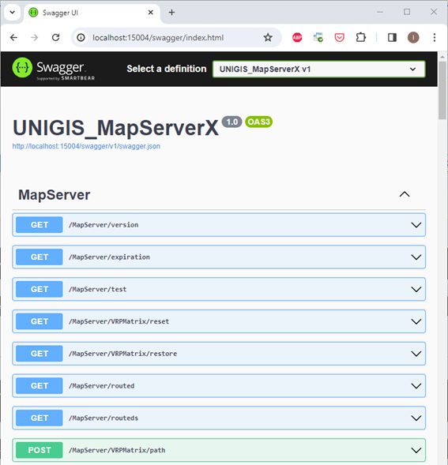

MapServer X 
============

Descripción 
--------------

.. container:: justified-text

    A partir de la versión 10.220.0.0, se suma a la familia de productos Unigis “MapServer X”, sustituyendo a Unigis MapServer. El cual se encarga de realizar las tareas de ruteo, ediciones de rutas y consolidación de órdenes, pero no de geocodificar.

Caracteristicas
-------------------

.. container:: justified-text

    Unigis MapServer X es una WebAPI desarrollada en NetCore y utiliza Kestrel como servidor. Además, posee Swagger para poder visualizar los métodos con los que cuenta.

.. container:: justified-text

    A diferencia del anterior MapServer, puede comunicarse con Unigis y realizarle consultas por medio de la MAPI.

Pre Requisitos
----------------

Unigis MapServer X se publica junto a todas sus dependencias, por tal motivo, no es necesario instalar nada previamente.

Configuración 
--------------------

Una vez descargada la carpeta de MapServerX, en ella encontraremos el archivo “appsettings.json”.

.. code-block:: json
    :linenos:

    {
        "Logging": {
            "LogLevel": {
                "Default": "Information",
                "Microsoft.AspNetCore": "Warning"
      }
    },
    "AllwedHosts": "*",
    "Kestrel": {
        "Endpoints": {
         "Http": {
            "Url": "http://localhost:1504"
        }
        "Https": {
            "Url": "http://localhost:1503"
        }
      }
    },
    "Routed": {
        "Alias": "Default",
        "Host": "Localhost",
        "Port": "5000"

.. container:: justified-text

    En este archivo podremos configurar los endpoints a utilizar, Routed, cantidad máxima de threads a utilizar durante un ruteo y el token de Unigis, en caso de que se necesite consumir algo por MAPI.

    A continuación, se dan ejemplos de las distintas claves que se pueden configurar. Para configurar los endpoints de Kestrel:

.. code-block:: json
    :linenos:

    "Kestrel": {
        "Endpoints": {
            "Http": {
                "Url": "http://localhost:15004"
        },
        "Https": {
        "Url": "https://localhost:15003"
        }
      }
    } 

Para configurar Routed:

.. code-block:: json
    :linenos:

    "Routed": {
        "Alias": "Default",
        "Host": "localhost",
        "Port": "5000"
    }

En caso de utilizar múltiples Routeds, será necesario agregar la sección de Routeds:

.. code-block:: json
    :linenos:

    "Routeds": {
        "routeds": [
    {
        "Alias": "Argentina",
        "Host": "localhost",
        "Port": "5001"
    },
    {
        "Alias": "Uruguay",
        "Host": "localhost",
        "Port": "5002"
        }
    ]
    }

Para configurar el token de la MAPI:

.. code-block:: json
    :linenos:

    "Mapi": {
        "URL": "http://localhost:60002",
        "ApiKey": "51-39-EC-58-36-8"
    }

Por último, en la sección de Varonet, podemos encontrar la limitación de hilos:

.. code-block:: json
    :linenos:

    "Varonet": {
        "CantMaxThreads": 4
    }

Como podemos ver, “appsettings.json” reemplaza al archivo Gis.ini que se encuentra en MapServer.

Parámetros
------------

.. container:: justified-text

    Para utilizar MapServerX desde Unigis, es necesario configurar tres cosas.
   
    1.	En el App.config de Unigis hay que agregar la clave “"map_server_x_url” y setearlo como valor alguno de los endpoints seteados en Kestrel.
   
    2.	Repetir el punto anterior ahora en el App.config de Unigis Control Console.
    
    3.	Por último, setear el parámetro “UsarMapServerX”.

    :kbd:`Administración del Sistema` --> :kbd:`Sistema` --> :kbd:`Parámetros`

.. list-table:: 
    :widths: 10 10 10 45
    :header-rows: 1

    * - Parámetro Clave
      - Valor 
      - Categoría
      - Descripción de Parámetro
    * - UsarMapServerX
      - 0
      - Routing
      - Activa el uso de MapServer X para el rute.

Si alguno de estos valores no se encuentra seteados, Unigis ruteará con MapServer.